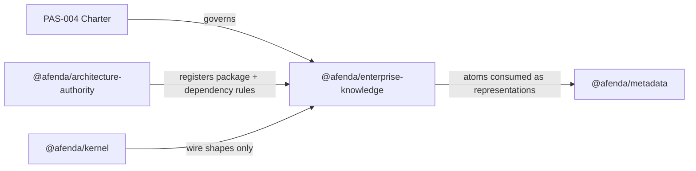

# PAS-004 — Enterprise Knowledge Charter

> **Constitutional sentence:** Enterprise knowledge exists when meaning is accepted, reasoning is understood, evidence is trusted, relationships are preserved, decisions are explainable, and evolution is traceable.

> **One sentence:** PAS-004 is Afenda's constitutional charter for enterprise knowledge governance. It defines how knowledge **becomes authoritative through acceptance** — by an accepted authority, supported by evidence, within a defined domain — independent of any technology or platform.

## Why this must NOT live in `@afenda/architecture-authority`

The previous draft put Knowledge Atoms in architecture-authority for **MVP convenience**. That was wrong for a constitutional PAS.

| | `@afenda/architecture-authority` (PAS-002) | `@afenda/enterprise-knowledge` (PAS-004) |
|---|-------------------------------------------|------------------------------------------|
| **Owns** | Package registry, layer rules, dependency edges, drift policy, architecture gates | How knowledge becomes authoritative; Knowledge Atoms, domains, acceptance, integrity |
| **Must never own** | Business master data, domain semantics, ERP behavior | Kernel wire shapes, UI rendering, accounting rules, DB migrations |
| **Analogy** | Building codes and zoning | The library of accepted enterprise truth |

Putting Knowledge Atoms inside architecture-authority would:

1. **Violate PAS-002's own boundary** — architecture-authority explicitly must not own domain/business semantics.
2. **Contradict the charter** — we separated "constitution" from "platform," then hid the platform inside a package-governance package.
3. **Undermine the North Star** — enterprise knowledge is not "architecture metadata"; it outlives package layout.
4. **Break PAS parity** — PAS-001 → `@afenda/kernel`, PAS-002 → `@afenda/architecture-authority`, PAS-003 → `@afenda/accounting-standards`; PAS-004 deserves its own package.

**Correct split:**



- **`@afenda/enterprise-knowledge`** — owns the Afenda Knowledge Platform implementation for MVP (atom registry, relationships, conformance, future scoring).
- **`@afenda/architecture-authority`** — lists the package in `package-registry`, assigns layer, validates dependency boundaries; does **not** store atoms.
- **`@afenda/kernel`** — wire shapes (`LegalEntityContext`, etc.); PAS-004 atoms **reference** them via implementation mapping, never duplicate them.

## Reserved package (your choice: `@afenda/enterprise-knowledge`)

| Field | Value |
|-------|-------|
| Package | `@afenda/enterprise-knowledge` |
| Path | `packages/enterprise-knowledge/` |
| Layer | **Platform** (same tier as kernel, architecture-authority — cross-cutting, not a business module) |
| Registry lane | `PKGR04_ENTERPRISE_KNOWLEDGE` (new — via `foundation-registry-owner`) |
| PAS doc | `docs/PAS/PAS-004-ENTERPRISE-KNOWLEDGE-STANDARD.md` |
| Skill | `.cursor/skills/enterprise-knowledge/` |
| Maturity | MVP Authority |
| Runtime stance | `contracts-only` (registry + policy + gates; no DB, no HTTP, no UI) |

Follow the **PAS-003 skeleton pattern**: dedicated `package.json`, `tsconfig`, `vitest`, minimal dependency on `@afenda/kernel` (types only if needed), tombstone pointer in package root.

**Not the same as `@afenda/metadata`:** metadata owns UI surface/section/action rendering; enterprise-knowledge owns **accepted business meaning** — orthogonal concerns.

## Three layers (unchanged philosophy)

| Layer | Name | Home |
|-------|------|------|
| Charter | PAS-004 | `docs/PAS/` only (technology-free) |
| Platform | Afenda Knowledge Platform | `@afenda/enterprise-knowledge` |
| Representations | glossary, AI context, API labels, etc. | Consumers import from `@afenda/enterprise-knowledge` |

## Document structure (ten chapters)

Unchanged from freeze-candidate: North Star → First Principles → Epistemology → Governance Charter (6 questions) → Knowledge Atom → Acceptance/Authority/Binding → Domain/Applicability/Lifecycle → Knowledge Integrity → Relationships & Representations → Implementation (**in `@afenda/enterprise-knowledge`**, not architecture-authority).

Chapters 1–4 remain technology-free.

## Deliverables (MVP slice)

### 1. Charter document
[`docs/PAS/PAS-004-ENTERPRISE-KNOWLEDGE-STANDARD.md`](docs/PAS/PAS-004-ENTERPRISE-KNOWLEDGE-STANDARD.md) — ten chapters, First Principles, constitutional sentence. Maturity **MVP Authority**.

**Boundary (§2):** `@afenda/enterprise-knowledge` **owns the enterprise knowledge platform — authoritative acceptance, Knowledge Atoms, domains, relationships, integrity dimensions, and conformance; it never owns kernel wire contracts, business master data runtime, UI rendering ([`@afenda/metadata`](packages/metadata/src/metadata.contract.ts)), accounting-standard rules, database migrations, package lifecycle registries, external learning portals, scoring algorithms, or tenant-specific knowledge.**

### 2. Package scaffold
Create `packages/enterprise-knowledge/`:

```text
packages/enterprise-knowledge/
├── package.json              # @afenda/enterprise-knowledge
├── tsconfig.json
├── tsconfig.vitest.json
├── vitest.config.ts
├── PAS-004-ENTERPRISE-KNOWLEDGE-STANDARD.md   # tombstone pointer only
└── src/
    ├── index.ts
    ├── contracts/
    │   ├── knowledge-atom.contract.ts
    │   ├── accepting-authority.contract.ts
    │   └── knowledge-relationship.contract.ts
    ├── data/
    │   ├── knowledge.registry.ts       # ENTERPRISE_KNOWLEDGE_ATOMS
    │   └── knowledge-relationships.registry.ts
    ├── policy/
    │   └── knowledge.policy.ts
    └── __tests__/
        ├── knowledge.registry.test.ts
        └── architecture-boundary.test.ts   # no imports from apps/erp, metadata-ui, database runtime
```

**Registry promotion:** delegate `PKGR04_ENTERPRISE_KNOWLEDGE` entry to **`foundation-registry-owner`** (sync `foundation-disposition.md`, `package-registry.data.ts`, `layer-registry` as needed). Do not edit disposition registry in the main slice without that agent.

### 3. Knowledge Atom model (in enterprise-knowledge, not architecture-authority)
Same facets as freeze-candidate: Acceptance Chain, Authority type + Binding + Confidence (three axes), Knowledge Domain, Applicability (applicable / not-applicable / exceptions), Lifecycle (incl. Ratified), Knowledge Decision, Lineage, Relationships, Misconceptions, Exposure, Integrity dimensions (presence only).

~12 fully-authored MVP atoms + seed relationships.

### 4. Integrity + conformance gates
- `packages/enterprise-knowledge/src/__tests__/knowledge.registry.test.ts` — structural + constitutional + honesty checks.
- `scripts/governance/knowledge-conformance.mjs` — repo-root gate (reads enterprise-knowledge registry).
- `pnpm check:knowledge-conformance` in root `package.json`.
- PAS-004 §13 gates: `pnpm --filter @afenda/enterprise-knowledge typecheck`, `test:run`, `pnpm check:knowledge-conformance`, `pnpm quality:boundaries`.

### 5. Skill (PAS three-tier)
[`.cursor/skills/enterprise-knowledge/SKILL.md`](.cursor/skills/enterprise-knowledge/SKILL.md) + `reference/`. **Primary skill for PAS-004** — not a subsection of architecture-authority.

Architecture-authority skill gets one line: *package boundary questions for `@afenda/enterprise-knowledge` → enterprise-knowledge skill; registry listing → architecture-authority.*

### 6. Glossary demoted to a Representation
[`docs/architecture/glossary.md`](docs/architecture/glossary.md) — synced view; authority = PAS-004 + `@afenda/enterprise-knowledge` registry.

### 7. Tombstone, slice, cross-links
- [`docs/PAS/slice/b24-knowledge-charter-mvp.md`](docs/PAS/slice/b24-knowledge-charter-mvp.md) — Allowed layer: **`packages/enterprise-knowledge`** + `docs/PAS/`; Prohibited: stuffing atoms into architecture-authority or kernel.
- Register in [`docs/PAS/README.md`](docs/PAS/README.md), [`pas-status-index.md`](docs/PAS/pas-status-index.md), [`AGENTS.md`](AGENTS.md).
- PAS-001/PAS-002 pointers: *acceptance/meaning → PAS-004 / `@afenda/enterprise-knowledge`; shapes/package maps stay in kernel / architecture-authority.*

## Dependency rules (enterprise-knowledge)

**Allowed:** `@afenda/kernel` (read-only types if needed), local registry/policy/tests.

**Prohibited:** `@afenda/architecture-authority` (avoid circular authority), `@afenda/metadata`, `@afenda/metadata-ui`, `@afenda/database`, `apps/erp`, auth SDKs, UI frameworks.

Architecture-authority **may import** enterprise-knowledge only for governance validation if cycle-free — prefer root script reading both packages without a runtime import cycle.

## Example Knowledge Atom (unchanged shape; lives in enterprise-knowledge registry)

See freeze-candidate `ifrs_10` example — `ownedByPas: "PAS-004"`, stored in `packages/enterprise-knowledge/src/data/knowledge.registry.ts`.

## Out of scope for MVP
- Full Knowledge Platform beyond registry (no graph DB, server, UI, scoring engine).
- Tenant-editable knowledge.
- Kernel field renames (lineage/aliases only).
- New ADR.

## Implementation order
1. PAS-004 doc chapters 1–4 (technology-free) + slice handoff with **enterprise-knowledge as allowed layer**.
2. **`foundation-registry-owner`:** `PKGR04_ENTERPRISE_KNOWLEDGE` + package-registry entry.
3. Package scaffold + Knowledge Atom contracts + registry + tests.
4. `knowledge-conformance` script + root gate.
5. Skill + reference files.
6. Glossary demotion + PAS/README/AGENTS + PAS-001/PAS-002 pointers.

## Success criteria
- Knowledge Atoms and domains live in **`@afenda/enterprise-knowledge`**, not architecture-authority or kernel.
- PAS-004 §2 boundary names `@afenda/enterprise-knowledge` as owner.
- `PKGR04_ENTERPRISE_KNOWLEDGE` exists in foundation disposition with gates.
- Architecture-authority lists the package but does not contain atom source files.
- All prior constitutional criteria (acceptance chain, three axes, integrity dimensions, First Principles, etc.) still pass.
