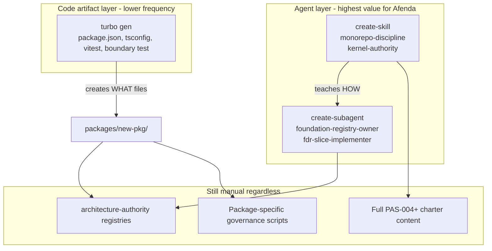

# Turborepo Code Generation — Implement or Not?

## Executive recommendation

| Approach | Implement now? | Why |
|----------|----------------|-----|
| **Built-in `turbo gen workspace --copy`** | **Yes** (documentation only) | Zero repo cost; replaces ad-hoc manual copy; no new dependencies |
| **Custom Plop generators (`turbo/generators/`)** | **Defer** | Low scaffold frequency; bottleneck is registry/PAS content, not missing files; maintenance cost |
| **New skill via `/create-skill`** | **Yes, small extension** | Document Phase 0 copy workflow + post-scaffold checklist in `monorepo-discipline` |
| **New subagent via `/create-subagent`** | **No** | Scaffolding is file creation, not specialized reasoning — existing agents already cover the hard parts |

**Bottom line:** Turborepo codegen is **not more valuable** than `/create-skill` or `/create-subagent` for Afenda today — it solves a **different, smaller** problem. Invest in skills/subagents for governance; use built-in `--copy` for the occasional package skeleton.

---

## Three tools, three layers (not substitutes)

| Tool | Produces | Solves | Afenda bottleneck? |
|------|----------|--------|---------------------|
| **`/create-subagent`** | `.cursor/agents/*.md` system prompts | **Who** delegates governed work (registry edits, slice execution) | **Yes** — registry is CI gate |
| **`/create-skill`** | `.cursor/skills/*/SKILL.md` workflows | **How** agents implement (Phase 0, gates, boundaries, checklists) | **Yes** — prevents drift/violations |
| **`turbo gen`** | `packages/*` filesystem (JSON, TS, tests) | **What** boilerplate files exist, identically every time | **Partially** — ~10 files, copyable once per package |

They are **complementary**, not competing. No amount of turbo gen replaces `foundation-registry-owner` or a PAS charter.

---

## True benefit of Turborepo codegen (honest assessment)

### What turbo gen actually saves

For a Foundation authority package (PAS-003/004 pattern), scaffolding is roughly:

- `package.json`, `tsconfig.json`, `tsconfig.vitest.json`, `vitest.config.ts`
- `src/index.ts` (fingerprint export)
- `src/__tests__/architecture-boundary.test.ts`
- PAS tombstone pointer markdown

**~30 minutes** for an agent or experienced dev copying [`accounting-standards`](packages/accounting-standards) or [`enterprise-knowledge`](packages/enterprise-knowledge) — already proven with PAS-004.

### What turbo gen does **not** save (the real work)

| Task | Time / complexity | Tool that helps |
|------|-------------------|-----------------|
| Registry rows (layer, package, ownership, dependency) | High — must be correct | **`foundation-registry-owner` subagent** |
| Full PAS doc (25 sections, gates, DoD) | Very high | **`fdr-author` / write-fdr skill** |
| Domain model + registry data | High | **PAS slice + governed implementer** |
| Package-specific governance script | Medium | **Manual slice** |
| Skill + reference docs | Medium | **`/create-skill` + pas-reference-templates** |

PAS-004 proved this: [`packages/enterprise-knowledge`](packages/enterprise-knowledge) exists with full src tree — the plan's remaining todos are charter, registry, atoms, gates, skill — **not** "create package.json".

### Custom generator incremental benefit over `--copy`

| Benefit | `--copy` (Phase 0) | Custom Plop (Phase 1–2) |
|---------|--------------------|-------------------------|
| Correct package skeleton | Yes (with cleanup) | Yes (clean, no dist/) |
| Forbidden domain dir guard | Manual | Automated in prompt |
| PAS skill/doc stubs | No | Yes (Phase 2) |
| Non-interactive `--args` for agents | Awkward | Yes |
| Maintenance when templates evolve | None | **Ongoing** — templates drift from canonical packages |
| New dependencies | None | `@turbo/gen` |

**Incremental value of custom generators:** worthwhile only at **higher scaffold frequency** or when **copy-paste errors** repeatedly fail gates.

---

## Comparison to `/create-skill`

| Dimension | `/create-skill` | `turbo gen` custom |
|-----------|-----------------|---------------------|
| Output | Agent instructions | Compilable code files |
| Audience | AI agents + humans reading skills | Developers/agents running CLI |
| Governance encoding | Phase 0, hard stops, gate commands | File templates only |
| Updates when PAS changes | Edit skill prose | Edit Handlebars + keep in sync with live packages |
| Best for Afenda now | **Yes** — extend [`monorepo-discipline`](.cursor/skills/monorepo-discipline/SKILL.md) § new package | Defer until repetition justifies templates |

**A skill saying "copy `accounting-standards`, delete dist/node_modules, run checklist" captures ~80% of turbo gen value at ~5% of implementation cost.**

Optional: a thin project skill `afenda-package-scaffold` with copy commands + checklist — **more valuable than custom Plop today**.

---

## Comparison to `/create-subagent`

| Dimension | `/create-subagent` | `turbo gen` |
|-----------|-------------------|-------------|
| Purpose | Delegate **reasoning** in isolated context | Emit **deterministic files** |
| Example | `foundation-registry-owner` edits registries safely | Creates empty `packages/foo/` |
| Overlap | None | None |

**Do not create a "package-scaffold-subagent"** — scaffolding is not a delegation task. Use:

- **`foundation-registry-owner`** — after filesystem exists
- **`afenda-governed-implementer`** — for PAS slice implementation
- **`fdr-slice-implementer`** — for foundation work

A subagent that only copies files would be **less reliable** than `turbo gen workspace --copy` (deterministic) or a skill checklist (flexible).

---

## When custom turbo gen **becomes** more valuable than skill-only

Implement Phase 1–2 custom generators when **any** of:

1. **3+ new authority packages** planned within 6 months (inventory, hrm, crm slots promoting)
2. **Multiple contributors** (not just agents) scaffold packages and hit repeated gate failures from incomplete skeletons
3. **Agent automation** needs non-interactive scaffold (`turbo gen ... --args`) in a repeatable pipeline
4. **Template drift** — manual copies diverge from canonical shape and fail `architecture-boundary.test.ts` or tsconfig references

Until then, built-in `--copy` + skill documentation is the efficient frontier.

---

## Revised implementation plan

### Do now (Phase 0 — recommended)

1. Extend [`.cursor/skills/monorepo-discipline/SKILL.md`](.cursor/skills/monorepo-discipline/SKILL.md) with:
   - `turbo gen workspace --copy packages/accounting-standards` (with-kernel variant)
   - `turbo gen workspace --copy packages/enterprise-knowledge` (zero-deps variant)
   - Post-copy cleanup: delete `dist/`, `node_modules/`, rename package, fix boundary test constants
   - Existing registry checklist unchanged
2. Optional one-liner in [`AGENTS.md`](AGENTS.md) monorepo section
3. **No** `@turbo/gen`, **no** `turbo/generators/`

### Defer (Phase 1–2 — not recommended now)

- Custom `foundation-authority-package` Plop generator
- `pas-authority-bundle` generator
- Root `pnpm gen` script

### Never automate (unchanged)

- Registry / foundation-disposition mutations
- Forbidden domain directories
- Full PAS enterprise docs

---

## Value ranking for Afenda (2026)

1. **`foundation-registry-owner` subagent** — unblocks CI
2. **PAS / kernel / monorepo-discipline skills** — prevents architectural violations
3. **`turbo gen workspace --copy` (documented)** — fast skeleton when needed
4. **Custom turbo generators** — marginal until scaffold frequency increases

**Turborepo codegen is valuable infrastructure, but for this repo it ranks below skill/subagent investment until package creation becomes routine.**
