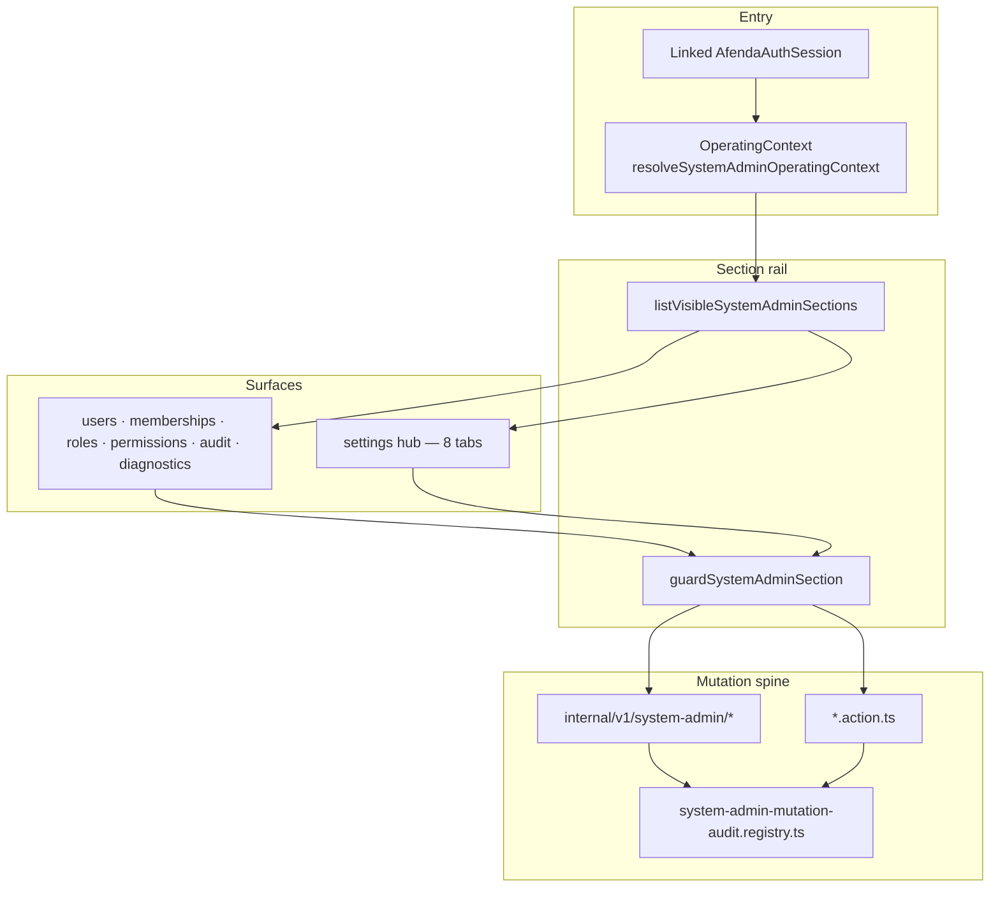

# ARCH-ADMIN-001 — System Admin Control Plane

> Enterprise architecture authority for Afenda **System Admin only**.  
> Template: [`ARCH-TEMPLATE.md`](ARCH-TEMPLATE.md) · Index: [`arch-status-index.md`](arch-status-index.md) · Domain peer: [`ARCH-AUTH-001`](%5BPartially%20Implemented%5D%20ARCH-AUTH-001-enterprise-authentication.md)

| Field | Value |
| --- | --- |
| **Document ID** | ARCH-ADMIN-001 |
| **Work ID** | ARCH-ADMIN-001 · PKG-007 · `fdr-007-system-admin` (paired FDR) |
| **Title** | System Admin control plane |
| **Status** | **Partially Implemented** — Phase A–D delivered (Slices 1–8); DoD #20 peer review open |
| **Date** | 2026-06-25 |
| **Owner** | Application Authority (`apps/erp` system-admin) |
| **Package** | PKG-007 · `@afenda/erp` · `@afenda/appshell` · `@afenda/permissions` |
| **Registry entry ID** | PKG007_ADMIN (system-admin control plane) |
| **Runtime owner** | `apps/erp/src/lib/system-admin/` · `apps/erp/src/app/(protected)/system-admin/` |
| **Lane** | amber-lane |
| **Risk class** | High (cross-company admin mutations) |
| **Change class** | Extension + Governance |
| **Clean Core target** | B |
| **Enterprise score target** | 29/30 (9.5+) — current estimate **29/30** (DoD #20 peer review open) |

> **Scope:** Section registry, permission gates, settings hub, promoted admin UI blocks, mutation audit spine, internal admin API under `/system-admin/**` only.  
> **Not in scope:** Auth mechanics → [`ARCH-AUTH-001`](%5BPartially%20Implemented%5D%20ARCH-AUTH-001-enterprise-authentication.md). Accounting admin → `fdr-r01-accounting-contracts`+. Module business UIs outside system-admin.

> **Naming note:** Delivery docs use **`ARCH-<DOMAIN>-<NNN>`** (this doc: **ARCH-ADMIN-001**). Do not confuse with registry invariants **ARCH-001** (package ownership) or **ARCH-002** (layer assignment) in [`ownership-registry.md`](../architecture/ownership-registry.md) / [`layer-registry.md`](../architecture/layer-registry.md). Auth peer: **ARCH-AUTH-001**.

---

## 1. Execution instruction

You are executing a **System Admin** enterprise architecture delivery slice under ARCH-ADMIN-001.

You must produce implementation and evidence that meets:

- Architecture authority (this document + authority chain §3)
- Runtime truth (`afenda-runtime-truth-matrix.md`)
- Package ownership (PKG-007 / PKG-001 appshell blocks)
- Clean Core boundaries (level B)
- Enterprise acceptance criteria (§7)
- Automated gate proof (§10)
- Documentation sync
- Definition of Done (§11)

Every completion claim must map to **file path**, **test path**, **command exit code**, **documentation row**, or **explicit waiver** (§13). No prose-only “done”.

**One-sentence architecture:** System Admin is a **company-scoped admin shell** (`/system-admin/**`) where every section is permission-filtered, every mutation emits audit evidence, and settings UI is promoted from shadcn/studio blocks into `@afenda/appshell` — never copied from `_reference/` or staging into ERP imports.

---

## 2. Target item

| Field | Value |
| --- | --- |
| Work ID | ARCH-ADMIN-001 · [`fdr-007-system-admin`](../delivery/FDR/%5BPartially%20Implemented%5D%20fdr-007-system-admin.md) |
| Title | System Admin control plane |
| Status | **Partially Implemented** |
| Package | `@afenda/erp` (primary) · `@afenda/appshell` (UI blocks) |
| Registry entry ID | PKG007_ADMIN |
| Runtime owner | `apps/erp/src/lib/system-admin/` |
| Lane | amber-lane |
| Risk class | High |
| Change class | Extension |
| Clean Core target | B |
| Enterprise score target | 29/30 |

### Delivery phase status

| Phase | Scope | Status |
| --- | --- | --- |
| **A** | Section registry, layout, core pages, guard, API contracts, audit viewer | **Delivered** (`fdr-007-system-admin` foundation slices) |
| **B** | Settings UI promotion — `AppShellAccountSettings02–07` | **Delivered** (2026-06-25) |
| **C** | Persistence, members roster, user MFA actions, block 01 full promotion | **Delivered — Slices 1–6 (2026-06-25)** |
| **D** | Evidence-sync — matrix, FDR index, ARCH-ADMIN-001 slice rows | **Delivered — Slice 6 (2026-06-25)** |

---

## 3. Authority chain

Read in this order before touching code:

```text
1. docs/ARCH/[Partially Implemented] ARCH-ADMIN-001-system-admin-control-plane.md          ← this document
2. docs/ARCH/[Partially Implemented] ARCH-AUTH-001-enterprise-authentication.md      ← Members/Security auth semantics only
3. docs/delivery/fdr-status-index.md
4. packages/architecture-authority/src/data/foundation-disposition.registry.ts
5. docs/architecture/afenda-runtime-truth-matrix.md
6. docs/delivery/FDR/[Partially Implemented] fdr-007-system-admin.md
7. docs/adr/ADR-0010.md · ADR-0013.md · ADR-0014.md · ADR-0017.md
8. packages/permissions/src/grants/permission.contract.ts
9. apps/erp/src/lib/system-admin/                              ← runtime owner
10. packages/appshell/src/shadcn-studio/blocks/                ← promoted UI
11. Related tests and governance scripts (§10)
```

| Layer | Authority |
| --- | --- |
| Registry | `foundation-disposition.registry.ts` — ownership, gates, prohibited actions |
| Delivery evidence | `fdr-007-system-admin` · `fdr-007-accounting-readiness` (diagnostics partial) |
| Auth admin semantics | ARCH-AUTH-001 — do not duplicate Better Auth APIs here |
| UI promotion | ADR-0017 · `.cursor/skills/afenda-shadcn-components/SKILL.md` |
| Governed UI | TIP-004 · `pnpm ui:guard:scan` |

---

## 4. Problem statement

### 4.1 Current risk / gap

```text
Phase A–D delivered the system-admin shell, section guards, promoted settings blocks 01–07,
tenant_settings persistence (notifications/workspace/billing/integrations), live Members roster,
Security user MFA actions, settings audit waiver closeout, and Slice 6 evidence-sync (2026-06-25).
Remaining gap: DoD #20 Architecture Authority peer review before Complete promotion. Without
ARCH-ADMIN-001 as bounded authority, agents may duplicate auth docs, ship staging UI into ERP,
or add unguarded / un-audited admin mutations.
```

### 4.2 Business / architecture impact

```text
System Admin is a Phase 9 Accounting Readiness Gate requirement (ADR-0010 / ADR-0013).
Platform administrators must manage users, security policy, and configuration without DB access.
Every admin mutation must be permission-gated, company-scoped, and auditable for ISO 27001 / SOX-style
operating controls. UI must stay TIP-004 compliant so ERP chrome does not fork @afenda/ui primitives.
```

---

## 5. Architecture requirement

### 5.1 Ownership

| Concern | Owner | Allowed path |
| --- | --- | --- |
| Section registry + guards | `@afenda/erp` | `apps/erp/src/lib/system-admin/` |
| Admin pages + layouts | `@afenda/erp` | `apps/erp/src/app/(protected)/system-admin/` |
| Admin client panels | `@afenda/erp` | `apps/erp/src/components/system-admin/` |
| Admin server + API | `@afenda/erp` | `apps/erp/src/server/system-admin/` · `app/api/internal/v1/system-admin/` |
| Promoted UI blocks | `@afenda/appshell` | `packages/appshell/src/shadcn-studio/blocks/` |
| Staging (read-only) | `@afenda/ui` | `packages/ui/src/components/shadcn-studio/blocks/` — **never import in ERP** |
| Permission keys | `@afenda/permissions` | `PERMISSION_REGISTRY.systemAdmin.*` only |
| Operating context | `@afenda/kernel` + ERP | `OperatingContext.actor.userId` = platform `users.id` |
| Platform persistence | `@afenda/database` | user, membership, role, tenant schemas |
| Documentation | `docs/ARCH/` | this file · runtime matrix |

No implementation outside declared paths unless a slice handoff (§17) explicitly allows it.

### 5.2 Boundary rules

The implementation must:

1. Keep PKG-007 admin logic in `apps/erp`; reusable blocks in `@afenda/appshell`.
2. Use `PERMISSION_REGISTRY` keys only — no ad-hoc permission strings in ERP.
3. Call `guardSystemAdminSection(sectionId)` on every page and server action.
4. Resolve `OperatingContext` before mutation; never use `authUserId` for RBAC or audit actor.
5. Register every governed mutation in `system-admin-mutation-audit.registry.ts`.
6. Promote UI via ADR-0017 pipeline (Q1–Q3); props-driven data in ERP panels.
7. Derive nav visibility from permission checks — not hardcoded section lists in UI.
8. Keep auth entry UI out of system-admin (Better Auth routes only — ARCH-AUTH-001 §10).
9. Keep accounting admin out of system-admin (`fdr-r01-accounting-contracts`+).
10. Sync documentation when slice status or runtime evidence changes.

### 5.3 Prohibited actions

The agent must not:

```text
- create an accounting package or accounting admin under /system-admin
- duplicate PERMISSION_REGISTRY keys as string literals in ERP
- use authUserId in checkPermission, audit actorUserId, or membership mutations
- import shadcn/studio staging blocks from packages/ui into ERP routes
- add shadcn login-page / register blocks under /system-admin/**
- skip guardSystemAdminSection on server actions or API handlers
- add mutations missing from system-admin-mutation-audit.registry.ts
- put className on @afenda/ui primitives in system-admin panels (TIP-004)
- duplicate Better Auth plugin APIs (see ARCH-AUTH-001 + better-auth-erp skill)
- weaken type safety with any; suppress tests instead of fixing failures
- mark Complete without gate evidence (§16)
```

### 5.4 Boundary with ARCH-AUTH-001

| Concern | Owner doc | Artifact |
| --- | --- | --- |
| Canonical `users.id`, mirror sync, invite auth gate | ARCH-AUTH-001 | `@afenda/auth`, `auth_identity_links` |
| Tenant MFA policy semantics | ARCH-AUTH-001 | `tenants.mfa_required`, Better Auth `twoFactor()` |
| Security / Members **tab UI** | **ARCH-ADMIN-001** | `AppShellAccountSettings05/06` + ERP panels |
| Invite Server Actions + mirror on accept | ARCH-AUTH-001 FR-A04 | admin server + hooks |
| Sign-in / reset / MFA enrollment pages | ARCH-AUTH-001 | Better Auth only |

### 5.4.1 Boundary with ARCH-USER-001

| Concern | Owner doc | Artifact |
| --- | --- | --- |
| Personal profile (block 01 full) | **ARCH-USER-001** | `/settings/profile` — not admin General tab |
| Personal MFA + sessions | **ARCH-USER-001** | `/settings/security` — user slice of block 06 |
| User-scoped notifications | **ARCH-USER-001** | `/settings/notifications` — distinct copy contract |
| Theme / locale / density | **ARCH-USER-001** | `/settings/preferences` |
| Tenant General form (company name) | **ARCH-ADMIN-001** | `/system-admin/settings/general` — tenant form only (Slice 6 realignment) |
| Tenant MFA **policy** section | **ARCH-ADMIN-001** | `/system-admin/settings/security` — policy section only (post-split) |
| Identity execution (MFA, sessions, credentials) | ARCH-AUTH-001 | `@afenda/auth/client` — shared by both surfaces |

### 5.5 Control plane topology



### 5.6 Section registry (core rail)

Canonical: [`system-admin-sections.ts`](../../apps/erp/src/lib/system-admin/system-admin-sections.ts)

| Section ID | Route | Read permission | Purpose |
| --- | --- | --- | --- |
| `users` | `/system-admin/users` | `system_admin.users_read` | User directory + invite |
| `memberships` | `/system-admin/memberships` | `system_admin.users_read` | Company membership admin |
| `roles` | `/system-admin/roles` | `system_admin.roles_manage` | Role assignment |
| `permissions` | `/system-admin/permissions` | `system_admin.permissions_manage` | Read-only permission catalog |
| `audit` | `/system-admin/audit` | `system_admin.audit_read` | Audit events viewer |
| `settings` | `/system-admin/settings` | `system_admin.modules_manage` | Settings hub (8 tabs) |
| `diagnostics` | `/system-admin/diagnostics` | `system_admin.audit_read` | Readiness gate + diagnostics |

Denied deep-links → `guardSystemAdminSection` → audit `system_admin.section.access_denied`.

### 5.7 Settings hub (nested tabs)

Layout: [`settings/layout.tsx`](../../apps/erp/src/app/(protected)/system-admin/settings/layout.tsx)

| Tab | Route | Appshell block | Persistence |
| --- | --- | --- | --- |
| General | `/system-admin/settings/general` | `AppShellAccountSettingsPanelSection` + `SystemAdminSettingsForm` (tenant only) | **Live** — Slice 6 realignment |
| Notifications | `/system-admin/settings/notifications` | `AppShellAccountSettings02` | **Live** — Slice 1 |
| Workspace | `/system-admin/settings/workspace` | `AppShellAccountSettings03` | **Live** — Slice 1 |
| Integrations | `/system-admin/settings/integrations` | `AppShellAccountSettings04` | **Live** — Slice 2 |
| Members | `/system-admin/settings/members` | `AppShellAccountSettings05` | **Live** — Slice 3 |
| Security | `/system-admin/settings/security` | `AppShellAccountSettings06Policy` (tenant MFA policy only) | **Live** — Slice 6 realignment |
| Billing & Usage | `/system-admin/settings/billing` | `AppShellAccountSettings07` | **Live** — Slice 1 |
| Appearance | `/system-admin/settings/appearance` | Scaffold | Not promoted |

Shared layout: `AppShellAccountSettingsPanelSection` · CSS §J in [`afenda-appshell-studio.css`](../../packages/appshell/src/styles/afenda-appshell-studio.css).

### 5.8 Operating context pipeline

```text
getAfendaAuthSession(headers)
  → isAfendaAuthSessionLinked(session)
  → toAfendaAuthIdentity(session).userId
  → resolveOperatingContextFromHeaders({ actorUserId })
  → OperatingContext
```

Resolver: [`resolve-system-admin-operating-context.server.ts`](../../apps/erp/src/lib/system-admin/resolve-system-admin-operating-context.server.ts)

| Result | Behavior |
| --- | --- |
| `redirect` | → `/sign-in` or `/sign-in?error=unlinked` |
| `forbidden` | No resolvable operating context |
| `ready` | Use `operatingContext.actor.userId` for RBAC + audit |

### 5.9 UI delivery (ADR-0017)

| Step | Rule |
| --- | --- |
| Q1 | Tailwind layout → `.app-shell-studio-*` semantic classes |
| Q2 | `@afenda/ui` primitives — zero `className` on governed primitives in appshell |
| Q3 | Props-driven — ERP `*-settings-panel.tsx` owns state and server calls |
| Install | Staging in `packages/ui` via shadcn/studio CLI |
| Promote | Export from `@afenda/appshell` |
| Wire | One ERP panel per settings tab |

### 5.10 Mutation and audit spine

Registry: [`system-admin-mutation-audit.registry.ts`](../../apps/erp/src/lib/system-admin/system-admin-mutation-audit.registry.ts)  
CI: `system-admin-mutation-audit-coverage.test.ts` · `pnpm check:system-admin-mutation-audit`

| Event | Trigger |
| --- | --- |
| `system_admin.section.access_denied` | Section guard denial |
| `system_admin.user.invited` | Invite API contract |
| `system_admin.membership.role.assigned` | Role assignment API |
| `system_admin.membership.role.assignment_denied` | Scoped assignment rejection |
| `system_admin.settings.updated` | Settings mutation (when audit enabled) |

Auth event vocabulary (`auth.mfa.policy_updated`, etc.) — **ARCH-AUTH-001 §6.3** only.

### 5.11 Internal admin API

Contracts: [`apps/erp/src/server/api/contracts/system-admin/`](../../apps/erp/src/server/api/contracts/system-admin/)

| Contract | Route | Audit |
| --- | --- | --- |
| User invite POST | `/api/internal/v1/system-admin/users/invite` | `system_admin.user.invited` |
| Membership role POST | `/api/internal/v1/system-admin/memberships/role` | `system_admin.membership.role.assigned` |
| Audit events GET | `/api/internal/v1/system-admin/audit-events` | read-only |

Scoped actor: `require-company-scoped-api-actor.server.ts` · `fdr-007-api-governance` validation.

### 5.12 Functional requirements

| ID | Requirement |
| --- | --- |
| **FR-S01.1** | Section rail shows only permitted sections |
| **FR-S01.2** | Every page/action calls `guardSystemAdminSection` |
| **FR-S01.3** | Guard denial emits audit + structured log |
| **FR-S02.1** | Eight settings tabs under `/system-admin/settings/*` |
| **FR-S02.2** | Each tab uses promoted appshell block or governed ERP panel |
| **FR-S02.3** | General tab persists tenant display name via server action |
| **FR-S02.4** | Notifications, workspace, billing, and integrations tabs persist via `tenant_settings` JSONB sections |
| **FR-S03.1** | Members tab exposes `SystemAdminInviteDialog` / wizard |
| **FR-S03.2** | Invite accept → canonical user then mirror (ARCH-AUTH-001) |
| **FR-S03.3** | Security tab reads/writes tenant MFA policy |
| **FR-S03.4** | Security tab lists/revokes sessions via `multiSession` client |
| **FR-S04.1** | Diagnostics surfaces accounting readiness gate |
| **FR-S04.2** | Readiness refresh mutation gated + audit-registered |
| **FR-S05.1** | TIP-004 — zero `className` on `@afenda/ui` primitives |
| **FR-S05.2** | Shell chrome on plain HTML + ERP CSS only |
| **FR-S05.3** | `pnpm ui:guard:scan` clean for system-admin surfaces |

---

## 6. Required implementation scope

### In scope

```text
- apps/erp/src/lib/system-admin/**
- apps/erp/src/components/system-admin/**
- apps/erp/src/app/(protected)/system-admin/**
- apps/erp/src/server/system-admin/**
- apps/erp/src/app/api/internal/v1/system-admin/**
- packages/appshell/src/shadcn-studio/blocks/app-shell-account-settings-*
- packages/appshell/src/shadcn-studio/blocks/system-admin-readiness-gate-metrics*
- packages/appshell/src/styles/afenda-appshell-studio.css (§J patterns)
- packages/permissions — systemAdmin keys (read-only unless ADR)
- docs/ARCH/[Partially Implemented] ARCH-ADMIN-001-system-admin-control-plane.md
```

### Out of scope

```text
- @afenda/accounting and accounting admin surfaces (`fdr-r01-accounting-contracts`+)
- Better Auth plugin configuration (ARCH-AUTH-001 + better-auth-erp skill)
- Auth entry pages (login, register, reset)
- SSO / passkey / social OAuth
- Shipping packages/ui staging imports in ERP
- Module business UIs outside /system-admin/**
```

### Expected files (reference)

| File / area | Package | Change type | Required? |
| --- | --- | --- | --- |
| `system-admin-sections.ts` | `@afenda/erp` | existing | Yes |
| `guard-system-admin-section.server.ts` | `@afenda/erp` | existing | Yes |
| `system-admin-mutation-audit.registry.ts` | `@afenda/erp` | existing | Yes |
| `app-shell-account-settings-02–07.tsx` + content | `@afenda/appshell` | delivered | Yes |
| `system-admin-*-settings-panel.tsx` | `@afenda/erp` | delivered / partial | Yes |
| Tenant settings schema + actions | `@afenda/database` + ERP | **delivered Slice 1** | Phase C |
| `app-shell-account-settings-01` full content | `@afenda/appshell` | **delivered Slice 2** | Phase C |

---

## 7. Enterprise acceptance criteria

```gherkin
Feature: System Admin control plane

  Scenario: Actor sees only permitted sections
    GIVEN a signed-in user with linked platform identity
    AND OperatingContext resolves for the active company
    WHEN listVisibleSystemAdminSections runs
    THEN only sections whose readPermissionKey passes are returned
    AND the section nav renders those entries only

  Scenario: Unauthorized section access is denied and audited
    GIVEN an actor without system_admin.roles_manage
    WHEN they deep-link to /system-admin/roles
    THEN guardSystemAdminSection returns forbidden
    AND audit event system_admin.section.access_denied is recorded

  Scenario: Settings tab renders promoted governed block
    GIVEN an actor with system_admin.modules_manage
    WHEN they open /system-admin/settings/notifications
    THEN AppShellAccountSettings02 renders via SystemAdminNotificationsSettingsPanel
    AND ui:guard:scan reports no TIP-004 violations on system-admin tsx

  Scenario: General settings mutation updates tenant display name
    GIVEN an authorized actor on the General tab
    WHEN update-system-admin-settings.action runs with companyName
    THEN tenants.display name persists via updateTenant()
    AND typecheck and action tests pass

  Scenario: Mutation registry drift is caught in CI
    GIVEN a new system-admin server action without registry entry
    WHEN system-admin-mutation-audit-coverage.test.ts runs
    THEN the test fails before merge

  Scenario: Cross-package consumer compatibility
    GIVEN apps/erp imports AppShellAccountSettings* from @afenda/appshell
    WHEN pnpm --filter @afenda/erp typecheck runs
    THEN exit code is 0 with no private/deep imports
```

### AC index

| AC | Criterion | Verification | Status |
| --- | --- | --- | --- |
| AC-S01 | Seven core sections routable | integration / route manifest | Pass |
| AC-S02 | Nav hides unauthorized sections | `list-visible-system-admin-sections` test | Pass |
| AC-S03 | Guard denial audited | guard unit test | Pass |
| AC-S04 | Settings tabs 02–07 promoted | appshell exports + ERP pages | Pass |
| AC-S05 | General name mutation live | `update-system-admin-settings.action.test.ts` | Pass |
| AC-S06 | Security MFA policy + sessions + user MFA actions | `system-admin-security-settings-panel.test.tsx` | Pass |
| AC-S07 | Mutation registry coverage | `system-admin-mutation-audit-coverage.test.ts` | Pass |
| AC-S08 | API contracts governed | `pnpm check:api-contracts` | Pass |
| AC-S09 | TIP-004 clean | `pnpm ui:guard:scan` | Pass |
| AC-S10 | ERP tests green | `pnpm --filter @afenda/erp test:run` (613+ pass) | Pass |
| AC-S11 | Doc drift references ARCH-ADMIN-001 | `pnpm check:documentation-drift` | Pass (Slice 6) |

---

## 8. Enterprise quality benchmark

```text
Minimum acceptable: 28/30 foundation
Enterprise 9.5:       29/30 — no dimension below 4/5
Current estimate:     29/30 (DoD #20 peer review open)
```

| Dimension | Target | Evidence | Score |
| --- | ---: | --- | ---: |
| Contract stability | 5/5 | ERP + appshell typecheck exit 0 | 5 |
| Test coverage | 5/5 | appshell 395 tests; ERP system-admin suites | 4 |
| Observability + audit | 5/5 min | Registry + guard audit; settings mutations auditable (Slice 5) | 5 |
| Security + RBAC | 5/5 | guard tests; scoped API actor; no authUserId in RBAC | 5 |
| Documentation + traceability | 5/5 | ARCH-ADMIN-001; `fdr-007-system-admin` evidence; matrix + index sync (Slice 6) | 5 |
| Maintainability + Clean Core | 5/5 | ui:guard; boundaries; ADR-0017 promotion | 5 |
| **Total** | **29/30** | | **29/30** |

---

## 9. Non-functional requirements

| Characteristic | Requirement | Verification |
| --- | --- | --- |
| Functional suitability | Sections, guards, settings hub per FR-S* | Integration + manual |
| Security | Server-side RBAC; no client-trusted authority | guard + API actor tests |
| Compatibility | `@afenda/appshell` public exports stable | ERP typecheck |
| Reliability | Deterministic permission filtering | unit tests |
| Maintainability | Single permission registry; mutation registry | governance scripts |
| Performance | No O(n²) permission loops on layout | code review |
| Accessibility | Settings tabs + MFA switch labelled | block 06 a11y fix |
| Observability | Admin mutations auditable or waived | registry + §13 |
| Documentation | ARCH-ADMIN-001 ↔ runtime matrix aligned | documentation-drift |

---

## 10. Required gates

Run and report exit codes for every slice closeout.

```bash
pnpm --filter @afenda/erp typecheck
pnpm --filter @afenda/erp test:run
pnpm --filter @afenda/appshell build
pnpm --filter @afenda/appshell test:run
pnpm ui:guard:scan
pnpm check:api-contracts
pnpm check:system-admin-mutation-audit
pnpm quality:boundaries
pnpm check:foundation-disposition
pnpm check:documentation-drift
```

### Gate report (Phase B — 2026-06-25 evidence)

| Gate | Exit | Result |
| --- | ---: | --- |
| `pnpm ui:guard:scan` | 0 | Pass — 286 files clean |
| `pnpm --filter @afenda/appshell build` | 0 | Pass |
| `pnpm --filter @afenda/appshell test:run` | 0 | Pass — 395/395 |
| `pnpm --filter @afenda/erp typecheck` | 0 | Pass |
| `pnpm check:documentation-drift` | 0 | Pass (Slice 6) |
| `pnpm check:system-admin-mutation-audit` | 0 | Pass (registry coverage) |

### Gate report (Slice 6 — 2026-06-25 evidence)

| Gate | Exit | Result |
| --- | ---: | --- |
| `pnpm check:documentation-drift` | 0 | Pass — ARCH-ADMIN-001 ↔ matrix ↔ index aligned |
| `pnpm check:foundation-disposition` | 0 | Pass — PKG007_ADMIN registry fingerprint valid |
| `pnpm --filter @afenda/erp typecheck` | 0 | Pass — 4A WIP stub removed (`resolve-user-preferences.server.ts`) |
| `pnpm --filter @afenda/erp test:run` (system-admin subset) | 0 | Pass — 26 files · 99/99 tests |

**Delivered runtime evidence (Slices 1–6):** `tenant_settings` persistence (notifications/workspace/billing/integrations) · General tab `AppShellAccountSettings01` · live Members roster (Slice 3) · Security user MFA actions (Slice 4) · settings audit waiver closed (Slice 5) · `pnpm quality:migrations` exit 0 · `pnpm check:system-admin-mutation-audit` exit 0 · `pnpm ui:guard:scan` exit 0 · `pnpm --filter @afenda/erp test:run` 613+ pass.

---

## 11. Definition of Done

| # | Criterion | Evidence | Status |
| --- | --- | --- | --- |
| 1 | Runtime evidence at stated paths | `apps/erp/src/lib/system-admin/` · appshell blocks | [x] |
| 2 | Acceptance criteria implemented | §7 AC table | [x] |
| 3 | Positive path tested | ERP + appshell test suites | [x] |
| 4 | Negative path tested | guard denial · RBAC denial tests | [x] |
| 5 | TypeScript strict passes | `pnpm --filter @afenda/erp typecheck` | [x] |
| 6 | Package tests pass | appshell 395 · ERP test:run | [x] |
| 7 | Biome clean | `pnpm ci:biome` / ultracite | [x] |
| 8 | Boundaries pass | `pnpm quality:boundaries` | [x] |
| 9 | Registry/index aligned | `pnpm check:foundation-disposition` | [x] |
| 10 | Documentation drift clean | `pnpm check:documentation-drift` | [x] Slice 6 |
| 11 | Runtime matrix updated | `afenda-runtime-truth-matrix.md` | [x] Slice 6 |
| 12 | FDR/ARCH status cross-ref | `fdr-007-system-admin` partial; ARCH-ADMIN-001 authority | [x] |
| 13 | Impact analysis completed | §12 | [x] |
| 14 | Rollback strategy documented | §14 | [x] |
| 15 | Security / RBAC verified | guard + API actor tests | [x] |
| 16 | Observability / audit verified | mutation registry; settings audit (Slice 5) | [x] |
| 17 | Public API compatibility | `@afenda/appshell` exports | [x] |
| 18 | Clean Core level declared | B | [x] |
| 19 | Waivers documented | §13 | [x] |
| 20 | Peer review if required | Architecture Authority acceptance | [ ] |

**Promotion:** Cannot claim **Complete — enterprise 9.5 accepted** until DoD #20 peer review passes. Slices 1–6 and DoD rows 10–11 delivered (2026-06-25).

---

## 12. Impact analysis

| Consumer | Import / dependency | Breaking? | Action |
| --- | --- | --- | --- |
| `@afenda/erp` | `@afenda/appshell` account-settings blocks | No | Wire via panels |
| `@afenda/erp` | `@afenda/permissions` systemAdmin keys | No | Use registry only |
| `@afenda/appshell` | `@afenda/ui` governed primitives | No | TIP-004 consumption |
| ARCH-AUTH-001 | Members/Security semantics | No | Cross-ref only |

```text
Breaking change:     No
Migration required:  No (additive promotion)
Runtime risk:        Low (notifications/workspace/billing/integrations persisted via tenant_settings)
Rollback safe:       Yes — revert appshell + ERP panel commits
```

---

## 13. Waiver policy

| Waiver ID | Requirement waived | Reason | Revisit |
| --- | --- | --- | --- |
| — | User MFA enable/disable handlers | ARCH-AUTH-001 FR-A03 UI half | Slice 4 |

No waiver permits claiming production persistence where demo client state is still used.

---

## 14. Rollback strategy

| Change area | Rollback method | Risk |
| --- | --- | --- |
| Appshell blocks 02–07 | `git revert` promotion commit(s) | Low |
| ERP settings panels | Revert panel + page wiring | Low |
| Section registry / guard | Revert ERP lib changes | Medium |
| API contracts | Restore prior contract export | Medium |
| Documentation | Revert ARCH-ADMIN-001 / matrix row | Low |

Rollback must preserve registry authority, package boundaries, and public `@afenda/appshell` export compatibility.

---

## 15. Required output from IDE / agent

Every ARCH-ADMIN-001 slice must end with:

```markdown
## Completion report

### Status
<Partially Implemented / Complete — foundation / Blocked>

### Files changed
- `<path>` — <summary>

### Architecture requirements satisfied
- FR-Sxx — <evidence path>

### Acceptance criteria
| AC | Status | Evidence |

### Gates
| Gate | Exit | Result |

### Enterprise readiness
<score>/30

### Remaining gaps
- <gap>

### Waivers
- <waiver or None>

### Promotion recommendation
<Can / cannot promote because…>

### Rollback
<plan>
```

---

## 16. Promotion rule

Do **not** promote ARCH-ADMIN-001 to **Complete — enterprise 9.5 accepted** until:

```text
- Phase C slices 1–7 delivered ✓ (2026-06-25)
- Phase D evidence-sync (Slice 6) exit 0 ✓
- All §11 DoD rows checked except #20 peer review
- Enterprise score ≥ 29/30
- No undisclosed demo-state settings presented as production persistence
```

Allowed status labels for this work item:

```text
Not started
Partially Implemented          ← current
Complete — foundation acceptable
Complete — enterprise 9.5 accepted
Blocked
```

### DoD #20 — Architecture Authority peer review readiness

> **Agent cannot sign DoD #20.** Human Architecture Authority approval is required before `[Complete]` filename promotion or **enterprise 9.5 accepted** claim.

| # | Review criterion | Evidence path | Gate |
| --- | --- | --- | --- |
| 1 | Seven settings sections live with RSC resolvers | `apps/erp/src/app/(protected)/system-admin/settings/*/page.tsx` | ERP test:run |
| 2 | `tenant_settings` persistence (notifications/workspace/billing/integrations) | `packages/database/src/tenant-settings/` | `@afenda/database` test:run |
| 3 | Members roster + invite resend/revoke audit | `resend-system-admin-invite.action.ts` · `revoke-system-admin-invite.action.ts` | PKG007 registry + parity test |
| 4 | Settings mutations emit audit (no observability waiver) | `system-admin-observability-registry-parity.test.ts` | `pnpm quality:erp-observability` |
| 5 | Mutation audit registry complete | `system-admin-mutation-audit.registry.ts` | `pnpm check:system-admin-mutation-audit` |
| 6 | Documentation authorities aligned | ARCH · matrix · FDR · index | `pnpm check:documentation-drift` |
| 7 | Operator migration applied per environment | `20260625045902_tenant_settings_integrations` | `pnpm migrate` (per env) |

**Sign-off template (Architecture Authority):**

```text
DoD #20 peer review — ARCH-ADMIN-001
Reviewer: <name>
Date: <YYYY-MM-DD>
PR: <url>
Result: Approved / Changes requested
Notes: <optional>
```

---

## 17. Handoff to implementation (Phase C)

> **Authority:** ARCH-ADMIN-001 (domain semantics). `fdr-007-system-admin` foundation slices **Delivered**. Phase C slices below close ARCH-ADMIN-001 §11 DoD gaps.  
> **Format:** [`write-tip-slice`](../../.cursor/skills/write-tip-slice/SKILL.md) 6-field handoff (archive-compatible). New foundation work uses [`write-fdr-slice`](../../.cursor/skills/write-fdr-slice/SKILL.md) when an FDR exists.

**Prerequisite (all Phase C slices):** ARCH-ADMIN-001 Phase B delivered — `AppShellAccountSettings02–07` in `@afenda/appshell`; `pnpm ui:guard:scan` clean; ERP settings pages wired.

---

### Slice 1 — Tenant settings persistence

**Status:** **Partially Implemented — slice delivered 2026-06-25** (ARCH doc remains Partially Implemented)  
**Prerequisite:** Phase B appshell blocks exported; `update-system-admin-settings.action.ts` delivers tenant `name` only  
**Closes:** FR-S02.4 (notifications/workspace/billing) · DoD #8 · waiver “demo tabs 02/03/07”

#### Design

- Add `tenant_settings` table (tenant-scoped JSON document or normalized columns) via Drizzle migration — **no hand-edited SQL**.
- Governed writes through `@afenda/database` service; ERP server actions read/write via resolver.
- Wire notifications/workspace/billing panels to server actions (replace client-only demo state).
- Serializable DTOs at ERP boundary; no `Date` in action payloads.

#### Handoff block

```
Handoff from: docs/ARCH/[Partially Implemented] ARCH-ADMIN-001-system-admin-control-plane.md

1. Objective    — Persist tenant-scoped settings for notifications, workspace, and billing tabs; replace ERP demo client state with governed server actions and database-backed read resolvers.
2. Allowed layer— packages/database/src/ (schema + migration + service) · apps/erp/src/lib/system-admin/
3. Files        — packages/database/src/schema/tenant-settings.schema.ts (New)
                  packages/database/src/tenant-settings/tenant-settings.service.ts (New)
                  packages/database/src/tenant-settings/tenant-settings.contract.ts (New)
                  packages/database/src/migrations/*_tenant_settings.sql (New — generated)
                  packages/database/src/migrations/migration-governance.contract.ts (Modified)
                  packages/database/src/index.ts (Modified — export read API)
                  apps/erp/src/lib/system-admin/resolve-notifications-settings.server.ts (New)
                  apps/erp/src/lib/system-admin/resolve-workspace-settings.server.ts (New)
                  apps/erp/src/lib/system-admin/resolve-billing-settings.server.ts (New)
                  apps/erp/src/lib/system-admin/update-notifications-settings.action.ts (New)
                  apps/erp/src/lib/system-admin/update-workspace-settings.action.ts (New)
                  apps/erp/src/lib/system-admin/update-billing-settings.action.ts (New)
                  apps/erp/src/lib/system-admin/system-admin-settings.schema.ts (Modified)
                  apps/erp/src/lib/system-admin/system-admin-mutation-audit.registry.ts (Modified)
                  apps/erp/src/components/system-admin/system-admin-notifications-settings-panel.tsx (Modified)
                  apps/erp/src/components/system-admin/system-admin-workspace-settings-panel.tsx (Modified)
                  apps/erp/src/components/system-admin/system-admin-billing-settings-panel.tsx (Modified)
                  apps/erp/src/app/(protected)/system-admin/settings/notifications/page.tsx (Modified)
                  apps/erp/src/app/(protected)/system-admin/settings/workspace/page.tsx (Modified)
                  apps/erp/src/app/(protected)/system-admin/settings/billing/page.tsx (Modified)
                  apps/erp/src/lib/system-admin/__tests__/tenant-settings*.test.ts (New)
                  docs/ARCH/[Partially Implemented] ARCH-ADMIN-001-system-admin-control-plane.md (Modified — Slice 1 status)
                  docs/architecture/afenda-runtime-truth-matrix.md (Modified)
4. Prohibited   — @afenda/accounting · ADR-0010 Accounting Core · packages/ui staging imports · packages/appshell block rewrites · auth entry pages · hand-edited migration SQL · className on @afenda/ui primitives
5. Authority    — ARCH-ADMIN-001 FR-S02 · ADR-0010 Phase 8 · @afenda/database write ownership
6. Gates        — pnpm quality:migrations
                  pnpm --filter @afenda/database typecheck
                  pnpm --filter @afenda/erp typecheck
                  pnpm --filter @afenda/erp test:run
                  pnpm ui:guard:scan
                  pnpm check:system-admin-mutation-audit
                  pnpm check:documentation-drift
```

#### DoD rows this slice closes

| # | Criterion | Gate |
| --- | --- | --- |
| 8 | Settings persistence schema for deferred tabs | `pnpm quality:migrations` |
| 16 | Observability on new mutations | `pnpm check:system-admin-mutation-audit` |

---

### Slice 1.5 — Gate debt + type hygiene closeout

**Status:** **Delivered — 2026-06-25**  
**Prerequisite:** Slice 1 tenant settings persistence (schema + actions)  
**Closes:** Operating-context protected action binding · TIP-004 Gate D on account-settings 02–07 · `tenant_settings` RLS applied · settings redirect acceptance

#### Design

- Refactor invite resend/revoke server actions to `resolveActionOperatingContext` + `guardSystemAdminSection` (protected surface registry parity).
- Align `update-system-admin-settings.action.test.ts` with canonical operating context and guard denial/success paths.
- Update `system-admin-acceptance.test.ts` for `/system-admin/settings` → `/general` redirect (no accounting admin surfaces).
- Add `@afenda/ui/governance` type-only imports to 20 appshell account-settings blocks (02–07 content + parent shells).
- Apply generated `20260625005454_tenant_settings_rls` migration via `pnpm migrate`.

#### Handoff block

```
Handoff from: docs/ARCH/[Partially Implemented] ARCH-ADMIN-001-system-admin-control-plane.md

1. Objective    — Fix 4 failing ERP tests, add @afenda/ui/governance imports to 20 appshell account-settings blocks, apply tenant_settings RLS migration, and update acceptance tests for settings redirect pattern.
2. Allowed layer— apps/erp/src/lib/system-admin/** · apps/erp/src/__tests__/** · packages/appshell/src/shadcn-studio/blocks/** · docs/ARCH (Slice 1.5 section only)
3. Files        — apps/erp/src/lib/system-admin/resend-system-admin-invite.action.ts (Modified)
                  apps/erp/src/lib/system-admin/revoke-system-admin-invite.action.ts (Modified)
                  apps/erp/src/lib/system-admin/__tests__/update-system-admin-settings.action.test.ts (Modified)
                  apps/erp/src/__tests__/system-admin-acceptance.test.ts (Modified)
                  packages/appshell/src/shadcn-studio/blocks/account-settings-02/content/*.tsx (Modified)
                  packages/appshell/src/shadcn-studio/blocks/account-settings-03/content/*.tsx (Modified)
                  packages/appshell/src/shadcn-studio/blocks/account-settings-04/content/*.tsx (Modified)
                  packages/appshell/src/shadcn-studio/blocks/account-settings-07/content/*.tsx (Modified)
                  packages/appshell/src/shadcn-studio/blocks/app-shell-account-settings-02.tsx (Modified)
                  packages/appshell/src/shadcn-studio/blocks/app-shell-account-settings-03.tsx (Modified)
                  packages/appshell/src/shadcn-studio/blocks/app-shell-account-settings-04.tsx (Modified)
                  packages/appshell/src/shadcn-studio/blocks/app-shell-account-settings-05.tsx (Modified)
                  packages/appshell/src/shadcn-studio/blocks/app-shell-account-settings-07.tsx (Modified)
                  docs/ARCH/[Partially Implemented] ARCH-ADMIN-001-system-admin-control-plane.md (Modified — Slice 1.5 status)
4. Prohibited   — @afenda/accounting · packages/ui · hand-edited migration SQL · Slice 2 general tab promotion · integrations persistence · mark ARCH Complete
5. Authority    — ARCH-ADMIN-001 · TIP-004 · operating-context protected surface registry
6. Gates        — pnpm quality:migrations
                  pnpm --filter @afenda/erp typecheck
                  pnpm --filter @afenda/erp test:run
                  pnpm ui:guard:scan
                  pnpm check:system-admin-mutation-audit
                  pnpm check:documentation-drift
```

#### DoD rows this slice closes

| # | Criterion | Gate |
| --- | --- | --- |
| — | All server actions resolve operating context | `pnpm --filter @afenda/erp test:run` |
| — | Appshell account-settings 02–07 Gate D governance imports | `pnpm ui:guard:scan` |
| — | tenant_settings RLS applied on connected DB | `pnpm quality:migrations` · `pnpm migrate` |

---

### Slice 2 — General tab block 01 promotion + integrations persistence

**Status:** **Delivered** (2026-06-25)  
**Prerequisite:** Slice 1 optional (General tab already live via `SystemAdminSettingsForm`)  
**Closes:** FR-S02.2 (General full compose) · FR-S02.4 (integrations persistence)

#### Design

- Promote staging `account-settings-01/content/*` → `packages/appshell/.../account-settings-01/content/` with Q1–Q3 normalization.
- Compose `AppShellAccountSettings01` from personal-info, email-password, connect-account, social-url, danger-zone sections.
- General ERP page: `personalInfoSection` = `SystemAdminSettingsForm`; other sections props-driven placeholders until product scope.
- Add `tenant_settings.integrations` JSONB column; persist connect toggles via `updateIntegrationsSettingsAction`.

#### Handoff block (General tab)

```
Handoff from: docs/ARCH/[Partially Implemented] ARCH-ADMIN-001-system-admin-control-plane.md

1. Objective    — Promote account-settings-01 Pro content into governed AppShellAccountSettings01 and wire General settings page with SystemAdminSettingsForm in personalInfoSection only.
2. Allowed layer— packages/appshell/src/shadcn-studio/blocks/ · apps/erp/src/app/(protected)/system-admin/settings/general/ · apps/erp/src/components/system-admin/
3. Files        — packages/appshell/src/shadcn-studio/blocks/account-settings-01/content/*.tsx (New)
                  packages/appshell/src/shadcn-studio/blocks/app-shell-account-settings-01.tsx (Modified)
                  packages/appshell/src/styles/afenda-appshell-studio.css (Modified — if new §J patterns)
                  packages/appshell/src/shadcn-studio/STUDIO-PATTERN-MAP.md (Modified)
                  packages/appshell/src/index.ts (Modified)
                  apps/erp/src/components/system-admin/system-admin-general-settings-panel.tsx (Modified)
                  apps/erp/src/app/(protected)/system-admin/settings/general/page.tsx (Modified)
                  packages/appshell/src/__tests__/app-shell-account-settings-01.test.tsx (New)
                  docs/ARCH/[Partially Implemented] ARCH-ADMIN-001-system-admin-control-plane.md (Modified)
4. Prohibited   — packages/ui staging shipped to ERP · @afenda/accounting · auth entry blocks · className on @afenda/ui primitives
5. Authority    — ARCH-ADMIN-001 §5.9 · ADR-0017 · afenda-shadcn-components skill
6. Gates        — pnpm --filter @afenda/appshell build
                  pnpm --filter @afenda/appshell test:run
                  pnpm --filter @afenda/erp typecheck
                  pnpm ui:guard:scan
                  pnpm check:documentation-drift
```

#### Gate evidence (2026-06-25)

```text
pnpm --filter @afenda/appshell build          exit 0
pnpm --filter @afenda/appshell test:run       exit 0 (406/406)
pnpm --filter @afenda/erp typecheck           exit 0
pnpm ui:guard:scan                            exit 0 (300 files clean)
pnpm check:documentation-drift                exit 0
```

---

#### Handoff block (Integrations persistence — Slice 2 extension)

```
Handoff from: docs/ARCH/[Partially Implemented] ARCH-ADMIN-001-system-admin-control-plane.md

1. Objective    — Persist integrations tab via tenant_settings.integrations JSONB; replace demo client state with governed resolver + server action.
2. Allowed layer— packages/database/src/** · apps/erp/src/lib/system-admin/** · apps/erp/src/components/system-admin/** · apps/erp/src/app/(protected)/system-admin/settings/integrations/**
3. Files        — packages/database/src/schema/tenant-settings.schema.ts (Modified)
                  packages/database/src/tenant-settings/tenant-settings.contract.ts (Modified)
                  packages/database/src/tenant-settings/tenant-settings.service.ts (Modified)
                  packages/database/src/migrations/*tenant_settings_integrations* (Generated)
                  packages/database/src/migrations/migration-governance.contract.ts (Modified)
                  apps/erp/src/lib/system-admin/resolve-integrations-settings.server.ts (New)
                  apps/erp/src/lib/system-admin/update-integrations-settings.action.ts (New)
                  apps/erp/src/lib/system-admin/system-admin-settings.schema.ts (Modified)
                  apps/erp/src/lib/system-admin/system-admin-mutation-audit.registry.ts (Modified)
                  apps/erp/src/components/system-admin/system-admin-integrations-settings-panel.tsx (Modified)
                  apps/erp/src/app/(protected)/system-admin/settings/integrations/page.tsx (Modified)
                  apps/erp/src/lib/system-admin/__tests__/tenant-settings-persistence.test.ts (Modified)
4. Prohibited   — hand-edited migration SQL (except drizzle-kit --custom workflow) · @afenda/accounting · packages/ui · mark ARCH Complete
5. Authority    — ARCH-ADMIN-001 FR-S02.4 · @afenda/database tenant_settings contract
6. Gates        — pnpm quality:migrations · pnpm --filter @afenda/database typecheck · pnpm --filter @afenda/erp test:run · pnpm check:system-admin-mutation-audit
```

---

### Slice 3 — Members roster + invite lifecycle

**Status:** **Delivered — 2026-06-25** — live roster via `listTenantMembersForSettings`; pending invites via `listPendingAuthInvitationsForTenant`; mirror sync on invite via `syncAuthMirrorUser`  
**Prerequisite:** Phase B `AppShellAccountSettings05` delivered; invite API contract (`fdr-007-system-admin` invite slice)  
**Closes:** FR-S03.1–FR-S03.2 · AC-S06 partial

#### Design

- `resolveMembersSettings` loads active tenant/company memberships + user display fields from `@afenda/database` (read-only query — no ad-hoc SQL in ERP).
- Map rows to `AppShellAccountSettings05MemberRow` (id, name, email, role, isAdmin from role key).
- Pending invites: keep `listPendingAuthInvitationsForTenant` from `@afenda/auth`.
- Invite accept path: ensure `invite-company-user.server.ts` calls `syncAuthMirrorUser` per ARCH-AUTH-001 FR-A02 (verify + test only if already wired).
- Strict typing: branded `TenantId` / `UserId` at resolver boundary; no `any` on Better Auth session shapes — export shared type from `@afenda/auth` if needed.

#### Handoff block

```
Handoff from: docs/ARCH/[Partially Implemented] ARCH-ADMIN-001-system-admin-control-plane.md

1. Objective    — Load live member roster into Members settings tab; keep pending invites; verify invite provision triggers mirror sync per ARCH-AUTH-001; eliminate empty members stub and unsound session casts.
2. Allowed layer— apps/erp/src/lib/system-admin/ · apps/erp/src/server/system-admin/ (read-only verify) · packages/database/src/ (read API only if missing)
3. Files        — apps/erp/src/lib/system-admin/list-tenant-members-for-settings.server.ts (New)
                  apps/erp/src/lib/system-admin/resolve-members-settings.server.ts (Modified)
                  apps/erp/src/lib/system-admin/__tests__/resolve-members-settings.test.ts (New)
                  apps/erp/src/lib/system-admin/__tests__/list-tenant-members-for-settings.test.ts (New)
                  apps/erp/src/server/system-admin/invite-company-user.server.ts (Modified — mirror sync verify only)
                  packages/database/src/index.ts (Modified — if export needed for read helper)
                  docs/ARCH/[Partially Implemented] ARCH-ADMIN-001-system-admin-control-plane.md (Modified — Slice 3 status)
4. Prohibited   — @afenda/accounting · packages/appshell block edits · packages/ui · auth entry pages · local permission strings · authUserId in RBAC
5. Authority    — ARCH-ADMIN-001 FR-S03 · ARCH-AUTH-001 FR-A02/FR-A04 · ADR-0013
6. Gates        — pnpm --filter @afenda/erp typecheck
                  pnpm --filter @afenda/erp test:run
                  pnpm --filter @afenda/auth test:run
                  pnpm ui:guard:scan
                  pnpm check:documentation-drift
```

#### DoD rows this slice closes

| # | Criterion | Gate |
| --- | --- | --- |
| 5 | Members tab invite UI + server invite path | integration test / manual |
| 2 | Acceptance FR-S03.1 | `resolve-members-settings.test.ts` |

**Evidence (2026-06-25 closeout):** `listTenantMembersForSettings` → `listCompanyMembersForScope` → `@afenda/database` `listCompanyMembers`; `resolveMembersSettings` maps members + pending invites; `inviteCompanyUser` calls `syncAuthMirrorUser` + `registerAuthInvitation`. Tests: `list-tenant-members-for-settings.test.ts` (1) · `resolve-members-settings.test.ts` (1) · `invite-company-user.server.test.ts` (1) · `@afenda/auth` `auth.mirror-sync` (5) · `auth.invitation` (5). Gates: `pnpm ui:guard:scan` ✓ · `pnpm check:documentation-drift` ✓. **Escalated (out of slice):** `pnpm --filter @afenda/erp typecheck` fails on `AppShellAccountSettings06Policy` stale `@afenda/appshell` dist (Slice 4/6); full `auth test:run` fails on `multiSession` integration (Slice 4 / ARCH-AUTH).

---

### Slice 4 — Security user MFA actions

**Status:** **Delivered — 2026-06-25** — policy + sessions + user MFA enable/disable wired  
**Prerequisite:** ARCH-AUTH-001 Slice 3 (MFA policy) · `AppShellAccountSettings06` delivered  
**Closes:** FR-S03.4 · AC-S06

#### Design

- Wire `onEnableUserMfa` / `onDisableUserMfa` on `AppShellAccountSettings06` from `SystemAdminSecuritySettingsPanel`.
- Use `twoFactor` from `@afenda/auth/client` only — no duplicate Better Auth API in ERP.
- Replace local `BetterAuthDeviceSession` duplicate with exported client types or narrow helper in `@afenda/auth` if repeated.
- Optimistic UI + error surface via governed Button states; `userMfaEnabled` refresh after successful enable/disable.
- Principal TS: eliminate unsafe `as BetterAuthDeviceSession[]` casts — use type guards or canonical types.

#### Handoff block

```
Handoff from: docs/ARCH/[Partially Implemented] ARCH-ADMIN-001-system-admin-control-plane.md

1. Objective    — Wire Security settings user MFA enable/disable handlers via @afenda/auth/client twoFactor; harden session list typing; close AC-S06.
2. Allowed layer— apps/erp/src/components/system-admin/ · packages/auth/src/ (types/export only if needed)
3. Files        — apps/erp/src/components/system-admin/system-admin-security-settings-panel.tsx (Modified)
                  apps/erp/src/lib/system-admin/resolve-security-settings.server.ts (Modified — if server-side MFA flag refresh)
                  apps/erp/src/lib/system-admin/__tests__/system-admin-security-settings-panel.test.tsx (New)
                  packages/auth/src/auth.client.ts (Modified — export session list types if needed)
                  packages/auth/src/index.ts (Modified — type re-export only)
                  docs/ARCH/[Partially Implemented] ARCH-ADMIN-001-system-admin-control-plane.md (Modified — Slice 4 status)
4. Prohibited   — packages/appshell block edits (06 already promoted) · @afenda/accounting · Better Auth config duplication in ARCH doc · className on @afenda/ui
5. Authority    — ARCH-ADMIN-001 FR-S03.4 · ARCH-AUTH-001 FR-A03 · better-auth-erp skill
6. Gates        — pnpm --filter @afenda/erp typecheck
                  pnpm --filter @afenda/erp test:run
                  pnpm --filter @afenda/auth test:run
                  pnpm ui:guard:scan
                  pnpm check:documentation-drift
```

---

### Slice 5 — Settings audit waiver closeout

**Status:** **Delivered — 2026-06-25**  
**Prerequisite:** Slice 1 delivered (org-scoped settings mutations)  
**Closes:** DoD #16 · `system-admin-settings-observability-exempt` (removed from §13)

#### Handoff block

```
Handoff from: docs/ARCH/[Partially Implemented] ARCH-ADMIN-001-system-admin-control-plane.md

1. Objective    — Enable audit evidence on update-system-admin-settings.action.ts; remove SYSTEM_ADMIN_SETTINGS_OBSERVABILITY_WAIVER_ID; update observability parity test.
2. Allowed layer— apps/erp/src/lib/system-admin/
3. Files        — apps/erp/src/lib/system-admin/update-system-admin-settings.action.ts (Modified)
                  apps/erp/src/lib/system-admin/system-admin-mutation-audit.registry.ts (Modified)
                  apps/erp/src/lib/system-admin/__tests__/system-admin-observability-registry-parity.test.ts (Modified)
                  apps/erp/src/lib/system-admin/__tests__/update-system-admin-settings.action.test.ts (Modified)
                  docs/ARCH/[Partially Implemented] ARCH-ADMIN-001-system-admin-control-plane.md (Modified)
4. Prohibited   — @afenda/accounting · disabling audit registry checks
5. Authority    — ARCH-ADMIN-001 §7.3 · `fdr-013-audit-coverage` audit spine
6. Gates        — pnpm check:system-admin-mutation-audit
                  pnpm --filter @afenda/erp test:run
                  pnpm check:documentation-drift
```

#### Gate evidence (2026-06-25)

```text
pnpm check:system-admin-mutation-audit           exit 0
pnpm --filter @afenda/erp test:run               exit 0 (observability parity + update-settings action suites)
pnpm check:documentation-drift                   exit 0
```

**Evidence paths:**

- `apps/erp/src/lib/system-admin/update-system-admin-settings.action.ts` — `recordActionAudit` on denied + success; `updateTenant` persistence
- `apps/erp/src/lib/system-admin/system-admin-mutation-audit.registry.ts` — `system_admin.settings.update` in `SYSTEM_ADMIN_SERVER_ACTION_MUTATION_AUDIT_ENTRIES`
- `apps/erp/src/lib/system-admin/__tests__/system-admin-observability-registry-parity.test.ts` — PKG013 `auditRequired: true` + `recordActionAudit` for settings actions
- `apps/erp/src/lib/system-admin/__tests__/update-system-admin-settings.action.test.ts` — forbidden + success audit assertions (4/4)
- PKG013 `governed-mutation-audit-registry.ts` — `system_admin.settings.update` `auditRequired: true` (no waiver)

---

### Slice 6 — Evidence-sync

**Status:** **Delivered — 2026-06-25**  
**Prerequisite:** Slices 1–5 delivered ✓  
**Closes:** DoD #10–11 · AC-S11 · §16 promotion (peer review #20 remains open)

#### Handoff block

```
Handoff from: docs/ARCH/[Partially Implemented] ARCH-ADMIN-001-system-admin-control-plane.md

1. Objective    — Sync runtime matrix PKG007 row, ARCH-ADMIN-001 phase/slice statuses, and `arch-status-index` + `fdr-status-index` cross-refs; run documentation drift to exit 0.
2. Allowed layer— docs/ only
3. Files        — docs/ARCH/[Partially Implemented] ARCH-ADMIN-001-system-admin-control-plane.md (Modified)
                  docs/architecture/afenda-runtime-truth-matrix.md (Modified)
                  docs/ARCH/arch-status-index.md (Modified — ARCH-ADMIN-001 cross-ref only)
                  docs/delivery/fdr-status-index.md (Modified — PKG007_ADMIN cross-ref only)
                  docs/ARCH/README.md (Modified — if needed)
4. Prohibited   — packages/* · apps/*
5. Authority    — ADR-0012 · documentation-drift agent policy
6. Gates        — pnpm check:documentation-drift
                  pnpm check:foundation-disposition
```

#### DoD rows this slice closes

| # | Criterion | Gate |
| --- | --- | --- |
| 10 | Documentation drift clean | `pnpm check:documentation-drift` |
| 11 | Runtime matrix updated | matrix row path |
| 20 | Peer review | Architecture Authority sign-off — **open** (blocks Complete promotion) |

#### Gate evidence (2026-06-25)

```text
pnpm check:documentation-drift                 exit 0
pnpm check:foundation-disposition              exit 0
pnpm --filter @afenda/erp typecheck            exit 0
pnpm --filter @afenda/erp test:run system-admin exit 0 — 26 files · 99/99 tests
```

**Evidence paths:**

- `docs/architecture/afenda-runtime-truth-matrix.md` — System Admin row: ARCH-ADMIN-001 Slices 1–6 ✓
- `docs/ARCH/arch-status-index.md` — delivered table + §ARCH register Slices 1–6 ✓
- `docs/delivery/fdr-status-index.md` — PKG007_ADMIN cross-ref: ARCH Slices 1–6; settings observability waiver closed in ARCH
- `docs/ARCH/[Partially Implemented] ARCH-ADMIN-001-system-admin-control-plane.md` — Phase C/D delivered; DoD #10–11; AC-S11 Pass; enterprise score 29/30

---

### Slice 7 — Post-closeout hygiene (FDR waiver sync + invite audit registry)

**Status:** **Delivered — 2026-06-25**  
**Prerequisite:** Slices 1–6 delivered ✓  
**Closes:** FDR waiver drift · invite resend/revoke PKG007↔PKG013 parity · DoD #20 readiness checklist (sign-off remains open)

#### Design (internal-guide)

- Close stale `system-admin-settings-observability-exempt` narrative in `fdr-007-system-admin.md` (runtime already correct since Slice 5).
- Register `system_admin.settings.members.invite.resend` and `.revoke` in PKG007 ERP registry + PKG013 governed-mutation registry; extend parity test.
- Document DoD #20 peer-review readiness in §16 — no Complete promotion without human sign-off.
- Operator action: apply `20260625045902_tenant_settings_integrations` via `pnpm migrate` per connected environment.

#### Handoff block

```
Handoff from: docs/ARCH/[Partially Implemented] ARCH-ADMIN-001-system-admin-control-plane.md

1. Objective    — Sync FDR observability waiver evidence; register invite resend/revoke in PKG007/PKG013 mutation audit registries; add DoD #20 peer-review readiness checklist without Complete promotion.
2. Allowed layer— apps/erp/src/lib/system-admin/ · packages/observability/src/surface/ · docs/
3. Files        — apps/erp/src/lib/system-admin/system-admin-mutation-audit.registry.ts (Modified)
                  apps/erp/src/lib/system-admin/__tests__/system-admin-observability-registry-parity.test.ts (Modified)
                  packages/observability/src/surface/governed-mutation-audit-registry.ts (Modified)
                  packages/observability/src/surface/governed-diagnostic-logging-registry.ts (Modified)
                  docs/delivery/FDR/[Partially Implemented] fdr-007-system-admin.md (Modified)
                  docs/ARCH/[Partially Implemented] ARCH-ADMIN-001-system-admin-control-plane.md (Modified)
4. Prohibited   — packages/ui · packages/database schema/migrations · foundation-disposition.registry.ts · @afenda/accounting · ARCH [Complete] rename
5. Authority    — ARCH-ADMIN-001 · PKG007_ADMIN · PKG013_AUDIT · ADR-0014
6. Gates        — pnpm --filter @afenda/erp typecheck
                  pnpm --filter @afenda/erp test:run
                  pnpm --filter @afenda/observability test:run
                  pnpm check:system-admin-mutation-audit
                  pnpm quality:erp-observability
                  pnpm check:documentation-drift
```

#### DoD rows this slice closes

| # | Criterion | Gate |
| --- | --- | --- |
| 16 | Observability / audit verified | parity test + `quality:erp-observability` |
| 20 | Peer review readiness documented | §16 checklist — **sign-off open** |

#### Known debt

- DoD #20 Architecture Authority human sign-off (blocks Complete promotion)
- Operator: `pnpm migrate` per environment for `tenant_settings_integrations`
- Database RLS registry test hygiene (separate slice; `@afenda/database` test:run exit 0 as of Slice 7 gate log)

#### Gate evidence (2026-06-25)

```text
pnpm --filter @afenda/erp typecheck                 exit 0
pnpm --filter @afenda/erp test:run system-admin     exit 0
pnpm --filter @afenda/observability test:run        exit 0
pnpm check:system-admin-mutation-audit              exit 0
pnpm quality:erp-observability                      exit 0
pnpm check:documentation-drift                      exit 0
```

---

### Slice 8 — Members invite UX + observability dist gate

**Status:** **Delivered — 2026-06-25**  
**Prerequisite:** Slice 7 delivered ✓  
**Closes:** Invite panel silent failure · ERP `pretest:run` observability dist freshness

#### Design (internal-guide)

- Members panel must inspect `ServerActionResult` from resend/revoke before `router.refresh()`; surface `userMessage` via `role="alert"` (matches settings panels).
- Role-change API paths wrap `assignMembershipRoleViaApi` in `try/catch` — no refresh on failure.
- `apps/erp` `pretest:run` builds `@afenda/observability` so PKG013 parity tests read fresh `dist/` without manual rebuild.

#### Handoff block

```
Handoff from: docs/ARCH/[Partially Implemented] ARCH-ADMIN-001-system-admin-control-plane.md

1. Objective    — Handle invite resend/revoke ServerActionFailure in members panel; add ERP pretest:run observability build gate.
2. Allowed layer— apps/erp/src/
3. Files        — apps/erp/src/components/system-admin/system-admin-members-settings-panel.tsx (Modified)
                  apps/erp/src/components/system-admin/__tests__/system-admin-members-settings-panel.test.tsx (New)
                  apps/erp/package.json (Modified — pretest:run)
                  docs/ARCH/[Partially Implemented] ARCH-ADMIN-001-system-admin-control-plane.md (Modified)
4. Prohibited   — packages/ui · database migrations · ARCH [Complete] rename · fake DoD #20 sign-off
5. Authority    — ARCH-ADMIN-001 · PKG007_ADMIN
6. Gates        — pnpm --filter @afenda/erp typecheck
                  pnpm --filter @afenda/erp test:run
                  pnpm check:documentation-drift
```

#### DoD rows this slice closes

| # | Criterion | Gate |
| --- | --- | --- |
| 3 | Positive path tested | members panel test — resend success refreshes |
| 4 | Negative path tested | members panel test — failure skips refresh |

#### Known debt

- DoD #20 Architecture Authority human sign-off (blocks Complete promotion)
- Operator: `pnpm migrate` per environment for `tenant_settings_integrations`

---

### Execute command (any slice)

```text
Execute ARCH-ADMIN-001 Slice <N> as one bounded enterprise architecture slice.
Use §3 authority chain, §5 requirements, §7 acceptance criteria, §10 gates, §11 DoD.
Follow afenda-coding-session Phase 0 → implement → §11 Completion Report.
Do not expand scope. Do not mark ARCH-ADMIN-001 Complete unless §16 promotion rules pass.
Stop after slice completion report.
```

---

## 18. References

| Document | Relationship |
| --- | --- |
| [`ARCH-TEMPLATE.md`](ARCH-TEMPLATE.md) | Structural template for this doc |
| [`ARCH-AUTH-001`](%5BPartially%20Implemented%5D%20ARCH-AUTH-001-enterprise-authentication.md) | Auth semantics — Members + Security |
| [`ARCH-USER-001`](%5BPartially%20Implemented%5D%20ARCH-USER-001-user-settings-self-service.md) | User self-service — profile, personal security, prefs |
| [`fdr-007-system-admin`](../delivery/FDR/%5BPartially%20Implemented%5D%20fdr-007-system-admin.md) | Paired FDR — foundation delivery evidence |
| [`fdr-007-accounting-readiness`](../delivery/FDR/%5BPartially%20Implemented%5D%20fdr-007-accounting-readiness.md) | Diagnostics gate |
| [`ADR-0017`](../adr/ADR-0017-shadcn-studio-ui-delivery-acceleration.md) | UI promotion |
| [`afenda-shadcn-components` SKILL](../../.cursor/skills/afenda-shadcn-components/SKILL.md) | Q1–Q3 pipeline |
| [`tip-004-policy.md`](../governance/tip-004-policy.md) | Governed UI |
