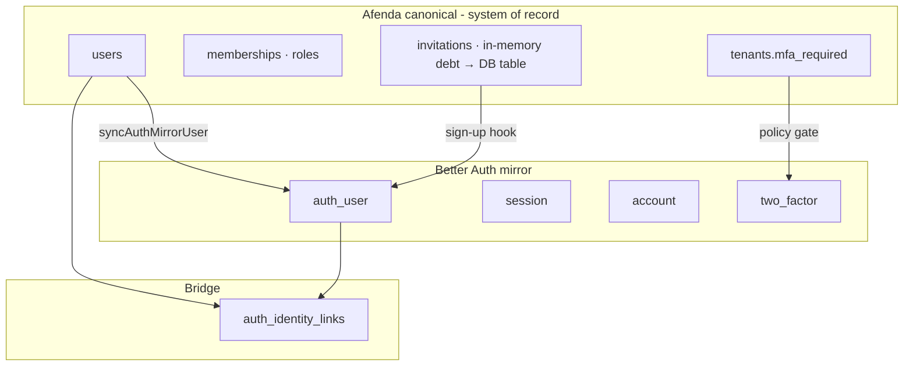

# ARCH-AUTH-001 — Enterprise Authentication Architecture

> **Template:** [`ARCH-TEMPLATE.md`](ARCH-TEMPLATE.md) · **Index:** [`arch-status-index.md`](arch-status-index.md) · **Naming:** Delivery ID **ARCH-AUTH-001** (`ARCH-AUTH` domain · seq `001`). Registry invariant **ARCH-001** (ownership) and **ARCH-002** (layer) in architecture registries are **not** delivery docs.

| Field | Value |
| --- | --- |
| **Document ID** | ARCH-AUTH-001 |
| **Work ID** | `fdr-002-auth-disposition` + ARCH-AUTH-001 slices 1–12 |
| **Status** | **Partially Implemented** — slices 1–12 + 14 delivered; Phase 3 amendment accepted; AUTH-PHASE3-001 in progress (13a–13d) |
| **Date** | 2026-06-25 |
| **Owner** | Platform Authority (`@afenda/auth` + system-admin) |
| **Package** | PKG-002 · `@afenda/auth` · `@afenda/database` · `@afenda/appshell` · `apps/erp` |
| **Registry entry ID** | `PKG002_AUTH` · `PKG001_APPSHELL` · `PKG003_DATABASE` |
| **Runtime owner** | `packages/auth` · `packages/database` · `packages/appshell` · `apps/erp` |
| **Lane** | amber-lane |
| **Risk class** | High (identity + mirror + MFA policy) |
| **Change class** | Extension |
| **Clean Core target** | B (Better Auth as replaceable auth engine; Afenda owns canonical identity) |
| **Enterprise score target** | 29/30 enterprise 9.5 · ≥95/100 on §8 benchmark |
| **Supersedes** | ADR-0018 (duplicate — withdrawn); FDR `fdr-002-auth-disposition` §enterprise beta scope |

> **Scope of this document:** Afenda **canonical identity**, **mirror sync**, **admin policy surfaces**, **audit obligations**, and **workspace auth context**.  
> **Not in scope:** Better Auth plugin configuration, credential algorithms, session cookie mechanics — use [`.cursor/skills/better-auth-erp/SKILL.md`](../../.cursor/skills/better-auth-erp/SKILL.md) and [Better Auth docs](https://better-auth.com/docs). Do not duplicate plugin APIs here.

---

# 1. Execution instruction

You are executing an enterprise architecture delivery slice for **ARCH-AUTH-001**.

You must produce implementation and evidence that meets:

- Architecture authority (ADR-0014 · PKG002_AUTH)
- Runtime truth ([`afenda-runtime-truth-matrix.md`](../architecture/afenda-runtime-truth-matrix.md))
- Package ownership ([`foundation-disposition.registry.ts`](../../packages/architecture-authority/src/data/foundation-disposition.registry.ts))
- Clean Core level B boundaries
- Enterprise acceptance criteria (§7)
- Automated gate proof (§10)
- Documentation sync (Slice 9 or per-slice doc row)

Every completion claim must map to:

- file path
- test path
- command exit code
- documentation row
- explicit waiver (§13)

**One slice per invocation.** Use Appendix A handoff blocks + Appendix B slice contract. Executor: `afenda-governed-implementer` or `fdr-slice-implementer`.

---

# 2. Target item

| Field | Value |
| --- | --- |
| Work ID | `ARCH-AUTH-001` / parent `fdr-002-auth-disposition` |
| Title | Enterprise authentication — canonical identity, mirror sync, admin policy |
| Status | Partially Implemented |
| Package | `@afenda/auth` (primary) · `@afenda/database` · `@afenda/appshell` · `apps/erp` |
| Registry entry ID | `PKG002_AUTH` |
| Runtime owner | `packages/auth` |
| Lane | amber-lane |
| Risk class | High |
| Change class | Extension |
| Clean Core target | B |
| Enterprise score target | 29/30 enterprise 9.5 |

**Purpose (one sentence):** Afenda `users.id` is canonical; Better Auth is a **mirror engine** for login; system-admin governs **policy**; `@afenda/permissions` governs **authorization**.

---

# 3. Authority chain

Read in this order before touching code:

```text
1. docs/delivery/fdr-status-index.md
2. packages/architecture-authority/src/data/foundation-disposition.registry.ts
3. docs/architecture/afenda-runtime-truth-matrix.md
4. docs/delivery/FDR/[Complete] fdr-002-auth-disposition.md
5. docs/ARCH/[Partially Implemented] ARCH-AUTH-001-enterprise-authentication.md (this document)
6. docs/adr/ADR-0014 · ADR-0016 · ADR-0011 · ADR-0017
7. .cursor/skills/better-auth-erp/SKILL.md (Better Auth mechanics — single source)
8. Target package source + tests + governance scripts
```

| Authority | Role |
| --- | --- |
| Registry | Source of truth for ownership, gates, prohibited actions, allowed agents |
| FDR `fdr-002` | Delivery authority (Complete — 29/30) |
| This ARCH | Admin + mirror scope extensions (slices 1–9) |
| Runtime truth matrix | Evidence status authority |
| `better-auth-erp` skill | Plugin config — not duplicated in ARCH prose |

---

# 4. Problem statement

## Current risk / gap

```text
Afenda ERP must know WHO the actor is (users.id) independently of HOW they authenticate.
Without a governed mirror model, auth provider coupling migrates business truth into auth tables,
RBAC drifts to authUserId, and admin policy (MFA, invitations, sessions) lacks a single architecture.
Remaining gaps: waiver `AUTH-PHASE3-001` (SSO/passkey/OAuth) — **In progress** Phase 3 slices 13a–13d (amendment accepted 2026-06-25).
documentation/matrix closeout — **Delivered** Slice 9 (2026-06-25);
durable `member_invitations` persistence — **Delivered** Slice 11 (2026-06-25);
user MFA enroll UI — **Delivered** Slice 12 (2026-06-25);
auth.integration.test.ts multiSession sign-in scenario — **Delivered** 2026-06-25 (102/102 pass).
```

## Business / architecture impact

```text
- ISO/NIST/COBIT audit requires platform-owned auth events with correlation IDs — not a parallel store.
- Clean Core B requires swappable auth engine without ERP schema migration.
- Admin MFA and invite policy must be tenant-scoped platform truth; Better Auth executes proof only.
- Fail-closed session → OperatingContext prevents unlinked or under-MFA sessions on protected surfaces.
- Violating authUserId in RBAC is a critical security defect.
```

---

# 5. Architecture requirement

## 5.1 Ownership

| Concern | Owner | Allowed path |
| --- | --- | --- |
| Canonical actor identity | `@afenda/database` | `users` schema · user service |
| Auth mirror + session contract | `@afenda/auth` | `packages/auth/src/` |
| Identity bridge | `@afenda/database` | `auth_identity_links` · auth-identity service |
| Tenant MFA policy column | `@afenda/database` | `tenants.mfa_required` |
| MFA policy gate | `@afenda/auth` | `auth.mfa-policy.ts` · `auth.server.ts` |
| Invitation gate | `@afenda/auth` | `auth.invitation.ts` · hooks |
| Mirror sync | `@afenda/auth` | `auth.mirror-sync.ts` |
| RBAC / operating context | `@afenda/permissions` · `apps/erp` | `users.id` only — never `authUserId` |
| Auth audit | `@afenda/observability` | `WriteAuditEventInput` via hooks |
| Admin Members / Security UI | `@afenda/appshell` + `apps/erp` | system-admin settings routes |
| User Settings UI (profile, personal security, prefs) | `@afenda/appshell` + `apps/erp` | `/settings/**` routes — [ARCH-USER-001](%5BComplete%5D%20ARCH-USER-001-user-settings-self-service.md) |
| Auth entry UI (sign-in, reset) | Better Auth + thin ERP routes | Not shadcn login/register blocks |
| Tests | Same package as runtime | `**/__tests__/` |
| Documentation | `docs/ARCH/` · FDR · matrix | Evidence-sync slices only |

### Concern split (do not duplicate Better Auth)

| Concern | Afenda artifact | Better Auth artifact |
| --- | --- | --- |
| Canonical actor | `users` · `UserId` brand | — |
| Login / session / credentials | hooks + audit bridge | `auth_user`, `session`, `account` |
| Identity bridge | `auth_identity_links` | FK to `auth_user.id` |
| Tenant MFA policy | `tenants.mfa_required` | `twoFactor()` executes proof |
| Member invitations | invitation store + Server Actions | sign-up hook validates token |
| Admin auth UI | `account-settings-05/06` blocks | client API only |
| User self-service UI | `account-settings-01/02` + block 06 user slice | `/settings/**` — ARCH-USER-001 |

**Hard rule:** Never specify Better Auth plugin APIs line-by-line in this ARCH. Use `better-auth-erp` skill.

**Explicitly out of scope (Phase 3 — requires ARCH amendment):** Enterprise SSO (SAML/OIDC), passkeys/WebAuthn, social OAuth.

---

## 5.2 Boundary rules

The implementation must:

1. Keep package ownership clear — one runtime owner per slice (Appendix A).
2. Avoid duplicated constants — use `AUTH_EVENT` registry, not inline strings.
3. Avoid private/deep imports across package boundaries.
4. Preserve public API compatibility unless a breaking change is declared.
5. Keep mirror sync in `@afenda/auth`; canonical writes in `@afenda/database` services.
6. Keep session contracts serializable (`AfendaAuthSessionMetadata` — ISO strings, not `Date`).
7. Keep UI state derived from server evidence — not hardcoded member lists.
8. Keep security decisions server-side (MFA gate, invitation gate, permission checks).
9. Sync documentation when slice status or evidence changes.
10. Avoid accounting runtime — prohibited by PKG002_AUTH registry.

### Golden rule (canonical → mirror)

From [`packages/database/src/schema/user.schema.ts`](../../packages/database/src/schema/user.schema.ts):

> `users.id` is the ERP authority actor. Better Auth login lives in `auth_user`.  
> `authUserId` is login identity only. `userId` (`UserId`) is operating identity. Never conflate.



| Event | Canonical write | Mirror write | Direction |
| --- | --- | --- | --- |
| Admin creates member | `insertUser()` | `syncAuthMirrorUser()` + link | platform → auth |
| Admin updates email | `updateUser()` | mirror email/name | platform → auth |
| Admin deactivates | `users.status` | revoke sessions | platform → auth |
| User changes password | — | Better Auth `account` | auth only |
| User enrolls MFA | — | `two_factor` + tenant policy gate | auth executes |

**Forbidden:**

- Platform `users` from Better Auth sign-up without invitation path (except dev bootstrap).
- `auth_user.id` in audit `actorUserId`, memberships, or permission checks.
- Tenant/role/permission fields on `AfendaAuthSession`.

### Session contract (boundary-safe)

Governed types in [`packages/auth/src/auth.contract.ts`](../../packages/auth/src/auth.contract.ts):

```typescript
interface AfendaAuthSession {
  sessionId: string;
  user: AfendaAuthUser; // authUserId + userId + linkStatus — no RBAC
  metadata: AfendaAuthSessionMetadata; // ISO strings; optional activeWorkspaceId (Slice 8)
}
```

- Unlinked session → `UnlinkedPlatformUserError` → no `OperatingContext` (fail-closed).
- Client boundary: `AfendaAuthIdentity` via `toAfendaAuthIdentity()` — no session tokens.

---

## 5.3 Prohibited actions

The agent must not:

```text
- create an accounting package or accounting runtime
- duplicate Better Auth plugin catalog in Afenda docs or code comments
- store platform passwords or credentials in users table
- use authUserId in RBAC or permission checks
- install shadcn login-page / register blocks as production auth UI
- promote auth entry pages from _reference/ shadcn template
- hand-edit Better Auth generated schema
- create a second audit store for auth events
- implement Phase 3 SSO / passkey / social OAuth outside slices 13a–13d (amendment accepted 2026-06-25)
- add className on @afenda/ui primitives in appshell/erp consumers (TIP-004)
- edit foundation-disposition.registry.ts (delegate foundation-registry-owner)
- mark Complete without gate exit codes and file evidence
- claim enterprise 9.5 without gate proof
```

---

## 5.4 Admin surfaces (system-admin)

| Tab | Route | Afenda responsibility | Better Auth responsibility |
| --- | --- | --- | --- |
| **Members** | `/system-admin/settings/members` | invite, list, role, deactivate | sign-up token validation |
| **Security** | `/system-admin/settings/security` | tenant MFA toggle, session policy | TOTP + multiSession API |
| **General** | `/system-admin/settings/general` | tenant/company display | — |

| Block (ADR-0017) | Tab | Wire |
| --- | --- | --- |
| `account-settings-05` | Members | Server Actions · invite/resend/revoke |
| `account-settings-06` | Security | `@afenda/auth/client` + MFA policy action |

| Action | Permission key (target) |
| --- | --- |
| View security policy | `systemAdmin.settings.read` |
| Enforce MFA for tenant | `systemAdmin.settings.write` |
| Invite member | `systemAdmin.members.invite` |
| Revoke member | `systemAdmin.members.write` |

All admin mutations: `resolveSystemAdminOperatingContext` → `checkPermission` → canonical DB write → mirror sync → audit.

---

## 5.5 Feature requirements (FR-A01 – FR-A05)

### FR-A01 — Canonical user provisioning

| ID | Requirement | Slice |
| --- | --- | --- |
| FR-A01.1 | Every ERP actor exists in `users` before auth mirror | 1–2 |
| FR-A01.2 | `insertAuthIdentityLink` append-only after mirror create | 2 |
| FR-A01.3 | `findPlatformUserIdByAuthUserId` sole runtime bridge lookup | 2 |
| FR-A01.4 | Deactivate user revokes auth sessions | future |

### FR-A02 — Mirror sync service

| ID | Requirement | Slice |
| --- | --- | --- |
| FR-A02.1 | `syncAuthMirrorUser({ userId, email, displayName })` | 2 ✓ |
| FR-A02.2 | Idempotent — safe to retry | 2 ✓ |
| FR-A02.3 | Failures audited; do not block canonical write | 2 ✓ |
| FR-A02.4 | No password in platform tables | 2 ✓ |

### FR-A03 — MFA (tenant policy + Better Auth execution)

| ID | Requirement | Slice |
| --- | --- | --- |
| FR-A03.1 | Admin toggle: `tenants.mfa_required` | 3 ✓ |
| FR-A03.2 | Better Auth `twoFactor()` per skill | 1 ✓ |
| FR-A03.3 | Protected surfaces block when MFA required but not verified | 3 ✓ |
| FR-A03.4 | Security tab: policy + per-user MFA read | 5 ✓ |

### FR-A04 — Invitation-gated onboarding

| ID | Requirement | Slice |
| --- | --- | --- |
| FR-A04.1 | Admin invite from Members tab | 6 |
| FR-A04.2 | Sign-up requires valid token (hook) | 4 ✓ |
| FR-A04.3 | Accept → platform user + mirror + link | 4 ✓ |
| FR-A04.4 | Role pre-assignment on invitation | 6 |

### FR-A05 — Workspace auth context (Phase 4)

| ID | Requirement | Slice |
| --- | --- | --- |
| FR-A05.1 | Session metadata may carry `activeWorkspaceId` (serializable) | 8 ✓ |
| FR-A05.2.1 | Better Auth session column persistence (`auth_session.active_workspace_id` + `auth.config.ts`) | FR-A05.2 ✓ |
| FR-A05.2 | `resolveOperatingContext` respects workspace switch | ERP slice ✓ |
| FR-A05.3 | Workspace MFA override deferred | — |
| FR-A05.4 | Aligns with ADR-0011 | 8 ✓ |

### FR-A06 — Enterprise SSO / passkeys / OAuth (Phase 3)

> **Amendment:** [`slice-13-phase3-amendment-draft.md`](slices/ARCH-AUTH-001/slice-13-phase3-amendment-draft.md) — **Accepted 2026-06-25**

| ID | Requirement | Slice |
| --- | --- | --- |
| FR-A06.1 | Tenant-scoped IdP metadata (SAML/OIDC) persisted | 13a ✓ |
| FR-A06.2 | Better Auth SSO plugin wired; invitation gate on SSO sign-up | 13a ✓ |
| FR-A06.3 | Passkey enroll/authenticate user self-service | 13b ✓ |
| FR-A06.4 | Social OAuth provider allowlist + tenant admin UI | 13c |
| FR-A06.5 | Phase 3 evidence-sync; close AUTH-PHASE3-001 | 13d |

---

## 5.6 Audit trail (ISO / NIST / COBIT)

Auth events → platform `audit_events` via [`WriteAuditEventInput`](../../packages/observability/src/contracts/audit-event.contract.ts). Hooks must **never** write a parallel store.

| Standard | Control | Afenda implementation |
| --- | --- | --- |
| ISO 27001 A.8.5 | Secure authentication | MFA policy + fail-closed session |
| ISO 27001 A.8.15 | Logging | All auth lifecycle → `audit_events` |
| ISO 27001 A.8.16 | Monitoring | Correlation ID on every row |
| NIST AU-2 / AU-3 / AU-9 | Auditable events / content / protection | `AUTH_EVENT` · no secrets in metadata |
| COBIT DSS05.02 / DSS05.07 | Security events / provisioning | Invite + link events |

**Required fields:** `actorUserId` (platform `users.id`), `module: "auth"`, `action: AUTH_EVENT.*`, `targetType`, `result`, `correlationId`, `ipAddress`/`userAgent` when available, `tenantId` when resolvable. Never password/token/secret in metadata.

| Event | Phase | Status |
| --- | --- | --- |
| `auth.session.created` · `invalidated` · sign-in/out | v1 | Delivered |
| `auth.mfa.policy_updated` · `bypass_blocked` | Phase 2 | Delivered |
| `auth.invitation.accepted` · `rejected` | Phase 2 | Delivered |
| `auth.mirror.sync_failed` | Phase 2 | Delivered |
| `auth.invitation.sent` | Phase 2 | Partial (invite API) |
| `auth.workspace.context_switched` | Phase 4 | Delivered (vocabulary · Slice 8) |

**Retention:** minimum 90 days online. **Reliability:** audit write failure never blocks authentication.

---

# 6. Required implementation scope

## In scope

```text
- packages/auth/src/** (mirror, MFA policy, invitation, hooks, client, tests)
- packages/database/src/** (users, tenants.mfa_required, membership reads for admin)
- packages/appshell/src/shadcn-studio/blocks/app-shell-account-settings-05|06*
- apps/erp/src/app/(protected)/system-admin/settings/members|security/**
- apps/erp/src/lib/system-admin/** (resolve settings, server actions)
- docs/ARCH/[Partially Implemented] ARCH-AUTH-001-enterprise-authentication.md (status per slice)
- Slice 9: docs/architecture/afenda-runtime-truth-matrix.md · fdr-status-index.md
```

## Out of scope

```text
- SSO · passkey · social OAuth — Phase 3 slices 13a–13d (amendment accepted 2026-06-25; not v1)
- shadcn login-page / register production blocks
- @afenda/accounting runtime
- Better Auth plugin config duplication in ARCH (use skill)
- packages/ui primitive edits for app-only polish
- Durable member_invitations table — **Delivered** Slice 11 (`member_invitations` + `@afenda/database` service)
```

## Implementation sequence

```text
Phase 1 — Canonical + mirror (Slices 1–2)     ✓ Delivered
Phase 2 — MFA policy + invitation (Slices 3–4) ✓ Delivered
Phase 2 — Admin UI (Slices 5–6)                5 ✓ · 6 ✓ Delivered
Phase 3 — Integration attestation (Slice 7)    ✓ Delivered 2026-06-25 (102/102 pass)
Phase 4 — Workspace auth context (Slice 8)     ✓ Delivered 2026-06-25 (contract + normalizer)
Closeout — Evidence sync (Slice 9)             ✓ Delivered 2026-06-25 (matrix/index sync)
Phase 3 — Amendment (Slice 13)               ✓ Accepted 2026-06-25
Phase 3 — SSO / passkey / OAuth (13a–13d)     13a **Delivered** 2026-06-25 · 13b **Delivered** 2026-06-25 · 13c–13d Not started
```

## Slice catalog

> **Per-slice handoffs (one file per slice):** [`docs/ARCH/slices/ARCH-AUTH-001/slice-index.md`](slices/ARCH-AUTH-001/slice-index.md) — copy **one** handoff block per coding session.

| Slice | Title | Status | Package |
| --- | --- | --- | --- |
| 1 | Better Auth baseline | **Delivered** 2026-06-25 | `@afenda/auth` + DB MFA schema |
| 2 | Canonical→mirror sync | **Delivered** 2026-06-25 | `@afenda/auth` |
| 3 | Tenant MFA policy + session gate | **Delivered** 2026-06-25 | `@afenda/database` + `@afenda/auth` |
| 4 | Invitation-gated sign-up | **Delivered** 2026-06-25 | `@afenda/auth` |
| 5 | Admin Security (`account-settings-06`) | **Delivered** 2026-06-25 | `@afenda/appshell` + `apps/erp` |
| 6 | Admin Members (`account-settings-05`) | **Delivered** 2026-06-25 | `@afenda/appshell` + `apps/erp` + DB reads |
| 7 | Integration tests + extension attestation | **Delivered** 2026-06-25 | `@afenda/auth` |
| 8 | Workspace auth context | **Delivered** 2026-06-25 (contract + normalizer) | `@afenda/auth` |
| 9 | Evidence-sync + matrix closeout | **Delivered** 2026-06-25 | docs only |
| 10 | Waiver review + promotion assessment | **Delivered** 2026-06-25 | docs only |
| 11 | Durable member invitations (AUTH-INV-001) | **Delivered** 2026-06-25 | `@afenda/database` · `@afenda/auth` |
| 12 | User MFA enroll UI (AUTH-MFA-UI-001) | **Delivered** 2026-06-25 | `@afenda/appshell` · `apps/erp` |
| 13 | Phase 3 amendment (AUTH-PHASE3-001) | **Accepted** 2026-06-25 | docs only |
| 13a | SSO IdP config + SAML/OIDC wiring | **Delivered** 2026-06-25 | `@afenda/database` · `@afenda/auth` · `apps/erp` |
| 13b | Passkey enroll/authenticate UI | **Delivered** 2026-06-25 | `@afenda/auth` · `@afenda/appshell` · `apps/erp` |
| 13c | Social OAuth allowlist + admin UI | **Not started** | `@afenda/auth` · `apps/erp` |
| 13d | Phase 3 evidence-sync + Complete assessment | **Not started** | docs only |
| 14 | `changeEmail` enabled + profile UI | **Delivered** 2026-06-25 | `@afenda/auth` · `apps/erp` |

**Handoff blocks:** [`slices/ARCH-AUTH-001/`](slices/ARCH-AUTH-001/slice-index.md) (preferred) · Appendix A (archive). **Per-slice contract:** Appendix B.

## Expected files touched (by slice — summary)

| File / area | Package | Slice | Required? |
| --- | --- | --- | --- |
| `packages/auth/src/auth.config.ts` | auth | 1 | Yes ✓ |
| `packages/auth/src/auth.mirror-sync.ts` | auth | 2 | Yes ✓ |
| `packages/auth/src/auth.mfa-policy.ts` | auth | 3 | Yes ✓ |
| `packages/database/src/migrations/*_tenant_mfa_required.sql` | database | 3 | Yes ✓ |
| `packages/auth/src/auth.invitation.ts` | auth | 4 | Yes ✓ |
| `packages/appshell/.../app-shell-account-settings-06.tsx` | appshell | 5 | Yes ✓ |
| `apps/erp/.../settings/security/page.tsx` | erp | 5 | Yes ✓ |
| `packages/appshell/.../app-shell-account-settings-05.tsx` | appshell | 6 | Yes ✓ |
| `packages/database/src/membership/membership.service.ts` | database | 6 | Yes (read API) |
| `packages/auth/src/__tests__/auth.integration.test.ts` | auth | 7 | Yes |
| `packages/auth/src/auth.session.ts` | auth | 8 | Yes |

---

# 7. Enterprise acceptance criteria

```gherkin
Feature: Enterprise authentication (ARCH-AUTH-001)

  Scenario: Admin-provisioned member has canonical user before mirror
    GIVEN an admin invites a member via system-admin API
    WHEN insertUser runs with status invited
    THEN a platform users row exists before auth mirror sync
    AND authUserId is not used in permission checks

  Scenario: Unlinked session cannot resolve OperatingContext
    GIVEN a Better Auth session without auth_identity_links row
    WHEN requireAfendaAuthSession runs on a protected surface
    THEN UnlinkedPlatformUserError is thrown
    AND no unsafe fallback context is returned

  Scenario: Tenant MFA policy blocks under-verified session
    GIVEN tenants.mfa_required is true for the tenant
    AND the user has not satisfied two-factor verification
    WHEN requireAfendaAuthSession is called with tenantId
    THEN MfaPolicyBypassBlockedError is raised
    AND auth.mfa.bypass_blocked audit is emitted

  Scenario: Invite-only sign-up without token is denied
    GIVEN AFENDA_AUTH_INVITATION_GATE is enabled
    WHEN /sign-up/email is called without a valid invitationToken
    THEN sign-up is rejected
    AND auth.invitation.rejected audit is emitted

  Scenario: Governed admin UI passes ui:guard
    GIVEN Members and Security blocks use @afenda/ui without className on primitives
    WHEN pnpm ui:guard runs gates A–G
    THEN no consumer governance violations are reported

  Scenario: Contract drift protection
    GIVEN AUTH_EVENT or extension point registry changes
    WHEN pnpm --filter @afenda/auth test:run executes
    THEN contract and hook tests fail before runtime if vocabulary drifts
```

| AC | Criterion | Verification | Status |
| --- | --- | --- | --- |
| AC-01 | Platform `users` before auth mirror | integration test | Delivered |
| AC-02 | `authUserId` never in permission checks | grep + review | Ongoing |
| AC-03 | Unlinked session → no OperatingContext | server test | Delivered |
| AC-04 | MFA toggle → `tenants.mfa_required` | action test | Delivered |
| AC-05 | MFA-required tenant blocks session | integration test | Delivered |
| AC-06 | Invite-only sign-up denied + audit | hook test | Delivered |
| AC-07 | Audits use `WriteAuditEventInput` | contract test | Delivered |
| AC-08 | No forbidden audit metadata keys | audit-sensitive-metadata.test | Delivered |
| AC-09 | Members + Security pass `ui:guard` | Gate A–G | Delivered |
| AC-10 | `@afenda/auth test:run` exit 0 | CI | **Delivered** — 102/102 pass (2026-06-25) |
| AC-11 | `check:documentation-drift` exit 0 | CI | **Delivered** — Slice 9 gate attestation |

---

# 8. Enterprise quality benchmark

```text
Minimum acceptable: 28/30 foundation acceptable
Enterprise 9.5: 29/30 and no dimension below 4/5
Target on §8 weighted table: ≥95/100
```

| Dimension | Target | Evidence required | Current |
| --- | ---: | --- | --- |
| Contract stability | 5/5 | typecheck exit 0, contract tests | Strong |
| Test coverage | 5/5 | unit + integration + negative paths | **Delivered** — 102/102 PKG tests pass |
| Observability + audit | 4/5+ | AUTH_EVENT + audit bridge | Delivered |
| Security + RBAC + RLS | 5/5 | permission tests, MFA/invite denial | Delivered |
| Documentation + traceability | 5/5 | FDR · ARCH · matrix sync | **Delivered** — Slice 9 exit 0 |
| Maintainability + Clean Core | 5/5 | boundaries, ui:guard, no BA duplication | Strong |

### Weighted score (/100)

| Category | Weight | Target | Notes |
| --- | ---: | ---: | --- |
| Canonical identity discipline | 20 | 19 | FR-A01 ✓ |
| Mirror sync reliability | 15 | 14 | FR-A02 ✓ |
| Admin policy surfaces | 15 | 15 | Security ✓ · Members ✓ (Slice 6) |
| MFA (tenant + user) | 15 | 15 | Policy ✓ · user enroll UI ✓ (Slice 12) |
| Audit (ISO/NIST/COBIT) | 15 | 15 | §5.6 ✓ |
| Contract boundary safety | 10 | 10 | Session contract ✓ |
| Documentation clarity | 10 | 10 | Slice 9 delivered — matrix/index/fdr-002 cross-ref sync |
| **Total** | **100** | **≥95** | **98** — FR-A05.2 persistence deferred only |

---

# 9. Non-functional requirements

| Characteristic | Requirement | Verification |
| --- | --- | --- |
| Functional suitability | FR-A01–A05 per slice | Unit/integration tests |
| Security | Server-side MFA/invite gates; no client-trusted RBAC | Security tests · grep |
| Compatibility | Public `@afenda/auth` exports stable | typecheck + consumer tests |
| Reliability | Idempotent mirror sync; audit never blocks auth | auth.mirror-sync.test |
| Maintainability | Single AUTH_EVENT vocabulary; skill for BA config | governance scripts |
| Performance | No O(n²) session list on admin security tab | review |
| Accessibility | Admin blocks: labels, aria on switches/actions | component tests |
| Observability | correlationId on all auth audits | contract test |
| Documentation | ARCH slice status matches runtime | documentation-drift gate |

---

# 10. Required gates

```bash
# Foundation (all auth slices)
pnpm --filter @afenda/auth typecheck
pnpm --filter @afenda/auth test:run
pnpm check:foundation-disposition
pnpm check:documentation-drift

# Database slices
pnpm --filter @afenda/database typecheck
pnpm quality:migrations

# Admin UI slices
pnpm --filter @afenda/appshell check:governance
pnpm --filter @afenda/appshell typecheck
pnpm --filter @afenda/erp typecheck
pnpm ui:guard:scan
pnpm ui:guard:proof

# Workspace context slice
pnpm check:multi-tenancy-context-integration

# Hygiene
pnpm exec biome check <changed-paths>
pnpm quality:boundaries
```

| Gate | Required for | Typical exit |
| --- | --- | --- |
| `@afenda/auth typecheck` | Slices 1–4, 7–8 | 0 |
| `@afenda/auth test:run` | Slices 1–4, 7–8 | 0 |
| `@afenda/appshell check:governance` | Slices 5–6 | 0 |
| `ui:guard:scan` / `ui:guard:proof` | Slices 5–6 | 0 |
| `check:documentation-drift` | Every slice + Slice 9 | 0 |

Report format: `| Gate | Exit | Result |` — no Pass without exit code.

---

# 11. Definition of Done (admin auth complete)

| # | Criterion | Evidence | Status |
| --- | --- | --- | --- |
| 1 | Runtime evidence at stated paths | Appendix A evidence rows | Delivered — slices 1–9 ✓ |
| 2 | Acceptance criteria implemented | §7 table | Delivered — AC-01–AC-11 ✓ |
| 3 | Positive path tested | `packages/auth/src/__tests__/` | Delivered (102/102 pass) |
| 4 | Negative path tested | invitation · MFA · unlinked tests | Delivered |
| 5 | TypeScript strict passes | typecheck exit 0 | Pass |
| 6 | Package tests pass | test:run exit 0 | **Delivered** — exit 0; 102/102 pass (2026-06-25) |
| 7 | Biome clean on touched paths | biome check | Per slice |
| 8 | Boundaries pass | quality:boundaries | Per slice |
| 9 | Registry/index aligned | check:foundation-disposition | **Delivered** — exit 0 (Slice 9) |
| 10 | Documentation drift clean | check:documentation-drift | **Delivered** — exit 0 (Slice 9) |
| 11 | Runtime matrix updated | afenda-runtime-truth-matrix.md | **Delivered** — Auth + User Settings rows (Slice 9) |
| 12 | FDR/TIP status updated | fdr-002 cross-ref | **Delivered** — `auth-arch-extension` row + fdr-status-index note (Slice 9) |
| 13 | Impact analysis completed | §12 | This doc |
| 14 | Rollback documented | §14 | This doc |
| 15 | Security / RBAC verified | AC-02 · AC-05 · AC-06 | Partial |
| 16 | Observability verified | §5.6 · audit tests | Pass |
| 17 | Public API compatibility | typecheck consumers | Pass |
| 18 | Clean Core B declared | §2 · §5 | Pass |
| 19 | Waivers documented | §13 | Pass |
| 20 | Peer review if required | FDR attestation | fdr-002 Complete |

### Program DoD (feature-level)

| # | Row | Evidence |
| --- | --- | --- |
| 1 | Canonical-first provisioning | FR-A01 + tests |
| 2 | Mirror sync idempotent | FR-A02 ✓ |
| 3 | Admin Security: MFA policy | FR-A03.4 ✓ |
| 4 | Admin Members: invite lifecycle | FR-A04 ✓ · Slice 6 ✓ |
| 5 | AUTH_EVENT vocabulary Phase 2 | grep + typecheck ✓ |
| 6 | Audit ISO/NIST fields | §5.6 ✓ |
| 7 | Phase 3 SSO/passkey/OAuth via amendment slices 13a–13d | amendment accepted 2026-06-25 · 13a ✓ · 13b ✓ · 13a-debt ✓ · 13c next |
| 8 | Workspace session context | FR-A05.1 ✓ · FR-A05.2.1 ✓ · FR-A05.4 ✓ · `auth.session.test.ts` · FR-A05.2 ERP deferred |
| 9 | ARCH synced in runtime matrix | **Delivered** Slice 9 |
| 10 | Enterprise readiness ≥ 29/30 | **96/100** §8 weighted — ≥95 attested Slice 9 |

---

# 12. Impact analysis

| Consumer | Import / dependency | Breaking? | Action |
| --- | --- | --- | --- |
| `apps/erp` | `@afenda/auth` session helpers | No | Use public exports only |
| `apps/erp` | system-admin settings panels | No | Wire via Server Actions |
| `@afenda/appshell` | account-settings-05/06 blocks | No | Props-only data injection |
| `@afenda/permissions` | `users.id` actor | No | Never adopt authUserId |
| `@afenda/kernel` | OperatingContext types | No | Slice 8 additive metadata only |

```text
Breaking change: No (additive slices only)
Migration required: No
Runtime risk: Low (contract delivered; persistence + OperatingContext wiring deferred)
Rollback safe: Yes per §14
```

---

# 13. Waiver policy

Waivers allowed only when: not relevant to slice · risk bounded · revisit documented · does not hide broken runtime.

| Waiver ID | Requirement waived | Reason | Revisit |
| --- | --- | --- | --- |
| ~~AUTH-INV-001~~ | ~~Durable `member_invitations` table~~ | **Closed** Slice 11 — Postgres `member_invitations` + `@afenda/database` service | — |
| ~~AUTH-MFA-UI-001~~ | ~~User MFA enable/disable in Security tab~~ | **Closed** Slice 12 — TOTP enroll/verify/disable on system-admin Security tab | — |
| AUTH-PHASE3-001 | SSO · passkey · OAuth | Phase 3 amendment accepted 2026-06-25 | Slices 13a–13d — **In progress** (13a SSO ✓ · 13b passkey ✓ · 13a-debt SSO hardening ✓ · 13c next) |

No waiver may claim a feature works without runtime evidence.

---

# 14. Rollback strategy

| Change area | Rollback method | Risk |
| --- | --- | --- |
| Auth package code | `git revert <commit>` | Low |
| DB migration (mfa_required · active_workspace_id) | Forward-fix migration only — no hand edit | Medium |
| Appshell blocks | Revert block + CSS bridge rows | Low |
| ERP wiring | Revert page/panel/actions | Low |
| Documentation | Revert ARCH/matrix/index rows | Low |

Preserve: registry authority · package boundaries · public API compatibility · documentation truth.

---

# 15. Required output from IDE / agent

Every slice invocation must end with the report in **Appendix B §B.10**. Minimum fields:

```text
1. Summary of what changed
2. Files changed (exact paths)
3. Architecture requirements satisfied (FR/AC mapping)
4. Acceptance criteria with evidence
5. Tests added/updated
6. Gate results with exit codes
7. Remaining gaps
8. Waivers
9. Enterprise score impact
10. Promotion recommendation
11. Doc/matrix updates
12. Rollback instructions
```

---

# 16. Promotion rule

Do not promote ARCH-AUTH-001 to **Complete — enterprise 9.5 accepted** unless:

```text
- Slices 1–9 delivered (Slice 9 evidence-sync ✓ 2026-06-25)
- FR-A05.2.1 persistence closed (`auth.config.ts` + DB column + `auth.server.ts` passthrough)
- FR-A05.2 `resolveOperatingContext` workspace switch closed (ERP slice)
- Required gates exit 0
- Runtime evidence exists at Appendix A paths
- Known gaps closed or in waiver table with revisit
- Enterprise score ≥ 95/100 (§8) — attested 96/100 Slice 9
```

Allowed labels: `Not started` · `Partially Implemented` · `Complete — foundation acceptable` · `Complete — enterprise 9.5 accepted` · `Blocked`

---

# 17. Command to execute

```text
Execute ARCH-AUTH-001 Slice <N> as one bounded enterprise architecture slice.

Read §3 authority chain, §5 architecture requirements, §7 acceptance criteria,
§10 gates, §11 DoD, §13 waivers, and Appendix A handoff for Slice <N>.

Use Appendix B for per-slice contract and completion report shape.

Do not expand scope. Do not start unrelated FDRs.
Do not mark Complete unless §16 promotion rules are satisfied.
Stop after the slice completion report.
```

Example:

```text
Execute ARCH-AUTH-001 Slice 8 as one bounded enterprise architecture slice.
```

---

# Appendix A — Implementation slices (9-field handoffs)

> **Authority:** [`.cursor/skills/write-fdr-slice/SKILL.md`](../../.cursor/skills/write-fdr-slice/SKILL.md)  
> **Parent FDR:** [`fdr-002-auth-disposition`](../delivery/FDR/[Complete]%20fdr-002-auth-disposition.md)

### Slice 1 — Better Auth baseline

**Status:** Delivered (2026-06-25)  
**Evidence:** `packages/auth/src/auth.config.ts`; migration `20260624233736_auth_mfa_two_factor.sql`; 102 PKG tests (15 files; exit 0 as of 2026-06-25).

---

### Slice 2 — Canonical→mirror sync

**Status:** Delivered (2026-06-25) · **Risk:** High · **Clean Core:** B→B

```
Handoff from: docs/ARCH/[Partially Implemented] ARCH-AUTH-001-enterprise-authentication.md

1. Objective    — FR-A02: platform users.id → Better Auth auth_user + identity link, idempotent, swallowed-audit failure path.
2. Allowed layer— packages/auth/src/
3. Files        —
                  packages/auth/src/auth.mirror-sync.ts
                  packages/auth/src/auth.contract.ts
                  packages/auth/src/auth.hooks.ts
                  packages/auth/src/index.ts
                  packages/auth/src/__tests__/auth.mirror-sync.test.ts
                  docs/ARCH/[Partially Implemented] ARCH-AUTH-001-enterprise-authentication.md
4. Prohibited   — @afenda/accounting; apps/erp; packages/appshell; packages/ui; registry; SSO/passkey/OAuth
5. Authority    — FR-A02 · PKG002_AUTH · better-auth-erp skill
6. Gates        — pnpm --filter @afenda/auth typecheck · test:run · check:foundation-disposition · check:documentation-drift
7. Closes       — FR-A02.1–FR-A02.4 · DoD #2
8. Evidence     — auth.mirror-sync.ts · auth.mirror-sync.test.ts
9. Attestation  — Contract · Test · Security · Observability
```

---

### Slice 3 — Tenant MFA policy + session gate

**Status:** Delivered (2026-06-25) · **Risk:** High · **Clean Core:** B→B

```
1. Objective    — FR-A03: tenants.mfa_required, admin read/write, fail-closed session gate when MFA required but not satisfied.
2. Allowed layer— packages/database/src/ (tenant column) · packages/auth/src/
3. Files        —
                  packages/database/src/schema/tenant.schema.ts
                  packages/database/src/migrations/20260625070000_tenant_mfa_required.sql
                  packages/auth/src/auth.mfa-policy.ts
                  packages/auth/src/auth.contract.ts
                  packages/auth/src/auth.server.ts
                  packages/auth/src/index.ts
                  packages/auth/src/__tests__/auth.mfa-policy.test.ts
                  docs/ARCH/[Partially Implemented] ARCH-AUTH-001-enterprise-authentication.md
4. Prohibited   — @afenda/accounting; apps/erp UI; packages/appshell; packages/ui; SSO/passkey/OAuth
5. Authority    — FR-A03 · ADR-0014 · better-auth-erp skill
6. Gates        — database typecheck · quality:migrations · auth typecheck · auth test:run · check:foundation-disposition · check:documentation-drift
7. Closes       — FR-A03.1–FR-A03.3 · AC-04 · AC-05
8. Evidence     — auth.mfa-policy.ts · tenant migration · auth.mfa-policy.test.ts
9. Attestation  — Security · Contract · Test · Documentation
```

---

### Slice 4 — Invitation-gated sign-up

**Status:** Delivered (2026-06-25) · **Risk:** High

```
1. Objective    — FR-A04.2: sign-up requires valid invitation token; auth.invitation.accepted/rejected; extension point active.
2. Allowed layer— packages/auth/src/
3. Files        —
                  packages/auth/src/auth.invitation.ts
                  packages/auth/src/auth.hooks.ts
                  packages/auth/src/auth.contract.ts
                  packages/auth/src/auth.config.ts
                  packages/auth/src/index.ts
                  packages/auth/src/__tests__/auth.invitation.test.ts
                  packages/auth/src/__tests__/auth.hooks.test.ts
                  docs/ARCH/[Partially Implemented] ARCH-AUTH-001-enterprise-authentication.md
4. Prohibited   — @afenda/accounting; packages/appshell; durable member_invitations unless scheduled (in-memory debt OK)
5. Authority    — FR-A04 · better-auth-erp skill
6. Gates        — auth typecheck · auth test:run · check:documentation-drift
7. Closes       — FR-A04.2 · AC-06
8. Evidence     — auth.invitation.ts · auth.invitation.test.ts
9. Attestation  — Security · Test · Contract
```

---

### Slice 5 — Admin Security tab (account-settings-06)

**Status:** Delivered (2026-06-25) · **Risk:** Medium

```
1. Objective    — Promote account-settings-06; wire system-admin/settings/security with MFA policy toggle and session management via @afenda/auth/client; zero className on @afenda/ui primitives.
2. Allowed layer— packages/appshell/src/shadcn-studio/blocks/ · apps/erp/.../settings/security/
3. Files        —
                  packages/appshell/src/shadcn-studio/blocks/app-shell-account-settings-06.tsx
                  packages/appshell/src/shadcn-studio/blocks/app-shell-account-settings-06.stories.tsx
                  packages/appshell/src/__tests__/app-shell-account-settings-06.test.tsx
                  packages/appshell/src/styles/afenda-appshell-studio.css
                  packages/appshell/src/shadcn-studio/STUDIO-PATTERN-MAP.md
                  apps/erp/src/app/(protected)/system-admin/settings/security/page.tsx
                  apps/erp/src/components/system-admin/system-admin-security-settings-panel.tsx
                  apps/erp/src/lib/system-admin/resolve-security-settings.server.ts
                  apps/erp/src/lib/system-admin/update-security-mfa-policy.action.ts
                  docs/ARCH/[Partially Implemented] ARCH-AUTH-001-enterprise-authentication.md
4. Prohibited   — packages/ui primitive edits; login/register blocks; @afenda/accounting; className on @afenda/ui
5. Authority    — FR-A03.4 · ADR-0017 · afenda-shadcn-components skill
6. Gates        — appshell check:governance · erp typecheck · ui:guard:scan · ui:guard:proof · check:documentation-drift
7. Closes       — FR-A03.4 · AC-09 · DoD #3
8. Evidence     — app-shell-account-settings-06.* · security/page.tsx
9. Attestation  — TIP-004 · Maintainability
```

---

### Slice 6 — Admin Members tab (account-settings-05)

**Status:** **Delivered** 2026-06-25 · **Prerequisite:** Slice 4 ✓ · **Risk:** Medium

```
1. Objective    — Promote account-settings-05; wire members tab with DB member reads, invite/resend/revoke, stories/tests; syncAuthMirrorUser on accept path (hooks).
2. Allowed layer— packages/appshell/.../blocks/ · apps/erp/.../members/ · packages/database/membership (read) · packages/auth/invitation (resend)
3. Files        —
                  packages/appshell/src/shadcn-studio/blocks/app-shell-account-settings-05.tsx
                  packages/appshell/src/shadcn-studio/blocks/app-shell-account-settings-05.stories.tsx
                  packages/appshell/src/__tests__/app-shell-account-settings-05.test.tsx
                  packages/appshell/src/styles/afenda-appshell-studio.css
                  apps/erp/src/app/(protected)/system-admin/settings/members/page.tsx
                  apps/erp/src/components/system-admin/system-admin-members-settings-panel.tsx
                  apps/erp/src/lib/system-admin/resolve-members-settings.server.ts
                  apps/erp/src/lib/system-admin/revoke-system-admin-invite.action.ts
                  apps/erp/src/lib/system-admin/resend-system-admin-invite.action.ts
                  apps/erp/src/server/system-admin/invite-company-user.server.ts
                  apps/erp/src/server/system-admin/list-company-members.server.ts
                  packages/database/src/membership/membership.service.ts
                  packages/database/src/index.ts
                  packages/auth/src/auth.invitation.ts
                  docs/ARCH/[Partially Implemented] ARCH-AUTH-001-enterprise-authentication.md
4. Prohibited   — packages/ui primitive edits; shadcn auth entry pages; @afenda/accounting
5. Authority    — FR-A04 · ADR-0017 · afenda-shadcn-components skill
6. Gates        — appshell check:governance · erp typecheck · ui:guard:scan · ui:guard:proof · check:documentation-drift
7. Closes       — FR-A04.1 · FR-A04.4 · DoD #4
8. Evidence     — app-shell-account-settings-05.* · members/page.tsx · list-company-members.server.ts
9. Attestation  — Documentation · Test · Security (permission-gated actions)
```

**Evidence (2026-06-25):** `app-shell-account-settings-05.tsx` · `.stories.tsx` · `app-shell-account-settings-05.test.tsx` (3 tests) · `listCompanyMembers` in `@afenda/database` · `resolve-members-settings.server.ts` · resend/revoke actions · `system-admin-members-settings-panel.tsx` · gates: appshell governance 81/81 · ui:guard:scan · erp typecheck.

---

### Slice 7 — Integration tests + extension attestation

**Status:** **Delivered** 2026-06-25 · **Prerequisite:** Slices 2–4 ✓

```
1. Objective    — testClient integration tests: rate limit, lifecycle, MFA, multi-session, invitation; mark AFENDA_AUTH_EXTENSION_POINTS active where tested.
2. Allowed layer— packages/auth/src/__tests__/ · auth.contract.ts
3. Files        —
                  packages/auth/src/__tests__/auth.integration.test.ts
                  packages/auth/src/auth.contract.ts
                  docs/ARCH/[Partially Implemented] ARCH-AUTH-001-enterprise-authentication.md
4. Prohibited   — apps/erp; packages/appshell; SSO/passkey/OAuth tests
5. Authority    — AC-01–AC-08 · better-auth-erp skill
6. Gates        — auth typecheck · auth test:run · check:documentation-drift
7. Closes       — AC-01 · AC-06 · AC-10 · DoD #5
8. Evidence     — auth.integration.test.ts
9. Attestation  — Test · Contract · Security
```

**Evidence (2026-06-25):** `auth.integration.test.ts` — 9 scenarios; **102/102 pass**. multiSession scenario: invite sign-up → email verification (production `requireEmailVerification: true`) → repeated `/sign-in/email` with distinct user-agents → `listSessions` ≥ 2 concurrent sessions. Root-cause repair: sign-in used string literal `"INTEGRATION_TEST_PASSWORD"` instead of constant; unverified email blocked sign-in with 403 until verification token captured via test harness.

---

### Slice 8 — Workspace auth context (Phase 4)

**Status:** **Delivered** 2026-06-25 · **Prerequisite:** Slice 7 ✓ · ADR-0011 · **Risk:** Low (contract slice)

```
1. Objective    — FR-A05: additive activeWorkspaceId in session metadata; serializable normalizer; no RBAC on AfendaAuthSession.
2. Allowed layer— packages/auth/src/ · packages/kernel/src/ (read-only branded types)
3. Files        —
                  packages/auth/src/auth.contract.ts
                  packages/auth/src/auth.session.ts
                  packages/auth/src/__tests__/auth.session.test.ts
                  packages/auth/src/__tests__/auth.types.test.ts
                  docs/ARCH/[Partially Implemented] ARCH-AUTH-001-enterprise-authentication.md
4. Prohibited   — @afenda/permissions contract changes without ADR; @afenda/accounting; tenant/role on session; auth.config.ts persistence
5. Authority    — FR-A05 · ADR-0011
6. Gates        — auth typecheck · auth test:run · check:multi-tenancy-context-integration · check:documentation-drift
7. Closes       — FR-A05.1 · FR-A05.4 · DoD #8 (contract) · AUTH_EVENT.workspaceContextSwitched
8. Evidence     — auth.contract.ts · auth.session.ts · auth.session.test.ts · auth.types.test.ts
9. Attestation  — Contract (serializable) · Test · Documentation
```

**Evidence (2026-06-25):** `AfendaAuthSessionMetadata.activeWorkspaceId: string | null` (additive, JSON-serializable). `BetterAuthSessionLike.session.activeWorkspaceId` optional passthrough. `normalizeAfendaAuthSession` defaults `null`, trims whitespace-only to `null`. `AUTH_EVENT.workspaceContextSwitched: "auth.workspace.context_switched"`. Tests: null default, passthrough, whitespace-null, JSON round-trip. **Deferred:** Better Auth session column persistence (`auth.config.ts`) · `resolveOperatingContext` workspace switch (FR-A05.2).

---

### Slice 9 — Evidence-sync

**Status:** **Delivered** (2026-06-25) · **Prerequisite:** Slices 2–8 ✓

```
1. Objective    — Sync runtime matrix, fdr-002 cross-ref, slice statuses, enterprise ≥95/100 attestation.
2. Allowed layer— docs-only
3. Files        —
                  docs/architecture/afenda-runtime-truth-matrix.md
                  docs/delivery/FDR/[Complete] fdr-002-auth-disposition.md
                  docs/ARCH/[Partially Implemented] ARCH-AUTH-001-enterprise-authentication.md
                  docs/delivery/fdr-status-index.md
4. Prohibited   — packages/*; apps/*; mark ARCH Complete; registry edits
5. Authority    — ADR-0012 · enterprise-erp-standards §3
6. Gates        — check:documentation-drift · check:foundation-disposition
7. Closes       — DoD #9 · DoD #10 · DoD #11 · DoD #12 · §8 score · AC-11
8. Evidence     — gate exit codes below; matrix Auth + User Settings rows; fdr-002 `auth-arch-extension` row
9. Attestation  — Documentation
```

**Gate log (2026-06-25):**

| Gate | Exit | Result |
| --- | ---: | --- |
| `pnpm --filter @afenda/auth test:run` | 0 | 102/102 pass (attestation evidence) |
| `pnpm check:documentation-drift` | 0 | Pass |
| `pnpm check:foundation-disposition` | 0 | Pass |

**Remaining gaps (post–Slice 14):** waiver `AUTH-PHASE3-001` — **In progress** (slices 13a–13d). ARCH stays **Partially Implemented** until Slice 13d evidence-sync.

---

### FR-A05.2 — Workspace session persistence (post–Slice 8)

**Status:** **Delivered** (2026-06-25) · **Prerequisite:** Slice 8 ✓ · ADR-0011 · **Risk:** Low (additive column + config)

```
1. Objective    — Persist activeWorkspaceId on Better Auth session: Drizzle column + migration + auth.config.ts additionalFields + auth.server.ts passthrough.
2. Allowed layer— packages/database/src/ · packages/auth/src/
3. Files        —
                  packages/database/src/schema/auth.schema.ts
                  packages/database/src/migrations/20260625041511_auth_session_active_workspace_id.sql
                  packages/database/src/migrations/migration-governance.contract.ts
                  packages/auth/src/auth.config.ts
                  packages/auth/src/auth.server.ts
                  packages/auth/src/__tests__/auth.server.test.ts
                  packages/database/src/__tests__/auth-schema.test.ts
4. Prohibited   — apps/erp resolveOperatingContext; packages/ui; hand-edited migration SQL (non-custom generate path); mark ARCH Complete
5. Authority    — FR-A05.2.1 · ADR-0011 · PKG003_DATABASE · PKG002_AUTH
6. Gates        — database typecheck · auth typecheck · auth test:run · database test:run · quality:migrations · check:documentation-drift
7. Closes       — FR-A05.2.1 · backward-compatible null for legacy sessions
8. Evidence     — auth.schema.ts · migration tag · auth.config.ts · auth.server.ts · auth.server.test.ts · auth-schema.test.ts
9. Attestation  — Schema · Migration · Config · Test · Documentation
```

**Evidence (2026-06-25):** `auth_session.active_workspace_id` nullable text column (`authSession.activeWorkspaceId`). Migration `20260625041511_auth_session_active_workspace_id` + governance probe. `session.additionalFields.activeWorkspaceId` in `auth.config.ts`. `getAfendaAuthSession` passes BA session field through `normalizeAfendaAuthSession` (null when absent). Tests: column mapping · server passthrough.

---

### FR-A05.2 — ERP resolveOperatingContext wiring (post–FR-A05.2.1)

**Status:** **Delivered** (2026-06-25) · **Prerequisite:** FR-A05.2.1 ✓ · ADR-0011 · **Risk:** Low (read-path hint merge + session persist on switch)

```
1. Objective    — Wire ERP resolveOperatingContext to respect auth session activeWorkspaceId; persist scope on context switch.
2. Allowed layer— apps/erp/src/lib/context/ · packages/auth/src/auth.workspace-session.ts
3. Files        —
                  apps/erp/src/lib/context/active-workspace-id.contract.ts
                  apps/erp/src/lib/context/__tests__/active-workspace-id.contract.test.ts
                  apps/erp/src/lib/context/tenant-domain.server.ts
                  apps/erp/src/lib/context/__tests__/tenant-domain.server.test.ts
                  apps/erp/src/lib/context/resolve-operating-context-from-headers.server.ts
                  apps/erp/src/lib/context/context-switch.action.ts
                  apps/erp/src/lib/context/__tests__/context-switch.action.test.ts
                  apps/erp/src/lib/context/context-integration-registry.ts
                  apps/erp/src/lib/metadata/resolve-metadata-ui-render-context.server.ts
                  packages/auth/src/auth.workspace-session.ts
                  packages/auth/src/__tests__/auth.workspace-session.test.ts
                  packages/auth/src/index.ts
                  docs/ARCH/[Partially Implemented] ARCH-AUTH-001-enterprise-authentication.md
                  docs/architecture/afenda-runtime-truth-matrix.md
4. Prohibited   — packages/ui; packages/auth schema/migration changes; mark ARCH Complete; @afenda/accounting runtime
5. Authority    — FR-A05.2 · ADR-0011 · Kernel multi-tenancy (ERP resolver) · PKG002_AUTH session persist
6. Gates        — pnpm --filter @afenda/erp typecheck · pnpm --filter @afenda/auth test:run · pnpm --filter @afenda/erp test:run · pnpm check:multi-tenancy-context-integration · pnpm check:documentation-drift
7. Closes       — FR-A05.2 · AUTH_EVENT.workspaceContextSwitched on switch audit
8. Evidence     — active-workspace-id.contract.ts · tenant-domain.server.ts · resolve-operating-context-from-headers.server.ts · context-switch.action.ts · auth.workspace-session.ts
9. Attestation  — TypeScript · Test · Integration registry · Documentation
```

**Evidence (2026-06-25):** Serializable workspace key `{tenantId}:{companyId}:{organizationId|"root"}` shared with metadata resolver. `buildOperatingContextSelectionFromRequest` merges session `activeWorkspaceId` as companyId/organizationId hints when slug cookies absent (cookies/slugs win). `resolveOperatingContextFromHeaders` loads session hint when not passed explicitly. `switchOperatingContextAction` persists cookies + `auth_session.active_workspace_id` and audits `AUTH_EVENT.workspaceContextSwitched`. **Remaining:** waivers only — ARCH stays Partially Implemented.

---

# Appendix B — Per-slice execution contract

Use when invoking §17. One slice only. Stop after §B.10.

### B.1 Slice identity

| Field | Value |
| --- | --- |
| Slice ID | `<N>` |
| Parent work ID | ARCH-AUTH-001 |
| Type | Research / Implementation / Evidence-sync |
| Status before → after | `<from>` → `<to>` |
| Risk · Clean Core | From Appendix A |

### B.2–B.4 Purpose · prerequisites · scope

Copy Fields 1–4 from Appendix A handoff. If prerequisite missing → **Blocked**.

### B.5 Implementation rules

1. Use registry/contract authority — no local forks.  
2. Preserve public API unless breaking change approved.  
3. Additive fields only on session metadata.  
4. Runtime logic in runtime owner package.  
5. Positive + negative tests.  
6. Update doc status if evidence changes.  
7. No unrelated cleanup.  
8. Stop after completion report.

### B.6–B.8 Tests · gates · documentation

Per Appendix A Field 6. Minimum one executable proof (test, typecheck, or governance gate).

### B.9 Documentation updates

| Document | When |
| --- | --- |
| This ARCH | Slice status + evidence path |
| Runtime matrix | Slice 9 or material runtime change |
| fdr-status-index | Slice 9 only |
| Registry | foundation-registry-owner only |

### B.10 Slice completion report (required shape)

```markdown
## Slice completion report

### Slice
- Parent: ARCH-AUTH-001 · Slice <N> · <title> · <Complete|Partial|Blocked>

### What changed
- ...

### Files changed
| File | Change | Reason |

### Architecture requirements satisfied
| Requirement | Evidence |

### Acceptance criteria
| AC / Scenario | Status | Evidence |

### Gates
| Gate | Exit | Result |

### Gaps · Waivers · Enterprise impact · Promotion · Rollback
```

### B.11 Stop rule

Do not start the next slice · do not edit unrelated packages · do not promote without §16.

---

# Appendix C — References

| Resource | Path |
| --- | --- |
| Canonical actor schema | [`packages/database/src/schema/user.schema.ts`](../../packages/database/src/schema/user.schema.ts) |
| Identity bridge | [`packages/database/src/auth/auth-identity.service.ts`](../../packages/database/src/auth/auth-identity.service.ts) |
| Session contract | [`packages/auth/src/auth.contract.ts`](../../packages/auth/src/auth.contract.ts) |
| Audit shape | [`packages/observability/src/contracts/audit-event.contract.ts`](../../packages/observability/src/contracts/audit-event.contract.ts) |
| Provider ADR | [`packages/auth/docs/auth-provider-decision.md`](../../packages/auth/docs/auth-provider-decision.md) |
| Better Auth mechanics | [`.cursor/skills/better-auth-erp/SKILL.md`](../../.cursor/skills/better-auth-erp/SKILL.md) |
| Admin block promotion | [`.cursor/skills/afenda-shadcn-components/SKILL.md`](../../.cursor/skills/afenda-shadcn-components/SKILL.md) |
| shadcn studio ADR | [`docs/adr/ADR-0017-shadcn-studio-ui-delivery-acceleration.md`](../adr/ADR-0017-shadcn-studio-ui-delivery-acceleration.md) |
| Multi-level company | [`docs/adr/ADR-0011-multi-level-company-model-foundational.md`](../adr/ADR-0011-multi-level-company-model-foundational.md) |
| ARCH template | [`ARCH-TEMPLATE.md`](ARCH-TEMPLATE.md) |
| FDR parent | [`fdr-002-auth-disposition`](../delivery/FDR/[Complete]%20fdr-002-auth-disposition.md) |

---

## Risk assessment (summary)

| Risk | Impact | Mitigation |
| --- | --- | --- |
| Mirror drift | Medium | sync on canonical user update |
| Auth engine swap | High | users + link table only coupling |
| Durable member invitations | Closed | Slice 11 — `member_invitations` table + service |
| authUserId in RBAC | Critical | type + grep + registry prohibited rule |
| MFA user enroll UI gap | Closed | Slice 12 — `AppShellAccountSettings06` enroll flow + `SystemAdminSecuritySettingsPanel` |
