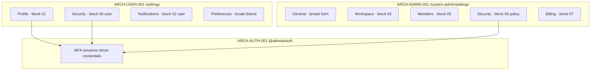

# ARCH-USER-001 — User Settings Self-Service

> Enterprise architecture authority for Afenda **signed-in user self-service settings** at `/settings/**` only.  
> Template: [`ARCH-TEMPLATE.md`](ARCH-TEMPLATE.md) · Index: [`arch-status-index.md`](arch-status-index.md) · Domain peers: [`ARCH-AUTH-001`](%5BPartially%20Implemented%5D%20ARCH-AUTH-001-enterprise-authentication.md) · [`ARCH-ADMIN-001`](%5BPartially%20Implemented%5D%20ARCH-ADMIN-001-system-admin-control-plane.md)

| Field | Value |
| --- | --- |
| **Document ID** | ARCH-USER-001 |
| **Work ID** | ARCH-USER-001 · PKG-007 · `fdr-007-ux-surfaces` (paired FDR) |
| **Title** | User settings self-service |
| **Status** | **Partially Implemented** — Slices 1–2 delivered; tabs 3–7 pending |
| **Date** | 2026-06-25 |
| **Owner** | Application Authority (`apps/erp` user-settings) |
| **Package** | PKG-007 · `@afenda/erp` · `@afenda/appshell` · `@afenda/auth` (execution) |
| **Registry entry ID** | PKG007_USER (user-settings surface — FDR subdomain; no dedicated foundation row yet) |
| **Runtime owner** | `apps/erp/src/lib/user-settings/` · `apps/erp/src/app/(protected)/settings/` |
| **Lane** | green-lane |
| **Risk class** | Medium (self-service identity + preference mutations) |
| **Change class** | Extension + Governance |
| **Clean Core target** | B |
| **Enterprise score target** | 29/30 (9.5+) — Slice 1 shell **~9.5/10** |

> **Scope:** Self-service settings shell at `/settings/**` for any linked authenticated user — profile, personal security, notifications, preferences.  
> **Not in scope:** Tenant admin settings → [`ARCH-ADMIN-001`](%5BPartially%20Implemented%5D%20ARCH-ADMIN-001-system-admin-control-plane.md) (`/system-admin/settings/**`). Auth plugin mechanics → [`ARCH-AUTH-001`](%5BPartially%20Implemented%5D%20ARCH-AUTH-001-enterprise-authentication.md) + `better-auth-erp` skill. Accounting → `fdr-r01-accounting-contracts`+.

> **Naming note:** Delivery ID **ARCH-USER-001** (`ARCH-USER` domain · seq `001`). Do not confuse with Better Auth `account` table, `@afenda/accounting`, or shadcn block filenames (`account-settings-*`).

---

## 1. Execution instruction

You are executing a **User Settings** enterprise architecture delivery slice under ARCH-USER-001.

You must produce implementation and evidence that meets:

- Architecture authority (this document + authority chain §3)
- Runtime truth (`afenda-runtime-truth-matrix.md`)
- Package ownership (PKG-007 / PKG-001 appshell blocks)
- Clean Core boundaries (level B)
- Enterprise acceptance criteria (§7)
- Automated gate proof (§10)
- Documentation sync
- Definition of Done (§11)

Every completion claim must map to **file path**, **test path**, **command exit code**, **documentation row**, or **explicit waiver** (§13). No prose-only “done”.

**One-sentence architecture:** User Settings is a **self-scoped preference shell** (`/settings/**`) where every tab mutates only the signed-in actor’s profile or preferences, reuses promoted shadcn/studio blocks from `@afenda/appshell` with user-scoped copy contracts, and delegates identity execution to `@afenda/auth` — never tenant admin permissions or `system_admin.*` gates.

---

## 2. Target item

| Field | Value |
| --- | --- |
| Work ID | ARCH-USER-001 · [`fdr-007-ux-surfaces`](../delivery/FDR/%5BPartially%20Implemented%5D%20fdr-007-ux-surfaces.md) |
| Title | User settings self-service |
| Status | **Not started** |
| Package | `@afenda/erp` (primary) · `@afenda/appshell` (UI blocks) · `@afenda/auth` (execution) |
| Registry entry ID | PKG007_USER (FDR subdomain) |
| Runtime owner | `apps/erp/src/lib/user-settings/` |
| Lane | green-lane |
| Risk class | Medium |
| Change class | Extension |
| Clean Core target | B |
| Enterprise score target | 29/30 |

### Delivery phase status

| Phase | Scope | Status |
| --- | --- | --- |
| **A** | ARCH authority + index + block map + boundary tables | **Delivered** (authority accepted 2026-06-25) |
| **B** | Settings shell — layout, tab nav, profile dropdown links | **Delivered** (Slice 1 — 2026-06-25) |
| **C** | Profile + Security + Notifications + Preferences tabs wired | **Delivered** (Slices 2–5 — 2026-06-25) |
| **D** | Admin realignment (block 01/06 split from system-admin) | **Delivered** (Slice 6 — 2026-06-25) |
| **E** | Evidence-sync — matrix, index, ADR-0017 rows | **Delivered** (Slice 7 — 2026-06-25) |

---

## 3. Authority chain

Read in this order before touching code:

```text
1. docs/ARCH/[Not started] ARCH-USER-001-user-settings-self-service.md     ← this document
2. docs/ARCH/[Partially Implemented] ARCH-AUTH-001-enterprise-authentication.md  ← identity execution
3. docs/ARCH/[Partially Implemented] ARCH-ADMIN-001-system-admin-control-plane.md  ← tenant admin peer boundary
4. docs/ARCH/arch-status-index.md
5. docs/delivery/fdr-status-index.md
6. packages/architecture-authority/src/data/foundation-disposition.registry.ts
7. docs/architecture/afenda-runtime-truth-matrix.md
8. docs/delivery/FDR/[Partially Implemented] fdr-007-ux-surfaces.md
9. docs/adr/ADR-0017-shadcn-studio-ui-delivery-acceleration.md
10. .cursor/skills/better-auth-erp/SKILL.md (Better Auth mechanics — single source)
11. apps/erp/src/lib/user-settings/ (future runtime owner)
12. packages/appshell/src/shadcn-studio/blocks/ (promoted UI)
13. Related tests and governance scripts (§10)
```

| Layer | Authority |
| --- | --- |
| Registry | `foundation-disposition.registry.ts` — PKG-007 package scope |
| Delivery evidence | `fdr-007-ux-surfaces` (UX surfaces subdomain) |
| Identity execution | ARCH-AUTH-001 — do not duplicate Better Auth APIs here |
| Tenant admin | ARCH-ADMIN-001 — `/system-admin/**` only |
| UI promotion | ADR-0017 · `.cursor/skills/afenda-shadcn-components/SKILL.md` |
| Governed UI | TIP-004 · `pnpm ui:guard:scan` |

### 3.1 Cross-ARCH dependency chain (mandatory sequencing)

Do **not** start ARCH-USER-001 runtime slices until upstream auth gates are stable. `/settings/security` depends on `@afenda/auth` `multiSession` and session contract behavior.

```text
ARCH-AUTH-001 Slice 7   → close multiSession integration test gate (pnpm --filter @afenda/auth test:run exit 0)
        ↓
ARCH-AUTH-001 Slice 8   → workspace auth context (ADR-0011)
        ↓
ARCH-USER-001 Slice 1   → settings shell + resolveUserSettingsOperatingContext
        ↓
ARCH-USER-001 Slice 2   → Profile tab
        ↓
ARCH-USER-001 Slice 3   → Security tab (user slice) — BLOCKED until Slice 7 closed
        ↓
ARCH-USER-001 Slice 6   → Admin realignment — required before public/demo exposure of both surfaces
        ↓
ARCH-USER-001 Slice 4A  → user_preferences persistence foundation
        ↓
ARCH-USER-001 Slice 4B  → Notifications tab
        ↓
ARCH-USER-001 Slice 5   → Preferences tab
        ↓
ARCH-USER-001 Slice 7   → evidence-sync
```

| Hard prerequisite | Applies to |
| --- | --- |
| ARCH-AUTH-001 Slice 7 gate debt **closed** | ARCH-USER-001 **Slice 3** (Security) and any slice wiring `@afenda/auth/client` session APIs |
| ARCH-AUTH-001 Slice 8 **delivered** (or explicit waiver) | ARCH-USER-001 promotion to **Complete** |
| ARCH-USER-001 Slices 2–3 **delivered** | Slice 6 (admin realignment) |
| Slice 6 **complete** | Public/demo exposure of `/settings/**` alongside `/system-admin/settings/**` |

Parallel work: ARCH-ADMIN-001 slices may continue under [`ARCH-ADMIN-001`](%5BPartially%20Implemented%5D%20ARCH-ADMIN-001-system-admin-control-plane.md) — but do not expand user/admin settings overlap until Slice 6 lands.

---

## 4. Problem statement

### 4.1 Current risk / gap

```text
The admincn reference template (_reference/shadcn-nextjs-admincn-admin-template-1.0.0) exposes
a unified "Account & User Management" page with seven tabs (General, Notifications, Workspace,
Integrations, Members, Security, Billing). Afenda promoted all account-settings-01–07 blocks into
/system-admin/settings/** under ARCH-ADMIN-001, conflating tenant admin configuration with
personal user self-service.

Block 01 (personal profile, email/password, connected accounts, danger zone) is wired into the
admin General tab via SystemAdminGeneralSettingsPanel injecting tenant companyName into
personalInfoSection. Block 06 mixes tenant MFA policy with personal MFA and session management
on the admin Security tab. Block 02 uses tenant-scoped notification copy on admin Notifications.

No /settings/** routes exist. AppShellProfileDropdown menu items (My profile, Preferences) have
no href wiring. Without ARCH-USER-001, agents may duplicate admin settings, ship personal MFA
under system_admin permissions, or fork block 06 without a bounded split plan.
```

### 4.2 Business / architecture impact

```text
Enterprise ERP users expect self-service profile and security controls without platform admin
permissions (ISO 27001 A.8.2 / A.8.5 — user responsibilities vs organizational policy).
Separating user settings from system admin prevents privilege escalation via misrouted UI,
keeps audit vocabulary distinct (user.settings.* vs system_admin.*), and aligns with ADR-0017
/pages/user-settings adaptation decision. Clean Core B requires props-driven appshell blocks
reused across surfaces with scope-specific ERP panels — not duplicate MCP installs.
```

---

## 5. Architecture requirement

### 5.1 Ownership

| Concern | Owner | Allowed path |
| --- | --- | --- |
| Settings pages + layouts | `@afenda/erp` | `apps/erp/src/app/(protected)/settings/` |
| User settings resolvers + actions | `@afenda/erp` | `apps/erp/src/lib/user-settings/` |
| User settings client panels | `@afenda/erp` | `apps/erp/src/components/user-settings/` |
| Promoted UI blocks | `@afenda/appshell` | `packages/appshell/src/shadcn-studio/blocks/` |
| Block split wrappers (06 user) | `@afenda/appshell` | `packages/appshell/src/shadcn-studio/blocks/` |
| Staging (read-only) | `@afenda/ui` | `packages/ui/src/components/shadcn-studio/blocks/` — **never import in ERP** |
| Identity execution (MFA, sessions, credentials) | `@afenda/auth` | `packages/auth/src/` |
| Canonical user profile persistence | `@afenda/database` | `users` schema · user preference column/table (Slice 4+) |
| Profile dropdown chrome | `@afenda/appshell` | `app-shell-profile-dropdown.tsx` · `app-shell.profile.data.ts` |
| Profile dropdown route wiring | `@afenda/erp` | protected layout / shell consumer |
| Operating context | `@afenda/kernel` + ERP | `OperatingContext.actor.userId` = platform `users.id` |
| Documentation | `docs/ARCH/` | this file · runtime matrix |

No implementation outside declared paths unless a slice handoff (§17) explicitly allows it.

### 5.2 Boundary rules

The implementation must:

1. Keep user-settings logic in `apps/erp`; reusable blocks in `@afenda/appshell`.
2. Require linked Afenda auth session — unlinked sessions redirect per ARCH-AUTH-001 fail-closed rules.
3. Scope every mutation to `OperatingContext.actor.userId` — never mutate other users from `/settings/**`.
4. **Not** call `guardSystemAdminSection` or require `system_admin.*` permissions on user settings routes.
5. **Not** write tenant-scoped fields (`tenants.*`, `tenant_settings.*`) from user settings actions.
6. Delegate MFA enrollment, session list/revoke, email/password to `@afenda/auth/client` — no duplicate Better Auth APIs.
7. Promote UI via ADR-0017 pipeline (Q1–Q3); props-driven data in ERP `user-*-settings-panel.tsx` files.
8. Reuse promoted `AppShellAccountSettings*` blocks — do not re-install account-settings-01–07 from MCP unless staging gap (API keys).
9. Register user-settings protected surface in `operating-context-protected-surface.registry.ts` (Slice 1).
10. Sync documentation when slice status or runtime evidence changes.

### 5.3 Prohibited actions

The agent must not:

```text
- route personal profile or personal MFA under /system-admin/settings/**
- require system_admin.* permissions for /settings/** pages or actions
- mutate tenant_settings, tenants.display_name, or workspace config from user settings
- import shadcn/studio staging blocks from packages/ui into ERP routes
- duplicate Better Auth plugin APIs (see ARCH-AUTH-001 + better-auth-erp skill)
- use authUserId for RBAC, audit actorUserId, or preference ownership keys
- put className on @afenda/ui primitives in user-settings panels (TIP-004)
- create an accounting package or accounting surfaces under /settings/**
- weaken type safety with any; suppress tests instead of fixing failures
- mark Complete without gate evidence (§16)
- re-install account-settings blocks already promoted in appshell (reuse + split only)
```

### 5.4 Boundary with ARCH-ADMIN-001

| Concern | Owner doc | Artifact |
| --- | --- | --- |
| Tenant display name / General admin form | **ARCH-ADMIN-001** | `SystemAdminSettingsForm` — tenant-only (Slice 6 realignment) |
| Workspace / Integrations / Members / Billing tabs | **ARCH-ADMIN-001** | `AppShellAccountSettings03–05/07` + admin panels |
| Tenant MFA **policy** toggle | **ARCH-ADMIN-001** | `AppShellAccountSettings06` policy section only (post-split) |
| Personal profile (block 01 full) | **ARCH-USER-001** | `/settings/profile` |
| Personal MFA + sessions (+ API keys) | **ARCH-USER-001** | `/settings/security` |
| User-scoped notifications (block 02 user copy) | **ARCH-USER-001** | `/settings/notifications` |
| Theme / locale / density | **ARCH-USER-001** | `/settings/preferences` |
| Admin notification rules (roster/API alerts) | **ARCH-ADMIN-001** | `/system-admin/settings/notifications` |
| Permission model | ARCH-ADMIN-001 | `system_admin.*` + section guards |
| Permission model | ARCH-USER-001 | Linked session only — self actor |

### 5.4.2 User vs Admin feature matrix (canonical)

Use this table to prevent future scope drift. **Core of the architecture.**

| Feature | `/settings/**` User self-service | `/system-admin/settings/**` System Admin |
| --- | --- | --- |
| Profile name | Personal user profile | Tenant/company display name |
| Email / password | Personal auth execution (Better Auth) | Not admin-owned |
| MFA | Personal MFA enrollment / status | Tenant MFA **policy** only |
| Sessions | Own sessions only | Tenant/session policy only (if supported) |
| Notifications | Personal notification preferences | Tenant/admin alert rules |
| Preferences | Theme, locale, density, timezone | Tenant branding/config only (Appearance scaffold) |
| Members | **Not allowed** | Members roster / invites |
| Billing | Read-only deep link optional | Tenant billing / usage |
| Integrations | v2 personal connections only | Tenant integration catalog |
| Permissions | None — linked session only | `system_admin.*` + section guards |
| Actor key | `OperatingContext.actor.userId` | Authorized admin actor |
| Mutation target | Self only | Tenant / company / member resources |
| Audit prefix | `user.settings.*` | `system_admin.*` / tenant admin registry |
| Context guard | `resolveUserSettingsOperatingContext()` | `guardSystemAdminSection()` |

### 5.5 Boundary with ARCH-AUTH-001

| Concern | Owner doc | Artifact |
| --- | --- | --- |
| Canonical `users.id`, mirror sync | ARCH-AUTH-001 | `@afenda/auth`, `auth_identity_links` |
| Better Auth MFA / session / credential execution | ARCH-AUTH-001 | `twoFactor()`, `multiSession` client APIs |
| Tenant MFA policy column + gate | ARCH-AUTH-001 | `tenants.mfa_required`, `auth.mfa-policy.ts` |
| User Security **tab UI** | **ARCH-USER-001** | `/settings/security` panel |
| Sign-in / reset / MFA enrollment **pages** | ARCH-AUTH-001 | Better Auth routes only |
| Auth audit vocabulary | ARCH-AUTH-001 | `auth.*` events via hooks |

### 5.6 Reference template normalization

**Source:** `_reference/shadcn-nextjs-admincn-admin-template-1.0.0/.../src/views/pages/user-settings/`  
**ADR-0017 decision:** `/pages/user-settings` → **Adapt** (form-layout + tab patterns)

The reference combines admin + user tabs in one page. Afenda **splits** by scope:

| Reference tab | shadcn block | Afenda route | Owner |
| --- | --- | --- | --- |
| General | account-settings-01 | `/settings/profile` | ARCH-USER-001 |
| Notifications | account-settings-02 | `/settings/notifications` (user copy) | ARCH-USER-001 |
| Notifications | account-settings-02 | `/system-admin/settings/notifications` (admin copy) | ARCH-ADMIN-001 |
| Workspace | account-settings-03 | `/system-admin/settings/workspace` | ARCH-ADMIN-001 |
| Integrations | account-settings-04 | `/system-admin/settings/integrations` | ARCH-ADMIN-001 |
| Members | account-settings-05 | `/system-admin/settings/members` | ARCH-ADMIN-001 |
| Security | account-settings-06 | `/settings/security` (user slice) | ARCH-USER-001 |
| Security | account-settings-06 | `/system-admin/settings/security` (policy slice) | ARCH-ADMIN-001 |
| Billing & Usage | account-settings-07 | `/system-admin/settings/billing` | ARCH-ADMIN-001 |



### 5.7 Settings hub (v1 tabs)

Layout target: `apps/erp/src/app/(protected)/settings/layout.tsx`

| Tab | Route | Appshell block | Persistence | Gate |
| --- | --- | --- | --- | --- |
| Profile | `/settings/profile` | `AppShellAccountSettings01` (full sections) | `users` + Better Auth mirror | Linked session |
| Security | `/settings/security` | Block 06 **user slice** (MFA, sessions; API keys v1.1) | `@afenda/auth/client` | Self actor only |
| Notifications | `/settings/notifications` | `AppShellAccountSettings02` + **user copy contract** | `user_preferences` (Slice 4) | Self actor only |
| Preferences | `/settings/preferences` | Theme/density + `AppShellLanguageDropdown` | `user_preferences` (Slice 5) | Self actor only |

Shared layout: reuse `AppShellAccountSettingsPanelSection` pattern · CSS §J in [`afenda-appshell-studio.css`](../../packages/appshell/src/styles/afenda-appshell-studio.css).

**Profile dropdown entry map** ([`app-shell.profile.data.ts`](../../packages/appshell/src/shadcn-studio/data/app-shell.profile.data.ts)):

| Menu item | Route | Owner |
| --- | --- | --- |
| My profile | `/settings/profile` | ARCH-USER-001 |
| Preferences | `/settings/preferences` | ARCH-USER-001 |
| Company plan | `/system-admin/settings/billing` | ARCH-ADMIN-001 (permission-gated) |
| ERP users / Add user | `/system-admin/users` or members tab | ARCH-ADMIN-001 |
| Appearance (user theme) | `/settings/preferences` | ARCH-USER-001 — **not** admin Appearance scaffold |
| Sign out | Better Auth sign-out | ARCH-AUTH-001 |

### 5.8 shadcn/studio block availability (normalized)

Consolidated from shadcn/studio MCP `get-block-meta-content` (`/dashboard-and-application/account-settings/registry`) and promoted appshell inventory (2026-06-25).

| Block | MCP sections | Appshell export | STUDIO-PATTERN-MAP §J | User settings use |
| --- | --- | --- | --- | --- |
| **01** | personal-info, email-password, connect-account, social-url, danger-zone | `AppShellAccountSettings01` | Yes | **Profile tab (primary)** |
| **02** | all-notifications, inbox, browser, DND | `AppShellAccountSettings02` | Yes | **Notifications tab (user copy)** |
| **06** | two-factor, api-key, sessions | `AppShellAccountSettings06` (Afenda-adapted) | Yes | **Security tab (split — user sections)** |
| form-layout | form sections | — | Partial | Profile + Preferences forms |
| file-upload | avatar upload | — | — | Profile personal-info (Slice 2) |
| dashboard-dialog-09 | verify dialog | staging in ui | — | MFA enrollment (Slice 3) |

**Supporting appshell (already delivered):** `AppShellProfileDropdown`, `AppShellLanguageDropdown`.

**Staging gap:** `account-settings-06/content/api-key.tsx` in `packages/ui` — promote to appshell in Security v1.1.

**Admin-only blocks (not user settings):** 03, 04, 05, 07 — remain ARCH-ADMIN-001.

### 5.9 UI delivery (ADR-0017)

| Step | Rule |
| --- | --- |
| Q1 | Tailwind layout → `.app-shell-studio-*` semantic classes |
| Q2 | `@afenda/ui` primitives — zero `className` on governed primitives in appshell |
| Q3 | Props-driven — ERP `user-*-settings-panel.tsx` owns state and server calls |
| Reuse | Do not re-install blocks 01–07 from MCP when appshell export exists |
| Split | Block 06: `/rui` or sibling `app-shell-account-settings-06-user.tsx` for user-only sections |
| Wire | One ERP panel per settings tab |

### 5.10 Self-service context resolver (mandatory contract)

Every user-settings page and server action must use the named resolver — agents must not invent ad-hoc session checks or call `guardSystemAdminSection()`.

**Canonical:** `resolveUserSettingsOperatingContext()`  
**Path:** [`resolve-user-settings-context.server.ts`](../../apps/erp/src/lib/user-settings/resolve-user-settings-context.server.ts) (Slice 1)

Pipeline:

```text
getAfendaAuthSession(headers)
  → require linked platform identity (isAfendaAuthSessionLinked)
  → toAfendaAuthIdentity(session).userId
  → resolveOperatingContextFromHeaders({ actorUserId })
  → return { operatingContext, actorUserId } — fail closed if unlinked
```

**Must not:**

```text
call guardSystemAdminSection()
require system_admin.*
use authUserId as RBAC actor or preference ownership key
mutate tenant_settings or tenants.*
```

Mirror pattern: [`resolve-system-admin-operating-context.server.ts`](../../apps/erp/src/lib/system-admin/resolve-system-admin-operating-context.server.ts) — but without admin permission gates.

### 5.11 Audit registry (user self-service)

Lighter than system-admin, but **not** ad-hoc strings. Prevent drift with a local vocabulary registry.

**Canonical:** [`user-settings-audit.registry.ts`](../../apps/erp/src/lib/user-settings/user-settings-audit.registry.ts) (Slice 1 stub · enforced Slice 2+)

| Event ID | Trigger |
| --- | --- |
| `user.settings.profile_updated` | Profile fields persisted |
| `user.settings.preferences_updated` | Theme/locale/density/timezone saved |
| `user.settings.notifications_updated` | Notification prefs saved |
| `user.session.revoked` | Self revoke session (may correlate with `auth.session.invalidated`) |

Auth plugin events (`auth.mfa.*`, `auth.session.*`) remain **ARCH-AUTH-001 §6.3** vocabulary via hooks — do not duplicate in this registry.

CI: add `user-settings-audit-coverage.test.ts` when first mutation action lands (Slice 2).

### 5.12 Functional requirements

| ID | Requirement |
| --- | --- |
| **FR-U01.1** | Four v1 tabs routable under `/settings/*` |
| **FR-U01.2** | Every page requires linked Afenda auth session |
| **FR-U01.3** | Mutations scoped to actor `users.id` only |
| **FR-U02.1** | Profile tab renders full `AppShellAccountSettings01` |
| **FR-U02.2** | Profile mutations use Better Auth + `users` schema — not tenant fields |
| **FR-U03.1** | Security tab: personal MFA enroll/disable + session list/revoke |
| **FR-U03.2** | Security tab excludes tenant MFA policy section |
| **FR-U04.1** | Notifications tab uses user-scoped copy contract (distinct from admin) |
| **FR-U05.1** | Preferences tab persists theme/locale/density per user |
| **FR-U06.1** | Profile dropdown links to `/settings/profile` and `/settings/preferences` |
| **FR-U07.1** | TIP-004 — zero `className` on `@afenda/ui` primitives |
| **FR-U07.2** | `pnpm ui:guard:scan` clean for user-settings tsx |
| **FR-U08.1** | Protected surface registered in operating-context registry |
| **FR-U08.2** | Every page/action calls `resolveUserSettingsOperatingContext()` |
| **FR-U08.3** | User settings mutations emit events from `user-settings-audit.registry.ts` |

---

## 6. Required implementation scope

### In scope

```text
- apps/erp/src/lib/user-settings/**
- apps/erp/src/components/user-settings/**
- apps/erp/src/app/(protected)/settings/**
- packages/appshell — block 06 user split wrapper (Slice 3)
- packages/appshell — user-settings copy contracts for block 02 (Slice 4)
- apps/erp/src/lib/user-settings/resolve-user-settings-context.server.ts (Slice 1)
- apps/erp/src/lib/user-settings/user-settings-audit.registry.ts (Slice 1 stub)
- apps/erp/src/lib/context/operating-context-protected-surface.registry.ts (Slice 1)
- packages/database/src/schema/user-preferences.schema.ts (Slice 4A)
- Profile dropdown href wiring in ERP shell consumer (Slice 1)
- docs/ARCH/[Not started] ARCH-USER-001-user-settings-self-service.md
```

### Out of scope

```text
- /system-admin/settings/** tenant admin tabs (ARCH-ADMIN-001)
- Better Auth plugin configuration (ARCH-AUTH-001 + better-auth-erp skill)
- Auth entry pages (login, register, reset, verify)
- @afenda/accounting and accounting surfaces
- Shipping packages/ui staging imports in ERP
- /settings/privacy and /settings/connections (v2 — document only)
- Tenant billing mutations from user settings (read-only deep link only)
```

### Expected files (reference)

| File / area | Package | Change type | Required? |
| --- | --- | --- | --- |
| `settings/layout.tsx` | `@afenda/erp` | **future Slice 1** | Yes |
| `resolve-user-settings-context.server.ts` | `@afenda/erp` | **future Slice 1** | Yes |
| `user-settings-audit.registry.ts` | `@afenda/erp` | **future Slice 1** | Yes |
| `user-settings-tab-nav.tsx` | `@afenda/erp` | **future Slice 1** | Yes |
| `user-*-settings-panel.tsx` | `@afenda/erp` | **future Slices 2–5** | Yes |
| `user-preferences.schema.ts` + service | `@afenda/database` | **Slice 4A ✓** | Yes |
| `app-shell-account-settings-06-user.tsx` | `@afenda/appshell` | **future Slice 3** | Optional (split alt) |
| `user-settings-blocks.contract.ts` | `@afenda/erp` | **Slice 4B ✓** | Yes |

---

## 7. Enterprise acceptance criteria

```gherkin
Feature: User settings self-service

  Scenario: Linked user opens profile settings
    GIVEN a signed-in user with linked platform identity
    AND OperatingContext resolves for the active company
    WHEN they navigate to /settings/profile
    THEN AppShellAccountSettings01 renders via UserProfileSettingsPanel
    AND no system_admin permission check is required

  Scenario: Unlinked session cannot access settings
    GIVEN a Better Auth session without auth_identity_links row
    WHEN they deep-link to /settings/profile
    THEN they are redirected or forbidden per ARCH-AUTH-001 fail-closed rules

  Scenario: User cannot mutate another user's preferences
    GIVEN an authenticated actor on /settings/notifications
    WHEN update-user-notifications-settings.action runs
    THEN only OperatingContext.actor.userId preferences are updated
    AND tenant_settings rows are not modified

  Scenario: Security tab excludes tenant MFA policy
    GIVEN an actor without system_admin.modules_manage
    WHEN they open /settings/security
    THEN personal MFA and session sections render
    AND tenant MFA policy toggle is not present

  Scenario: Profile dropdown navigates to user settings
    GIVEN the AppShell profile menu is open
    WHEN the actor selects "My profile"
    THEN navigation targets /settings/profile

  Scenario: TIP-004 compliance on user settings surfaces
    GIVEN user-settings tsx under apps/erp
    WHEN pnpm ui:guard:scan runs
    THEN no className violations on @afenda/ui primitives are reported

  Scenario: User settings route never requires admin permission
    GIVEN a linked non-admin user
    WHEN they open /settings/profile
    THEN the page renders
    AND no system_admin.* permission is checked

  Scenario: User settings cannot mutate tenant settings
    GIVEN a linked user updates preferences
    WHEN the user settings action executes
    THEN only user_preferences or users self-profile fields are changed
    AND tenants or tenant_settings are not updated

  Scenario: Admin and user security surfaces are split
    GIVEN a non-admin user opens /settings/security
    THEN personal MFA and own sessions are visible
    AND tenant MFA policy is not visible

    GIVEN an admin opens /system-admin/settings/security
    THEN tenant MFA policy is visible
    AND personal session management is not presented as tenant policy

  Scenario: Profile dropdown routes are scope-correct
    GIVEN the profile dropdown is open
    WHEN the user clicks My profile
    THEN the route is /settings/profile

    WHEN the user clicks Company plan
    THEN the route is /system-admin/settings/billing
    AND visibility is permission-aware

  Scenario: User settings audit uses user vocabulary
    GIVEN a user updates profile settings
    WHEN the mutation succeeds
    THEN user.settings.profile_updated is emitted per user-settings-audit.registry.ts
    AND system_admin.* audit events are not emitted
```

### AC index

| AC | Criterion | Verification | Status |
| --- | --- | --- | --- |
| AC-U01 | Four v1 tabs routable | route manifest / integration test | Not started |
| AC-U02 | Linked session required | protected layout test | Not started |
| AC-U03 | Self-only mutation scope | action unit tests | Not started |
| AC-U04 | Profile block 01 full wire | panel + page test | Yes — Slice 2 |
| AC-U05 | Security user slice only | panel test | Yes — Slice 3 |
| AC-U06 | User notification copy distinct | contract test | Yes — Slice 4B |
| AC-U07 | Preferences persistence | action test | Yes — Slice 5 |
| AC-U08 | Profile dropdown links | interaction test | Not started |
| AC-U09 | TIP-004 clean | `pnpm ui:guard:scan` | Yes — Slices 4B–5 |
| AC-U10 | Doc drift references ARCH-USER-001 | `pnpm check:documentation-drift` | Yes — Slice 7 |
| AC-U11 | No admin permission on user routes | integration test | Not started |
| AC-U12 | Tenant settings not mutated | action unit tests | Not started |
| AC-U13 | Security surface split user/admin | panel tests both routes | Yes — Slice 6 |
| AC-U14 | Profile dropdown scope-correct | interaction test | Not started |
| AC-U15 | User audit vocabulary | registry + action test | Yes — Slices 2–5 |

---

## 8. Enterprise quality benchmark

```text
Minimum acceptable: 28/30 foundation
Enterprise 9.5:       29/30 — no dimension below 4/5
Current estimate:     N/A (Not started — authority doc only)
```

| Dimension | Target | Evidence | Score |
| --- | ---: | --- | ---: |
| Contract stability | 5/5 | ERP + appshell typecheck exit 0 | — |
| Test coverage | 5/5 | Panel + action tests positive/negative | — |
| Observability + audit | 4/5 | `user.settings.*` events or waiver | — |
| Security + RBAC + RLS | 5/5 | Self-scope tests; no admin permission on routes | — |
| Documentation + BRD traceability | 5/5 | ARCH + index + matrix synced | 4 (this doc) |
| Maintainability + Clean Core | 5/5 | Block reuse; no duplicate MCP installs | — |

---

## 9. Non-functional requirements

| Characteristic | Requirement | Verification |
| --- | --- | --- |
| Functional suitability | Four v1 tabs per §5.7 | Integration tests |
| Security | Self-scope only; linked session | Security tests |
| Compatibility | Reuse appshell public exports | Typecheck |
| Reliability | Deterministic preference reads | Unit tests |
| Maintainability | Dual copy contracts — not duplicate blocks | Code review |
| Performance | No N+1 session list fetches | Code review |
| Accessibility | Tab nav + form labels ARIA | Component tests |
| Observability | User settings audit events | Audit test or waiver |
| Documentation | ARCH/index/matrix aligned | `pnpm check:documentation-drift` |

---

## 10. Required gates

```bash
pnpm --filter @afenda/erp typecheck
pnpm --filter @afenda/erp test:run
pnpm --filter @afenda/appshell test:run
pnpm ui:guard:scan
pnpm exec biome check apps/erp/src/lib/user-settings apps/erp/src/components/user-settings
pnpm quality:boundaries
pnpm check:documentation-drift
pnpm check:foundation-disposition
```

Gate report format:

| Gate | Exit | Result |
| --- | ---: | --- |
| `pnpm check:documentation-drift` | 0 | Pass (authority doc phase) |
| `pnpm --filter @afenda/erp typecheck` | — | N/A until Slice 1 |

---

## 11. Definition of Done

| # | Criterion | Evidence | Status |
| --- | --- | --- | --- |
| 1 | Runtime evidence at stated paths | File paths listed | [ ] |
| 2 | Acceptance criteria implemented | Tests pass | [ ] |
| 3 | Positive path tested | Test path | [ ] |
| 4 | Negative path tested | Test path | [ ] |
| 5 | TypeScript strict passes | `typecheck` exit 0 | [ ] |
| 6 | Package tests pass | `test:run` exit 0 | [ ] |
| 7 | Biome clean | `biome check` exit 0 | [ ] |
| 8 | Boundaries pass | `quality:boundaries` exit 0 | [ ] |
| 9 | Registry/index aligned | drift + disposition exit 0 | [x] authority row |
| 10 | Documentation drift clean | `check:documentation-drift` exit 0 | [x] Slice 7 |
| 11 | Runtime matrix updated | Matrix User Settings row | [x] stub |
| 12 | FDR cross-ref updated | fdr-007-ux-surfaces mention | [ ] |
| 13 | Impact analysis completed | §12 below | [x] |
| 14 | Rollback strategy documented | §14 below | [x] |
| 15 | Security self-scope verified | Test or waiver | [ ] |
| 16 | Observability verified | Audit or waiver | [ ] |
| 17 | Public API compatibility verified | Typecheck | [ ] |
| 18 | Clean Core level declared | B | [x] |
| 19 | Waivers documented | §13 below | [x] none |
| 20 | Peer review if required | Architecture Authority | [ ] |

---

## 12. Impact analysis

| Consumer | Import surface / runtime dependency | Breaking change? | Required action |
| --- | --- | --- | --- |
| `@afenda/erp` shell | Profile dropdown href wiring | No | Slice 1 |
| `@afenda/appshell` | Block 06 split export | No if additive | Slice 3 optional export |
| ARCH-ADMIN-001 | General/Security tab realignment | Yes (behavior) | Slice 6 coordinated |
| ARCH-AUTH-001 | No contract change | No | None |

```text
Breaking change: No (authority doc only)
Migration required: Yes (Slice 6 — admin General/Security realignment)
Runtime risk: Low (green-lane; self-scoped)
Rollback safe: Yes (revert routes + docs)
```

---

## 13. Waiver policy

| Waiver ID | Requirement waived | Reason | Approver | Expiry |
| --- | --- | --- | --- | --- |
| — | — | None at authority phase | — | — |

---

## 14. Rollback strategy

| Change area | Rollback method | Risk |
| --- | --- | --- |
| Code | `git revert <commit>` | Low |
| ARCH doc | Revert doc + index row | Low |
| Admin realignment | Restore admin General panel block 01 usage | Medium — coordinate with ARCH-ADMIN-001 |

---

## 15. Remaining gaps (v2+)

| Gap | Target slice / doc |
| --- | --- |
| `/settings/privacy` — GDPR export, consent | Future ARCH amendment |
| `/settings/connections` — personal OAuth | Future Slice |
| API keys section (block 06 staging) | Security v1.1 |
| Accessibility prefs (reduced motion, contrast) | Preferences v2 |
| Dedicated `fdr-007-user-settings` FDR | Optional — registry owner |
| `user_preferences` schema | **Slice 4A** (not deferred to Slice 4B/5 separately) |

---

## 16. Promotion rule

Do not promote to `Complete` unless all are true:

```text
- ARCH-AUTH-001 Slice 7 auth test gate debt closed (pnpm --filter @afenda/auth test:run exit 0)
- ARCH-AUTH-001 Slice 8 workspace auth context delivered or explicitly waived
- Slices 1–5 delivered with runtime evidence (4A + 4B + 5)
- Slice 6 admin realignment complete — required before public/demo dual-surface exposure
- Required gates exit 0
- Runtime matrix row = implemented
- ARCH/index/ADR-0017 synchronized (Slice 7)
- Enterprise score ≥ 29/30
```

**Demo blocker:** Do not expose `/settings/**` and `/system-admin/settings/**` together in production or external demo until **Slice 6** completes.

Allowed status labels: **Not started** → **Partially Implemented** → **Complete**

After authority acceptance (Phase A), status may read **Not started — authority accepted; no runtime routes**. Do not call **Complete** until promotion rules pass.

---

## 17. Slice handoffs

> **Execution order:** See §3.1. Numeric slice IDs are stable; **recommended run order** is 1 → 2 → 3 → **6** → 4A → 4B → 5 → 7.

### Slice 1 — Settings shell + context resolver + profile dropdown links

**Status:** Delivered (2026-06-25)  
**Prerequisite:** ARCH-USER-001 index row (this doc) · **ARCH-AUTH-001 Slice 7 closed** · **ARCH-AUTH-001 Slice 8 delivered** · **FR-A05.2 ✓**  
**Closes:** FR-U01.1 · FR-U06.1 · FR-U08.1 · FR-U08.2

#### Handoff block

```
Handoff from: docs/ARCH/[Partially Implemented] ARCH-USER-001-user-settings-self-service.md

1. Objective    — Create /settings/** layout with four tab routes, resolveUserSettingsOperatingContext resolver, user-settings-audit.registry stub, operating-context protected surface entry, and profile dropdown href wiring.
2. Allowed layer— apps/erp/src/app/(protected)/settings/ · apps/erp/src/components/user-settings/ · apps/erp/src/lib/user-settings/ · apps/erp/src/lib/context/
3. Files        — apps/erp/src/lib/user-settings/resolve-user-settings-context.server.ts (New)
                  apps/erp/src/lib/user-settings/__tests__/resolve-user-settings-context.test.ts (New)
                  apps/erp/src/lib/user-settings/user-settings-audit.registry.ts (New)
                  apps/erp/src/app/(protected)/settings/layout.tsx (New)
                  apps/erp/src/app/(protected)/settings/page.tsx (New — redirect)
                  apps/erp/src/app/(protected)/settings/profile/page.tsx (New — scaffold)
                  apps/erp/src/app/(protected)/settings/security/page.tsx (New — scaffold)
                  apps/erp/src/app/(protected)/settings/notifications/page.tsx (New — scaffold)
                  apps/erp/src/app/(protected)/settings/preferences/page.tsx (New — scaffold)
                  apps/erp/src/components/user-settings/user-settings-tab-nav.tsx (New)
                  apps/erp/src/lib/context/operating-context-protected-surface.registry.ts (Modified)
                  apps/erp/src/lib/context/__tests__/operating-context-protected-surface.registry.test.ts (Modified)
                  apps/erp protected layout or shell consumer (Modified — profile menu hrefs)
                  docs/ARCH/[Partially Implemented] ARCH-USER-001-user-settings-self-service.md (Modified — Slice 1 status)
4. Prohibited   — system_admin guards on /settings/** · packages/ui staging · @afenda/accounting · tenant_settings mutations · authUserId as actor
5. Authority    — ARCH-USER-001 §5.10 · fdr-007-ux-surfaces · ADR-0017
6. Gates        — pnpm --filter @afenda/erp typecheck
                  pnpm --filter @afenda/erp test:run
                  pnpm ui:guard:scan
                  pnpm check:documentation-drift
```

**Evidence (2026-06-25):** Four-tab `/settings/**` layout with redirect to `/settings/profile`. `resolveUserSettingsOperatingContext` fail-closed pipeline (linked session + `resolveOperatingContextFromHeaders`). `USER_SETTINGS_AUDIT_EVENTS` stub registry. Protected surface entries `user-settings-context` + `user-settings-layout`. Profile dropdown href wiring via `resolveAppShellProfileMenuGroups()` + optional `AppShellProfileMenuItem.href`. Tests: resolver (4) · profile menu (2) · protected surface registry.

---

### Slice 2 — Profile tab (block 01)

**Status:** Delivered (2026-06-25)  
**Prerequisite:** Slice 1  
**Closes:** FR-U02.1 · FR-U02.2 · AC-U04

#### Handoff block

```
Handoff from: docs/ARCH/[Partially Implemented] ARCH-USER-001-user-settings-self-service.md

1. Objective    — Wire /settings/profile with full AppShellAccountSettings01 and Better Auth profile/email/password execution; user-scoped persistence only.
2. Allowed layer— apps/erp/src/lib/user-settings/ · apps/erp/src/components/user-settings/ · apps/erp/src/app/(protected)/settings/profile/
3. Files        — apps/erp/src/components/user-settings/user-profile-settings-panel.tsx (New)
                  apps/erp/src/lib/user-settings/resolve-user-profile-settings.server.ts (New)
                  apps/erp/src/lib/user-settings/update-user-profile-settings.action.ts (New)
                  apps/erp/src/lib/user-settings/__tests__/resolve-user-profile-settings.test.ts (New)
                  apps/erp/src/app/(protected)/settings/profile/page.tsx (Modified)
                  docs/ARCH/ (Modified — Slice 2 status)
4. Prohibited   — tenant companyName on profile tab · packages/appshell block 01 re-install · Better Auth config duplication
5. Authority    — ARCH-USER-001 §5.5 · ARCH-AUTH-001 · better-auth-erp skill
6. Gates        — pnpm --filter @afenda/erp typecheck
                  pnpm --filter @afenda/erp test:run
                  pnpm ui:guard:scan
                  pnpm check:documentation-drift
```

**Evidence (2026-06-25):** `/settings/profile` renders `UserProfileSettingsPanel` with full `AppShellAccountSettings01` (personal-info form + email/password via Better Auth client). `resolveUserProfileSettings` loads self-scoped `users` row + session email verification. `updateUserProfileSettingsAction` persists `displayName` via `updateUser`, mirrors via `syncAuthMirrorUser`, emits `user.settings.profile_updated`. Tests: resolver (3) · action (3).

---

### Slice 3 — Security tab (block 06 user slice)

**Status:** Delivered (2026-06-25)  
**Prerequisite:** Slice 1 · Slice 2 · **ARCH-AUTH-001 Slice 7 gate closed** (`pnpm --filter @afenda/auth test:run` exit 0)  
**Closes:** FR-U03.1 · FR-U03.2 · AC-U05 · AC-U13

#### Handoff block

```
Handoff from: docs/ARCH/[Partially Implemented] ARCH-USER-001-user-settings-self-service.md

1. Objective    — Extract user-only sections from block 06 (personal MFA, sessions) into /settings/security; exclude tenant MFA policy; optional appshell 06-user wrapper.
2. Allowed layer— apps/erp/src/components/user-settings/ · packages/appshell/src/shadcn-studio/blocks/ (split only) · packages/auth/src/ (types export if needed)
3. Files        — apps/erp/src/components/user-settings/user-security-settings-panel.tsx (New)
                  apps/erp/src/lib/user-settings/resolve-user-security-settings.server.ts (New)
                  packages/appshell/src/shadcn-studio/blocks/app-shell-account-settings-06-user.tsx (New — optional)
                  packages/appshell/src/index.ts (Modified — if new export)
                  apps/erp/src/app/(protected)/settings/security/page.tsx (Modified)
                  apps/erp/src/lib/user-settings/__tests__/user-security-settings-panel.test.tsx (New)
                  docs/ARCH/ (Modified)
4. Prohibited   — tenant MFA policy on user security tab · @afenda/accounting · authUserId in RBAC
5. Authority    — ARCH-USER-001 §5.5 · ARCH-AUTH-001 FR-A03 · better-auth-erp skill
6. Gates        — pnpm --filter @afenda/erp typecheck
                  pnpm --filter @afenda/auth test:run
                  pnpm --filter @afenda/appshell test:run
                  pnpm ui:guard:scan
                  pnpm check:documentation-drift
```

**Evidence (2026-06-25):** `/settings/security` renders `UserSecuritySettingsPanel` with `AppShellAccountSettings06User` (personal MFA + sessions; no tenant MFA policy). `resolveUserSecuritySettings` loads self-scoped MFA via `isAuthUserMfaEnabled`. Session revoke emits `user.session.revoked` via `recordUserSessionRevokedAction`. Tests: resolver (3) · panel (3).

---

### Slice 4A — `user_preferences` persistence foundation

**Status:** **Delivered — 2026-06-25**  
**Prerequisite:** Slice 1 · Slice 6 ✓  
**Closes:** Shared persistence for Slices 4B and 5

#### Gate evidence (2026-06-25)

```text
pnpm --filter @afenda/database typecheck           exit 0
pnpm --filter @afenda/database test:run            exit 0 (175 tests)
pnpm quality:migrations                            exit 0
pnpm --filter @afenda/erp typecheck                exit 0
pnpm check:documentation-drift                     exit 0
```

**Evidence paths:**

- `packages/database/src/schema/user-preferences.schema.ts` — `user_preferences` table keyed by platform `users.id`
- `packages/database/src/user-preferences/user-preferences.contract.ts` — serializable Zod contracts (notifications + display)
- `packages/database/src/user-preferences/user-preferences.service.ts` — `getUserPreferencesByUserId` · `upsertUserPreferencesSection`
- `packages/database/src/migrations/20260625121713_user_preferences.sql` — generated via drizzle `--custom` (non-TTY CI)
- `apps/erp/src/lib/user-settings/resolve-user-preferences.server.ts` — self-scoped read wrapper
- `apps/erp/src/lib/user-settings/__tests__/resolve-user-preferences.test.ts` — resolver tests (3)
- `packages/database/src/user-preferences/__tests__/user-preferences.contract.test.ts` — contract tests (4)

#### Handoff block

```
Handoff from: docs/ARCH/[Partially Implemented] ARCH-USER-001-user-settings-self-service.md

1. Objective    — Add user_preferences schema, serializable contract, and service in @afenda/database; ERP resolve/update helpers consume public API only.
2. Allowed layer— packages/database/src/schema/ · packages/database/src/user-preferences/ · apps/erp/src/lib/user-settings/ (read wrappers only)
3. Files        — packages/database/src/schema/user-preferences.schema.ts (New)
                  packages/database/src/user-preferences/user-preferences.contract.ts (New)
                  packages/database/src/user-preferences/user-preferences.service.ts (New)
                  packages/database/src/index.ts (Modified — exports)
                  packages/database/src/migrations/*_user_preferences.sql (Generated — drizzle generate only)
                  apps/erp/src/lib/user-settings/resolve-user-preferences.server.ts (New)
                  apps/erp/src/lib/user-settings/__tests__/resolve-user-preferences.test.ts (New)
                  docs/ARCH/ (Modified — Slice 4A status)
4. Prohibited   — hand-edited migration SQL · tenant_settings writes · authUserId as ownership key · @afenda/accounting
5. Authority    — fdr-003-persistence · ARCH-USER-001 §5.7
6. Gates        — pnpm --filter @afenda/database typecheck
                  pnpm --filter @afenda/database test:run
                  pnpm quality:migrations
                  pnpm check:documentation-drift
```

---

### Slice 4B — Notifications tab (block 02 user copy)

**Status:** **Delivered — 2026-06-25**  
**Prerequisite:** Slice 4A  
**Closes:** FR-U04.1 · AC-U06

#### Gate evidence (2026-06-25)

```text
pnpm --filter @afenda/erp typecheck                exit 0
pnpm --filter @afenda/erp test:run (user-settings) exit 0 (30 tests)
pnpm ui:guard:scan                                 exit 0
pnpm check:documentation-drift                     exit 0
```

**Evidence paths:**

- `apps/erp/src/lib/user-settings/user-settings-blocks.contract.ts` — USER-scoped notification defaults (distinct from `SYSTEM_ADMIN_NOTIFICATION_SECTIONS`)
- `apps/erp/src/lib/user-settings/__tests__/user-settings-blocks.contract.test.ts` — AC-U06 section-id parity test
- `apps/erp/src/components/user-settings/user-notifications-settings-panel.tsx` — `AppShellAccountSettings02` client panel
- `apps/erp/src/lib/user-settings/update-user-notifications-settings.action.ts` — `upsertUserPreferencesSection` + `USER_SETTINGS_AUDIT_EVENTS.notificationsUpdated`
- `apps/erp/src/lib/user-settings/__tests__/update-user-notifications-settings.action.test.ts` — invalid intent · unauthenticated · success (3 tests)
- `apps/erp/src/app/(protected)/settings/notifications/page.tsx` — `resolveUserPreferences` + default builder

#### Handoff block

```
Handoff from: docs/ARCH/[Partially Implemented] ARCH-USER-001-user-settings-self-service.md

1. Objective    — Wire /settings/notifications with AppShellAccountSettings02 and USER-scoped copy contract; persist via user_preferences service from Slice 4A.
2. Allowed layer— apps/erp/src/lib/user-settings/ · apps/erp/src/components/user-settings/
3. Files        — apps/erp/src/lib/user-settings/user-settings-blocks.contract.ts (New)
                  apps/erp/src/components/user-settings/user-notifications-settings-panel.tsx (New)
                  apps/erp/src/lib/user-settings/update-user-notifications-settings.action.ts (New)
                  apps/erp/src/lib/user-settings/__tests__/update-user-notifications-settings.action.test.ts (New)
                  apps/erp/src/app/(protected)/settings/notifications/page.tsx (Modified)
                  docs/ARCH/ (Modified)
4. Prohibited   — SYSTEM_ADMIN_NOTIFICATION_SECTIONS reuse · tenant_settings writes · skipping user-settings-audit.registry entry
5. Authority    — ARCH-USER-001 §5.8 · §5.11 · fdr-003-persistence
6. Gates        — pnpm --filter @afenda/erp typecheck
                  pnpm --filter @afenda/erp test:run
                  pnpm ui:guard:scan
                  pnpm check:documentation-drift
```

---

### Slice 5 — Preferences tab

**Status:** **Delivered — 2026-06-25**  
**Prerequisite:** Slice 4A ✓  
**Closes:** FR-U05.1 · AC-U07

#### Gate evidence (2026-06-25)

```text
pnpm --filter @afenda/erp typecheck                exit 0
pnpm --filter @afenda/erp test:run (user-settings) exit 0 (30 tests)
pnpm ui:guard:scan                                 exit 0
pnpm check:documentation-drift                     exit 0
```

**Evidence paths:**

- `apps/erp/src/components/user-settings/user-preferences-settings-panel.tsx` — theme/density/locale/timezone
- `apps/erp/src/lib/user-settings/update-user-preferences-settings.action.ts` — `upsertUserPreferencesSection` display
- `apps/erp/src/lib/user-settings/__tests__/update-user-preferences-settings.action.test.ts` — action tests (3)
- `apps/erp/src/app/(protected)/settings/preferences/page.tsx` — wired page

#### Handoff block

```
Handoff from: docs/ARCH/[Partially Implemented] ARCH-USER-001-user-settings-self-service.md

1. Objective    — Wire /settings/preferences for theme, density, locale (AppShellLanguageDropdown persistence) and timezone; reuse user_preferences service from Slice 4A.
2. Allowed layer— apps/erp/src/lib/user-settings/ · apps/erp/src/components/user-settings/
3. Files        — apps/erp/src/components/user-settings/user-preferences-settings-panel.tsx (New)
                  apps/erp/src/lib/user-settings/update-user-preferences-settings.action.ts (New)
                  apps/erp/src/lib/user-settings/__tests__/update-user-preferences-settings.action.test.ts (New)
                  apps/erp/src/app/(protected)/settings/preferences/page.tsx (Modified)
                  docs/ARCH/ (Modified)
4. Prohibited   — tenant branding / admin Appearance tab logic · packages/ui primitives edit · duplicate preference persistence logic outside user-preferences.service
5. Authority    — ARCH-USER-001 §5.7 · §5.11 · ADR-0017
6. Gates        — pnpm --filter @afenda/erp typecheck
                  pnpm --filter @afenda/erp test:run
                  pnpm ui:guard:scan
                  pnpm check:documentation-drift
```

---

### Slice 6 — Admin realignment (coordinate ARCH-ADMIN-001)

**Status:** Delivered (2026-06-25)  
**Prerequisite:** ARCH-USER-001 Slices 2–3  
**Demo rule:** Must complete before public/demo exposure of **both** `/settings/**` and `/system-admin/settings/**`  
**Closes:** ARCH-ADMIN-001 General/Security drift · AC-U13

#### Handoff block

```
Handoff from: docs/ARCH/[Partially Implemented] ARCH-USER-001-user-settings-self-service.md

1. Objective    — Remove block 01 personal sections from system-admin General tab (tenant form only); restrict admin Security tab to tenant MFA policy section only.
2. Allowed layer— apps/erp/src/components/system-admin/ · docs/ARCH/
3. Files        — apps/erp/src/components/system-admin/system-admin-general-settings-panel.tsx (Modified)
                  apps/erp/src/components/system-admin/system-admin-security-settings-panel.tsx (Modified)
                  docs/ARCH/[Partially Implemented] ARCH-ADMIN-001-system-admin-control-plane.md (Modified — §5.7)
                  docs/ARCH/[Partially Implemented] ARCH-USER-001-user-settings-self-service.md (Modified)
4. Prohibited   — breaking tenant admin mutations · removing system_admin guards
5. Authority    — ARCH-USER-001 §5.4 · ARCH-ADMIN-001 Slice 2 amendment
6. Gates        — pnpm --filter @afenda/erp typecheck
                  pnpm --filter @afenda/erp test:run
                  pnpm check:documentation-drift
```

**Evidence (2026-06-25):** Admin General tab uses `AppShellAccountSettingsPanelSection` + tenant `SystemAdminSettingsForm` only (no block 01 scaffold sections). Admin Security uses `AppShellAccountSettings06Policy` (tenant MFA policy only). User `/settings/security` retains `AppShellAccountSettings06User`. Tests: general panel (1) · admin security policy (2) · `user-admin-settings-split` AC-U13 (1).

---

### Slice 7 — Evidence-sync

**Status:** **Delivered — 2026-06-25**  
**Prerequisite:** Slices 1–6 · 4A–5 ✓  
**Closes:** DoD #10–11 · AC-U10

#### Gate evidence (2026-06-25)

```text
pnpm check:documentation-drift                   exit 0
pnpm check:foundation-disposition                exit 0
```

#### Handoff block

```
Handoff from: docs/ARCH/[Partially Implemented] ARCH-USER-001-user-settings-self-service.md

1. Objective    — Sync runtime matrix User Settings row, ARCH filename status prefix, arch-status-index, ADR-0017 Appendix D; documentation drift exit 0.
2. Allowed layer— docs/ only
3. Files        — docs/ARCH/[Partially Implemented] ARCH-USER-001-user-settings-self-service.md (rename if status changed)
                  docs/architecture/afenda-runtime-truth-matrix.md (Modified)
                  docs/ARCH/arch-status-index.md (Modified)
                  docs/adr/ADR-0017-shadcn-studio-ui-delivery-acceleration.md (Modified — Appendix D)
4. Prohibited   — packages/* · apps/*
5. Authority    — ADR-0012 · documentation-drift policy
6. Gates        — pnpm check:documentation-drift
                  pnpm check:foundation-disposition
```

---

## 18. References

| Document | Relationship |
| --- | --- |
| [`ARCH-TEMPLATE.md`](ARCH-TEMPLATE.md) | Structural template |
| [`ARCH-AUTH-001`](%5BPartially%20Implemented%5D%20ARCH-AUTH-001-enterprise-authentication.md) | Identity execution peer |
| [`ARCH-ADMIN-001`](%5BPartially%20Implemented%5D%20ARCH-ADMIN-001-system-admin-control-plane.md) | Tenant admin peer |
| [`fdr-007-ux-surfaces`](../delivery/FDR/%5BPartially%20Implemented%5D%20fdr-007-ux-surfaces.md) | Paired FDR — UX surfaces |
| [`ADR-0017`](../adr/ADR-0017-shadcn-studio-ui-delivery-acceleration.md) | UI promotion · `/pages/user-settings` |
| [`STUDIO-PATTERN-MAP.md`](../../packages/appshell/src/shadcn-studio/STUDIO-PATTERN-MAP.md) | §J account-settings patterns |
| [`better-auth-erp` SKILL](../../.cursor/skills/better-auth-erp/SKILL.md) | Auth execution |
