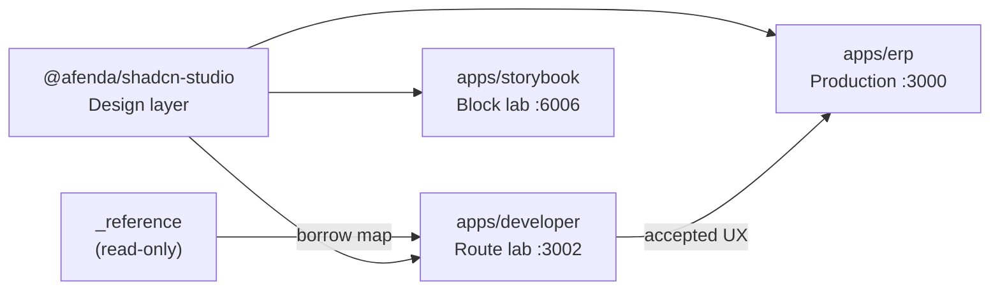

# Developer Sandbox Architecture Blueprint (Route Lab)

| Field | Value |
| --- | --- |
| **Document class** | `architecture_blueprint` |
| **Document role** | `presentation_lab_box_map` |
| **Architectural identity** | **Developer Route Lab** |
| **Workspace mapping** | `@afenda/developer` (lab-lane — registry via foundation-registry-owner) |
| **Scope** | Route lab — full operator UX prototyping |
| **Parent** | [Presentation North Star](../NORTHSTAR/shadcn-studio-presentation-north-star.md) · [Developer Sandbox North Star](../NORTHSTAR/developer-sandbox-north-star.md) |
| **Sibling** | [shadcn/studio Presentation Blueprint](shadcn-studio-presentation-blueprint.md) |
| **Authority ADR** | [ADR-0039](../adr/ADR-0039-developer-presentation-sandbox.md) |
| **Governing PAS** | [PAS-006E](../PAS/PRESENTATION/PAS-006E-DEVELOPER-ROUTE-LAB-STANDARD.md) |
| **Maturity** | Planned (app scaffold P06-014) |
| **Last reviewed** | 2026-07-02 |

> **One sentence:** One **Developer Route Lab** box owns `apps/developer` on port **3002**, consuming **`@afenda/shadcn-studio` only**, prototyping full operator surfaces for ERP promotion — no kernel, API, or spine.

---

# 0. Agent Quick Path

**Read order:** [Developer Sandbox North Star](../NORTHSTAR/developer-sandbox-north-star.md) → **this document** → [PAS-006E](../PAS/PRESENTATION/PAS-006E-DEVELOPER-ROUTE-LAB-STANDARD.md) → target slice handoff.

**Hard stops:**

- Do not import `@afenda/kernel`, `@afenda/database`, or `@afenda/auth` into `@afenda/developer`
- Do not runtime-import `_reference/`
- Do not deploy to production without `AFENDA_DEVELOPER_SANDBOX` guard (ADR-0039)
- Do not create `src/views/` — use `_components/` + `lib/lab/load-*-page.server.ts`

---

# 1. Blueprint Box

| Blueprint box | Layer | Port | Consumes | Status |
| --- | --- | --- | --- | --- |
| **Developer Route Lab** | Application (lab) | **3002** | `@afenda/shadcn-studio` only | Planned (P06-014) |

**Upstream:** [shadcn/studio Presentation](shadcn-studio-presentation-blueprint.md) — Design layer blocks + CSS.

**Downstream:** [ERP Application](shadcn-studio-presentation-blueprint.md) — promotion target after acceptance.

---

# 2. Composition Diagram



| Box | Relationship |
| --- | --- |
| shadcn/studio Presentation | Supplies blocks + CSS — **sole package dependency** |
| Developer Route Lab | Composes multi-block routes · static lab fixtures |
| Storybook (Block lab) | Parallel consumer — single-block verification |
| ERP Application | Receives promoted UX + adds auth/spine/APIs |

---

# 3. Target Filesystem (P06-014)

```text
apps/developer/src/
  app/
    layout.tsx              # root: globals, demo banner — NO auth
    page.tsx                # lab index
    error.tsx               # client-safe — NO studio import
    (lab)/
      layout.tsx            # force-dynamic + AppShell + nav
      dashboard/sales/
        page.tsx            # thin RSC
        loading.tsx
        _components/sales-dashboard-panel.tsx
  lib/lab/
    load-dashboard-sales-page.server.ts
    lab-demo-context.ts     # NOT OperatingContext
  config/
    nav-config.ts
    theme-config.ts
```

Detail: PAS-006E **Frontend layout annex**.

---

# 4. v1 Routes

| Route | Reference source | Slice |
| --- | --- | --- |
| `/` | New — lab index + banner | P06-014 |
| `/dashboard/sales` | `/dashboard/sales` | P06-014 |
| `/dashboard/finance` | `/dashboard/finance` | P06-015 |
| `/admin/users` | `/apps/users/list` | P06-016 |
| `/settings/appearance` | `themeConfig` | P06-016 |

SSOT: [reference-borrow-map.md](../PAS/PRESENTATION/SLICE/reference-borrow-map.md)

---

# 5. PAS & Slice Inventory

| PAS | Role | Slices |
| --- | --- | --- |
| PAS-006E | Route lab standard + layout annex | P06-013–P06-016 |

| Slice | Title | Status |
| --- | --- | --- |
| P06-013 | Developer route lab docs | **Delivered** |
| P06-014 | Developer app scaffold | Planned |
| P06-015 | Dashboard compositions (finance) | Planned |
| P06-016 | Admin list + theme smoke | Planned |

Catalog: [presentation-slice-catalog.md](../PAS/PRESENTATION/SLICE/presentation-slice-catalog.md)

---

# 6. Verification Gates (post-scaffold)

```bash
pnpm --filter @afenda/developer typecheck
pnpm --filter @afenda/developer build
# MCP: nextjs_index → get_routes → get_errors (port 3002)
# P06-016: Playwright smoke on :3002 (advisory CI, no auth)
```

---

## References

| Document | Role |
| --- | --- |
| [ADR-0039](../adr/ADR-0039-developer-presentation-sandbox.md) | Constitutional decision |
| [Presentation Blueprint](shadcn-studio-presentation-blueprint.md) | Upstream Design box |
| [PAS-006E](../PAS/PRESENTATION/PAS-006E-DEVELOPER-ROUTE-LAB-STANDARD.md) | Contracts + layout annex |
| [afenda-nextjs-best-practice SKILL](../../.cursor/skills/afenda-nextjs-best-practice/SKILL.md) | Multi-app + page law |
