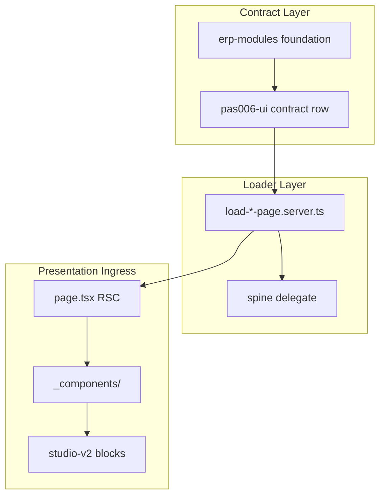

# Full-Stack Integration Architecture Blueprint

| Field | Value |
| --- | --- |
| **Document class** | `architecture_blueprint` |
| **Document role** | `domain_architecture_box_map` |
| **Architectural identity** | Full-Stack Integration overlay — alignment across presentation, application ingress, API, and governance |
| **Scope** | Cross-layer materialization · registry discipline · lab mirror · machine traceability |
| **Parent** | [Platform North Star](../architecture/afenda-platform-north-star.md) · [Full-Stack Integration North Star](../NORTHSTAR/full-stack-integration-north-star.md) |
| **Platform rollup** | [Platform Architecture Blueprint](../architecture/afenda-architecture-blueprint.md) cross-cutting row |
| **Authority ADR** | [ADR-0026](../adr/ADR-0026-platform-north-star-and-architecture-blueprint.md) · [ADR-0044](../adr/ADR-0044-developer-route-lab-runtime-authority-boundary.md) · [ADR-0027](../adr/ADR-0027-frontend-presentation-reset.md) · [ADR-0030](../adr/ADR-0030-erp-rest-api-contract-standard.md) |
| **Derived documents** | FSI slice track in [PAS status index](../PAS/pas-status-index.md) · `integration-graph.snapshot.json` (generated) |
| **Maturity** | Active — FSI-S10 delivered (graph + dashboard) |
| **Runtime stance** | Documentation + generated snapshot — references registries and lab dashboard |
| **Does not confer** | Business domain meaning, North Star EFR, slice handoff execution |
| **Quality target** | Enterprise acceptance |
| **Evidence standard** | [doc-evidence-standard.md](../../.cursor/skills/kernel-authority/reference/doc-evidence-standard.md) |
| **Last reviewed** | 2026-07-06 |
| **Next document** | FSI slice handoffs in [PAS status index](../PAS/pas-status-index.md) |

> **One sentence:** Full-Stack Integration Blueprint maps the eight-layer overlay, module ingress chain, application sub-boxes, dependency tiers, and mechanical proof inventory that keep frontend, API, domain, and UI configuration aligned — with machine export as SSOT for visualization.

---

# 0. Agent Quick Path

**Read order:** [Full-Stack Integration North Star](../NORTHSTAR/full-stack-integration-north-star.md) §1–§6 → **this document** → sibling Blueprints (API Contract, Kernel, Presentation) → FSI slice in PAS index → Code.

**This document answers:** layer overlay, ingress sequences, CCP inventory, slice index links, decision register, and enterprise acceptance checklist.

**This document never answers:** business mission restatement (North Star §1–§6), TypeScript contract shapes (PAS), or session scope (9-field handoff).

**Chain rule:** North Star §1–§6 → **this Blueprint** → FSI slice → Code → Integration Map dashboard

---

# 1. Blueprint Purpose

Before extending module surfaces, lab routes, or integration visualization, answer from **this document only**:

1. **Which layer?** → §2 eight-layer overlay
2. **Which ingress chain?** → §3 three-layer module ingress
3. **Which app sub-box?** → §4 application map
4. **Which dependency tier?** → §5 tiers 0–8
5. **Which development step?** → §6 eight-step sequence
6. **Which FSI slice?** → §7 index (detail in PAS)
7. **Which CCP applies?** → §9 appendix
8. **Which gate proves it?** → §9 CCP gate column · §11 acceptance checklist

Business **why** integration integrity exists: [North Star §1](../NORTHSTAR/full-stack-integration-north-star.md) — do not copy here.

---

# 2. Eight-Layer Integration Overlay

```text
L0  Constitutional law          Platform laws · ADRs
L1  Domain North Stars          Business WHY per domain
L2  Architecture Blueprints     Box maps · ingress · tiers (this document)
L3  PAS / slice handoffs        Contracts · gates · file paths
L4  Registry SSOT               foundation-disposition · API registry · pas006-ui · lab allowlists
L5  Runtime materialization     loaders · pages · handlers · delegates
L6  Presentation binding        studio-v2 blocks · metadata binding
L7  Mechanical proof            export snapshots · drift gates · tests · MCP verification
L8  Visualization mirror        Integration Map dashboard (lab-only read model)
```

**Flow:** L4 registries author truth → L5–L6 materialize → L7 proves → L8 visualizes without becoming authority.

---

# 3. Three-Layer Module Ingress

Every ERP module surface traverses three ingress layers before operator render:

| Layer | Responsibility | Proof |
| --- | --- | --- |
| **Contract layer** | Module foundation + pas006-ui row declares surfaceId, route, loader, block | Registry entry + contract gate |
| **Loader layer** | Server loader assembles serializable page data via spine delegate | Loader typed + spine consumer registry |
| **Presentation layer** | RSC page + `_components/` compose studio-v2 blocks | PAS-006 consumer gate + interaction tests |

**Canonical ingress string:**

```text
erp-modules contract → lib/{module}/load-* → modules/**/page.tsx → _components/ → studio-v2
```

**Micro-sequence per surface:**

```text
ADR/slice → pas006-ui row → loader → page → _components → spine registry → MCP get_errors
```

---

# 4. Application Sub-Boxes

| Sub-box | Role | Integration posture |
| --- | --- | --- |
| **ERP modules** | Production operator surfaces | Full spine · API · permission vocabulary |
| **ERP integration spine** | Operating context + API handler runtime | Consumes API Contract authority |
| **Developer route lab** | Composition proof on port 3002 | Demo-fixture authority only (ADR-0044) |
| **Developer Integration Map** | Architecture visualization | Reads generated graph; no ERP runtime imports |
| **Docs / OpenAPI mirror** | Publication and discovery | Generated from API registry |
| **Architecture authority** | Foundation disposition · package registry | Package lane SSOT |
| **Presentation package** | studio-v2 primitives and blocks | PAS-006 import chain |
| **Governance scripts** | Export + drift gates | Machine proof layer |

---

# 5. Dependency Tiers (0–8)

| Tier | Depends on | Examples |
| --- | --- | --- |
| **0** | — | Constitutional laws · ADRs |
| **1** | 0 | Platform North Star |
| **2** | 1 | Domain North Stars (FSI, API, Kernel, Presentation) |
| **3** | 2 | Blueprints (this document, API Contract, Kernel) |
| **4** | 3 | PAS families · slice handoffs |
| **5** | 4 | Registry files (disposition, API, pas006-ui, lab) |
| **6** | 5 | Loaders · pages · route handlers |
| **7** | 6 | Presentation blocks · metadata binding |
| **8** | 5–7 | Export snapshots · drift gates · dashboard mirror |

**Rule:** No tier N artifact may declare authority that contradicts tier N−1. Lab (tier 6–7) never imports tier 6 ERP spine packages.

---

# 6. Development Sequence (8 Steps)

| Step | Action | Blocked by |
| --- | --- | --- |
| **1** | Integration spine + operating context proof | Foundation gate |
| **2** | API contract registry + OpenAPI publication | PAS-API-REST-001 |
| **3** | Module foundation package (`erp-modules`) | PAS-001C |
| **4** | Presentation v2 cutover (`shadcn-studio-v2`) | ADR-0027 · PAS-006 |
| **5** | Module surface registry (`pas006-ui`) + loaders | FSI-S7 |
| **6** | Route lab parity surfaces | PAS-006E · ADR-0044 |
| **7** | Line-of-business operational surfaces | Module readiness |
| **8** | Accounting Core runtime | ADR-0010 · new ADR (**blocked**) |

---

# 7. FSI Slice Index

Detail lives in [PAS status index](../PAS/pas-status-index.md) — index only here.

| ID | Priority | One line | PAS / track link |
| --- | --- | --- | --- |
| **FSI-S7** | P0 | Module surface registry materialization | [pas-status-index § FSI](../PAS/pas-status-index.md) |
| **FSI-S8** | P0 | Rendering matrix (`force-dynamic`, BFF cache mirror) | [pas-status-index § FSI](../PAS/pas-status-index.md) |
| **FSI-S3** | P1 | Lab→ERP promotion attestation | [PAS-006E](../PAS/PRESENTATION/PAS-006E-DEVELOPER-ROUTE-LAB-STANDARD.md) |
| **FSI-S1** | P1 | Consumer envelope discipline | [API Contract NS](../NORTHSTAR/api-contract-north-star.md) |
| **FSI-S6** | P1 | v1→v2 presentation cutover | [Presentation NS](../NORTHSTAR/shadcn-studio-presentation-north-star.md) |
| **FSI-S9** | P1 | MCP route verification | [afenda-nextjs-best-practice](../../.cursor/skills/afenda-nextjs-best-practice/SKILL.md) |
| **FSI-S2** | P1 | Wire→UI mapper registry | [pas-status-index § FSI](../PAS/pas-status-index.md) |
| **FSI-S4** | P2 | Metadata binding materialization | [PAS-006](../PAS/PRESENTATION/PAS-006-SHADCN-STUDIO-FRONTEND-STANDARD.md) |
| **FSI-S5** | P2 | OpenAPI↔permission parity | [PAS-API-001](../PAS/API-CONTRACT/PAS-API-001-PLATFORM-API-CONTRACT-AUTHORITY-STANDARD.md) |
| **FSI-S10** | P1 | Integration graph export + dashboard | **Delivered** — this blueprint cycle |

---

# 8. Next.js Ingress Diagram



**Lab variant:** Same ingress chain with `demo-fixture` instead of spine; promotion replaces loader target with ERP path attestation.

---

# 9. CCP Appendix (Top 14)

Critical Control Points — mechanical proof inventory. Full governance inventory: architecture authority disposition gates.

| CCP ID | Control | Owner layer | Gate |
| --- | --- | --- | --- |
| **FSI-CCP-001** | Triple proof — registry + delegate + gate | L4–L7 | `pnpm check:foundation-disposition` |
| **FSI-CCP-002** | Registry-before-filesystem for ERP pages | L5 | `pnpm check:erp-module-readiness` |
| **FSI-CCP-003** | pas006-ui contract materialization | L4 | `pnpm check:procurement-pas006-ui-contract` |
| **FSI-CCP-004** | API operation registry completeness | L4 | `pnpm check:api-contracts` |
| **FSI-CCP-005** | OpenAPI publication drift | L7 | `pnpm check:openapi-drift` |
| **FSI-CCP-006** | Spine consumer wiring | L5 | `pnpm quality:kernel-context-surface` |
| **FSI-CCP-007** | Lab route surface registry | L4 | `pnpm check:route-lab-governance` |
| **FSI-CCP-008** | Lab runtime authority boundary | L5 | ADR-0044 · lab governance script |
| **FSI-CCP-009** | Presentation v2 consumer imports | L6 | `pnpm check:erp-metadata-pas006-consumer` |
| **FSI-CCP-010** | Integration graph export freshness | L7 | `pnpm check:integration-graph-drift` |
| **FSI-CCP-011** | Documentation authority sync | L1–L3 | `pnpm check:documentation-drift` |
| **FSI-CCP-012** | Developer lab greenlight | L8 | `pnpm check:developer-route-lab-greenlight` |
| **FSI-CCP-013** | Module context spine consumer | L5 | `pnpm check:procurement-context-spine-consumer` |
| **FSI-CCP-014** | ERP typecheck + build on surface change | L5–L6 | `pnpm --filter @afenda/erp typecheck` |

---

# 10. Decision Register

| ID | Decision | Status | Rationale |
| --- | --- | --- | --- |
| **FSI-D1** | Machine graph replaces hand-maintained traceability matrix | Accepted | Single SSOT from registries |
| **FSI-D2** | Integration Map stays lab-only permanently | Accepted | ADR-0044 — operators do not need architecture graphs |
| **FSI-D3** | Two authority docs (NS + Blueprint) — no inline annex proliferation | Accepted | Lean docs-as-code |
| **FSI-D4** | API supplement doc deferred — 3-line cross-link suffices | Accepted | HTTP doctrine owned by API Contract NS |
| **FSI-D5** | CCP table in Blueprint only — not in North Star body | Accepted | NS stays business doctrine |
| **FSI-D6** | FSI slice detail in PAS index — not duplicated in plan | Accepted | PAS is slice SSOT |
| **FSI-D7** | `openapi-typescript` / `orval` deferred | Planned | Per PAS-API family roadmap |

---

# 11. Enterprise Acceptance Checklist

| # | Criterion | Gate / evidence |
| --- | --- | --- |
| 1 | North Star + Blueprint published | `pnpm check:documentation-drift` |
| 2 | Integration graph exports from live registries | `pnpm export:integration-graph` |
| 3 | Graph snapshot drift gate wired | `pnpm check:integration-graph-drift` |
| 4 | Developer dashboard renders five tabs | `/architecture` on port 3002 |
| 5 | Force graph shows ≥1 edge from registry data | Dashboard Dependency graph tab |
| 6 | Mermaid overview renders layer flow | Dashboard Overview tab |
| 7 | Route lab governance includes architecture route | `pnpm check:route-lab-governance` |
| 8 | No ERP auth/kernel imports on dashboard | Route-lab governance prohibited imports |
| 9 | PAS status index registers FSI track | Manual + documentation-drift |
| 10 | North Star README cross-cutting row added | Manual + documentation-drift |

**Merged gate bundle:**

```bash
pnpm check:documentation-drift
pnpm check:integration-graph-drift
pnpm --filter @afenda/developer typecheck
pnpm check:route-lab-governance
pnpm check:developer-route-lab-greenlight
```

---

# 12. Machine Export Reference

| Artifact | Path | Generator |
| --- | --- | --- |
| Integration graph snapshot | `docs/architecture/integration-graph.snapshot.json` | `pnpm export:integration-graph` |
| Drift gate | `scripts/governance/check-integration-graph-drift.mts` | `pnpm check:integration-graph-drift` |

**Node types:** `package` · `api-operation` · `module-surface` · `spine-wiring` · `lab-route` · `ccp` · `gate`

**Edge types:** `depends-on` · `materializes` · `validates` · `consumes`

**Rule:** Never hand-edit the snapshot — regenerate via export script.

## 12.1 Reading the Integration Map

**Dashboard:** `http://localhost:3002/architecture` (Developer Route Lab only — ADR-0044).

| Tab | Authority | What it shows |
| --- | --- | --- |
| **Overview** | Illustrative target + derived gaps | Blueprint §8 ingress (best practice) vs snapshot-derived gap table (as-built) |
| **Dependency graph** | Machine snapshot | Full registry graph — exploratory, not normative |
| **Surfaces** | Machine snapshot | Lab routes and ERP module surfaces with promotion and spine columns |
| **CCPs** | Declared controls | FSI-CCP inventory and gate commands — verify in CI/local, not in browser |
| **Slices** | FSI slice index | PAS backlog status mirrored from export |

**Target diagram** = [§8 Next.js Ingress Diagram](#8-nextjs-ingress-diagram) (illustrative best practice).

**Current posture** = gaps computed at load time from `integration-graph.snapshot.json` nodes and edges — authoritative for as-built drift.

### Gap ID catalog

| Gap ID | Target | Detected when | Slice |
| --- | --- | --- | --- |
| `GAP-LAB-PROMO` | Every `promotionTarget: erp-route` lab route has a pas006 mirror | Lab route with no matching `module-surface` `routePattern` | FSI-S3 · FSI-S7 |
| `GAP-MISSING-SPINE` | Module surface consumes spine delegate | `module-surface` without `consumes` → `spine:*` edge | FSI-S7 |

**Regenerate snapshot:** `pnpm export:integration-graph` · **Drift gate:** `pnpm check:integration-graph-drift`
