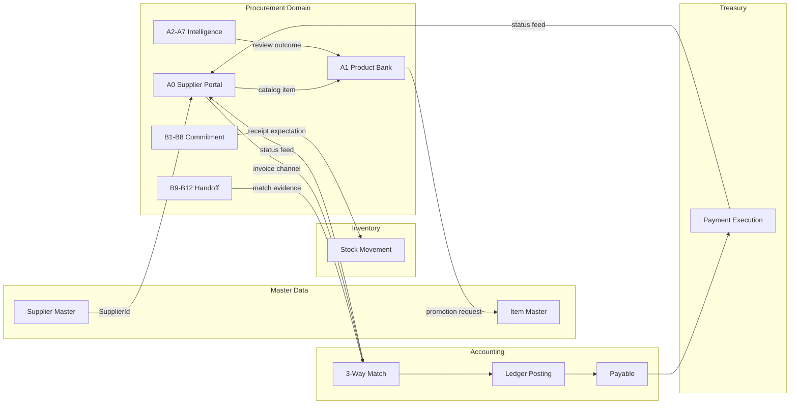

# Procurement Architecture Blueprint

| Field | Value |
| --- | --- |
| **Document class** | `architecture_blueprint` |
| **Document role** | `domain_architecture_box_map` |
| **Architectural identity** | Blueprint box family — **Procurement Domain** · primary boxes: Procurement Product Bank · Supplier Portal · Procurement Commitment · Procurement Cross-Domain Handoff |
| **Scope** | Full procurement domain: supplier portal · product bank · sourcing intelligence · commitment lifecycle · S2P cross-domain handoffs |
| **Parent** | [Platform North Star](../architecture/afenda-platform-north-star.md) · [ERP Module Runtime Blueprint](erp-module-runtime-blueprint.md) |
| **Domain NS** | [Procurement North Star](../NORTHSTAR/procurement-north-star.md) |
| **Authority ADR** | [ADR-0020](../adr/ADR-0020-master-data-authority-consolidation.md) · [ADR-0021](../adr/ADR-0021-canonical-enterprise-identity.md) · [ADR-0031](../adr/ADR-0031-procurement-runtime-authority-boundary.md) |
| **Wire anchor** | KV-PROC · [B80](../PAS/KERNEL/SLICE/b80-procurement-domain-vocabulary.md) |
| **Runtime path law** | Operational (future): `packages/features/erp-modules/src/procurement/` · Registry reservation: `packages/procurement` (must not exist — [ADR-0031 §6](../adr/ADR-0031-procurement-runtime-authority-boundary.md)) |
| **Maturity** | Blueprint **9.5 / 10** (document accepted) — runtime blocked per §13 condition gates |
| **Runtime stance** | **Operational deferred** — documentation and foundation meaning only; features-package filesystem, DB, ERP routes, and supplier portal runtime blocked until authorized ERP-MODULES slice handoffs (see [procurement-runtime-readiness-report](../PAS/ERP-MODULES/PROCUREMENT/procurement-runtime-readiness-report.md) §Operational deferral) |
| **Pending ADR gates** | Supplier-facing auth / SupplierId tenancy scoping · Accounting match feed contract · Treasury payment feed contract |
| **Last reviewed** | 2026-06-30 |
| **PAS family** | [PAS-PROC-001K](../PAS/ERP-MODULES/PAS-PROC-001K-PROCUREMENT-PRODUCT-BANK-AND-SUPPLIER-PORTAL-STANDARD.md) (stub) · PAS-PROC-001 through 001J (planned) |
| **Benchmark review** | [procurement-oss-benchmark-review](../PAS/ERP-MODULES/PROCUREMENT/procurement-oss-benchmark-review.md) — wins · borrow stack · avoid list |

> **One sentence:** The Procurement Architecture Blueprint translates the Procurement North Star into 20 architecture boxes across two tiers — Commercial Sourcing Intelligence (A0–A7) and Commitment and Handoff (B1–B12) — mapping each box to its PAS owner, runtime stage, owned/never-owned responsibilities, and cross-domain handoff signals, so that implementation teams can build incrementally without violating Accounting, Treasury, Inventory, or BMD boundaries.

---

# 0. Agent Quick Path

**Read order:** [Procurement NS §1–§19](../NORTHSTAR/procurement-north-star.md) → **this document §1–§17** → [PAS-PROC-001K](../PAS/ERP-MODULES/PAS-PROC-001K-PROCUREMENT-PRODUCT-BANK-AND-SUPPLIER-PORTAL-STANDARD.md) → [OSS benchmark review](../PAS/ERP-MODULES/PROCUREMENT/procurement-oss-benchmark-review.md) → slice handoff → code.

**Hard stops:**

- Do not implement product bank or supplier portal as Accounting or Inventory runtime.
- Do not wire supplier invoice handling inside procurement — supplier submits; Accounting validates.
- Do not make Product Bank items into Item Master records without BMD promotion ([ADR-0020](../adr/ADR-0020-master-data-authority-consolidation.md)).
- Do not create cross-domain payment triggers in procurement — Treasury owns execution.
- Do not build supplier-facing auth before supplier auth/tenancy ADR is accepted (Stage 3 gate).
- Do not display match/payment status from local Procurement state — feed from Accounting/Treasury only (I-PORTAL-001).
- All runtime boxes are **planned** until authorized slice handoffs and ADR gates clear them.

---

# 1. Architecture Stance

This Blueprint translates the Procurement North Star into architecture boxes. It does not restate business philosophy, define TypeScript contracts, or authorize runtime implementation.

**This Blueprint decides:**

- which capability boxes exist and which tier they belong to;
- which boxes own, never own, consume, and emit procurement responsibilities;
- which boxes are outside Procurement's authority boundary;
- which PAS documents must be authored before implementation;
- which ADR gaps block runtime stages;
- which slices may proceed first and in which order.

**Business meaning** belongs to the [Procurement North Star](../NORTHSTAR/procurement-north-star.md).  
**Contract authority** belongs to PAS-PROC family.  
**Execution** belongs to slices and code.

**This Blueprint never:**

- Restates North Star philosophy or operating model
- Defines TypeScript contract field shapes
- Authorizes runtime implementation directly
- Replaces ADR decision rationale

---

# 2. Upstream Traceability

| Upstream | Link | This Blueprint uses |
| --- | --- | --- |
| ADR-0020 | Master data authority | Item Master belongs to BMD — Product Bank emits promotion |
| ADR-0031 | Runtime authority boundary | Procurement runtime path law + PKG-R05 reservation |
| Procurement NS §2.1 | Two-tier pillar model | Box map derives from pillar structure |
| Procurement NS §3.6 | Product Bank doctrine | Product Bank box and data domains |
| Procurement NS §3.9 | S2P ownership matrix | Box boundary with Accounting/Treasury |
| Procurement NS §2.9 | Actor separation | Portal surface limits |
| Procurement NS §5.1 | I-CAT/I-S2P/I-BUY/I-PORTAL | Invariants enforced through box boundaries |
| ERP Module Runtime Blueprint | Module delivery pattern | Path law + foundation consumption |
| Kernel Blueprint | KV-PROC wire | Wire consumption boundary |
| Enterprise Knowledge Blueprint | PAS-004 atoms | Meaning boundary — B56/B57 accepted; B58 planned |

---

# 3. Procurement Box Map (complete — 20 boxes)

The Procurement domain contains **20 capability boxes** under two tiers:

- **Tier A — Commercial Sourcing Intelligence:** A0–A7 (8 boxes)
- **Tier B — Commitment and Handoff:** B1–B12 (12 boxes)

Tier A governs supplier-offer intelligence before commitment. Tier B governs demand, requisition, sourcing, commitment, receipt expectation, exception, and cross-domain evidence handoff.

```text
╔═══════════════════════════════════════════════════════════════════════════════╗
║  PROCUREMENT DOMAIN (ADR-0031 · KV-PROC · path law: features/erp-modules)   ║
╠═══════════════════════════════════════════════════════════════════════════════╣
║                                                                               ║
║  ┌─ TIER A: COMMERCIAL SOURCING INTELLIGENCE (8 boxes) ───────────────────┐  ║
║  │                                                                          │  ║
║  │  ┌──────────────────────┐  ┌──────────────────────────────────────────┐ │  ║
║  │  │ A0 SUPPLIER S2P      │  │ A1 PROCUREMENT PRODUCT BANK             │ │  ║
║  │  │ PORTAL               │  │                                          │ │  ║
║  │  │ · Catalog/price      │  │ · Buyer review queue                    │ │  ║
║  │  │ · PO inbox           │  │ · Technical/QA/warehouse review         │ │  ║
║  │  │ · ASN submit         │  │ · Preferred/blocked/contracted status   │ │  ║
║  │  │ · Invoice channel    │  │ · Publication to requestors             │ │  ║
║  │  │ · Match/pay status   │  │ · Buying decision record               │ │  ║
║  │  └──────────────────────┘  │ · Master-data promotion request        │ │  ║
║  │                            └──────────────────────────────────────────┘ │  ║
║  │  ┌────────────────────┐  ┌───────────────────┐  ┌───────────────────┐   │  ║
║  │  │ A2 TECHNICAL       │  │ A3 SUPPLIER OFFER │  │ A4 TRUE COST /    │   │  ║
║  │  │ CATALOG            │  │ & PRICE LIST      │  │ LANDED COST       │   │  ║
║  │  │ · Specs/certs      │  │ · Validity/expiry │  │ · Freight/duty    │   │  ║
║  │  │ · Substitutes      │  │ · MOQ/lead time   │  │ · Shrinkage       │   │  ║
║  │  └────────────────────┘  └───────────────────┘  └───────────────────┘   │  ║
║  │  ┌────────────────────┐  ┌───────────────────┐  ┌───────────────────┐   │  ║
║  │  │ A5 CARGO SAFETY    │  │ A6 WAREHOUSE /    │  │ A7 CHANNEL FIT    │   │  ║
║  │  │ & LOGISTICS RISK   │  │ SHRINKAGE FIT     │  │ CLASSIFICATION    │   │  ║
║  │  └────────────────────┘  └───────────────────┘  └───────────────────┘   │  ║
║  └──────────────────────────────────────────────────────────────────────────┘  ║
║                                                                               ║
║  ┌─ TIER B: COMMITMENT AND HANDOFF (12 boxes) ─────────────────────────────┐  ║
║  │                                                                          │  ║
║  │  ┌──────────────────┐  ┌──────────────────┐  ┌──────────────────────┐  │  ║
║  │  │ B1 SPEND DEMAND  │  │ B2 REQUISITION   │  │ B3 POLICY &         │  │  ║
║  │  │ GOVERNANCE       │  │ GOVERNANCE       │  │ APPROVAL AUTHORITY  │  │  ║
║  │  └──────────────────┘  └──────────────────┘  └──────────────────────┘  │  ║
║  │  ┌──────────────────┐  ┌──────────────────┐  ┌──────────────────────┐  │  ║
║  │  │ B4 CATEGORY &    │  │ B5 SUPPLIER      │  │ B6 SOURCING &       │  │  ║
║  │  │ SPEND CLASS      │  │ ENGAGEMENT       │  │ AWARD GOVERNANCE    │  │  ║
║  │  └──────────────────┘  └──────────────────┘  └──────────────────────┘  │  ║
║  │  ┌──────────────────┐  ┌──────────────────┐  ┌──────────────────────┐  │  ║
║  │  │ B7 CONTRACT /    │  │ B8 PO COMMITMENT │  │ B9 RECEIPT          │  │  ║
║  │  │ BLANKET / RELEASE│  │ GOVERNANCE       │  │ EXPECTATION &       │  │  ║
║  │  │                  │  │                  │  │ VARIANCE HANDOFF    │  │  ║
║  │  └──────────────────┘  └──────────────────┘  └──────────────────────┘  │  ║
║  │  ┌──────────────────┐  ┌──────────────────┐  ┌──────────────────────┐  │  ║
║  │  │ B10 INVOICE      │  │ B11 PROCUREMENT  │  │ B12 AUDIT,          │  │  ║
║  │  │ MATCH EVIDENCE   │  │ EXCEPTION        │  │ PERFORMANCE &       │  │  ║
║  │  │ HANDOFF          │  │ GOVERNANCE       │  │ ACCOUNTABILITY      │  │  ║
║  │  └──────────────────┘  └──────────────────┘  └──────────────────────┘  │  ║
║  └──────────────────────────────────────────────────────────────────────────┘  ║
║                                                                               ║
╚═══════════════════════════════════════════════════════════════════════════════╝

    ↓ emits                        ↓ emits                    ↓ emits
┌──────────────┐        ┌──────────────────────┐      ┌────────────────────┐
│  INVENTORY   │        │      ACCOUNTING       │      │     TREASURY       │
│  stock move  │        │ 3-way match · posting │      │ payment execution  │
│  (owns)      │        │ payable (owns)        │      │ (owns)             │
└──────────────┘        └──────────────────────┘      └────────────────────┘
         ↑                          ↑                             ↑
   receipt signal            match evidence                payable readiness
   (procurement emits)       (procurement emits)           (Accounting emits)

                    ↑ master-data promotion request ↑
                ┌──────────────────────────────────────┐
                │  BMD / ITEM MASTER (ADR-0020)         │
                │  operational enterprise truth         │
                └──────────────────────────────────────┘
```

---

# 4. Authority Flow

Every supplier data claim travels through procurement authority gates before becoming trusted procurement truth, and then through handoff signals before downstream domains may act.

```text
Supplier Claim (catalog / price / certificate / invoice)
        ↓
[A0] Supplier Portal (procurement-led surface — claim entry)
        ↓
[A1] Product Bank Acceptance (buyer + technical review — becomes procurement truth)
        ↓
[A1] Requestor Catalog / [A3-A4] Buyer Cockpit (enriched sourcing intelligence)
        ↓
[B2] Requisition  OR  [B6] Sourcing Event
        ↓
[B8] PO Commitment (authorized supplier commitment)
        ↓
[B9] Receipt Expectation / Variance Signal
        ↓
[B10] Match Evidence Package (assembled by Procurement — emitted to Accounting)
        ↓
[Accounting] 3-Way Match / Posting / Payable
        ↓
[Treasury] Payment Execution
```

**Product truth authority flow:**

```text
Supplier Catalog Item  →[buyer review]→  Product Bank Item  →[BMD promotion]→  Item Master
     (A0 claim)              (A1 truth)                          (BMD truth)
```

Supplier data is a **claim**. Procurement acceptance creates **procurement truth**. Master-data promotion creates **operational enterprise truth**. These are three different assertions with three different owners.

---

# 5. Box Specifications

## 5.1 A0 — Supplier S2P Portal (Procurement-led surface with cross-domain feeds)

| Field | Value |
| --- | --- |
| **Box name** | Supplier S2P Portal |
| **PAS** | PAS-PROC-001K (stub · 2026-06-30) |
| **Runtime path** | `packages/features/erp-modules/src/procurement/supplier-portal/` |
| **Runtime stage** | Stage 3–7 (staged; see §9) |
| **Runtime status** | **Planned** — NS documented; supplier auth/tenancy ADR required before supplier login |
| **ADR gap** | Supplier-facing authentication + SupplierId tenancy scoping (ADR pending) |

**Supplier Portal is a supplier-facing surface led by Procurement** for catalog, offer, PO acknowledgment, ASN, and supplier accountability. It may display Accounting and Treasury statuses as read-only feeds. It does not own invoice validation, match outcome, payable creation, payment scheduling, payment execution, stock movement, or master-data creation.

### Portal ownership by module

| Portal area | Supplier action | Owning domain | Procurement role |
| --- | --- | --- | --- |
| Catalog upload | Submit product / price / certificate | Procurement | Accept / reject / publish |
| Price list | Upload / maintain | Procurement | Validate / expire / govern |
| PO inbox | Acknowledge / dispute | Procurement | Own PO commitment lifecycle |
| ASN / delivery notice | Submit delivery info | Procurement + Inventory | Emit receipt expectation |
| Invoice submission | Submit invoice against PO | **Accounting** | Portal channel only |
| Match status | View match result + reason codes | **Accounting** | Display read-only feed |
| Payment status | View payment / remittance | **Treasury** | Display read-only feed |
| Supplier query | Respond to exception | Owning domain by type | Route to owner |

**Owns:**
- Supplier catalog submission and maintenance surface
- Price list upload, parse, and validity tracking
- Certificate / document upload and expiry tracking
- PO inbox and acknowledgment interface
- ASN / delivery document submission
- Supplier accountability scorecard (catalog freshness + PO ack SLA + invoice quality)

**Never owns:**
- Procurement catalog acceptance decision (Product Bank — A1)
- Invoice validation / match execution (Accounting)
- Payment execution or scheduling (Treasury)
- Supplier master identity (BMD / PAS-001)
- Stock movement (Inventory)

**Consumes:** `SupplierId` from BMD · PO data from B8 · match status feed from Accounting · payment status feed from Treasury  
**Emits:** Supplier catalog item → A1 review queue · price list → A3 · ASN → B9 · invoice → Accounting capture · PO ack → B8

---

## 5.2 A1 — Procurement Product Bank

| Field | Value |
| --- | --- |
| **Box name** | Procurement Product Bank |
| **PAS** | PAS-PROC-001K (stub · 2026-06-30) |
| **Runtime path** | `packages/features/erp-modules/src/procurement/product-bank/` |
| **Runtime stage** | Stage 1 (internal) → Stage 2 (requestor browse) |
| **Runtime status** | **Planned** — NS doctrine + invariants documented; B58 atoms pending |

**Three-layer product truth enforced here:**

```text
Supplier Catalog Item (A0)  →[buyer review]→  Product Bank Item (A1)  →[BMD promotion emit]→  Item Master
```

**Owns:**
- Buyer review and acceptance workflow (I-CAT-001)
- Technical / QA / Warehouse review queue
- Product Bank item lifecycle management
- Publication approval and requestor catalog management (I-CAT-006)
- Preferred / contracted / blocked status
- Buying decision record (I-CAT-008) — linked at sourcing award and PO
- True cost enrichment (delegates calculation to A4)
- Master-data promotion request **emit** (→ BMD/Inventory)
- Product Bank change audit (I-CAT-007)

**Never owns:**
- Item Master (ADR-0020 — BMD/Inventory)
- Retail sellable product catalog (Sales domain)
- Manufacturing BOM (Manufacturing domain)
- Inventory SKU master or costing master (I-CAT-009)

**Consumes:** Supplier catalog item from A0 · technical review from A2 · true cost from A4 · cargo/storage from A5/A6  
**Emits:** `master_data_promotion_request` → BMD/Inventory · requestor-browsable catalog → B2 · buying decision record → B6

---

## 5.3 A2 — Technical Sourcing Catalog

| PAS | Runtime stage | Status |
| --- | ---: | --- |
| PAS-PROC-001K / PAS-PROC-001A | Stage 1 | Planned |

**Owns:** Product specification, grade, samples, substitutes/equivalences, regulatory compliance, certificate records (I-CAT-011 — issuer/validity/review actor/expiry).  
**Emits:** Technical review outcome → A1 Product Bank.

---

## 5.4 A3 — Supplier Offer and Price List Governance

| PAS | Runtime stage | Status |
| --- | ---: | --- |
| PAS-PROC-001K | Stage 1 | Planned |

**Owns:** Price list versioning, validity windows, expiry enforcement (I-CAT-003/004), currency, incoterm, payment terms, MOQ, lead time, near-expiry alerts.  
**Catalog visibility rule (I-CAT-010):** Expired, incomplete, or unreviewed offers must be hidden or restricted — they must not surface as catalog defaults.  
**Emits:** Validated price → A1 Product Bank item · expiry alert → A0 portal · price validity block → B8 PO gate.

---

## 5.5 A4 — True Cost / Landed Cost Evaluation

| PAS | Runtime stage | Status |
| --- | ---: | --- |
| PAS-PROC-001K (or future PAS-PROC-001L) | Stage 1 | Planned |

**Owns:** Freight, duty, shrinkage allowance, FX, handling — derives landed unit cost from supplier sticker price.  
**Emits:** Landed cost → A1 buying decision · comparison · B6 award evaluation.

---

## 5.6 A5 — Cargo Safety and Logistics Risk

| PAS | Runtime stage | Status |
| --- | ---: | --- |
| PAS-PROC-001K + Inventory / Logistics handoff | Stage 1 | Planned |

**Owns:** Cold chain requirements, hazmat classification, fragile handling, import documents, route risk.  
**Emits:** Cargo safety profile → A1 Product Bank · logistics risk signal → B9 receipt expectation.

---

## 5.7 A6 — Warehouse, Storage, and Shrinkage Fit

| PAS | Runtime stage | Status |
| --- | ---: | --- |
| PAS-PROC-001F + Inventory handoff | Stage 1 | Planned |

**Owns:** Storage type, FEFO suitability, yield profile, write-off % — signals only, never stock.  
**Emits:** Storage fit → A1 · shrinkage allowance → A4 true cost.

---

## 5.8 A7 — Retail / Manufacturing / Channel Fit Classification

| PAS | Runtime stage | Status |
| --- | ---: | --- |
| PAS-PROC-001K + Sales/MFG handoff (future) | Stage 1 | Planned |

**Owns:** Retail-ready assessment, MFG input suitability, regulatory approval, usage restrictions — classification for sourcing decisions only.  
**Never owns:** Retail sellable catalog (Sales) · manufacturing BOM (Manufacturing).  
**Emits:** Channel fit classification → A1 Product Bank.

---

## 5.9 B1 — Spend Demand Governance

| PAS | Runtime stage | Status |
| --- | ---: | --- |
| PAS-PROC-001B | Stage 1 | Planned |

**Owns:** Demand signal capture, spend intent classification, planned/unplanned/emergency demand, budget/project/cost-center association.  
**Emits:** Classified spend intent → B2 Requisition.

---

## 5.10 B2 — Requisition Governance

| PAS | Runtime stage | Status |
| --- | ---: | --- |
| PAS-PROC-001B | Stage 1 | Planned |

**Owns:** Purchase requisition lifecycle, requester, line classification, approval, conversion. Catalog buy path: A1 published catalog → B2 catalog buy (no sourcing needed).  
**Emits:** Approved requisition → B6 Sourcing or B8 PO (direct).

---

## 5.11 B3 — Policy and Approval Authority

| PAS | Runtime stage | Status |
| --- | ---: | --- |
| PAS-PROC-001G | Stage 1 | Planned |

**Owns:** Who may request, approve, source, award, amend, cancel, except; sourcing thresholds; catalog buy eligibility; emergency rules; catalog acceptance and publication authority.

---

## 5.12 B4 — Category and Spend Classification

| PAS | Runtime stage | Status |
| --- | ---: | --- |
| PAS-PROC-001A / 001G | Stage 1 | Planned |

**Owns:** Direct/indirect/service/capex/MRO/project/import/recurring spend taxonomy; category strategy; sourcing thresholds per category.

---

## 5.13 B5 — Supplier Engagement and Qualification

| PAS | Runtime stage | Status |
| --- | ---: | --- |
| PAS-PROC-001H | Stage 1 | Planned |

**Owns:** Supplier engagement status (Identified → Active → Preferred → Suspended), qualification gate, panel management, performance signal.  
**Consumes:** `SupplierId` from BMD (PAS-001 · ADR-0020) — never forks supplier identity.  
**Emits:** Supplier performance signal → BMD (if accepted for master data update).

---

## 5.14 B6 — Sourcing and Award Governance

| PAS | Runtime stage | Status |
| --- | ---: | --- |
| PAS-PROC-001C | Stage 1 | Planned |

**Owns:** RFQ/RFP/tender lifecycle, direct award, emergency sourcing, award reasoning, buying decision record creation (I-BUY-001 — alternatives preserved), sourcing exception.  
**Consumes:** Product Bank item (A1) — preferred/approved items shortlist for comparison.  
**Emits:** Award decision → B8 PO creation.

---

## 5.15 B7 — Contract / Blanket / Release Governance

| PAS | Runtime stage | Status |
| --- | ---: | --- |
| PAS-PROC-001E | Stage 1 | Planned |

**Owns:** Blanket agreement lifecycle, contract release, price validity enforcement, off-contract detection.

---

## 5.16 B8 — Purchase Order Commitment Governance

| PAS | Runtime stage | Status |
| --- | ---: | --- |
| PAS-PROC-001D | Stage 1 | Planned |

**Owns:** PO approval, PO send, acknowledgement, amendment, cancellation, revision history.  
**Gate:** PO must not be created from expired price list without approved exception (I-CAT-004).  
**Emits:** Approved PO → A0 portal (supplier view) · Accounting (encumbrance policy) · B9 receipt expectation.

---

## 5.17 B9 — Receipt Expectation and Variance Handoff

| PAS | Runtime stage | Status |
| --- | ---: | --- |
| PAS-PROC-001F | Stage 5 | Planned |

**Owns:** Receipt expectation creation, receipt signal recording, variance detection and emit.  
**Never owns:** Inventory stock movement (Inventory domain).  
**Emits:** Receipt expectation → Inventory · receipt variance → Inventory + Accounting.

---

## 5.18 B10 — Invoice Match Evidence Handoff

| PAS | Runtime stage | Status |
| --- | ---: | --- |
| PAS-PROC-001I | Stage 5 | Planned |

**Owns:** Assembly of PO + receipt + variance + exception evidence package for Accounting.  
**Never owns:** Match execution, posting, payable creation.  
**Emits:** Match evidence package → Accounting.

---

## 5.19 B11 — Procurement Exception Governance

| PAS | Runtime stage | Status |
| --- | ---: | --- |
| PAS-PROC-001G | Stage 1 | Planned |

**Owns:** Exception type, owner, reason, authority, expiry, affected commitment, downstream impact.  
**Emits:** Exception record → B12 audit · exception context → B10 match evidence (I-S2P-006 — no silent drop).

---

## 5.20 B12 — Audit, Performance, and Accountability

| PAS | Runtime stage | Status |
| --- | ---: | --- |
| PAS-PROC-001J / 001H | Stage 1 | Planned |

**Owns:** Audit replay minimum (NS §3.5 replay chain), supplier performance scoring, maverick spend visibility, procurement accountability reports.  
**Emits:** Supplier performance signal → BMD.

---

# 6. Consumer Map (external to Procurement)

| External box | Relationship | Signal direction |
| --- | --- | --- |
| **BMD / Supplier Master** | Provides SupplierId · Receives promotion request | Procurement consumes identity; emits promotion |
| **BMD / Item Master** | Receives master-data promotion request | Procurement emits; BMD creates |
| **ERP Integration Spine** | Provides operating context | Procurement consumes (PAS-001A) |
| **Kernel Vocabulary (KV-PROC)** | Provides wire shapes, IDs, audit words | Procurement consumes; never amends |
| **Enterprise Knowledge (PAS-004)** | Provides accepted meaning atoms | B56/B57 accepted; B58 planned |
| **Authorization** | Evaluates permissions | Procurement declares keys |
| **Persistence** | Owns schema execution | Procurement declares boundary |
| **Presentation (PAS-006)** | Owns UI primitives | Procurement binds metadata |
| **Inventory** | Receives receipt expectation/signal/variance | Procurement emits; Inventory owns stock |
| **Accounting** | Receives match evidence · Provides match/payable status feeds | Procurement emits evidence; Accounting runs match |
| **Treasury** | Receives payable readiness · Provides payment status feeds | Accounting emits payable; Treasury pays |
| **Workflow engine** | Routes approval chains | Procurement declares rules; engine evaluates |

---

# 7. Cross-Domain Boundary Diagram



---

# 8. PAS Handoff — Full Box Matrix

Every box must map to a PAS owner before runtime work begins.

| Box | Box name | PAS owner | Status |
| --- | --- | --- | --- |
| A0 | Supplier S2P Portal | PAS-PROC-001K | Stub (2026-06-30) |
| A1 | Procurement Product Bank | PAS-PROC-001K | Stub (2026-06-30) |
| A2 | Technical Sourcing Catalog | PAS-PROC-001K / PAS-PROC-001A | Planned |
| A3 | Supplier Offer & Price List | PAS-PROC-001K | Planned |
| A4 | True Cost / Landed Cost | PAS-PROC-001K (or future PAS-PROC-001L) | Planned |
| A5 | Cargo Safety & Logistics Risk | PAS-PROC-001K + Inventory handoff | Planned |
| A6 | Warehouse / Shrinkage Fit | PAS-PROC-001F + Inventory handoff | Planned |
| A7 | Channel Fit Classification | PAS-PROC-001K + Sales/MFG handoff | Planned |
| B1 | Spend Demand Governance | PAS-PROC-001B | Planned |
| B2 | Requisition Governance | PAS-PROC-001B | Planned |
| B3 | Policy & Approval Authority | PAS-PROC-001G | Planned |
| B4 | Category & Spend Classification | PAS-PROC-001A / 001G | Planned |
| B5 | Supplier Engagement & Qualification | PAS-PROC-001H | Planned |
| B6 | Sourcing & Award Governance | PAS-PROC-001C | Planned |
| B7 | Contract / Blanket / Release | PAS-PROC-001E | Planned |
| B8 | PO Commitment Governance | PAS-PROC-001D | Planned |
| B9 | Receipt Expectation & Variance | PAS-PROC-001F | Planned |
| B10 | Invoice Match Evidence Handoff | PAS-PROC-001I | Planned |
| B11 | Procurement Exception Governance | PAS-PROC-001G | Planned |
| B12 | Audit, Performance & Accountability | PAS-PROC-001J / 001H | Planned |

---

# 9. Runtime Staging

Do not build all boxes simultaneously. Runtime follows authority gates.

| Stage | Name | Scope | Runtime allowed | ADR gate |
| --- | --- | --- | --- | --- |
| **Stage 0** | Authority | NS, Blueprint, PAS-PROC-001, PAS-PROC-001K | No — docs only | — |
| **Stage 1** | Internal Product Bank | Buyer-side product bank, supplier offer record, price list, buyer review lifecycle, buying decision record | Yes — internal only | B58 P0 atoms accepted |
| **Stage 2** | Requestor Browse Catalog | Approved Product Bank items visible to requestors; catalog buy PR path | Yes | Stage 1 complete |
| **Stage 3** | Supplier Catalog Portal | Supplier uploads catalog, price list, certificates via portal | Yes — after supplier auth ADR | **Supplier auth/tenancy ADR required** |
| **Stage 4** | PO Inbox + Acknowledgement | Supplier views and acknowledges PO | Yes | Stage 3 + B8 PO runtime |
| **Stage 5** | ASN / Delivery Notice | Supplier submits shipment notice; receipt expectation handoff | Yes | Stage 4 + Inventory handoff contract |
| **Stage 6** | Invoice Submission Channel | Supplier submits invoice through portal; routes to Accounting | Accounting-owned | **Accounting invoice capture contract required** |
| **Stage 7** | Match / Payment Status Display | Supplier sees match/payment status read-only from feed | Yes — display only | **Accounting + Treasury feed contracts required** |

**Hard stop:** Stages 3–7 must not begin before the required ADR/contract gates clear.

---

# 10. Minimum Viable Runtime

MVP runtime should start with **Internal Product Bank + Buyer Decision Cockpit** (Stage 1), not the full supplier-facing portal. This delivers immediate buyer value without external auth, Accounting feed, or Treasury dependency.

### MVP may include (Stage 1)

```text
Product Bank item
Supplier offer record (buyer-entered or imported)
Supplier price list record
Buyer review status and workflow
Price validity tracking
Product classification and preferred/blocked status
Publication state (internal only until Stage 2)
Buying decision record
Master-data promotion request stub (emit interface only)
```

### MVP must not include

```text
Supplier portal login (ADR-gated — Stage 3)
Supplier invoice submission (Accounting-owned — Stage 6)
Match status display (Accounting feed — Stage 7)
Payment status display (Treasury feed — Stage 7)
3-way match execution (Accounting owns)
Inventory stock movement (Inventory owns)
Item Master creation (BMD owns — ADR-0020)
```

---

# 11. Recommended First Slices

| Slice | Name | Why first | Stage |
| --- | --- | --- | --- |
| **B58-P0** | Product Bank atom promotion (4 P0 atoms) | LAW K6 — meaning before behavior | Stage 0 → 1 prereq |
| **PROC-BP-001** | Product Bank Contract Skeleton | Foundation of commercial intelligence layer | Stage 1 |
| **PROC-BP-002** | Supplier Offer and Price List Contract | Solves buyer data pain immediately | Stage 1 |
| **PROC-BP-003** | Product Bank Review Lifecycle | Turns supplier claim into procurement truth | Stage 1 |
| **PROC-BP-004** | Requestor Publication Status | Enables requestor catalog browse (Stage 2) | Stage 1→2 |
| **PROC-BP-005** | Buying Decision Record | Captures "why this product/supplier/price" | Stage 1 |
| **PROC-BP-006** | Master-Data Promotion Request Emit | Protects Item Master boundary (ADR-0020) | Stage 1 |
| **PROC-BP-007** | Supplier Portal Auth ADR | Required before any supplier-facing login | Stage 3 prereq |
| **PROC-BP-008** | Cross-Domain Status Feed Contract | Required before invoice/payment visibility | Stage 6/7 prereq |

> **Do not start with A0 Supplier Portal.** Start with A1 Product Bank internal runtime. Portal requires separate auth architecture.

---

# 12. Anti-Pattern Block

These patterns are explicitly forbidden. Any implementation touching these is a boundary violation.

| Anti-pattern | Why forbidden | Invariant |
| --- | --- | --- |
| Supplier portal creates Item Master directly | Violates ADR-0020 | I-CAT-005 |
| Supplier price auto-publishes to requestor catalog | Violates Product Bank acceptance gate | I-CAT-001/002 |
| Product Bank becomes Retail Catalog | Sales boundary violation | I-CAT-009 |
| Product Bank becomes Manufacturing BOM | Manufacturing boundary violation | I-CAT-009 |
| Product Bank becomes Inventory SKU master or costing master | Inventory/Finance boundary violation | I-CAT-009 |
| Procurement validates supplier invoice tax | Accounting owns invoice validation | I-S2P-001 |
| Procurement stores match/payment status locally | Treasury/Accounting own the truth | I-PORTAL-001 |
| Receipt signal creates stock movement | Inventory owns stock | NS I9 |
| Sourcing award without buying decision record | Audit replay gap | I-CAT-008 · I-BUY-001 |
| PO created from expired price list without exception | Price validity failure | I-CAT-004 |
| Supplier can see competitor data via portal | Confidentiality breach | NS §3.9.6 |
| Expired/incomplete catalog item surfaces as catalog default | Visibility integrity failure | I-CAT-010 |

---

# 13. PAS Creation Gate

| # | Condition | Status |
| --- | --- | --- |
| 1 | Domain NS §4 EFR maps to these boxes | ✓ NS §4 two-tier |
| 2 | Blueprint box owns/never-owns declared for all 20 boxes | ✓ this document §5 |
| 3 | Registry PKG reservation | ✓ PKG-R05 (ADR-0031) |
| 4 | Supplier portal ADR | **Pending** — auth/tenancy for supplier-facing surface |
| 5 | Accounting invoice capture feed contract | **Pending** — Accounting PAS |
| 6 | Treasury payment status feed contract | **Pending** — Treasury PAS |
| 7 | B58 P0 atom slice | **Planned** — blocks Stage 1 runtime |
| 8 | Slice catalog populated (first 8 slices) | ✓ §11 above |
| 9 | Anti-pattern block present | ✓ §12 |
| 10 | EAC present | ✓ §14 |

---

# 14. Enterprise Acceptance Criteria (Blueprint 9.5)

The Procurement Blueprint reaches **9.5 / 10** when all of the following are satisfied:

| # | Criterion | Status (2026-06-30) |
| --- | --- | --- |
| 1 | Every Procurement North Star Tier A and Tier B pillar maps to exactly one primary Blueprint box | **Pass** — §5, all 20 boxes |
| 2 | Box count is consistent — 20 boxes declared in header, map, and specification | **Pass** — 8 + 12 = 20 |
| 3 | Every box declares owns, never owns, consumes, emits, PAS owner, and runtime stage | **Pass** — §5 per box |
| 4 | Supplier Portal defined as supplier-facing surface with cross-domain feeds, not owner of Accounting/Treasury truth | **Pass** — §5.1 portal ownership table |
| 5 | Product Bank three-layer truth enforced: Supplier Catalog Item → Product Bank Item → Item Master | **Pass** — §4 authority flow + §5.2 |
| 6 | Product Bank cannot become Item Master, Retail Catalog, BOM, Inventory SKU master, or costing master | **Pass** — §5.2 never owns + §12 anti-pattern |
| 7 | Cross-domain handoff to Inventory, Accounting, Treasury, and BMD is explicit | **Pass** — §6 + §7 diagram |
| 8 | Full PAS handoff matrix maps every box to a PAS document | **Pass** — §8 (20/20 boxes) |
| 9 | Runtime staging prevents supplier-facing build before supplier auth/tenancy ADR | **Pass** — §9 Stage 3 gate |
| 10 | MVP runtime limited to internal Product Bank unless ADRs and feed contracts accepted | **Pass** — §10 MVP scope |
| 11 | Anti-pattern block present with invariant references | **Pass** — §12 |
| 12 | Evidence register separates documented doctrine, accepted ADRs, runtime proof, and planned gaps | **Pass** — §15 below |
| 13 | Architecture stance declared — Blueprint does not restate NS philosophy or PAS shapes | **Pass** — §1 |
| 14 | Authority flow diagram present — end-to-end from supplier claim to Treasury payment | **Pass** — §4 |
| 15 | Portal ownership by module table present | **Pass** — §5.1 portal ownership table |
| 16 | Recommended first slice sequence present | **Pass** — §11 |
| 17 | OSS benchmark review linked — wins, borrow stack, build leverage map | **Pass** — §17 · [procurement-oss-benchmark-review.md](../PAS/ERP-MODULES/PROCUREMENT/procurement-oss-benchmark-review.md) |

**Blueprint 9.5 score:** Criteria 1–17 **Pass** → **9.5 / 10** document accepted — runtime blocked pending §13 condition gates (Supplier Portal ADR, Accounting/Treasury feed contracts, B58 atoms).

---

# 15. Evidence Register

| ID | Claim | Tier | Reference | Status |
| --- | --- | --- | --- | --- |
| BP1 | Two-tier 20-box architecture | T1¹ | NS §2.1 → §3 this doc | **Pass** |
| BP2 | Product Bank three-layer truth | T1¹ | NS §2.8 → §4 this doc | **Pass** |
| BP3 | Supplier Portal cross-domain surface | T1¹ | NS §3.9 → §5.1 this doc | **Pass** |
| BP4 | S2P cross-domain handoffs | T0 | ADR-0020 · ADR-0031 | **Pass** |
| BP5 | PAS-PROC-001K stub | T1¹ | [PAS-PROC-001K](../PAS/ERP-MODULES/PAS-PROC-001K-PROCUREMENT-PRODUCT-BANK-AND-SUPPLIER-PORTAL-STANDARD.md) | **Pass** (stub) |
| BP6 | Full PAS handoff matrix (20 boxes) | T1¹ | §8 this doc | **Pass** |
| BP7 | Supplier Portal ADR gap | T5 | §13 condition 4 | **Pending** |
| BP8 | Accounting match feed contract | T5 | §13 condition 5 | **Pending** |
| BP9 | Treasury payment feed contract | T5 | §13 condition 6 | **Pending** |
| BP10 | B58 Product Bank atoms | T5 | [PAS-004 backlog](../PAS/ERP-MODULES/PAS-004-module-foundation-promotion-backlog.md) | **Planned** |
| BP11 | Anti-pattern block present | T1¹ | §12 | **Pass** |
| BP12 | EAC present and scored | T1¹ | §14 | **Pass** |
| BP13 | Runtime staging declared | T1¹ | §9 | **Pass** |
| BP14 | MVP runtime boundaries declared | T1¹ | §10 | **Pass** |
| BP15 | OSS benchmark review linked | T6 | [procurement-oss-benchmark-review.md](../PAS/ERP-MODULES/PROCUREMENT/procurement-oss-benchmark-review.md) · §17 | **Pass** (2026-06-30) |

> **Tier legend:** T0 = accepted ADR / constitutional · T1¹ = self-referential Blueprint claim, promoted T1 on external acceptance · T5 = runtime or implementation evidence

---

# 16. Document Sync

| Change | Then update |
| --- | --- |
| New NS pillar | Add box here + PAS stub |
| Supplier Portal ADR accepted | Update §5.1 status · §9 Stage 3 gate · §13 condition 4 |
| Accounting match feed contract accepted | Update §5.18 + §5.1 portal ownership · §9 Stage 6/7 |
| PAS-PROC-001K full standard accepted | Update §8 PAS owner statuses |
| B58 atom batch accepted | Update §15 BP10 · update Stage 1 gate |
| Runtime boxes promoted | Update §5 status fields · §9 stage status |
| OSS benchmark review updated | Sync §17 · NS §2.4.5–§2.4.9 · PAS-PROC-001K §16 |

**Last synced with:** Procurement NS 9.5-target (2026-06-30) · ADR-0031 Accepted · PAS-PROC-001K stub (2026-06-30) · OSS benchmark review (2026-06-30)

---

# 17. Industry Benchmark and Build Leverage

**SSOT:** [procurement-oss-benchmark-review.md](../PAS/ERP-MODULES/PROCUREMENT/procurement-oss-benchmark-review.md) — full 12-dimension matrix, per-source notes, and PROC-BP slice mapping.

This section summarizes **what to keep**, **what to borrow**, and **what to avoid** when implementing boxes in §5. It does not authorize runtime — it prevents Stage 1–7 builds from copying monolithic P2P architectures.

## 17.1 Where Afenda wins (do not compromise)

| Win | Blueprint anchor | Build rule |
| --- | --- | --- |
| S2P ownership matrix — emit evidence only | §6 · B10/B11 | No match/post/payment state in procurement DB |
| Three-layer product truth | §4 · A1 · §5.2 | Supplier Catalog → Product Bank → Item Master (BMD promotion) |
| Portal as surface, not truth owner | §5.1 | Match/payment display = Accounting/Treasury feeds (I-PORTAL-001) |
| Staged MVP — internal Product Bank first | §9 Stage 1 · §10 | No supplier login until Supplier Portal ADR + Stage 3 gate |
| 20-box PAS handoff discipline | §8 · §11 | Every box has PAS owner before runtime |

Full W1–W10: [benchmark review §3](../PAS/ERP-MODULES/PROCUREMENT/procurement-oss-benchmark-review.md#3-where-afenda-wins-keep--do-not-compromise-at-build-time).

## 17.2 Borrow stack by Blueprint stage

| Priority | Pattern | OSS / giant source | Blueprint home | Stage |
| --- | --- | --- | --- | --- |
| **P0** | Price validity + buyer review lifecycle | BetterSpend · NS I-CAT | A1 · A3 · PROC-BP-002/003 | 1 |
| **P0** | Buying decision + alternatives | OpenProcurement · I-BUY-001 | B6 · PROC-BP-005 | 1 |
| **P0** | Promotion emit (not Item Master create) | ADR-0020 | A1 · PROC-BP-006 | 1 |
| **P1** | Budget gate before PO | BetterSpend | B3 + Accounting consumer | 1–2 |
| **P1** | Side-by-side quote comparison UI | ERPNext | B6 | 1–2 |
| **P1** | FK/event cross-domain handoff | open-mercato | PAS-PROC-001I · §6 | Before portal depth |
| **P2** | Requestor catalog browse | Coupa pattern | Stage 2 · A1 · PROC-BP-004 | 2 |
| **P2** | Supplier catalog portal UX | ERPNext portal + A0 doctrine | Stage 3 · A0 · PROC-BP-007 | 3+ |
| **P3** | Invoice channel + match tolerance spec | BetterSpend | B10 handoff · Accounting-owned · Stage 6 | 6+ |
| **P3** | Match/payment status feeds | Coupa/Odoo display pattern | A0 · Stage 7 · I-PORTAL-001 | 7 |

Full P0–P4 with slice IDs: [benchmark review §4](../PAS/ERP-MODULES/PROCUREMENT/procurement-oss-benchmark-review.md#4-what-to-borrow-prioritized-build-leverage-stack).

## 17.3 OSS anti-patterns to avoid

| Anti-pattern | Why it fails Afenda | Correct home |
| --- | --- | --- |
| Monolithic Procurement + Accounting + Inventory | Violates ADR-0031 · I-S2P | Separate PAS owners · §6 handoffs |
| Item Master = supplier catalog offer | Violates I-CAT-005/009 | Product Bank + BMD promotion |
| Supplier portal before auth ADR | Tenancy leak risk | §9 Stage 3 gate |
| `performThreeWayMatch` in procurement package | Nexus/ERPNext trap | Accounting runtime |
| Thin portal as full S2P | Odoo addon illusion | Stage 1 internal Product Bank first |

Full list: [benchmark review §5](../PAS/ERP-MODULES/PROCUREMENT/procurement-oss-benchmark-review.md#5-oss-anti-patterns-to-avoid).

## 17.4 Build leverage map (doc → slice → stage)

| Document claim | First slice | Runtime stage |
| --- | --- | --- |
| Product Bank acceptance workflow | PROC-001K-S1 · PROC-BP-002 | Stage 1 |
| Requestor catalog browse | PROC-001K-S4 · PROC-BP-004 | Stage 2 |
| Supplier portal catalog submit | PROC-001K-S6 · PROC-BP-007 | Stage 3+ |
| PO ack + ASN channel | PROC-001K-S7 · B8/B9 | Stage 4–5 |
| Invoice channel (emit only) | PROC-001K-S7 · B10 | Stage 6 |
| Match/payment status display | PROC-001K-S8 · I-PORTAL-001 | Stage 7 |

Full map: [benchmark review §8](../PAS/ERP-MODULES/PROCUREMENT/procurement-oss-benchmark-review.md#8-build-leverage-map-doc--slice--stage).

## 17.5 Honest maturity reminder

| Layer | Score | Implication |
| --- | ---: | --- |
| Afenda doctrine (NS + Blueprint) | **9.1–9.5** | Architecture wins — keep at build |
| Afenda runnable procurement | **~2.0** | Borrow OSS **patterns**, not their monoliths |
| OSS avg (12 dimensions) | **~5.5** | UX and P2P surfaces to learn from |

Axis health check before each slice: [benchmark review §9](../PAS/ERP-MODULES/PROCUREMENT/procurement-oss-benchmark-review.md#9-axis-health-check-before-each-slice).
