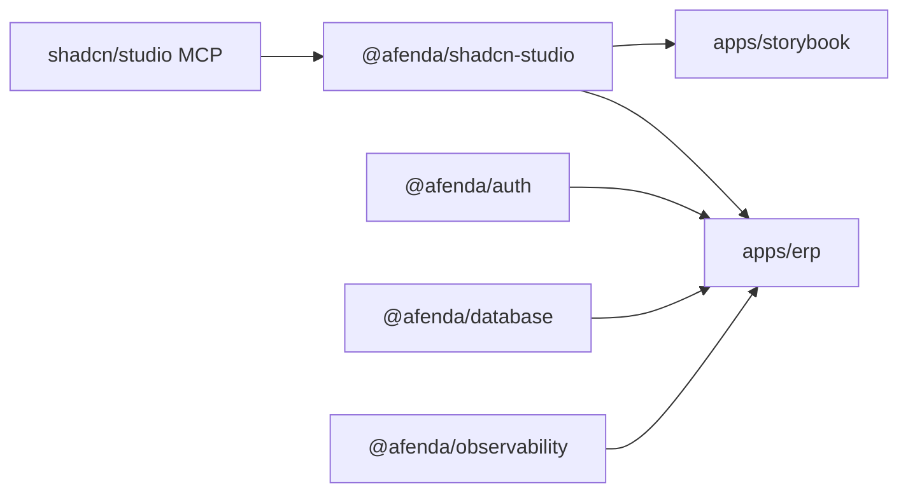

# shadcn-studio Presentation Blueprint

**Authority:** ADR-0027 · PAS-006  
**Fingerprint baseline:** ARCH-BASELINE-2026-06-29-v5

---

## Package graph (presentation slice)



---

## Layer assignments

| Layer | Path | Role |
|-------|------|------|
| Presentation product | `packages/shadcn-studio/` | Blocks, theme, CSS export |
| ERP shell | `apps/erp/src/app/` | Routes, globals.css, error surfaces |
| Storybook lab | `apps/storybook/` | Block verification |
| Retired | `packages/ui`, `appshell`, `metadata-ui`, `css-authority` | **Deleted** — archive-lane only |

---

## CSS composition (ERP)

```txt
apps/erp/src/app/globals.css
  @import "@afenda/shadcn-studio/shadcn-studio.css"
  @import "tailwindcss"
  @import "shadcn/tailwind.css"
```

Dist sync: `packages/shadcn-studio/dist/shadcn-studio.css` ← `src/styles/shadcn-studio.css`

---

## Dependency registry truth

**ERP approved runtime:** `@afenda/auth`, `@afenda/database`, `@afenda/observability`, `@afenda/shadcn-studio`

**Storybook approved runtime:** `@afenda/shadcn-studio`

Source: `packages/architecture-authority/src/data/dependency-registry.data.ts`

---

## Agent entry points

| Task | Skill / doc |
|------|-------------|
| MCP install / blocks | `.cursor/skills/shadcn-studio/SKILL.md` |
| CSS dist sync | `.cursor/skills/package-css-dist-sync/SKILL.md` |
| Registry edits | `@foundation-registry-owner` |

---

## Related

- [North star](../NORTHSTAR/shadcn-studio-presentation-north-star.md)
- [ADR-0027](../adr/ADR-0027-frontend-presentation-reset.md)
