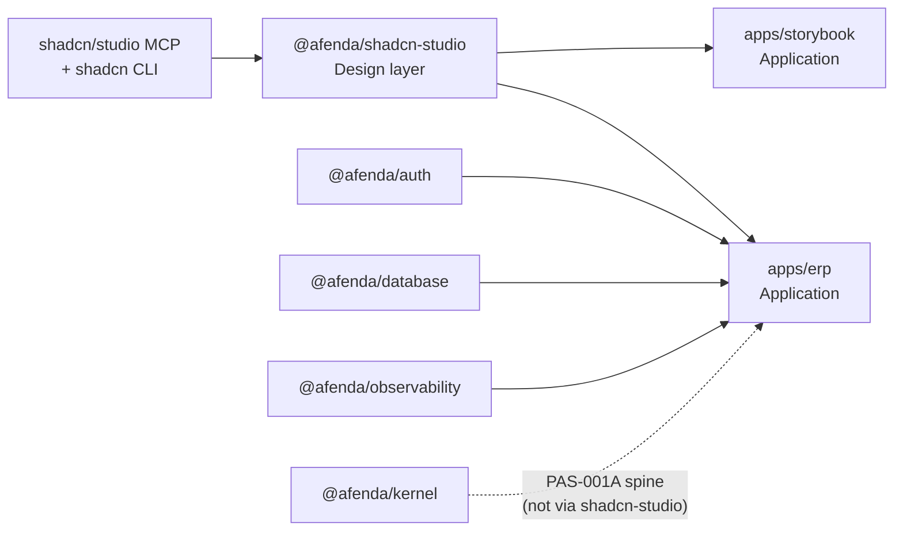

# shadcn/studio Presentation Architecture Blueprint

| Field | Value |
| --- | --- |
| **Document class** | `architecture_blueprint` |
| **Document role** | `domain_architecture_box_map` |
| **Architectural identity** | **Blueprint Box name** (§4) — permanent |
| **Workspace mapping** | [`package-registry.data.ts`](../../packages/architecture-authority/src/data/package-registry.data.ts) — `@afenda/*` npm name |
| **Scope** | shadcn/studio Presentation — ERP frontend visual truth |
| **Parent** | [Platform North Star](../architecture/afenda-platform-north-star.md) · [Presentation North Star](../NORTHSTAR/shadcn-studio-presentation-north-star.md) |
| **Platform rollup** | [Afenda Architecture Blueprint](../architecture/afenda-architecture-blueprint.md) § Design system (ERP frontend) |
| **Constitutional ADR** | [ADR-0027](../adr/ADR-0027-frontend-presentation-reset.md) |
| **MCP vendor ADR** | [ADR-0017](../adr/ADR-0017-shadcn-studio-ui-delivery-acceleration.md) — retained; install target changed |
| **Derived documents** | [PAS-006 family](../PAS/PRESENTATION/README.md) (006 · 006A–006D) · `@afenda/shadcn-studio` |
| **Maturity** | Production Candidate — **not yet Enterprise Accepted** |
| **Runtime stance** | Documentation only — references registries; does not duplicate PKG tables |
| **Total PAS at maturity** | `5` (PAS-006 charter · PAS-006A–006D) |
| **Live PAS today** | `2` (006 charter · 006A product) · `3` proposed (006B–006D) |
| **Planned PAS** | `0` (extensions fold into 006B–006D slices) |
| **Does not confer** | Business meaning, kernel vocabulary, permission evaluation, metadata workspace UI, accounting runtime |
| **Machine registry** | [`foundation-disposition.registry.ts`](../../packages/architecture-authority/src/data/foundation-disposition.registry.ts) · `PKGR05A_SHADCN_STUDIO` |
| **Quality target** | Enterprise **10 / 10** |
| **Evidence standard** | [doc-evidence-standard.md](../../.cursor/skills/kernel-authority/reference/doc-evidence-standard.md) |
| **Last reviewed** | 2026-06-29 |
| **Next document** | [PAS family README](../PAS/PRESENTATION/README.md) · [PAS-006A](../PAS/PRESENTATION/PAS-006A-SHADCN-STUDIO-PRODUCT-STANDARD.md) · [shadcn-studio SKILL](../../.cursor/skills/shadcn-studio/SKILL.md) |

> **One sentence:** One **Design-layer shadcn/studio Presentation** box owns a **five-PAS frontend manufacturing family** — product runtime, relational inventory pipeline, ACPA acceptance, and metadata-driven surfaces — consumed by ERP and Storybook only.

---

# 0. Agent Quick Path

**Read order:** [Presentation North Star §3–§8](../NORTHSTAR/shadcn-studio-presentation-north-star.md) → [ADR-0027](../adr/ADR-0027-frontend-presentation-reset.md) → **this document** → [PAS family README](../PAS/PRESENTATION/README.md) → target PAS §0 → [Slice catalog](../PAS/PRESENTATION/SLICE/presentation-slice-catalog.md) → handoff → Code.

**This document answers:**

- What **Blueprint box** owns the frontend manufacturing system
- How **one box** decomposes into **PAS-006 · 006A–006D** without splitting PKG-026
- Relational inventory layers (§5.3) · production chain (§5.2) · PAS/slice routing (§10)
- Kernel / Knowledge boundaries (§4.2)

**This document never answers:**

- Block implementation detail, theme preset schemas, or gate commands (PAS-006A–006D §13)
- MCP workflow step sequence (`.cursor/rules/shadcn-studio.instructions.mdc` · shadcn-studio SKILL)
- Kernel branded IDs, operating context, or permission vocabulary ([PAS-001](../PAS/KERNEL/PAS-001-KERNEL-VOCABULARY-AUTHORITY-STANDARD.md))
- Enterprise term acceptance or atom promotion ([PAS-004](../PAS/ENTERPRISE-KNOWLEDGE/PAS-004-ENTERPRISE-KNOWLEDGE-STANDARD.md))

**Hard stops:**

- Do not restore `@afenda/ui`, `@afenda/appshell`, `@afenda/metadata-ui`, or `@afenda/css-authority` without a new ADR
- Do not add `@afenda/kernel` runtime imports to `@afenda/shadcn-studio` (`do-not-import-kernel-runtime`)
- Do not run retired gates: `pnpm ui:guard*`, legacy css-authority checks, appshell promotion pipeline
- Do not implement from Blueprint alone — read **target PAS-006A–006D** + slice handoff
- Raw MCP blocks are **Imported** — Acceptance Record required before **Accepted** (NS §3.7 · PAS-006C)
- **Stabilize before customize** (NS §3.4 · PAS-006B)

**Chain rule:** ADR-0027 → Presentation North Star → **Blueprint** → **PAS-006 family** → Slice (`P06-*`) → Code

**Skill routing ([using-afenda-skills](../../.cursor/skills/using-afenda-skills/SKILL.md)):**

| Task | Entry |
| --- | --- |
| MCP install / blocks / theme | [shadcn-studio SKILL](../../.cursor/skills/shadcn-studio/SKILL.md) |
| CSS dist sync | [package-css-dist-sync SKILL](../../.cursor/skills/package-css-dist-sync/SKILL.md) |
| Kernel boundary questions | [kernel-authority SKILL](../../.cursor/skills/kernel-authority/SKILL.md) — presentation is **outside** kernel |
| Registry lane edits | `@foundation-registry-owner` |

---

# 1. Blueprint Purpose

Before authoring or extending presentation work, answer from **this document only**:

1. **What** Blueprint box? → **shadcn/studio Presentation** (§4)
2. **Why separate** from kernel, metadata-ui, appshell, css-authority? → §3.1 · §4 Reasoning · ADR-0027
3. **Which layer**? → Design (§3)
4. **What does the box own / never owns**? → §4.2
5. **Who consumes**? → `apps/erp`, `apps/storybook` (§5)
6. **Which PAS family doc?** → §10 · [PAS README](../PAS/PRESENTATION/README.md)
7. **Registry PKG**? → `PKG-026` → `@afenda/shadcn-studio`

Business **why single presentation owner:** [Presentation North Star §1](../NORTHSTAR/shadcn-studio-presentation-north-star.md) — do not copy here.

---

# 2. Upstream Traceability

| Upstream | Link | This Blueprint uses |
| --- | --- | --- |
| Platform North Star | §4 Design / Application surfaces | Platform scope confirmation |
| Presentation North Star | §4 capabilities · success signals | Box justification |
| ADR-0027 | Frontend presentation reset | Constitutional sole chain |
| ADR-0017 | MCP vendor approval | Install cwd and MCP servers |
| ADR-0026 | Blueprint document class | This document structure |

| Presentation NS capability | Blueprint §4 box | NS §4 / §3 |
| --- | --- | --- |
| Governed frontend production chain | shadcn/studio Presentation | §3.3 |
| Relational presentation inventory | shadcn/studio Presentation | §3.1 |
| Stabilization-first block pipeline | shadcn/studio Presentation | §3.4 · P06-002–004 |
| ACPA surface acceptance | shadcn/studio Presentation | §3.7 · PAS-006C |
| Authorization-adjacent WCAG AA | shadcn/studio Presentation | §3.7 · PAS-006C |
| Theme surface governance | shadcn/studio Presentation | §3.2 · PAS-006A |
| Metadata-driven surface composition | shadcn/studio Presentation | §3.5 · PAS-006D |
| Visual composition chain | shadcn/studio Presentation | §3.2 · PAS-006A |
| Design delivery acceleration | shadcn/studio Presentation | §3.3 · PAS-006A |

---

# 3. Layer Map

| Layer | Blueprint boxes in scope | Role |
| --- | --- | --- |
| **Design** | shadcn/studio Presentation | Visual truth — blocks, theme, CSS export |
| **Application** | `apps/erp`, `apps/storybook` | Delivery — compose presentation; ERP also wires auth/database/observability |
| **Platform** | `@afenda/kernel` (adjacent, not imported) | Vocabulary and wire contracts — consumed by ERP integration spine, **not** by shadcn-studio |

Presentation sits in the **Design** layer. ERP is **Application** and may import Design + Platform packages independently.

**Dependency rule:** `@afenda/shadcn-studio` has **zero** approved runtime package dependencies ([`dependency-registry.data.ts`](../../packages/architecture-authority/src/data/dependency-registry.data.ts)).

---

## 3.1 Architecture Decision Matrix

| Question | If Yes | If No |
| --- | --- | --- |
| Different business capability? | New box | Same box |
| Different lifecycle / maturity gate? | New box | Same box |
| Different ownership team? | New box | Same box |
| Independent deployment unit? | Candidate split | Same box |
| Shared platform vocabulary only? | Platform layer (kernel) | Design layer |
| Visual / rendering surface only? | shadcn/studio Presentation | Not kernel |
| Consumer wiring proof only? | ERP Integration Spine (PAS-001A) | Not presentation box |

**Applied decisions:**

| Decision | Outcome | Reasoning |
| --- | --- | --- |
| Merge ui + appshell + css-authority + metadata-ui? | **No — retired** | ADR-0027 deleted parallel stacks; single MCP-fed owner |
| Split Storybook into its own presentation box? | **No** | Storybook is Application lab; consumes same Design box |
| Import kernel into shadcn-studio? | **No** | Presentation renders; kernel defines cross-package vocabulary ([kernel-authority](../../.cursor/skills/kernel-authority/SKILL.md)) |
| Metadata workspace on deleted metadata-ui? | **No — greenfield on PAS-006D** | Core scalability path (NS §3.5) — not optional future |
| Split PAS-006 into family? | **Yes — 006A–006D** | Single box · multiple PAS — same pattern as PAS-004 family |

---

## 3.2 Canonical Dependency Categories

| Category | Presentation box uses | Example |
| --- | --- | --- |
| **Compile-time** | ERP/Storybook import blocks and CSS from `@afenda/shadcn-studio` | `import { HeroSection01Block } from "@afenda/shadcn-studio"` |
| **Runtime (integration)** | ERP assembles auth + database + observability separately | `@afenda/erp` approved runtime list |
| **Metadata** | Metadata surfaces bind kernel wire at ERP layer — contracts in PAS-006D | PAS-006D · P06-008–P06-009 |
| **Configuration** | Foundation disposition lane + CSS dist policy | `PKGR05A_SHADCN_STUDIO` |
| **Knowledge** | ERP labels cite PAS-004 atoms — presentation does not own meaning | Read-only at app wiring layer |

---

# 4. Blueprint Boxes

### Box → workspace authority chain

```text
Blueprint Box name: shadcn/studio Presentation (this document §4)
        ↓
package-registry.data.ts PKG-026 → @afenda/shadcn-studio
        ↓
foundation-disposition.registry.ts PKGR05A_SHADCN_STUDIO (green-lane)
        ↓
packages/shadcn-studio/ filesystem
```

| Blueprint box | Layer | Registry PKG | Why separate | Source | Reasoning (Because → Therefore) | Status | Governing PAS |
| --- | --- | --- | --- | --- | --- | --- | --- |
| **shadcn/studio Presentation** | Design | `PKG-026` → `@afenda/shadcn-studio` | Sole ERP visual owner + frontend manufacturing family | ADR-0027 · ADR-0017 · Presentation NS | **Because** one PKG must own the manufacturing chain · **Therefore** one box with PAS-006·006A–006D extensions — not five packages | **live** | PAS-006 · 006A–006D |

---

## 4.1 Blueprint Evidence Register

| ID | Source | Tier | Justifies | Link |
| --- | --- | --- | --- | --- |
| B1 | ADR-0027 | T0 | Sole presentation chain · retired packages | [`docs/adr/ADR-0027-frontend-presentation-reset.md`](../adr/ADR-0027-frontend-presentation-reset.md) |
| B2 | ADR-0017 | T0 | MCP vendor approval · install cwd | [`docs/adr/ADR-0017-shadcn-studio-ui-delivery-acceleration.md`](../adr/ADR-0017-shadcn-studio-ui-delivery-acceleration.md) |
| B3 | Presentation North Star | T1 | Capability expectations | [`docs/NORTHSTAR/shadcn-studio-presentation-north-star.md`](../NORTHSTAR/shadcn-studio-presentation-north-star.md) |
| B4 | PKG-026 / layer Design | T4 | Layer assignment | [`package-registry.data.ts`](../../packages/architecture-authority/src/data/package-registry.data.ts) |
| B5 | PKGR05A disposition | T5 | green-lane · gates · prohibited | [`foundation-disposition.registry.ts`](../../packages/architecture-authority/src/data/foundation-disposition.registry.ts) |
| B6 | ERP globals.css | T5 | Three-layer CSS composition | [`apps/erp/src/app/globals.css`](../../apps/erp/src/app/globals.css) |

---

## 4.2 Box Responsibility Matrix

| Blueprint box | Owns (architectural) | Never owns (explicit exclusions) | Trace |
| --- | --- | --- | --- |
| **shadcn/studio Presentation** | MCP install cwd · theme/CSS · primitives · blocks · relational inventory (target) · Acceptance Record doctrine · metadata template path · Storybook lab | Kernel · permission eval · metadata schema · business runtime · legacy UI stacks | Presentation NS §3–§8 · PAS-006 family |

**Kernel boundary (PAS-001 doctrine):**

```text
@afenda/kernel          → cross-package vocabulary (shape)
@afenda/enterprise-knowledge → accepted business meaning
@afenda/shadcn-studio   → rendering surfaces (presentation)
apps/erp                → composes all three at Application layer
```

`PKGR05A_SHADCN_STUDIO` prohibited includes `do-not-import-kernel-runtime` and `do-not-import-legacy-ui-or-appshell`.

---

## 4.3 Change Impact Matrix

| If this box changes… | PAS impacted | Registry PKG | Primary gates / tests | ADR required |
| --- | --- | --- | --- | --- |
| **shadcn/studio Presentation** | PAS-006 · 006A–006D | `PKG-026` | See §10.1 per PAS | ADR-0027 amendment if chain changes |
| **New presentation box** | New PAS + §10 row | New PKG via registry owner | Architecture + disposition gates | Yes |
| **Restore retired UI package** | Retired PAS-005 family | Archive-lane PKG | — | **Yes — mandatory** |

---

# 5. Composition and Consumers



| Blueprint box | Declared consumers | Dependency category (§3.2) | Notes |
| --- | --- | --- | --- |
| **shadcn/studio Presentation** | `apps/erp` · `apps/storybook` | Compile-time | PAS-006 **Consumers** ⊆ this list |
| **ERP Application** | End users | Runtime | Approved runtime: auth, database, observability, shadcn-studio |

**Approved runtime edges** (machine truth — link only):

- `@afenda/erp` → `@afenda/shadcn-studio`
- `@afenda/storybook` → `@afenda/shadcn-studio`
- `@afenda/shadcn-studio` → *(none)*

Source: [`dependency-registry.data.ts`](../../packages/architecture-authority/src/data/dependency-registry.data.ts)

---

## 5.1 Cross-box Composition

**Presentation delivery chain (conceptual):**

```text
shadcn/studio MCP + CLI (vendor)
        ↓ install cwd: packages/shadcn-studio
shadcn/studio Presentation box
        ├── src/components/ui/        (primitives)
        ├── src/components/shadcn-studio/blocks/  (blocks)
        ├── src/theme/                (presets · customizer)
        └── src/styles/shadcn-studio.css → dist/
        ↓ compile-time import
apps/storybook  (block verification lab)
apps/erp        (product shell + routes)
        ↓ parallel (not through shadcn-studio)
ERP Integration Spine (PAS-001A) + kernel vocabulary
```

> **ADR-0027 note:** ERP on `main` is a skeleton. PAS-001A full spine is **partial** (B111 consumer wire only) until protected routes return — see [PAS-001A §1.4](../PAS/KERNEL/PAS-001A-ERP-INTEGRATION-SPINE-STANDARD.md#14-adr-0027-runtime-suspension-2026-06-29). Presentation rebuild (this Blueprint) and spine rebuild (PAS-001A-R1) are **parallel tracks** — presentation does not substitute for integration proof.

| Upstream box | Downstream box | Relationship (conceptual) | Category (§3.2) |
| --- | --- | --- | --- |
| shadcn/studio MCP | shadcn/studio Presentation | feeds install artifacts | Configuration |
| shadcn/studio Presentation | ERP Application | supplies blocks + CSS | Compile-time |
| shadcn/studio Presentation | Storybook Application | supplies blocks for lab stories | Compile-time |
| Kernel Vocabulary | ERP Application | supplies wire context (not presentation) | Compile-time |
| Enterprise knowledge | ERP Application | supplies accepted labels (representations) | Knowledge |

**ERP CSS composition** (PAS-006 three-layer import — order matters):

```txt
apps/erp/src/app/globals.css
  1. @import "@afenda/shadcn-studio/shadcn-studio.css"   ← theme + @custom-variant (unlayered)
  2. @import "tailwindcss"
  3. @import "shadcn/tailwind.css"
```

Dist sync (single policy target):

```txt
packages/shadcn-studio/src/styles/shadcn-studio.css
  → packages/shadcn-studio/dist/shadcn-studio.css
```

Source: [`package-css-dist-policy.mjs`](../../scripts/governance/package-css-dist-policy.mjs) · [`apps/erp/src/app/globals.css`](../../apps/erp/src/app/globals.css)

**MCP install doctrine:**

```text
MCP install (packages/shadcn-studio cwd)
  → @afenda/shadcn-studio/src/blocks|components/ui/
  → import in apps/erp
  → pnpm --filter @afenda/shadcn-studio typecheck
  → pnpm --filter @afenda/erp typecheck && build
```

---

## 5.2 Governed Frontend Production Chain (E2E)

```text
┌─────────────────────────────────────────────────────────────────────────────┐
│ CONSTITUTION                                                                 │
│ ADR-0027 · ADR-0017 · Presentation North Star §3.3–§3.7                     │
└───────────────────────────────────┬─────────────────────────────────────────┘
                                    ▼
┌─────────────────────────────────────────────────────────────────────────────┐
│ DOMAIN BLUEPRINT (this doc) §4 box · §5.2–§5.4 · §10 PAS family               │
│ Platform Blueprint rollup — Design system (ERP frontend)                     │
└───────────────────────────────────┬─────────────────────────────────────────┘
                                    ▼
┌─────────────────────────────────────────────────────────────────────────────┐
│ PAS-006 family                                                               │
│ 006 charter · 006A product · 006B inventory · 006C acceptance · 006D meta   │
│ Slice SSOT: docs/PAS/PRESENTATION/SLICE/presentation-slice-catalog.md       │
└───────────────────────────────────┬─────────────────────────────────────────┘
                                    ▼
┌─────────────────────────────────────────────────────────────────────────────┐
│ IMPLEMENTATION                                                               │
│ packages/shadcn-studio/  ·  apps/storybook/  ·  apps/erp/                   │
│ P06-001 delivered · P06-002–P06-010 queued                                   │
└───────────────────────────────────┬─────────────────────────────────────────┘
                                    ▼
┌─────────────────────────────────────────────────────────────────────────────┐
│ GATE PLANE (slice-gated — not all live today)                                │
│ 006A: typecheck · build · CSS dist sync · boundaries                         │
│ 006B–006D: inventory · ACPA · metadata gates (proposed in PAS §13)          │
└───────────────────────────────────┬─────────────────────────────────────────┘
                                    ▼
┌─────────────────────────────────────────────────────────────────────────────┐
│ CONSUMERS                                                                    │
│ apps/erp (product) · apps/storybook (lab)                                    │
│ Parallel: PAS-001A spine · PAS-004 knowledge · @afenda/auth (not via studio)│
└─────────────────────────────────────────────────────────────────────────────┘
```

**Integration invariants (E2E):**

| # | Invariant | Enforced at |
| --- | --- | --- |
| E1 | No `@afenda/kernel` import in shadcn-studio | PKGR05A prohibited · `quality:boundaries` |
| E2 | CSS consumed from package `dist/` only | `check:package-css-dist-sync` |
| E3 | Raw MCP blocks ≠ production-ready without Acceptance Record | NS §3.7 · PAS-006C (target) |
| E4 | Customize only after Stabilized + Theme-bound | NS §3.4 · PAS-006B (target) |
| E5 | Metadata surfaces bind kernel wire — not embedded in presentation PKG | PAS-006D · ERP context layer |
| E6 | Docs claim only what slices + gates prove | `check:documentation-drift` · P06-010 attestation |

---

## 5.3 Relational Presentation Inventory

North Star §3.1 defines nine relational layers. Blueprint maps each layer to PAS ownership and slice closure:

| Layer (NS §3.1) | Architectural owner | Governing PAS | Slice closure |
| --- | --- | --- | --- |
| Theme Preset | shadcn/studio Presentation | PAS-006A | P06-001 ✓ |
| Primitive | shadcn/studio Presentation | PAS-006A | P06-001 ✓ |
| Variant | shadcn/studio Presentation | PAS-006A | P06-001 ✓ |
| Block | shadcn/studio Presentation | PAS-006A · 006B | P06-001 ✓ · P06-004 |
| Slot | shadcn/studio Presentation | PAS-006B | P06-003 |
| Block Data Contract | shadcn/studio Presentation | PAS-006B | P06-003 |
| Surface Template | shadcn/studio Presentation | PAS-006D | P06-009 |
| Operator Surface | ERP Application + Storybook lab | PAS-006C · 006D | P06-006–P06-009 |
| Acceptance Record | shadcn/studio Presentation (contract) | PAS-006C | P06-005–P06-007 |

**Block lifecycle** (NS §8.1 — registry enforcement target P06-004):

```text
Imported → Normalized → Stabilized → Theme-bound → Metadata-bound
  → Accepted → Production wired → Customized → Deprecated → Retired
```

---

## 5.4 PAS Family Composition Map

One Blueprint box · one PKG-026 · five PAS documents (charter + four derived):

| PAS | Role | Maturity | Agent entry |
| --- | --- | --- | --- |
| **PAS-006** | Constitutional charter · manufacturing doctrine | MVP Authority | NS alignment · scope disputes |
| **PAS-006A** | Product runtime — theme, CSS, MCP, exports | Production Candidate | MCP install · CSS · block exports |
| **PAS-006B** | Relational inventory · lifecycle · slots · contracts | Proposed | Registry · slot map · lifecycle |
| **PAS-006C** | Acceptance Record · ACPA · auth WCAG 2.2 AA | Proposed | Operator-surface acceptance |
| **PAS-006D** | Metadata binding · surface templates | Proposed | Metadata workspace path |

**Documentation sync chain:**

```text
Presentation NS §3–§8 (capabilities + manufacturing model)
        ↓
Domain Blueprint §5.2–§5.4 (this doc)
        ↓
PAS-006 family §0 + §13 gates
        ↓
packages/shadcn-studio/src/ + governance scripts (slice-gated)
        ↓
pnpm check:documentation-drift · disposition · boundaries
```

| Event | Update order |
| --- | --- |
| New NS §4 capability | NS → Blueprint §2 + §10 → PAS amendment → SLICE catalog row |
| Slice delivered | PAS metadata · skill mirror · pas-status-index · Blueprint §10 |
| Enterprise Accepted | P06-010 → disposition promotion via `@foundation-registry-owner` |

---

# 6. Filesystem Map (reference paths)

| Surface | Path | Role |
| --- | --- | --- |
| Public barrel | `packages/shadcn-studio/src/index.ts` | Block exports · theme · registry |
| Primitives | `packages/shadcn-studio/src/components/ui/` | shadcn CLI targets |
| Blocks | `packages/shadcn-studio/src/components/shadcn-studio/blocks/` | MCP-installed blocks |
| Theme | `packages/shadcn-studio/src/theme/theme-presets.ts` | JSON-serializable presets |
| Block registry | `packages/shadcn-studio/src/registry/studio-block-parity.registry.ts` | Parity inventory |
| CSS source | `packages/shadcn-studio/src/styles/shadcn-studio.css` | Authoring surface |
| CSS dist | `packages/shadcn-studio/dist/shadcn-studio.css` | App import target |
| ERP globals | `apps/erp/src/app/globals.css` | Composition entry |
| Storybook stories | `apps/storybook/stories/shadcn-studio-*.stories.tsx` | Block verification |
| MCP config | `.cursor/mcp.json` · `shadcn-studio.config.json` | Agent install paths |
| Agent skill | `.cursor/skills/shadcn-studio/SKILL.md` | Operational workflow |

---

# 7. PAS Creation Gate

PAS-006 family **satisfies** §7 for the live box. Before **any new** presentation box:

1. Box exists in §4 (box name — not PKG alone)
2. §3.1 Architecture Decision Matrix recorded in §4 Reasoning
3. §4.2 Box Responsibility row exists
4. Layer declared (Design)
5. **Why separate** in §4 (matrix outcome)
6. Registry PKG linked or `planned` via `@foundation-registry-owner`
7. Status is `live`, `planned`, or `blocked` (not `retired`)
8. PAS number from [PAS index](../PAS/README.md) · family row in [PRESENTATION README](../PAS/PRESENTATION/README.md)
9. Required ADR exists (§8 if blocked)
10. §4.3 impact row exists when box is new, split, merged, or layer-changed

**In-box PAS extension** (006B–006D pattern): amend existing **shadcn/studio Presentation** box — add PAS doc + SLICE catalog row — **no new PKG** without ADR.

**New Blueprint box** (rare): full §7 gate → ADR → registry owner → new PAS charter.

---

# 8. Blocked and Retired Boxes

| Blueprint box | Registry PKG | Status | Blocker / retire ADR | Required before proceeding |
| --- | --- | --- | --- | --- |
| Governed UI primitives | `@afenda/ui` | **retired** | ADR-0027 | New ADR + Blueprint amendment to recreate |
| ERP shell (legacy) | `@afenda/appshell` | **retired** | ADR-0027 | Same |
| Metadata UI (legacy) | `@afenda/metadata-ui` | **retired** | ADR-0027 | Greenfield on shadcn-studio instead |
| UI composition (legacy) | `@afenda/ui-composition` | **retired** | ADR-0027 | Same |
| CSS authority (legacy) | `@afenda/css-authority` · `PKGR05_CSS_AUTHORITY` | **retired** | ADR-0027 | Theme surface lives in shadcn-studio |
| Design system (legacy) | `@afenda/design-system` · `PKGR05B_DESIGN_RETIREMENT` | **retired** | ADR-0025 · ADR-0027 | Do not recreate package |
| Metadata workspace UI | — | **planned** | PAS-006D · P06-008–P06-009 | Author slice under PAS-006D (core path — NS §3.5) |

Disposition: `archive-lane` for retired PKG rows in [`foundation-disposition.registry.ts`](../../packages/architecture-authority/src/data/foundation-disposition.registry.ts).

---

# 9. Blueprint → PAS Handoff Contract

| §4 field | Pre-fills PAS-006 family |
| --- | --- |
| Blueprint box name | Metadata `Blueprint box` — **shadcn/studio Presentation** |
| Registry PKG | `@afenda/shadcn-studio` · `PKG-026` |
| Layer | Design |
| §4.2 Owns / never owns | PAS-006 §2 distill · 006A–006D §0 boundaries |
| §5.2 E2E chain | PAS §0 agent path · shadcn-studio SKILL |
| §5.3 inventory layers | PAS-006B §4 · SLICE P06-002–P06-004 |
| §5 consumers | Metadata `Consumers`: `apps/erp`, `apps/storybook` |
| §8 retired boxes | Family-wide hard stops (PRESENTATION README) |
| Governing PAS | PAS-006 · 006A–006D (pick by work type — §13) |

**Workflow:** Define (§4) → Plan (target PAS §4 + §12) → Build (SLICE `P06-*` handoff) → Ship (§10 sync)

PAS owns: contract types · gate commands · slice order. Blueprint does not duplicate §13 gates.

---

# 10. PAS Inventory

**Total PAS at maturity: 5** (006 charter · 006A–006D)

| PAS | Title | Blueprint box (§4) | Live / Total slices | Status |
| --- | --- | --- | --- | --- |
| PAS-006 | shadcn-studio Frontend Standard (charter) | shadcn/studio Presentation | — | **Active** · MVP Authority |
| PAS-006A | shadcn-studio Product Standard | shadcn/studio Presentation | 1 / 1 | **Active** · Production Candidate |
| PAS-006B | Inventory & Production Pipeline | shadcn/studio Presentation | 0 / 3 | **Proposed** |
| PAS-006C | Surface Acceptance (ACPA) | shadcn/studio Presentation | 0 / 3 | **Proposed** |
| PAS-006D | Metadata-Driven Surfaces | shadcn/studio Presentation | 0 / 2 | **Proposed** |

Retired: PAS-005 family merged into PAS-006A baseline (P06-001) per ADR-0027.

Family index: [`PRESENTATION/README.md`](../PAS/PRESENTATION/README.md)

---

## 10.1 Slice Catalog (SSOT pointer)

**Authoritative catalog:** [`PRESENTATION/SLICE/presentation-slice-catalog.md`](../PAS/PRESENTATION/SLICE/presentation-slice-catalog.md)

| Slice | PAS | Title | Status |
| --- | --- | --- | --- |
| P06-001 | 006A | Product baseline — theme, CSS, MCP, lab, ERP globals | **Delivered** |
| P06-002 | 006B | Relational inventory registry scaffold | Proposed |
| P06-003 | 006B | Block slot + block data contracts | Proposed |
| P06-004 | 006B | Block lifecycle in registry | Proposed |
| P06-005 | 006C | Acceptance Record wire contract | Proposed |
| P06-006 | 006C | ACPA block acceptance gate suite | Proposed |
| P06-007 | 006C | Auth-adjacent WCAG 2.2 AA pack | Proposed |
| P06-008 | 006D | Metadata binding contract | Proposed |
| P06-009 | 006D | Surface template registry | Proposed |
| P06-010 | 006 family | Enterprise Accepted attestation | Blocked |

**Next sequence item:** **P06-002** — relational inventory scaffold (PAS-006B).

---

# 11. PAS Maturity Rollup (read-only)

| Blueprint box | Registry PKG | PAS | Maturity |
| --- | --- | --- | --- |
| shadcn/studio Presentation | `PKG-026` → `@afenda/shadcn-studio` | PAS-006 (charter) | MVP Authority |
| shadcn/studio Presentation | `PKG-026` | PAS-006A | Production Candidate |
| shadcn/studio Presentation | `PKG-026` | PAS-006B–006D | Proposed |
| shadcn/studio Presentation | `PKG-026` | **Family rollup** | Production Candidate — **not Enterprise Accepted** until P06-010 |

---

# 12. How to Add Presentation Scope

1. Confirm capability in [Presentation North Star](../NORTHSTAR/shadcn-studio-presentation-north-star.md) — or amend NS first
2. Run **§3.1 Architecture Decision Matrix** — default: extend existing box, not new box
3. Pick **PAS by work type** (§13 · [PRESENTATION README](../PAS/PRESENTATION/README.md))
4. Check [slice catalog](../PAS/PRESENTATION/SLICE/presentation-slice-catalog.md) — author handoff before implementation
5. For MCP blocks: [shadcn-studio SKILL](../../.cursor/skills/shadcn-studio/SKILL.md) · cwd `packages/shadcn-studio` · **Stabilize before customize**
6. Add Storybook story before ERP route wiring (NS §3.6 · PAS-006C target)
7. Sync CSS dist after theme/CSS edits: `pnpm sync:package-css-dist -- --package @afenda/shadcn-studio`
8. Run target PAS §0 gates before claiming done
9. New **box** (rare): §7 gate → ADR → `@foundation-registry-owner` → new PAS charter

---

# 13. Agent Execution Rules

## Vibe-coding entry checklist

- [ ] Target box **shadcn/studio Presentation** has §4 row · status **live**
- [ ] §4.2 responsibility understood — no kernel imports in shadcn-studio
- [ ] Correct PAS loaded (006A product · 006B inventory · 006C acceptance · 006D metadata)
- [ ] [shadcn-studio SKILL](../../.cursor/skills/shadcn-studio/SKILL.md) loaded for MCP/UI work
- [ ] [package-css-dist-sync SKILL](../../.cursor/skills/package-css-dist-sync/SKILL.md) when editing `src/styles/`
- [ ] `/afenda-coding-session` Phase 0 from SLICE handoff when slice exists — not invented from Blueprint prose

## PAS picker (work type → PAS)

| Work type | PAS | Slice queue |
| --- | --- | --- |
| Doctrine · NS alignment · scope dispute | PAS-006 | — |
| Theme · CSS · MCP install · block exports | PAS-006A | P06-001 ✓ |
| Registry · slots · lifecycle · block data contracts | PAS-006B | P06-002–P06-004 |
| Acceptance Record · ACPA · auth WCAG AA | PAS-006C | P06-005–P06-007 |
| Metadata binding · surface templates | PAS-006D | P06-008–P06-009 |

## Agent decision matrix

| Question | If yes → |
| --- | --- |
| MCP block install or theme work? | PAS-006A · shadcn-studio SKILL · cwd `packages/shadcn-studio` |
| Block lifecycle / slot / inventory registry? | PAS-006B · P06-002+ handoff |
| Operator-surface acceptance / ACPA? | PAS-006C · P06-005+ handoff |
| Metadata workspace / surface template? | PAS-006D · P06-008+ handoff |
| CSS source edited? | sync dist + `pnpm check:package-css-dist-sync` |
| Kernel ID or OperatingContext in presentation package? | **Stop** — kernel-authority · move to ERP spine or kernel |
| Restore appshell/ui/css-authority? | **Stop** — ADR-0027 · §8 retired |
| Registry lane change? | `@foundation-registry-owner` |
| Business label / term authority? | enterprise-knowledge PAS-004 — not presentation box |
| Wire block to ERP without Acceptance Record? | **Stop** — PAS-006C · NS §3.7 |

## Runtime chain (implement mode)

```text
§4 box live + target PAS §0 + SLICE handoff (when exists)
        ↓
shadcn-studio SKILL (MCP) or direct package edit
        ↓
Storybook verification (when block-level)
        ↓
ERP import + globals.css unchanged unless CSS chain intentional
        ↓
Target PAS §13 gates → disposition check
```

---

# 14. Required Reviews and References

## Before accepting Blueprint amendments

- [ ] §4 box traces to Presentation North Star capabilities
- [ ] §3.1 matrix outcome in §4 Reasoning
- [ ] §4.2 responsibility complete · kernel boundary explicit
- [ ] §5 consumers match `dependency-registry.data.ts`
- [ ] No PKG table duplication — registry links only
- [ ] Retired boxes listed in §8 with ADR citations
- [ ] §10 lists PAS-006 family row for the slice
- [ ] §10.1 slice catalog synced on slice close
- [ ] No gate commands duplicated from PAS-006A–006D §13

## References

| Document | Role |
| --- | --- |
| Presentation North Star | [`shadcn-studio-presentation-north-star.md`](../NORTHSTAR/shadcn-studio-presentation-north-star.md) |
| Constitutional ADR | [`ADR-0027-frontend-presentation-reset.md`](../adr/ADR-0027-frontend-presentation-reset.md) |
| MCP vendor ADR | [`ADR-0017-shadcn-studio-ui-delivery-acceleration.md`](../adr/ADR-0017-shadcn-studio-ui-delivery-acceleration.md) |
| PAS family README | [`PRESENTATION/README.md`](../PAS/PRESENTATION/README.md) |
| PAS-006 (charter) | [`PAS-006-SHADCN-STUDIO-FRONTEND-STANDARD.md`](../PAS/PRESENTATION/PAS-006-SHADCN-STUDIO-FRONTEND-STANDARD.md) |
| PAS-006A (product) | [`PAS-006A-SHADCN-STUDIO-PRODUCT-STANDARD.md`](../PAS/PRESENTATION/PAS-006A-SHADCN-STUDIO-PRODUCT-STANDARD.md) |
| PAS-006B (inventory) | [`PAS-006B-INVENTORY-PRODUCTION-PIPELINE-STANDARD.md`](../PAS/PRESENTATION/PAS-006B-INVENTORY-PRODUCTION-PIPELINE-STANDARD.md) |
| PAS-006C (acceptance) | [`PAS-006C-SURFACE-ACCEPTANCE-ACPA-STANDARD.md`](../PAS/PRESENTATION/PAS-006C-SURFACE-ACCEPTANCE-ACPA-STANDARD.md) |
| PAS-006D (metadata) | [`PAS-006D-METADATA-DRIVEN-SURFACES-STANDARD.md`](../PAS/PRESENTATION/PAS-006D-METADATA-DRIVEN-SURFACES-STANDARD.md) |
| Slice catalog | [`presentation-slice-catalog.md`](../PAS/PRESENTATION/SLICE/presentation-slice-catalog.md) |
| Platform Blueprint rollup | [`afenda-architecture-blueprint.md`](../architecture/afenda-architecture-blueprint.md) |
| Blueprint template | [`.cursor/skills/kernel-authority/reference/blueprint-template.md`](../../.cursor/skills/kernel-authority/reference/blueprint-template.md) |
| shadcn-studio SKILL | [`.cursor/skills/shadcn-studio/SKILL.md`](../../.cursor/skills/shadcn-studio/SKILL.md) |
| kernel-authority SKILL | [`.cursor/skills/kernel-authority/SKILL.md`](../../.cursor/skills/kernel-authority/SKILL.md) |
| package-css-dist-sync SKILL | [`.cursor/skills/package-css-dist-sync/SKILL.md`](../../.cursor/skills/package-css-dist-sync/SKILL.md) |

---

# 15. Final Doctrine

This Blueprint owns **what presentation box exists, why one box decomposes into a five-PAS manufacturing family, how MCP → shadcn-studio → apps composes, what the box owns, and which PAS + slice governs each work type**.

| Identity | Owner | Changes when |
| --- | --- | --- |
| **Blueprint Box name** | This document §4 | Architectural split/merge (ADR + §4.3) |
| **`@afenda/shadcn-studio`** | `package-registry.data.ts` PKG-026 | Rename/scaffold — box unchanged |
| **Lane / disposition** | `foundation-disposition.registry.ts` PKGR05A | `@foundation-registry-owner` |
| **PAS family** | `docs/PAS/PRESENTATION/` | In-box extension — no new PKG without ADR |

Presentation North Star owns **capability expectations and the manufacturing operating model**. PAS-006 family owns **doctrine, contracts, gates, and slice order**. Kernel and Enterprise Knowledge own **shape and meaning** — ERP composes them at the Application layer.

> **May belong here:** §3.1 matrix · §4 boxes + §4.1–§4.3 · §5 + §5.1–§5.4 · §8 retired · §9 handoff · §10 + §10.1 inventory.

> **Belongs in PAS-006 family:** boundary sentences, CSS rules, inventory/acceptance/metadata contracts, §13 gates, slice handoffs.

> **Belongs in shadcn-studio SKILL:** MCP workflows, toolbar commands, pro-block install scripts.
