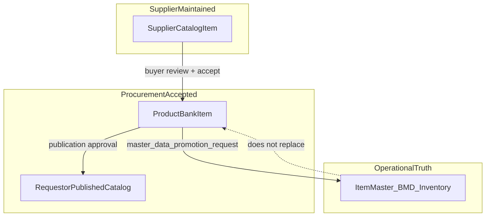
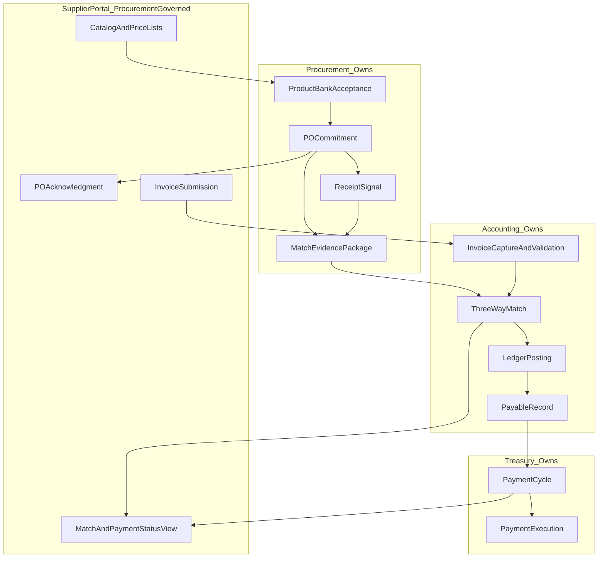

# Procurement Domain North Star

| Field | Value |
| --- | --- |
| **Document class** | `domain_north_star` |
| **Document role** | `domain_root_specification` |
| **Domain** | Procurement — source-to-commitment, supplier accountability, and commercial sourcing intelligence |
| **Domain type** | Line-of-business business domain |
| **Constitutional question** | *How does Afenda govern enterprise spend from demand through policy, commercial sourcing intelligence, supplier catalog acceptance, product bank, sourcing, commitment, receipt, variance, exception, and audit replay — without owning inventory stock, ledger posting, or payment execution?* |
| **Parent** | [Platform North Star](../architecture/afenda-platform-north-star.md) |
| **Foundation consumer** | [ERP Module Runtime North Star](erp-module-runtime-north-star.md) — delivery proof only |
| **Cross-domain laws** | [Platform Constitutional Laws](../CONSTITUTION/platform-constitutional-laws.md) · [Knowledge Constitutional Laws](../CONSTITUTION/knowledge-constitutional-laws.md) — K6 |
| **Derived document** | [Procurement Blueprint](../BLUEPRINT/procurement-blueprint.md) · [OSS benchmark review](../PAS/ERP-MODULES/PROCUREMENT/procurement-oss-benchmark-review.md) · [Gap report](../PAS/ERP-MODULES/PROCUREMENT/procurement-foundation-gap-report.md) |
| **Authority ADR** | [ADR-0020](../adr/ADR-0020-master-data-authority-consolidation.md) · [ADR-0021](../adr/ADR-0021-canonical-enterprise-identity.md) · [ADR-0031](../adr/ADR-0031-procurement-runtime-authority-boundary.md) (runtime authority — Accepted) |
| **Wire anchor** | KV-PROC · [B80](../PAS/KERNEL/SLICE/b80-procurement-domain-vocabulary.md) Delivered (contracts-only) |
| **Runtime path law** | `packages/features/erp-modules/src/procurement/` · consumes kernel wire |
| **Maturity** | **9.5-target** North Star specification — content complete (2026-06-30); acceptance pending Blueprint, PAS-PROC-001, PAS-PROC-001K, and B58 Product Bank atoms (§12.5) |
| **Quality target** | Enterprise **9.5 / 10** document acceptance after evidence gaps in §12.5 closed · operational runtime separately gated |
| **Runtime stance** | Documentation only — wire vocabulary live; business runtime blocked |
| **Does not confer** | Package boundaries, PAS authority, contracts, runtime authority, implementation |
| **Last reviewed** | 2026-06-30 |
| **Next document** | PAS-PROC-001 root authority (planned) · PAS-PROC-001K (Product Bank + Supplier Portal) · [SLICE/README](../PAS/ERP-MODULES/SLICE/README.md) |

> **One sentence:** Afenda Procurement governs how enterprise spend intent becomes auditable supplier commitment — through a supplier-self-managed catalog portal, governed product bank, requisitions, sourcing decisions, supplier selection, purchase orders, contract releases, receipt expectations, exception governance, and supplier accountability — while Inventory owns stock movement, Accounting owns invoice matching and ledger posting, Treasury owns payment execution, and Module Foundation owns runtime readiness proof.

> **Separation:** [Module Foundation NS](erp-module-runtime-north-star.md) owns *how any LoB module enters production*. This document owns *what procurement means* in enterprise language.

> **Source-to-Pay:** Source-to-Pay is a **cross-domain value stream** composed of Procurement, Inventory, Accounting, Treasury, Supplier Master, and Workflow — **not** the Procurement domain identity alone.

## Document layers

```text
LAYER A — Business architecture (§1–§12)     philosophy → breakthrough → pillars → intelligence → commitment → evidence
LAYER B — Implementation bridge (§14)        capability → Blueprint box names only
LAYER C — Governance & acceptance (§13–§19)  EAC · PAS inventory · covenant
```

---

# 0. Agent Quick Path

**Read order:** Platform NS → [Module Foundation NS §1–§12](erp-module-runtime-north-star.md) → this §1–§19 → Blueprint Procurement box → PAS-PROC → Slice → Code.

**Hard stops (business scope):**

- Do not treat wire labels (KV-PROC) as accepted business definitions — LAW K6.
- Do not implement PO posting, GR-IR, or 3-way match before Accounting ADR gates clear cross-domain dependencies.
- Do not build procurement runtime inside `packages/kernel` — kernel owns words only.
- Do not skip module foundation readiness — consume [PAS-001C](../PAS/KERNEL/PAS-001C-ERP-MODULE-FOUNDATION-STANDARD.md) pattern under path law.
- Do not label Procurement as sole **source-to-pay** owner — payment and ledger consequences belong to Treasury and Accounting.
- **Product Bank ≠ Item Master** — supplier-reviewed sourcing truth is not operational enterprise truth; promotion to Item Master is a **handoff emit**, not Procurement ownership ([ADR-0020](../adr/ADR-0020-master-data-authority-consolidation.md)).
- **Supplier data ≠ trusted** — supplier-submitted catalog items are not accepted procurement truth until reviewed and accepted by Afenda Procurement authority (I-CAT-001).
- **Supplier portal displays** financial status — does not own match result or payment execution.
- **Path law dual layer:** registry reserves `packages/procurement` (must not exist); operational scaffold uses `packages/features/erp-modules/src/procurement/` when authorized ([ADR-0031 §6](../adr/ADR-0031-procurement-runtime-authority-boundary.md)).

**Platform routing (2026-06-30):** Accounting Core ledger/posting runtime remains constitutionally blocked. Procurement foundation work under ERP-MODULES does **not** require Accounting Core runtime unblock.

---

# 1. Domain Philosophy

Enterprise procurement fails when requisitions, orders, and supplier records exist as anonymous features — untraceable to authority, meaning, and audit replay. Afenda procurement exists because **spend commitment must be provable before payment and inventory consequences** — independent of how module folders or wire contracts are shaped.

**Procurement is not:** purchasing screens · PO tables · payment execution · inventory stock movement · accounting match · supplier data-entry · module foundation proof.

**Procurement is:** the accepted business authority for turning governed spend intent into auditable supplier commitment — through commercial intelligence, sourcing discipline, and buyer accountability.

| Source | Reasoning |
| --- | --- |
| [T0 ADR-0020](../adr/ADR-0020-master-data-authority-consolidation.md) | **Because** supplier master authority is consolidated · **Therefore** procurement consumes supplier identity — does not fork ID families |
| [T5 B80 KV-PROC](../PAS/KERNEL/SLICE/b80-procurement-domain-vocabulary.md) | **Because** wire vocabulary is delivered contracts-only · **Therefore** business runtime awaits foundation + knowledge promotion |
| [T1 Module Foundation NS §9.4](erp-module-runtime-north-star.md) | **Because** delivery proof is orthogonal · **Therefore** procurement NS never replaces foundation gates |

---

# 2. Domain Identity

## Mission

Permanently govern **source-to-commitment** procurement behavior — supplier-maintained catalog acceptance, product bank intelligence, spend intent classification, sourcing discipline, supplier selection, supplier accountability, order lifecycle, exception governance, and audit-ready spend authorization — consumable by Inventory, Accounting, and Treasury through declared handoffs only.

## Definition

| Field | Definition |
| --- | --- |
| **Scope** | Supplier portal governance · product bank acceptance · spend intent · requisition · sourcing · supplier selection · award · PO · amendment/cancellation · blanket/contract release · receipt expectation · receipt variance signal · procurement exception · supplier performance signal · match evidence emit |
| **Out of scope** | Stock movement (Inventory) · ledger posting (Accounting) · 3-way match execution (Accounting) · payment execution (Treasury) · supplier master authority (BMD) · Item Master authority (BMD/Inventory per ADR-0020) · module foundation delivery (Module Foundation NS) · wire shape amendment (PAS-001B) · generic workflow engine |

## Success

Teams can authorize spend through classified documents with accepted business meaning, supplier master alignment, buyer-reviewed product bank intelligence, and cross-domain hooks declared — replayable under audit without ad-hoc strings or local tenant scope.

---

## 2.0 Breakthrough feature — Supplier Self-Managed Product Catalog Portal + Procurement Product Bank

This is the breakthrough capability that transforms procurement from a document workflow into a **governed commercial intelligence authority**.

| Attribute | Why it matters | Scope | Time to value |
| --- | --- | ---: | ---: |
| **Maverick spend prevention** | Off-contract purchases visible and preventable | Enterprise procurement + buyer cockpit | Short–medium (pilot 3–6 mo) |
| **Auditability** | Acceptance, buying decision, provenance for replay | Procurement evidence chain | Immediate (governance); full with PAS atoms |
| **Operational friction reduction** | Removes buyer-as-data-clerk; suppliers maintain offers | Supplier portal + review workflow | Medium (process + UI) |
| **Cross-domain clarity** | Explicit S2P ownership matrix — no "who owns match/pay?" | Docs + emitted signals | Immediate (docs) → medium (runtime) |

### Breakthrough doctrine

```text
Supplier may submit and maintain.
Procurement must accept and publish.
Requestor may browse.
Buyer must decide.
```

Single governed flow:

```text
Supplier updates → Procurement reviews → Approved catalog published → Requestor browses →
Buyer decides → True cost evaluated → Sourcing award → PO → Receipt signal →
Match evidence [→ Accounting: match/post] [→ Treasury: pay]
```

Procurement is **not** the supplier's data-entry department. Procurement is **acceptance, comparison, decision, and governance authority**.

### Three MUST-HAVE principles

| # | Principle | Rule | NS anchor |
| --- | --- | --- | --- |
| **M1** | **Meaning before PO behavior** | Every PO backed by accepted vocabulary + Product Bank meaning; no wire-label runtime without knowledge promotion | LAW K6 · P1 · I1 |
| **M2** | **Supplier identity is master data** | Consume BMD `SupplierId`; engagement/performance in Procurement; never fork supplier identity | ADR-0020 · P2 · I2 |
| **M3** | **Signals, not consequences** | Emit receipt expectation, variance, match evidence; Inventory moves stock; Accounting posts; Treasury pays | P3 · P7 · I15 · I-S2P-003 |

### Three MVP core features

| Feature | Purpose | Minimal acceptance criteria |
| --- | --- | --- |
| **1. Product Bank + publication lifecycle** | Buyer-reviewed items; requestor visibility control | Draft → Approved → Published states; audit trail (reviewer, timestamp, reason); Item Master promotion blocked until BMD acceptance (I-CAT-005) |
| **2. Supplier catalog submission + price list governance** | Suppliers maintain offers; validity enforced | Supplier upload; parsed price lists; validity window; expiry blocks new commitments (I-CAT-003/004) |
| **3. Buying decision record + award reasoning** | Justified supplier selection every time | Structured record: sourcing method, award evidence, approver OR exception owner/expiry; replayable (I-CAT-008) |

---

## 2.1 Two-tier pillar model (North Star scope)

Procurement governs **two tiers**: commercial sourcing intelligence (before commitment) and commitment/handoff (execution through audit).

### Tier A — Commercial Sourcing Intelligence (8 pillars)

| # | Pillar | Governs |
| --- | --- | --- |
| **A0** | **Supplier S2P portal (Procurement-led surface with cross-domain feeds)** | catalog · price lists · certs · PO acknowledgment · ASN · invoice submit channel · match/payment status visibility (read-only Accounting/Treasury feeds) |
| A1 | **Procurement Product Bank** | buyer-reviewed sourcing truth · preferred/blocked · publication to requestors · master-data promotion request |
| A2 | **Technical sourcing catalog** | specs · samples · substitutes · certificates · shelf life · cargo safety |
| A3 | **Supplier offer and price list governance** | validity · versioning · expiry · currency · incoterms · payment terms |
| A4 | **True cost / landed cost evaluation** | freight · duty · shrinkage allowance · handling · landed unit cost |
| A5 | **Cargo safety and logistics risk** | cold chain · hazmat · fragile · route risk · import documents |
| A6 | **Warehouse, storage, and shrinkage fit** | storage type · yield · FEFO · write-off profile — **signals only** |
| A7 | **Retail / manufacturing / channel fit** | retail-ready · MFG input · regulatory fit · channel suitability |

**Merged doctrine (A0 + A1):** *Supplier-Self-Managed Product Catalog and Procurement Product Bank* — portal extends through commitment visibility and invoice submission; financial execution stays Accounting/Treasury.

**Portal ownership boundary:**

```text
Supplier Portal is a shared supplier-facing surface with Procurement as primary governance owner.

Procurement governs:  catalog submission · price lists · certificates · PO acknowledgment · ASN · supplier offer intelligence
Accounting governs:   invoice acceptance · match result · exception reason codes
Treasury governs:     payment execution · scheduled dates · remittance advice

Supplier Portal displays Accounting/Treasury state through read-only feeds only.
Supplier Portal does NOT own Accounting match truth, Treasury payment truth, or Inventory stock truth.
```

**Portal architecture:**

```text
Supplier Portal (Procurement-led surface — cross-domain feeds from Accounting / Treasury)
├── Supplier profile and compliance docs
├── Product catalog / price list / certificates       [A0 catalog]
├── PO inbox and acknowledgment                       [B8 visibility]
├── Shipment / ASN / delivery documents               [B9 signal]
├── Invoice submission and dispute response           [→ Accounting]
└── Match status + payment status (read-only feeds)  [← Accounting / Treasury]

Procurement Product Bank (internal)
├── Buyer review queue · technical / QA / warehouse review
├── True cost evaluation · comparison · preferred/blocked
├── Publication to requestors · master-data promotion request
└── Supplier accountability (catalog freshness · PO ack SLA · invoice quality)
```

### Tier B — Commitment and Handoff (12 pillars)

| # | Pillar | Governs |
| --- | --- | --- |
| B1 | **Spend demand governance** | demand signal · spend intent · planned/unplanned/emergency · context association |
| B2 | **Requisition governance** | purchase requisition · requester · line classification · approval · conversion |
| B3 | **Policy and approval authority** | who may request · approve · source · award · amend · cancel · except |
| B4 | **Category and spend classification** | direct/indirect · service · capex · MRO · project · import · recurring |
| B5 | **Supplier engagement and qualification** | qualification · preferred supplier · panel · suspension · performance |
| B6 | **Sourcing and award governance** | RFQ/RFP · direct award · emergency sourcing · award reasoning |
| B7 | **Contract / blanket / release governance** | blanket · contract release · price validity · off-contract spend |
| B8 | **Purchase order commitment governance** | PO approval · sent · acknowledgement · amendment · cancellation |
| B9 | **Receipt expectation and variance handoff** | receipt expectation · variance signal · quality rejection handoff |
| B10 | **Invoice match evidence handoff** | PO · receipt · variance · exception evidence for Accounting |
| B11 | **Procurement exception governance** | controlled bypass with owner · reason · expiry · downstream impact |
| B12 | **Audit, performance, and accountability** | replay minimum · supplier performance · maverick spend visibility |

**Full value stream (cross-domain):**

```text
Demand → Supplier offer (portal) → Product Bank acceptance → Requestor browse →
Buyer decision → True cost / risk → Sourcing award → PO → Receipt signal →
Match evidence → [Accounting: match/post] → [Treasury: pay]
```

---

## 2.2 Procurement operating model

| Role | Responsibility |
| --- | --- |
| **Supplier** | Maintains catalog, price lists, certs, MOQ, lead time in portal; views PO and payment status |
| **Requester** | Creates spend intent and requisition; browses approved catalog |
| **Approver** | Holds authority to approve spend |
| **Buyer / procurement officer** | Reviews/accepts supplier catalog; converts approved demand into sourcing or PO; buying decisions |
| **Category owner** | Governs spend category strategy and sourcing thresholds |
| **Supplier owner** | Owns supplier relationship and performance accountability |
| **Technical / QA / Warehouse** | Reviews product specifications, storage, cargo safety — feeds into Product Bank approval |
| **Receiving actor** | Confirms supplier fulfillment — may operate in warehouse/Inventory workflow; Procurement consumes confirmation as fulfillment evidence but never owns stock movement |
| **AP / Accounting consumer** | Consumes PO/receipt evidence for match — does not own commitment |
| **Procurement governance owner** | Owns policy, exceptions, and audit replay completeness |

> **Doctrine:** Procurement coordinates requesters, approvers, buyers, suppliers, technical reviewers, and downstream finance consumers around governed spend commitment — and governed product intelligence before commitment.

---

## 2.3 Spend taxonomy (Afenda multi-LoB)

| Spend class | Afenda examples |
| --- | --- |
| **Direct material** | seeds · substrate · raw material · packaging · feed raw material |
| **Indirect material** | office supplies · consumables · cleaning |
| **Service procurement** | logistics · maintenance · consulting · installation |
| **Capex procurement** | machinery · farm equipment · automation · fit-out |
| **MRO** | maintenance · repair · operations parts |
| **Project procurement** | project-specific purchases |
| **Contracted recurring spend** | utilities · rental · outsourced services |
| **Emergency procurement** | urgent purchase under exception |
| **Intercompany procurement** | internal group purchase / transfer |
| **Import procurement** | international supplier · shipping · documents · landed-cost handoff |

---

## 2.4 Industry pattern comparison — directional reference only

Enterprise source-to-pay suites span **Source & Contract · Plan · Buy & Deliver · Invoice & Pay** as a cross-domain value stream. Afenda adopts **enterprise procurement authority patterns** with explicit domain boundaries.

> **Scoring caveat:** Scores in the table below are **architecture-fit assessments for Afenda doctrine**, not product-market capability rankings. They measure how well each platform's patterns align with Afenda's boundary and meaning-first principles — not commercial feature breadth, market share, or implementation maturity.

### 2.4.1 Major ERP platform patterns

**Afenda pattern-fit matrix (governance and doctrine axes only):**

| Dimension | Afenda NS | SAP Ariba | Oracle Fusion | Coupa | Gap / Strength |
| --- | ---: | ---: | ---: | ---: | --- |
| **Constitutional clarity (who owns what)** | **9.5** | 6 | 7 | 7 | **Strength** — §9.5, P3/P6/P7, I15 |
| **Meaning before behavior (K6, PAS-004)** | **10** | 5 | 5 | 5 | **Unique** — giants ship features first |
| **Spend taxonomy & category strategy** | **8** | 9 | 9 | 9 | Good LoB examples; category runtime missing |
| **Product Bank / supplier catalog** | **5 (with doc pass)** | 9 | 8 | 8 | **This breakthrough closes doctrine gap** |
| **Supplier S2P portal** | **4 (planned)** | 9 | 8 | 9 | NS §3.9 documented; runtime deferred |
| **Requestor self-service / catalog deflection** | **4 (planned)** | 8 | 7 | 9 | Coupa strongest here |
| **3-way match & AP** | **7** (evidence handoff) | 9 | 9 | 8 | **Correct boundary**, zero runtime |
| **Supplier network scale** | **0** | 10 | 6 | 8 | Ariba moat — Afenda does not compete |
| **AI / automation** | **1** | 8 | **9** | **9** | Oracle/Coupa invest heavily |
| **Implementation maturity** | **2** | 10 | 10 | 10 | NS 9.5; runtime 2/10 — §2.6 honest |

**Where Afenda excels vs. giants:** Domain boundary clarity · meaning governance · multi-LoB taxonomy · audit replay discipline · Product Bank / supplier governance separation.

**Where Afenda lags:** Runtime surface · supplier network · requestor UX · AI matching · payment cycle.

### 2.4.2 SAP Ariba

**Exists to:** Give SAP estates a spend-management layer with Ariba Business Network + deep S/4HANA integration.

**Adopt:** supplier lifecycle stages · category management · sourcing event → award → PO traceability · intake management (maverick front-door fix).  
**Do not copy:** Global network as requirement · SAP-only identity model · monolithic implementation.

### 2.4.3 Oracle Fusion Cloud Procurement

**Exists to:** Anchor procurement inside Oracle Cloud ERP with one unified data model + AI-assisted operations.

**Adopt:** Explicit S2P ownership matrix · contract price validity enforcement · supplier risk taxonomy · AI exception routing (Accounting owns outcome).  
**Do not copy:** Fusion UX as PAS-006 target · Oracle-only master data model.

### 2.4.4 Coupa (Business Spend Management)

**Exists to:** ERP-agnostic BSM platform — modern UX, requestor catalog, supplier portal, expense + treasury coverage; wins on adoption.

**Adopt:** Requestor catalog self-service · supplier portal PO/invoice/status · buying decision record + approval chains · "fix the front door" intake philosophy.  
**Do not copy:** Per-seat SaaS economics · expense/treasury in Procurement NS · $8B feature sprawl.

### 2.4.5 OSS platform learnings (GitHub and modular ERP)

Full 12-dimension matrix, per-source analysis, and build leverage stack: [procurement-oss-benchmark-review.md](../PAS/ERP-MODULES/PROCUREMENT/procurement-oss-benchmark-review.md).

| Project | Key idea for Afenda | Borrow at build (stage) | Do not copy |
| --- | --- | --- | --- |
| [**BetterSpend**](https://github.com/AsyncronousVentures/betterspend) | Budget gate before PO; approval engine; line-level match tolerance; tokenized vendor portal; immutable audit | P1 policy · P3 tolerance spec (Accounting-owned) · Stage 6 invoice channel | Monolithic P2P app |
| [**open-mercato**](https://github.com/open-mercato/open-mercato/issues/390) | FK-only cross-module links; `ThreeWayMatch` entity; ASN + variance events | P1 PAS-PROC-001I · Stage 5 ASN | Match inside procurement module |
| [**frappe/erpnext**](https://github.com/frappe/erpnext) | Supplier portal RFQ quotes; side-by-side comparison; MR → RFQ → PO | P0 B6 UI · P1 B1→B2 · Stage 3 portal RFQ pattern | Item Master = supplier offer |
| [**odoo/odoo**](https://github.com/odoo/odoo) | Purchase tenders; blanket orders; replenishment rules; bill control vs PO/receipt | P1 B4/B7 · B6 tender UX | Thin native portal as full S2P |
| [**openprocurement**](https://github.com/openprocurement/openprocurement.api) | Immutable tender timeline; open award evidence | P0 I-BUY-001 · B6 public-sector path | Internal ERP P2P runtime |
| [**nexus-procurement**](https://github.com/azaharizaman/nexus-procurement) | Modular package boundaries (Payable/Inventory/Finance deps) | P1 PAS-PROC-001I naming | `performThreeWayMatch` in procurement |
| [**procuman-community-edition**](https://github.com/procuman/procuman-community-edition) | Supplier catalog + pricing in CE | Validates A0/A1 direction | CRM bolt-on monolith |
| [**Shillinq**](https://github.com/ConductionNL/shillinq) | "Control spend before purchase, match after" | P1 policy slogan only | Proc + accounting + pay in one app |

**OSS ideas adopted conceptually:** Budget-gate before PO · line-level match tolerance (Accounting document) · supplier portal invoice **channel** · side-by-side quote comparison · immutable audit event log · modular cross-domain FK/event boundaries · staged portal (internal Product Bank first).

**OSS traps avoided:** Monolithic Procurement + Accounting + Inventory · Item Master = supplier catalog · supplier portal before auth ADR · local match/payment state in Procurement.

### 2.4.6 Industry rating matrix — Afenda position

| Category | Current position (doc) | Target with Product Bank (runtime) | Enterprise benchmark |
| --- | ---: | ---: | ---: |
| **Governance / doctrine** | 9.5 (doc candidate) | 9.5 (accepted) | 7–8 |
| **Commercial intelligence (Product Bank)** | 2 | 7 | 8–9 |
| **Supplier accountability (portal)** | 1 | 6 | 8–9 |
| **Requestor self-service** | 1 | 6 | 8–9 |
| **Commitment chain (PO → receipt)** | 6 (doctrine) | 6 | 9 |
| **S2P cross-domain clarity** | 8 | 9 | 6–7 |
| **Operational runtime** | 2 | 2 | 10 |

### 2.4.7 Where Afenda wins (keep at build time)

Do not compromise these when borrowing OSS UX or giant features:

| # | Win | NS / Blueprint anchor |
| --- | --- | --- |
| W1 | S2P ownership matrix — evidence emit only | §3.9 · I-S2P · I-PORTAL-001 |
| W2 | Three-layer product truth | §2.8 · I-CAT-005/009 |
| W3 | Meaning before behavior (K6) | M1 · B58 gate |
| W4 | Buying decision + alternatives | §3.7 · I-BUY-001 |
| W5 | Supplier maintains → Procurement accepts → Requestor browses → Buyer decides | §2.0 covenant |
| W6 | Portal surface, not match/payment truth owner | Blueprint §5.1 |
| W7 | Staged MVP — internal Product Bank before supplier login | Blueprint §9–§10 |
| W8 | 20-box PAS handoff + PROC-BP slices | Blueprint §8 · §11 |

Full W1–W10 table: [OSS benchmark review §3](../PAS/ERP-MODULES/PROCUREMENT/procurement-oss-benchmark-review.md#3-where-afenda-wins-keep--do-not-compromise-at-build-time).

### 2.4.8 Build leverage stack (borrow order)

| Priority | Pattern | Source | Afenda home | Stage |
| --- | --- | --- | --- | --- |
| **P0** | Price validity + buyer review lifecycle | BetterSpend · NS I-CAT | A1/A3 · PROC-BP-002/003 | 1 |
| **P0** | Buying decision + alternatives | OpenProcurement · I-BUY-001 | B6 · PROC-BP-005 | 1 |
| **P0** | Promotion emit (not Item Master create) | ADR-0020 | A1 · PROC-BP-006 | 1 |
| **P1** | Budget gate before PO | BetterSpend | B3 + Accounting consumer | 1–2 |
| **P1** | Quote comparison UI | ERPNext | B6 | 1–2 |
| **P1** | FK/event cross-domain handoff | open-mercato | PAS-PROC-001I | Before portal depth |
| **P2** | Requestor catalog | Coupa pattern | Stage 2 · PROC-BP-004 | 2 |
| **P2** | Supplier catalog portal | ERPNext portal + A0 doctrine | Stage 3 · PROC-BP-007 ADR | 3+ |
| **P3** | Invoice channel + match tolerance | BetterSpend | Accounting-owned · Stage 6 | 6+ |
| **P3** | Match/payment status feeds | Coupa/Odoo display pattern | I-PORTAL-001 · Stage 7 | 7 |

Full P0–P4 table: [OSS benchmark review §4](../PAS/ERP-MODULES/PROCUREMENT/procurement-oss-benchmark-review.md#4-what-to-borrow-prioritized-build-leverage-stack).

### 2.4.9 Twelve-dimension snapshot (summary)

| Dimension | Afenda doc | Afenda runtime | OSS avg | Afenda lead? |
| --- | ---: | ---: | ---: | --- |
| 3-way match **boundary** | **9** | 0 | ~4 | **Yes** — doctrine |
| Cross-domain modularity | **9** | 7 | ~5 | **Yes** |
| Audit trail design | **8** | 3 | ~6 | **Yes** |
| Supplier catalog (spec) | **6** | 0 | ~4 | Doc ahead |
| Implementation maturity | 5 | **2** | ~5.5 | **No** — build Stage 1 |

Full matrix: [OSS benchmark review §2](../PAS/ERP-MODULES/PROCUREMENT/procurement-oss-benchmark-review.md#2-twelve-dimension-comparison-matrix).

---

## 2.5 Pain points and Afenda response

| Enterprise pain | Why it hurts | Afenda response (this NS) |
| --- | --- | --- |
| **Buyer as supplier data clerk** | Buyer manually keys PDF/WhatsApp/email data | Supplier portal (A0) — supplier maintains; buyer accepts |
| **Stale price lists** | Price validity unknown; expired prices used | I-CAT-003/004 — validity window required; expiry blocks commitments |
| **Supplier never updates specs** | Buyer chases cert/spec updates manually | Supplier portal change audit (I-CAT-007) + cert expiry tracking |
| **Requestor asks buyer repeatedly** | "Do we have this? Who supplies? What price?" | Requestor catalog self-service (§3.6.3) after publication |
| **Maverick / off-contract spend** | Policy bypass invisible until audit failure | Policy authority · exception model · maverick visibility (§6) |
| **Wire label ≠ business meaning** | PO tables ship before meaning accepted | LAW K6 · PAS-004 atoms · meaning before behavior (M1) |
| **Anonymous PO factory** | No demand or award reasoning | Spend intent layer · buying decision record (§3.7) · audit replay |
| **Supplier master fork** | Duplicate SupplierId semantics | ADR-0020 · consume BMD (M2) |
| **Receipt conflated with stock** | Inventory boundary violated | Receipt **signal** and **expectation** — Inventory owns movement (M3) |
| **Silent Accounting coupling** | Ledger logic in procurement module | Invoice match **evidence handoff** only (B10 · I4) |
| **"Who owns match / payment?"** | Teams argue ownership in incidents | §3.9 S2P ownership matrix — explicit and invariant |
| **No audit replay** | Cannot explain who approved what and why | §3.5 · §12 · B12 |
| **Runtime before foundation** | Integration debt | Module Foundation NS · honest readiness (M1) |

---

## 2.6 Availability matrix (2026-06-30 — honest)

| Layer | Available now | North Star requires | Gap |
| --- | --- | --- | --- |
| **This NS document** | Two-tier pillars · Product Bank doctrine · S2P matrix · supplier portal | Full 9.5 content | PAS-PROC-001K · PAS-PROC family |
| **Kernel wire (KV-PROC)** | B80 contracts-only · document types · sourcing methods · permissions · audit words | Wire vocabulary consumption | None for foundation phase |
| **Enterprise Knowledge** | 47 atoms · B53–B57 core procurement terms accepted | Full §3 vocabulary promoted | P2 atoms · B58 Product Bank atoms (planned) |
| **Module Foundation** | `PROCUREMENT_FOUNDATION_BUNDLE` attested · gates green | Readiness proof pattern | Operational integration consumers |
| **Runtime (`features/procurement`)** | **Absent** (ADR-0031 · blocked) | PAS-PROC + slices | ERP-MODULES slice handoffs |
| **Product Bank** | **Not available** · NS required | §3.6 doctrine | PAS-PROC-001K |
| **Supplier portal (catalog)** | **Not available** · NS required | §3.6 + A0 | PAS-PROC-001K + supplier ADR |
| **Supplier portal (invoice/status)** | **Not available** · NS required | §3.9 | Accounting/Treasury feeds |
| **Requestor catalog** | **Not available** · NS required | §3.6.3 | PAS-PROC-001K |
| **PAS-PROC family** | **Not authored** | §15 inventory | PAS-PROC-001 root |
| **Blueprint Procurement box** | **Created** (2026-06-30) | §14 traceability | [procurement-blueprint.md](../BLUEPRINT/procurement-blueprint.md) |
| **OSS / industry benchmark review** | **Created** (2026-06-30) | §2.4 · build leverage | [procurement-oss-benchmark-review.md](../PAS/ERP-MODULES/PROCUREMENT/procurement-oss-benchmark-review.md) |
| **Accounting / Inventory handoff runtime** | **ADR-gated / deferred** | §9.5 evidence emission | Cross-domain PAS slices |

---

## 2.7 Buyer decision cockpit

| Buyer question | Afenda capability | Status |
| --- | --- | --- |
| "Does an approved product exist for this category?" | Requestor / buyer catalog browse (§3.6.3) | Planned |
| "Who supplies this and at what price?" | Product Bank item · supplier price list (§3.6.1) | Planned |
| "What is the true landed cost?" | Landed cost evaluation (A4) | Planned |
| "Is this supplier qualified and preferred?" | Supplier engagement status (B5 · §3.3) | Doctrine only |
| "What is the MOQ and lead time?" | Supplier-maintained catalog data (A0 · §3.6.1) | Planned |
| "Is this price still valid?" | Price validity (A3 · I-CAT-003) | Planned |
| "Why was this supplier selected last time?" | Buying decision record (§3.7 · I-CAT-008) | Planned |
| "Can this product be substituted?" | Product substitute map (A2) | Planned |
| "Is this product approved for requestors?" | Publication lifecycle (§3.8) | Planned |

---

## 2.8 Three-layer product truth (boundary)



| Layer | Truth class | Owner |
| --- | --- | --- |
| **Supplier Catalog Item** | Supplier-offered truth (untrusted until reviewed) | Supplier submits · Procurement governs acceptance |
| **Product Bank Item** | Buyer-reviewed sourcing truth | Procurement |
| **Item Master** | Operational enterprise truth | BMD / Inventory per [ADR-0020](../adr/ADR-0020-master-data-authority-consolidation.md) |

**Hard stop:** Product Bank must not become a parallel Item Master, retail catalog, or BOM. Promotion is an **emit** (handoff), not Procurement ownership.

---

## 2.9 Actor separation matrix

| Actor | Can do | Cannot do |
| --- | --- | --- |
| **Supplier** | Catalog/price/certs; view PO; acknowledge PO; submit ASN; submit invoice; view match/payment status | Self-approve catalog; force publication; create Item Master; create PO; clear match exceptions; trigger payment |
| **Buyer / Procurement** | Review, classify, approve, reject, publish, compare, negotiate, preferred/blocked | Blindly trust supplier data; run 3-way match; post to ledger |
| **Technical / QA / Warehouse** | Approve spec, storage, cargo, quality fit | Own procurement commitment |
| **Requestor** | Browse approved catalog, request listed item, request new item | Bypass policy |
| **Master Data** | Promote to Item Master (on request) | Own supplier-offer intelligence |
| **Accounting** | 3-way match, posting, payable | Own PO commitment or supplier catalog |
| **Treasury** | Payment execution | Own match or procurement |
| **System** | Expiry, change audit, duplicate detection | Make sourcing judgment without authority |

---

# 3. Enterprise Vocabulary

| Term | Business meaning | Not confused with | Source | Knowledge status |
| --- | --- | --- | --- | --- |
| **Spend intent** | Root business object before requisition | Expense report line | NS P2 · PAS-PROC-001A | planned |
| **Purchase requisition** | Internal request to buy before supplier commitment | Expense report | B80 · PAS-PROC-001B | **accepted** · `procurement_requisition` |
| **Procurement policy** | Who may request, approve, source, send — declared rules | UI validation | PAS-PROC-001G | planned |
| **Approval authority** | Separates request from spend authority | Generic workflow | PAS-PROC-001G | planned |
| **Sourcing method** | Catalog, RFQ, auction, or direct path to commitment | RFQ document alone | B80 `SOURCING_METHODS` | **accepted** · `procurement_sourcing` |
| **Supplier selection** | Why a supplier was chosen for a sourcing path | Supplier master record | PAS-PROC-001C | planned |
| **Award decision** | Sourcing outcome before PO commitment | PO | PAS-PROC-001C | planned |
| **RFQ** | Request for supplier quotation | PO | B80 wire | **accepted** · `procurement_rfq` |
| **Supplier quote** | Supplier priced response to sourcing invitation | PO | B80 supplierQuote | **accepted** · `supplier_quote` |
| **Purchase order** | External commitment to supplier with terms and lines | Sales order | B80 wire | **accepted** · `purchase_order` |
| **PO amendment** | Governed change to committed supplier, qty, price, or delivery | New PO | PAS-PROC-001D | planned |
| **Supplier** | Trading partner in procurement context — consumes BMD | Customer | ADR-0020 · PAS-001 | **accepted** · `supplier` |
| **Blanket agreement** | Framework terms enabling release POs | Legal contract repo | B80 wire | **accepted** · `blanket_agreement` |
| **Receipt expectation** | What Inventory should expect to receive | Stock on hand | PAS-PROC-001F | planned |
| **Goods receipt signal** | Procurement confirms supplier fulfillment occurred | Inventory stock movement | Cross-domain KV-INV | **missing** · atom pending |
| **Procurement exception** | Policy-approved bypass with owner, reason, expiry | Ad-hoc override | PAS-PROC-001G | planned |
| **Supplier performance signal** | Delivery, quality, fulfillment accountability | Supplier master | PAS-PROC-001H | planned |
| **Three-way match** | PO · receipt · invoice alignment | Payment | Accounting cross-domain | **missing** · ADR-gated |
| **Procurement Product Bank** | Buyer-reviewed sourcing truth for products · preferred/blocked | Item Master | §3.6 · PAS-PROC-001K | **planned** |
| **Supplier Catalog Item** | Supplier-offered product offer — untrusted until accepted | Procurement Product Bank | §2.8 · I-CAT-001 | **planned** |
| **Buying decision record** | Why a supplier/product/price was selected for a commitment | PO itself | §3.7 · I-CAT-008 | **planned** |
| **Supplier price list** | Supplier commercial offer with validity window | Contracted price | §3.6.1 · I-CAT-003 | **planned** |
| **Landed cost evaluation** | True total cost including freight, duty, shrinkage | Sticker price / unit price | A4 | **planned** |
| **Catalog publication** | State change making Product Bank items requestor-browsable | Supplier submission | §3.8 | **planned** |
| **Requestor sourcing catalog** | Procurement-approved product catalog published for requestor browse | Internal SKU catalog | §3.6.3 | **planned** |

**Promotion backlog:** [PAS-004-module-foundation-promotion-backlog.md](../PAS/ERP-MODULES/PAS-004-module-foundation-promotion-backlog.md) · **47 atoms** promoted (B53–B57) as of 2026-06-30. B58 Product Bank atoms: **planned** — pending PAS-PROC-001K acceptance.

## 3.1 Demand and spend intent vocabulary

| Term | Meaning | Knowledge status |
| --- | --- | --- |
| **Demand signal** | Business need before requisition | planned |
| **Spend intent** | Decision that business may need to spend | planned |
| **Planned spend** | Expected via budget · project · contract · production plan | planned |
| **Unplanned spend** | Outside planned demand | planned |
| **Emergency spend** | Urgent spend requiring exception | planned |
| **Policy-backed demand** | Demand allowed by procurement policy | planned |

## 3.2 Sourcing method vocabulary

| Method | Meaning |
| --- | --- |
| **Competitive RFQ** | Multiple suppliers quote |
| **RFP / tender** | Formal proposal process |
| **Direct award** | Selected supplier without competition |
| **Contract release** | Buy under existing agreement |
| **Emergency sourcing** | Urgent procurement exception path |
| **Preferred supplier sourcing** | Approved panel / preferred supplier |
| **Spot buy** | One-off purchase |
| **Strategic sourcing** | Category-level sourcing exercise |
| **Catalog buy** | Purchase from published requestor catalog |

## 3.3 Supplier engagement vocabulary

| Term | Meaning | Owner |
| --- | --- | --- |
| **Supplier master identity** | SupplierId · supplier_no | BMD · PAS-001 |
| **Supplier engagement status** | Identified → Invited → Qualified → Approved → Active → Preferred → Suspended → Disqualified | Procurement meaning |
| **Preferred supplier** | Recommended for category | Procurement + category |
| **Supplier panel** | Approved suppliers for category | Procurement |
| **Supplier qualification** | Compliance/onboarding gate | Procurement consumes BMD |
| **Supplier performance signal** | Delivery · quality · fulfillment accountability | Procurement emits |
| **Supplier accountability score** | Composite from catalog freshness + PO ack SLA + invoice quality | Procurement |

## 3.4 Procurement exception vocabulary

| Exception type | Meaning |
| --- | --- |
| **No RFQ exception** | Competitive sourcing waived |
| **Emergency purchase exception** | Urgent purchase |
| **Unapproved supplier exception** | Supplier not fully qualified |
| **Budget exception** | Spend outside budget/context |
| **Price variance exception** | Price higher than expected |
| **Receipt variance exception** | Qty/quality/date mismatch accepted |
| **Contract non-compliance exception** | Off-contract purchase |
| **Expired price list exception** | Commitment using past-validity price (requires approval) |

## 3.5 Audit replay minimum vocabulary

A procurement commitment is not audit-ready unless the platform can replay:

| Replay fact | Meaning |
| --- | --- |
| Spend intent | Why purchase was needed |
| Requester | Who requested |
| Operating context | Tenant · company · org · project · cost center |
| Supplier | Who was selected |
| Sourcing method | How supplier was selected |
| Award reasoning | Why selected (or exception owner) |
| Approval chain | Who approved |
| Commitment | PO / contract release |
| Product Bank reference | Which approved product was used |
| Receipt expectation | What was expected |
| Variance / exception | What deviated |
| Downstream consumers | Inventory · Accounting · Treasury |

---

## 3.6 Procurement Product Bank and Supplier-Self-Managed Catalog

Procurement owns a governed **Product Bank** that captures supplier-offered, buyer-reviewed, technically assessed, commercially enriched, and requestor-browsable product intelligence before requisition, sourcing, purchase order, or master-data promotion.

Suppliers may maintain their own product catalog, price lists, specifications, packaging, MOQ, lead time, certificate documents, storage requirements, and commercial terms through a governed **supplier portal**.

Supplier-submitted data is not accepted procurement truth until reviewed and accepted by Afenda Procurement or the relevant technical authority. Procurement controls approval, classification, publication, preferred/blocked status, true-cost enrichment, buying decision evidence, and requestor visibility.

**The Product Bank serves four purposes:**

1. Reduces repeated buyer workload by allowing requestors and frontline teams to browse approved or preferred products before raising requests.
2. Preserves technical buyer knowledge about product specifications, substitutes, supplier offers, price validity, cargo safety, warehouse fit, shrinkage, and channel suitability.
3. Creates supplier accountability by requiring suppliers to keep offer information, price lists, and certificates current.
4. Provides auditable evidence for sourcing decisions, purchase commitments, master-data promotion, and downstream Inventory, Accounting, and Treasury handoffs.

**The Product Bank does not replace Item Master, Inventory Master, Retail Product Catalog, or Manufacturing BOM.** When a sourced product becomes operationally accepted, Procurement emits a master-data promotion request to the owning master-data authority.

### 3.6.1 Supplier-maintained vs buyer-controlled data

**Supplier maintains (their offer truth):**

| Supplier-maintained data | Why it matters |
| --- | --- |
| Product name / SKU | Supplier offer identity |
| Product photos / documents | Requestor and buyer clarity |
| Specification / grade | Technical buying requirement |
| Packaging | Carton, bag, pallet, bulk, retail pack |
| MOQ | Minimum order control |
| Lead time | Planning and urgency decision |
| Price list | Commercial offer |
| Currency | FX and landed cost |
| Price validity | Prevents stale price commitment |
| Incoterm | Logistics cost responsibility |
| Payment terms | Commercial comparison |
| Country of origin | Import / compliance / sourcing |
| Certificates | COA, COO, halal, food safety, MSDS |
| Shelf life | Storage and expiry risk |
| Storage requirement | Chilled, frozen, dry, hazardous, fragile |
| Delivery coverage | Location / route |
| Product substitutes | Equivalent or alternative offer |

**Buyer controls (business truth):**

| Buyer-controlled data | Why |
| --- | --- |
| Internal product classification | Supplier may classify wrongly |
| Spend category | Approval / reporting |
| Approved / preferred / blocked status | Procurement authority |
| Product equivalence / substitution | Substitute governance |
| Buying decision notes | Audit replay |
| Negotiated price | Commercial authority |
| Contracted price | Supplier cannot self-declare contract truth |
| True cost assumptions | Freight, duty, shrinkage, FX, handling |
| Cargo safety acceptance | Buyer/logistics/QA review |
| Warehouse fit | Warehouse/Inventory review |
| Retail/manufacturing fit | Business usage |
| Requestor visibility | Not every item should be public internally |
| Master-data promotion | Only accepted products become Item Master |

### 3.6.2 Product Bank data domains

| Domain | Contents |
| --- | --- |
| **A — Identity** | Supplier, SKU, name, category, alternate IDs |
| **B — Technical** | Specification, grade, certificates, sample status, substitutes, regulatory compliance |
| **C — Supplier offer** | Price list, validity, currency, incoterms, MOQ, lead time, packaging |
| **D — True cost** | Landed cost calculation, freight, duty, shrinkage allowance, handling |
| **E — Cargo / storage safety** | Storage type, cold chain, hazmat, fragile, shelf life, FEFO |
| **F — Warehouse / shrinkage fit** | Yield profile, write-off %, damage risk, rack fit |
| **G — Channel fit** | Retail-ready, MFG input, regulatory approval, usage restriction |

### 3.6.3 Requestor self-service flow

```text
Requestor searches approved procurement catalog
        ↓
Requestor sees approved/preferred/contracted products with supplier, price validity, MOQ, lead time
        ↓
Requestor selects existing product → PR is cleaner, buyer rework reduced
```

If no approved product exists:

```text
Requestor submits new product request
        ↓
Buyer checks Product Bank for existing supplier offers
        ↓
If offer exists → buyer links and fast-tracks acceptance
        ↓
If not → sourcing event begins (B6)
```

This eliminates repeated buyer enquiries: "Do we have this? Who supplies? What is the price? Can I buy this? Is this approved?"

---

## 3.7 Buying decision record vocabulary

Every sourcing award or PO commitment against a Product Bank item must record:

| Field | Meaning |
| --- | --- |
| Selected supplier | Who won the award |
| Sourcing method | How competition was run (or exception) |
| Selected product bank item | Which offer was used |
| Award reasoning | Why this supplier/product/price path was chosen |
| Price basis | Sticker vs negotiated vs contracted vs exception |
| Approver | Who authorized the award |
| Exception reference | If policy bypass — owner, reason, expiry |
| Commercial intelligence snapshot | Price validity, landed cost, competitor offers at decision time |

> **I-CAT-008:** Buyer decision must record why a supplier/product/price path was selected when creating sourcing award or PO commitment.

---

## 3.8 Catalog lifecycle vocabulary

**Supplier catalog item lifecycle:**

```text
Supplier draft → Supplier submitted → Procurement screening →
Technical/QA/Warehouse review → Approved for sourcing →
Published to requestor catalog → Preferred / Contracted / Blocked →
Expired / Superseded / Retired
```

**Supplier price list lifecycle:**

```text
Uploaded → Parsed → Buyer reviewed → Active →
Near expiry → Expired → Superseded → Archived
```

**Catalog publication lifecycle:**

```text
Private supplier offer → Buyer-visible → Approved internal catalog →
Requestor-browsable → Restricted / Blocked / Retired
```

> **Doctrine:** Supplier-submitted data must not instantly become trusted procurement truth. Every state transition must have a responsible actor, timestamp, and audit record.

---

## 3.9 Source-to-Pay loop — explicit domain ownership

This section answers **definitively** who owns each step of the Source-to-Pay value stream. There is no ambiguity. "Who owns 3-way match?" → **Accounting.** "Who owns payment?" → **Treasury.**

### 3.9.1 End-to-end value stream



### 3.9.2 S2P ownership matrix

| Step | Actor submits | Domain owns execution | Supplier portal role |
| --- | --- | --- | --- |
| Catalog / price list | Supplier | Procurement (accept/publish) | Submit + maintain |
| PO issued | Buyer | Procurement | View + acknowledge |
| Delivery / ASN | Supplier | Procurement + Inventory signal | Submit shipment notice |
| Goods receipt | Warehouse | Inventory (stock) | View receipt confirmation |
| Invoice | Supplier | **Accounting** (capture, validate) | Submit invoice + attachments |
| 2-way / 3-way match | — | **Accounting** | View match status + exceptions |
| Ledger posting | — | **Accounting** | No access to journals |
| Payable / due date | — | **Accounting** | View approved payable summary |
| Payment batch / execution | — | **Treasury** | View payment status (scheduled/paid/failed) |
| Dispute / exception | Buyer + AP | Procurement + Accounting | View reason codes; respond to queries |

### 3.9.3 Supplier invoice submission lifecycle (Accounting owns truth)

```text
Supplier draft invoice
→ Submitted via portal
→ Accounting validation (PO reference, tax, duplicate check)
→ Accepted for matching OR rejected with reason
→ In match queue
→ Matched / partial match / exception
→ Approved for posting
→ Payable created
→ [Treasury] scheduled → paid
```

**Procurement role:** Provide PO + receipt + variance evidence package — **never** validate tax or post.

### 3.9.4 Three-way match lifecycle (Accounting owns)

```text
Invoice received
→ PO line linkage
→ Receipt quantity linkage
→ Price / quantity / tax variance detection
→ Auto-match OR exception queue
→ Buyer/AP resolution (Procurement consulted on commitment context only)
→ Match approved
→ Posting readiness
```

Procurement **supplies** evidence columns (§8.13). Accounting **runs** match. Never reversed.

### 3.9.5 Payment cycle lifecycle (Treasury owns)

```text
Payable approved
→ Payment terms clock starts
→ Payment proposal / batch (Treasury)
→ Approval per Treasury policy
→ Scheduled
→ Executed / failed / reversed
→ Remittance advice to supplier (portal visibility)
```

**Procurement role:** None on execution. Receives **paid PO / closed commitment** status for supplier accountability scorecard only.

### 3.9.6 Supplier visibility rules

| Data | Supplier may see | Supplier must not see |
| --- | --- | --- |
| Own POs | Lines, qty, price, delivery date, status | Internal buyer notes, competitor awards |
| Receipt | Qty received vs ordered | Internal shrinkage write-offs |
| Invoice | Own submission status | Other suppliers' invoices |
| Match | Matched / pending / exception + reason code | Internal GL accounts |
| Payment | Scheduled date, paid amount, remittance ref | Bank funding source, internal Treasury batch |
| Catalog | Own offers + publication status | Internal preferred/blocked rationale (optional redacted) |

### 3.9.7 S2P invariants

| ID | Rule |
| --- | --- |
| I-S2P-001 | Supplier invoice submission does not create payable until Accounting accepts |
| I-S2P-002 | Match outcome is Accounting authority — supplier cannot self-clear exceptions |
| I-S2P-003 | Payment execution is Treasury authority — Procurement never triggers pay |
| I-S2P-004 | Supplier portal displays match/payment status from Accounting/Treasury feeds only — no Procurement-local payment state |
| I-S2P-005 | Every PO→invoice→match→pay chain must be traceable to SupplierId + POId + commitment evidence |
| I-S2P-006 | Procurement exception on receipt/variance must surface to Accounting match context — no silent drop |

### 3.9.8 Anti-pattern block

| Anti-pattern | Correct owner |
| --- | --- |
| Buyer manually keys supplier invoice | Supplier submits via portal; Accounting validates |
| "Who approves this match?" | Accounting — with Procurement commitment context |
| "Why wasn't I paid?" | Treasury execution status + Accounting payable state — visible on portal |
| Procurement runs GR-IR | **Forbidden** — Accounting ADR-gated |
| Supplier emails PDF catalog | Supplier portal catalog — Procurement accepts |
| "Who owns 3-way match?" | **Accounting** — Procurement emits evidence only |
| "Who owns payment?" | **Treasury** — Procurement emits payable readiness evidence only |

---

## 3.10 Supplier portal modules

| Module | Surface | Governed by | Connects to |
| --- | --- | --- | --- |
| **Catalog & price list** | Submit, update, version | Procurement (A0 · A3) | Product Bank review queue |
| **Certificates & compliance docs** | Upload, expiry tracking | Procurement (A2) | Technical review queue |
| **PO inbox** | View, acknowledge, dispute | Procurement (B8) | PO commitment lifecycle |
| **ASN / delivery** | Submit advance shipment notice | Procurement + Inventory (B9) | Receipt expectation |
| **Invoice submission** | Submit against PO, attach docs | → Accounting | Invoice capture & match |
| **Status views** | Match status · payment status (read-only) | ← Accounting / Treasury feeds | Supplier financial visibility |

---

# 4. Domain Capability Model (EFR)

## 4.1 Tier A — Commercial Sourcing Intelligence

| Capability | Tier | Target | Pillar |
| --- | --- | --- | --- |
| **Supplier self-managed catalog portal** | Core | Enterprise | A0 |
| **Supplier offer submission governance** | Core | Enterprise | A0 |
| **Product bank review and approval** | Core | Enterprise | A1 |
| **Product bank publication to requestors** | Core | Enterprise | A1 |
| **Certificate and document expiry tracking** | Core | Enterprise | A0 · A2 |
| **Supplier catalog change audit** | Core | Enterprise | A0 |
| **Technical / QA / warehouse review queue** | Core | Enterprise | A2 |
| **Product substitute / equivalence map** | Advanced | Production | A2 |
| **Supplier offer and price list governance** | Core | Enterprise | A3 |
| **Supplier price list validity enforcement** | Core | Enterprise | A3 |
| **True cost / landed cost evaluation** | Core | Enterprise | A4 |
| **Cargo safety and logistics risk profile** | Core | Enterprise | A5 |
| **Warehouse and shrinkage fit profile** | Advanced | Production | A6 |
| **Channel fit classification** | Advanced | Production | A7 |
| **Buyer decision cockpit** | Core | Enterprise | A1 · A3 |
| **Buying decision record** | Core | Enterprise | A1 · B6 |
| **Requestor catalog self-service** | Advanced | Production | A1 |
| **Master-data promotion request** | Core | Enterprise | A1 |
| **Supplier accountability score** | Advanced | Production | A0 · A1 |
| **Supplier PO inbox and acknowledgment** | Core | Enterprise | A0 · B8 |
| **Supplier ASN / delivery document submission** | Core | Enterprise | A0 · B9 |
| **Supplier invoice submission (portal channel)** | Core | Enterprise | A0 · B10 |
| **Supplier match status visibility** | Core | Enterprise | A0 |
| **Supplier payment status visibility** | Core | Enterprise | A0 |
| **Supplier dispute / query response** | Advanced | Production | A0 |

## 4.2 Tier B — Commitment and Handoff

| Capability | Tier | Target | Pillar |
| --- | --- | --- | --- |
| **Spend demand governance** | Core | Enterprise | B1 |
| **Spend taxonomy and classification** | Core | Enterprise | B4 |
| **Procurement policy authority** | Core | Enterprise | B3 |
| **Delegation and approval authority** | Core | Enterprise | B3 |
| **Governed requisition lifecycle** | Core | Enterprise | B2 |
| **Sourcing method classification** | Core | Production | B6 |
| **RFQ / RFP / tender governance** | Advanced | Production | B6 |
| **Supplier selection and award reasoning** | Core | Enterprise | B6 |
| **Supplier engagement status governance** | Core | Enterprise | B5 |
| **Supplier qualification consumption** | Core | Enterprise | B5 |
| **Supplier risk classification** | Advanced | Production | B5 |
| **Category management** | Advanced | Production | B4 |
| **Contract / blanket compliance** | Advanced | Production | B7 |
| **Purchase order commitment governance** | Core | Enterprise | B8 |
| **PO amendment and cancellation governance** | Core | Enterprise | B8 |
| **Supplier acknowledgement governance** | Advanced | Production | B8 |
| **Receipt expectation governance** | Core | Enterprise | B9 |
| **Receipt variance handoff** | Core | Enterprise | B9 |
| **Invoice match evidence handoff** | Core | Production | B10 |
| **Procurement exception governance** | Core | Enterprise | B11 |
| **Cross-domain handoff declaration** | Core | Enterprise | B12 |
| **Procurement audit replay minimum** | Core | Enterprise | B12 |
| **Supplier performance signal** | Advanced | Production | B12 |
| **Maverick spend visibility** | Advanced | Production | B12 |

---

# 5. Domain Principles

| # | Principle | Reasoning |
| --- | --- | --- |
| P1 | **Meaning before PO behavior** | Unaccepted terms block semantic runtime — LAW K6 |
| P2 | **Supplier identity is master data** | ADR-0020 — consume BMD; no duplicate SupplierId |
| P3 | **Commitment ≠ payment ≠ receipt** | Treasury pays · Inventory moves stock · Accounting posts |
| P4 | **Foundation before runtime** | Module Foundation NS — identity before folders |
| P5 | **No silent Accounting coupling** | ADR-0010 — 3-way match ADR-gated |
| P6 | **Source-to-commitment, not source-to-pay** | Procurement governs commitment; S2P is cross-domain |
| P7 | **Signals, not consequences** | Emit receipt expectation and variance; Inventory owns stock |
| P8 | **Category before transaction** | Spend class and category strategy govern sourcing |
| P9 | **Award requires reasoning** | Sourcing events incomplete without selection reasoning |
| P10 | **Exceptions strengthen audit** | Bypass creates owner · reason · expiry · downstream impact |
| P11 | **Intelligence before requisition** | Product Bank reduces repeated buyer workload before spend intent |
| P12 | **Catalog deflects demand** | Approved catalog reduces maverick and repetitive sourcing |
| P13 | **Supplier maintains; Procurement governs** | Supplier self-service reduces buyer data-clerk burden |

## 5.1 Invariants

**Commitment chain:**

| # | Invariant |
| --- | --- |
| I1 | No PO behavior without accepted `purchase_order` meaning (PAS-004). |
| I2 | No supplier master fork — consume PAS-001 / BMD authority. |
| I3 | No inventory stock movement inside procurement runtime — emit signals only. |
| I4 | No ledger posting inside procurement — Accounting owns posting runtime. |
| I5 | All procurement mutations map to governed audit vocabulary. |
| I6 | No purchase order may be approved without declared supplier identity, procurement policy basis, and operating context. |
| I7 | No sourcing event may be awarded without supplier selection reasoning or approved exception. |
| I8 | No PO amendment may silently change committed supplier, quantity, price, delivery date, or receiving expectation without lifecycle evidence. |
| I9 | No receipt signal may be treated as inventory stock movement without Inventory domain acceptance. |
| I10 | No procurement exception may bypass audit replay, owner, reason, and expiry. |
| I11 | Every committed spend event must declare consumer impact: Inventory, Accounting, Treasury, Project, Cost Center, or Supplier Master where applicable. |
| I12 | No spend commitment without spend classification (§2.3 taxonomy). |
| I13 | No award without sourcing method declaration and award reasoning or approved exception. |
| I14 | Procurement exceptions must record owner, reason, approving authority, expiry, and affected commitment. |
| I15 | Invoice match and payment readiness consume Procurement evidence only — Procurement never posts or pays. |

**Catalog and Product Bank (I-CAT):**

| ID | Rule |
| --- | --- |
| I-CAT-001 | Supplier-submitted catalog data is not accepted procurement truth until reviewed and accepted by Afenda authority. |
| I-CAT-002 | No supplier may publish directly to requestor catalog without procurement approval. |
| I-CAT-003 | Every supplier price list must carry validity period, currency, supplier identity, and version. |
| I-CAT-004 | Expired price lists must not be used for new commitments unless an exception is approved. |
| I-CAT-005 | Supplier catalog items must not become Item Master records without master-data promotion via BMD authority. |
| I-CAT-006 | Product Bank items may be browsable for requestors only after publication status is approved. |
| I-CAT-007 | Any supplier catalog change must retain old value, new value, submitter, reviewer, timestamp, and reason. |
| I-CAT-008 | Buyer decision must record why a supplier/product/price path was selected when creating sourcing award or PO commitment. |
| I-CAT-009 | Product Bank may classify product suitability for sourcing decisions, but it must not become the authoritative retail sellable catalog, manufacturing BOM, inventory SKU master, or costing master. |
| I-CAT-010 | Supplier catalog visibility is earned by data completeness, validity, and acceptance status — expired, incomplete, or unreviewed offers must be hidden, restricted, or exception-only; they must not surface as defaults. |
| I-CAT-011 | Supplier-submitted certificates and documents must carry issuer identity, validity period, upload actor, review actor, approval date, expiry date, and affected products; expired certificates must trigger alerts before use in new commitments. |

**Buying invariants (I-BUY):**

| ID | Rule |
| --- | --- |
| I-BUY-001 | Every buying decision where sourcing comparison is required must preserve: alternatives considered, rejected options, basis for rejection, and final decision basis — not only the winner. |

**Portal surface invariants (I-PORTAL):**

| ID | Rule |
| --- | --- |
| I-PORTAL-001 | Supplier Portal may display cross-domain status (match result, payment status, remittance) but must not create Accounting match truth, Treasury payment truth, or Inventory stock truth; all such status must originate from the owning domain's feed. |

**Source-to-Pay loop (I-S2P):**

| ID | Rule |
| --- | --- |
| I-S2P-001 | Supplier invoice submission does not create payable until Accounting accepts. |
| I-S2P-002 | Match outcome is Accounting authority — supplier cannot self-clear exceptions. |
| I-S2P-003 | Payment execution is Treasury authority — Procurement never triggers pay. |
| I-S2P-004 | Supplier portal displays match/payment status from Accounting/Treasury feeds only. |
| I-S2P-005 | Every PO→invoice→match→pay chain must be traceable to SupplierId + POId + commitment evidence. |
| I-S2P-006 | Procurement exception on receipt/variance must surface to Accounting match context — no silent drop. |

## 5.2 Procurement policy authority model

| Policy area | Required meaning |
| --- | --- |
| Who may request | Requester eligibility |
| Who may approve | Approval authority / delegation |
| Who may source | Buyer / procurement role |
| Who may award | Supplier selection authority |
| Who may amend PO | Commitment-change authority |
| Who may cancel PO | Cancellation authority |
| When RFQ is required | Sourcing threshold |
| When direct award is allowed | Directed procurement exception |
| When emergency procurement is allowed | Urgency exception |
| When contract release is required | Blanket/contract compliance |
| When catalog buy is allowed | Product Bank publication status |
| Who may accept supplier catalog item | Procurement review authority |
| Who may publish to requestor catalog | Procurement publication authority |

---

# 6. Enterprise Outcomes and Acceptance Measures

| Outcome | Enterprise target | Measures |
| --- | --- | --- |
| **Spend under governance** | Purchases go through policy or recorded exception | Exception + audit replay |
| **Maverick spend reduction** | Off-policy purchases visible | Category + contract compliance |
| **Supplier accountability** | Supplier catalog fresh; performance measured | Catalog freshness · performance signals |
| **Sourcing transparency** | Awards have reasoning | Award evidence · sourcing method |
| **Contract compliance** | Purchases follow active agreements | Blanket/release governance |
| **Requestor self-service** | Approved catalog deflects repetitive buyer enquiries | Catalog publish rate · requestor hit rate |
| **Buyer workload reduction** | Buyer focuses on decision, not data entry | Supplier portal adoption |
| **Price validity discipline** | No expired-price commitments | I-CAT-004 gate |
| **Product intelligence** | True cost known before award | Landed cost evaluation rate |
| **Receipt variance visibility** | Mismatch signals visible | Variance handoff |
| **Commitment auditability** | PO history and approval replayable | Audit replay minimum §3.5 |
| **Cross-domain readiness** | Downstream handoff evidence complete | §9.5 matrix |
| **Supplier master singularity** | Zero duplicate supplier identity semantics | BMD + PAS-001 gates |
| **Knowledge alignment** | Zero unaccepted terms driving semantic runtime | Knowledge map + PAS-004 |

---

# 7. Business Events (procurement domain)

## Tier A — Catalog and Product Bank events

| Event | Business meaning |
| --- | --- |
| **Supplier catalog submitted** | Supplier offers product/price via portal |
| **Supplier catalog reviewed** | Buyer starts review of supplier offer |
| **Product Bank item approved** | Supplier item accepted as buyer-reviewed sourcing truth |
| **Product Bank item rejected** | Supplier item rejected with reason |
| **Product Bank item blocked** | Product blocked from sourcing or publication |
| **Catalog published to requestors** | Product Bank item becomes requestor-browsable |
| **Catalog publication revoked** | Product removed from requestor catalog |
| **Price list uploaded** | Supplier price list received via portal |
| **Price list validated** | Price list parsed and validity confirmed |
| **Price list near expiry** | Alert — price validity approaching end |
| **Price list expired** | Price list past validity date |
| **Supplier catalog change recorded** | Supplier updated offer; old value retained for audit |
| **Certificate expiry alert** | Supplier cert approaching expiry |
| **Supplier PO acknowledged** | Supplier confirmed receipt of PO |
| **Supplier ASN submitted** | Supplier declared shipment |
| **Supplier invoice submitted** | Supplier submitted invoice via portal |
| **Match status changed (visibility feed)** | Accounting match outcome visible to supplier |
| **Payment scheduled (visibility feed)** | Treasury payment date visible to supplier |
| **Remittance published** | Payment remittance visible to supplier |
| **Master-data promotion requested** | Procurement emits promotion request to BMD/Inventory |

## Tier B — Commitment events

| Event | Business meaning | Related vocabulary |
| --- | --- | --- |
| **Spend intent created** | Business demand becomes procurement-governed | Spend intent |
| **Requisition submitted** | Internal spend intent recorded | Purchase requisition |
| **Requisition approved** | Spend authority granted | Approval authority |
| **Sourcing method selected** | Competitive vs directed path chosen | Sourcing method |
| **RFQ issued** | Suppliers invited to quote | RFQ |
| **Supplier awarded** | Award decision before PO | Award decision |
| **Purchase order approved** | Commitment authorized | Purchase order |
| **Purchase order sent** | Supplier notified of commitment | Purchase order |
| **PO amended** | Commitment change with evidence | PO amendment |
| **PO cancelled** | Commitment terminated | PO cancellation |
| **Receipt expected** | Fulfillment expectation established | Receipt expectation |
| **Receipt signal recorded** | Fulfillment evidence recorded | Goods receipt signal |
| **Receipt variance recorded** | Mismatch signal to Inventory/Accounting | Receipt variance |
| **Procurement exception approved** | Controlled policy bypass | Procurement exception |
| **Supplier performance signal recorded** | Post-commitment accountability | Supplier performance signal |

---

# 8. Entity Lifecycles

### 8.0 Spend intent
```text
Identified → Classified → Submitted → Approved / Rejected → Converted / Cancelled
```

### 8.1 Purchase requisition
```text
Draft → Submitted → Under review → Approved → Converted → Closed / Cancelled
```

### 8.2 RFQ / sourcing event
```text
Draft → Issued → Quotation received → Evaluated → Awarded → Closed / Cancelled
```

### 8.3 Purchase order
```text
Draft → Approved → Sent → Acknowledged → Partially received → Closed / Cancelled
```

### 8.4 PO amendment
```text
Proposed → Approved → Sent → Acknowledged / Rejected
```

### 8.5 Blanket agreement
```text
Draft → Approved → Active → Released → Expired / Terminated
```

### 8.6 Receipt signal
```text
Expected → Recorded → Variance flagged → Accepted / Disputed
```

### 8.7 Procurement exception
```text
Requested → Approved → Used → Expired / Revoked
```

### 8.8 Supplier engagement (consumes BMD)
```text
Identified → Invited → Qualified → Approved → Active → Preferred → Suspended / Disqualified → Reactivated
```

### 8.9 Supplier performance
```text
Signal recorded → Reviewed → Accepted → Actioned
```

### 8.10 Supplier catalog item lifecycle (new)
```text
Supplier draft → Supplier submitted → Procurement screening →
Technical / QA / Warehouse review → Approved for sourcing →
Published to requestor catalog → Preferred / Contracted / Blocked →
Expired / Superseded / Retired
```

### 8.11 Supplier price list lifecycle (new)
```text
Uploaded → Parsed → Buyer reviewed → Active →
Near expiry → Expired → Superseded → Archived
```

### 8.12 Catalog publication lifecycle (new)
```text
Private supplier offer → Buyer-visible → Approved internal catalog →
Requestor-browsable → Restricted / Blocked / Retired
```

### 8.13 Product Bank item lifecycle (new)
```text
Unreviewed (from supplier) → Under review → Approved → Preferred / Contracted →
Published → Near expiry → Expired / Superseded → Archived
```

### 8.14 Buying decision record lifecycle (new)
```text
Created (at award) → Linked to PO → Auditable → Archived
```

### 8.15 Contract / blanket governance concepts

| Concept | Meaning |
| --- | --- |
| **Price validity** | Agreed price effective period |
| **Off-contract spend** | Spend outside approved contract |
| **Contract compliance** | Purchase follows agreement |

### 8.16 PO commitment controls

| Control | Why |
| --- | --- |
| PO amendment | Supplier · price · quantity · date · terms may change |
| Supplier acknowledgement | Supplier confirms commitment |
| PO cancellation reason | Cancellation is a business event |
| Closed for receiving | No further receipt expected |
| Closed for invoicing | No further invoice expected |

### 8.17 Receipt boundary

| Concept | Owner |
| --- | --- |
| **Receipt expectation** | Procurement |
| **Receipt confirmation signal** | Procurement / Receiving boundary |
| **Inventory stock movement** | Inventory |
| **Receipt variance** | Procurement emits · Inventory/Accounting consume |
| **Quality rejection** | Quality/Inventory consume · Procurement records supplier accountability |

### 8.18 Invoice match evidence (Procurement provides — Accounting consumes)

| Evidence | Meaning |
| --- | --- |
| PO commitment | What was ordered |
| PO price/terms | What was agreed |
| Receipt signal | What was fulfilled |
| Receipt variance | Mismatch evidence |
| Supplier identity | Who invoiced |
| Contract release | Agreement basis |
| Product Bank reference | Which approved product was used |
| Exception evidence | Why mismatch/exception accepted |

> **Doctrine:** Procurement does not own invoice posting or payment — it owns commitment and fulfillment evidence consumed by Accounting for two-way or three-way match.

---

# 9. Domain Boundary

## 9.1 Owns (business meaning)

- Supplier portal governance (acceptance, publication, audit)
- Procurement Product Bank (buyer-reviewed sourcing truth)
- Spend intent · requisition · sourcing decision · supplier selection · supplier commitment
- Purchase order lifecycle · PO amendment/cancellation meaning
- Blanket agreement · contract release meaning
- Procurement exception · receipt expectation · receipt variance signal
- Supplier accountability signals (performance, catalog freshness, acknowledgment)
- Match evidence package (emit only — Accounting runs match)

## 9.2 Consumes

| Consumer input | Authority |
| --- | --- |
| Supplier master | BMD · ADR-0020 · PAS-001 SupplierId |
| Item / service master | Domain PAS · Inventory where applicable |
| Operating context | PAS-001A spine |
| Approval authority | Workflow / policy registry |
| Budget · project · cost-center context | Operating context + finance PAS |
| Match / payment status feeds | Accounting / Treasury (read-only for portal display) |

## 9.3 Emits (downstream signals)

| Signal | Typical consumers |
| --- | --- |
| Approved requisition | Sourcing · PO creation |
| Sourcing award | PO · audit |
| Approved / sent PO | Supplier engagement · Inventory expectation · Accounting encumbrance policy |
| Receipt expectation | Inventory planning |
| Receipt variance | Inventory · Accounting |
| Match evidence package | Accounting (PO + receipt + exception for 2-way/3-way match) |
| Procurement exception | Audit · policy replay |
| Supplier performance signal | BMD · analytics (future) |
| **Master-data promotion request** | BMD / Inventory — when sourced product accepted for operational use |

## 9.4 Never owns

- Module foundation delivery proof (Module Foundation NS)
- Wire catalog shapes (PAS-001B)
- Inventory stock ledger · Accounting journals · Payment rails (Treasury)
- Supplier master authority (BMD)
- Item Master · Retail catalog · Manufacturing BOM (ADR-0020)
- Generic workflow engine · permission evaluation · UI rendering · HTTP transport
- 3-way match execution · ledger posting · payment execution

## 9.5 Cross-domain handoff matrix

| Procurement output | Consuming domain | Procurement owns | Consumer owns |
| --- | --- | --- | --- |
| Supplier selected | Supplier Master / BMD | Award reasoning · sourcing method | Supplier identity record |
| Product Bank item promoted | BMD / Inventory | Sourcing truth · promotion request | Item Master creation |
| Approved PO | Accounting / Budget | Commitment evidence | Encumbrance / posting policy |
| PO sent | Supplier engagement / comms | Commitment meaning | Communication delivery |
| Receipt expectation | Inventory | Expected inbound evidence | Receiving operation |
| Receipt signal | Inventory | Fulfillment confirmation signal | Stock movement |
| Receipt variance | Inventory / Accounting | Variance signal | Stock adjustment / invoice treatment |
| Invoice match evidence | Accounting | PO + receipt + exception evidence | Matching and ledger posting |
| Payment readiness evidence | Treasury | Approved payable reference | Payment execution |
| Match status feed (portal) | Accounting provides → Procurement displays | Portal display surface | Match result ownership |
| Payment status feed (portal) | Treasury provides → Procurement displays | Portal display surface | Payment execution |
| Supplier performance signal | BMD / Procurement | Performance signal | Master-data status update |

### 9.5.1 Supplier risk and compliance taxonomy

| Risk area | Why |
| --- | --- |
| Supplier catalog staleness | Buyer decision on outdated data |
| Supplier qualification risk | Prevent unqualified supplier award |
| Price list expiry risk | Expired prices used for new commitments |
| Single-source risk | Dependency on one supplier |
| Price volatility risk | Raw material / commodity exposure |
| Delivery risk | Late / partial fulfillment |
| Quality risk | Rejected or failed goods |
| Regulatory document risk | Certificates · import · food safety |
| Cargo safety risk | Cold chain failure · hazmat compliance |
| Conflict of interest | Buyer/supplier relationship risk |

## 9.6 Orthogonal separation

| Layer | Question |
| --- | --- |
| Module foundation ([PAS-001C](../PAS/KERNEL/PAS-001C-ERP-MODULE-FOUNDATION-STANDARD.md)) | *How is procurement authorized as a module?* |
| **Procurement (this NS)** | *What do requisition, PO, supplier, and Product Bank mean?* |
| Kernel wire (KV-PROC) | *What words exist on the wire?* |
| Runtime package ([ADR-0031](../adr/ADR-0031-procurement-runtime-authority-boundary.md)) | *Who owns procurement domain behavior?* |

---

# 10. Enterprise Risks

| Risk | Mitigation | Handoff |
| --- | --- | --- |
| Semantic runtime on unaccepted terms | P1 · PAS-004 promotion | [PAS-004 backlog](../PAS/ERP-MODULES/PAS-004-module-foundation-promotion-backlog.md) |
| Supplier master fork | P2 · ADR-0020 | BMD |
| Supplier data trusted without review | I-CAT-001 | PAS-PROC-001K acceptance workflow |
| Product Bank promoted to Item Master without BMD | I-CAT-005 | ADR-0020 promotion handoff |
| Expired price used for commitment | I-CAT-004 | Price validity gate |
| Silent 3-way match | P5 · I4 | Accounting ADR |
| Runtime before foundation | P4 | PAS-001C gates |
| Source-to-pay scope creep | P6 | §9.5 handoff matrix |
| Receipt treated as stock movement | P7 · I9 | Inventory PAS-PROC-001F |
| Supplier financial data shown incorrectly | I-S2P-004 | Accounting/Treasury feed contracts |

---

# 11. Quality Attributes

| Attribute | Expectation |
| --- | --- |
| Auditability | Every commitment, award, catalog decision, exception, and amendment mutation mapped |
| Traceability | Supplier offer → Product Bank → spend intent → requisition → sourcing → PO → receipt signal chain |
| Modularity | Inventory · Accounting · Treasury via declared handoffs only |
| Supplier accountability | Catalog freshness · PO ack SLA · invoice quality scored |

---

# 12. Domain Evidence

| ID | Claim | Tier | Reference | Status |
| --- | --- | --- | --- | --- |
| E1 | KV-PROC wire delivered | T5 | [B80](../PAS/KERNEL/SLICE/b80-procurement-domain-vocabulary.md) | **Pass** |
| E2 | Runtime explicitly blocked | T5 | [Gap report](../PAS/ERP-MODULES/PROCUREMENT/procurement-foundation-gap-report.md) | **Pass** |
| E3 | Foundation bundle attested | T5 | `PROCUREMENT_FOUNDATION_BUNDLE` | **Pass** |
| E4 | SupplierId on PAS-001 authority | T0 | ADR-0020 · ADR-0021 | **Pass** |
| E5 | Runtime ADR accepted | T0 | [ADR-0031](../adr/ADR-0031-procurement-runtime-authority-boundary.md) | **Pass** |
| E6 | PAS-004 procurement atoms B53–B57 | T5 | [Promotion backlog](../PAS/ERP-MODULES/PAS-004-module-foundation-promotion-backlog.md) | **Pass** (47 corpus) |
| E7 | Readiness report live | T5 | [procurement-runtime-readiness-report.md](../PAS/ERP-MODULES/PROCUREMENT/procurement-runtime-readiness-report.md) | **Pass** (foundation only) |
| E8 | Blueprint Procurement box | T1¹ | [Procurement Blueprint](../BLUEPRINT/procurement-blueprint.md) | **Pass** (created 2026-06-30) |
| E9 | PAS-PROC family authored | T1¹ | §15 below | **Partial** (001K stub; 001 planned) |
| E10 | Cross-domain handoff matrix | T1¹ | §9.5 | **Pass** (this NS) |
| E11 | Event vocabulary audit-mapped | T1¹ | §7 + kernel audit contracts | **Partial** |
| E12 | Two-tier pillar model | T1¹ | §2.1 | **Pass** (2026-06-30) |
| E13 | Operating model and spend taxonomy | T1¹ | §2.2 · §2.3 | **Pass** |
| E14 | Industry pattern comparison (directional) | T6 | §2.4 — author judgment, see caveat | **Pass** (2026-06-30) |
| E15 | Availability vs NS gap matrix (honest) | T5 | §2.6 | **Pass** |
| E16 | Product Bank + supplier portal doctrine | T1¹ | §2.0 · §3.6 · §2.9 | **Pass** (2026-06-30) |
| E17 | S2P ownership matrix §3.9 | T1¹ | §3.9.1–§3.9.8 | **Pass** (2026-06-30) |
| E18 | I-CAT + I-S2P + I-BUY + I-PORTAL invariants | T1¹ | §5.1 | **Pass** (2026-06-30) |
| E19 | Buyer cockpit + actor separation matrix | T1¹ | §2.7 · §2.9 | **Pass** (2026-06-30) |
| E20 | Three-layer product truth boundary | T1¹ | §2.8 | **Pass** (2026-06-30) |
| E21 | OSS + industry benchmark review (12-dimension, borrow stack) | T6 | [procurement-oss-benchmark-review.md](../PAS/ERP-MODULES/PROCUREMENT/procurement-oss-benchmark-review.md) | **Pass** (2026-06-30) |

> **Tier legend for this document:**  
> **T0** = accepted ADR / constitutional authority · **T1** = accepted domain NS / platform authority · **T1¹** = self-referential NS claim — promoted to T1 upon external NS acceptance · **T5** = runtime or implementation evidence · **T6** = architecture author judgment / directional reference

## 12.5 Evidence gaps to Enterprise 9.5

| Gap | Blocks | Status | Next artifact |
| --- | --- | --- | --- |
| PAS-PROC-001 not authored | PAS derivation · runtime contracts | **Pending** | PAS-PROC-001 root |
| PAS-PROC-001K | Product Bank + supplier portal standard | **Stub created** (2026-06-30) | Accept stub → full standard |
| Blueprint Procurement box | E8 · architecture placement | **Created** (2026-06-30) | [procurement-blueprint.md](../BLUEPRINT/procurement-blueprint.md) |
| P2 vocabulary atoms not promoted | spend intent · award · exception · receipt expectation | **Planned** | PAS-PROC-001A + PAS-004 slices |
| B58 Product Bank atoms not promoted | supplier_catalog_item · product_bank_item · buying_decision_record | **Planned** | After PAS-PROC-001K acceptance |
| Supplier Portal ADR | Supplier-facing auth + SupplierId tenancy scoping | **Pending** | New ADR required |
| Accounting / Treasury feed contracts | Portal match/payment status display | **Pending** | Accounting PAS · Treasury PAS |
| Operational runtime absent | semantic behavior | **Not started** | ERP-MODULES slices |
| Cross-domain handoff runtime | Inventory/Accounting consumers | **Not started** | PAS-PROC-001I · 001F |

## 12.1 Maturity status

| Item | Status |
| --- | --- |
| Business NS content — two-tier pillars · Product Bank · S2P matrix · invariants | **9.5-candidate** — content complete; acceptance pending §12.5 gaps |
| Runtime ADR | **Accepted** — ADR-0031 |
| Procurement Blueprint box | **Created** — 2026-06-30 |
| PAS-PROC-001K | **Stub created** — 2026-06-30 |
| PAS-004 core procurement atoms | **Accepted** — B53 · B56 · B57 |
| P2 vocabulary atoms | **Planned** |
| B58 Product Bank atoms | **Planned** — pending PAS-PROC-001K acceptance |
| PAS-PROC-001 root | **Planned** |
| Supplier Portal ADR | **Pending** |
| Accounting / Treasury feed contracts | **Pending** |
| Operational readiness | **Not ready** |

---

# 13. Enterprise Acceptance Criteria (9.5)

| # | Criterion | Status (2026-06-30) |
| --- | --- | --- |
| 1 | Domain clarified as **source-to-commitment**, not sole source-to-pay owner | **Pass** |
| 2 | Source-to-Pay declared as cross-domain value stream | **Pass** |
| 3 | Two-tier pillar model (A0–A7 + B1–B12) documented | **Pass** — §2.1 |
| 4 | Operating model (roles including supplier) documented | **Pass** — §2.2 |
| 5 | Spend taxonomy documented (incl. Afenda LoB examples) | **Pass** — §2.3 |
| 6 | Industry benchmark + rating matrix vs giants | **Pass** — §2.4 |
| 7 | Pain points and Afenda response documented | **Pass** — §2.5 |
| 8 | Availability vs NS gap matrix (honest) | **Pass** — §2.6 |
| 9 | Core procurement vocabulary promoted (B53–B57) | **Pass** |
| 10 | P2 vocabulary rows declared with planned/missing honesty | **Pass** — §3 |
| 11 | Product Bank + supplier portal doctrine | **Pass** — §2.0 · §3.6 |
| 12 | Three-layer product truth boundary | **Pass** — §2.8 |
| 13 | Actor separation matrix | **Pass** — §2.9 |
| 14 | Requestor self-service flow | **Pass** — §3.6.3 |
| 15 | Buying decision record vocabulary | **Pass** — §3.7 |
| 16 | Catalog + S2P lifecycles (8.10–8.18) | **Pass** — §8 |
| 17 | I-CAT-001…011 catalog invariants (incl. I-CAT-009 anti-parallel-master, I-CAT-010 visibility, I-CAT-011 certificate fields) | **Pass** — §5.1 |
| 18 | §3.9 S2P ownership matrix (invoice/match/payment/visibility) | **Pass** — §3.9 |
| 19 | I-S2P-001…006 S2P invariants | **Pass** — §5.1 |
| 20 | Expanded EFR capability model (Tier A + B) | **Pass** — §4 |
| 21 | Cross-domain handoff + supplier risk taxonomy | **Pass** — §9.5 |
| 22 | Evidence register + gaps to 9.5 | **Pass** — §12 · §12.5 |
| 23 | PAS-PROC family derived + 001K stub created | **Pass** — §15 |
| 24 | Buyer decision cockpit | **Pass** — §2.7 |
| 25 | I-BUY-001 (alternatives preserved in sourcing decisions) | **Pass** — §5.1 |
| 26 | I-PORTAL-001 (portal cross-domain surface limits) | **Pass** — §5.1 |
| 27 | Supplier portal ownership — Procurement-led with cross-domain feeds; not sole owner | **Pass** — §2.1 portal boundary |
| 28 | Receiving actor clarity — warehouse/Inventory owns stock; Procurement consumes signal | **Pass** — §2.2 · §8.17 |
| 29 | Evidence tier labels disciplined (T0/T1/T1¹/T5/T6 — no overclaim) | **Pass** — §12 tier legend |
| 30 | Maturity claim aligned with acceptance gap matrix (9.5-candidate, not 9.5 declared) | **Pass** — header · §12.1 |
| 31 | OSS benchmark review linked — wins, borrow stack, avoid list, build leverage map | **Pass** — §2.4.5–§2.4.9 · E21 |

**North Star 9.5 score:** Criteria 1–31 evaluated → **9.5 / 10 document candidate** — full acceptance requires §12.5 gap closure (PAS-PROC-001, Supplier Portal ADR, B58 atoms, feed contracts).

---

# 14. Capability → Blueprint Traceability

| §4 Capability | Blueprint box |
| --- | --- |
| Tier A — commercial intelligence capabilities | **Procurement Product Bank** (planned) |
| Supplier S2P portal | **Procurement Supplier Portal** (planned) |
| Tier B — commitment capabilities | **Procurement** (planned) |
| Audit / permission binding | **Procurement** · Module Foundation (consumer) |
| Cross-domain handoffs | **Procurement** · **Inventory** · **Accounting** · **Treasury** |

---

# 15. PAS-PROC family (derived from this NS)

Build order after North Star acceptance:

| PAS | Purpose | Status |
| --- | --- | --- |
| **PAS-PROC-001** | Procurement Authority Standard | Planned |
| **PAS-PROC-001A** | Vocabulary and Knowledge Binding | Planned |
| **PAS-PROC-001B** | Requisition Lifecycle Standard | Planned |
| **PAS-PROC-001C** | Sourcing / RFQ / Award Standard | Planned |
| **PAS-PROC-001D** | Purchase Order Commitment Standard | Planned |
| **PAS-PROC-001E** | Blanket Agreement / Contract Release Standard | Planned |
| **PAS-PROC-001F** | Receipt Signal and Variance Handoff Standard | Planned |
| **PAS-PROC-001G** | Policy, Approval, and Exception Standard | Planned |
| **PAS-PROC-001H** | Supplier Engagement and Performance Signal Standard | Planned |
| **PAS-PROC-001I** | Cross-Domain Handoff Standard | Planned |
| **PAS-PROC-001J** | Runtime Readiness and Release Attestation | Planned |
| **PAS-PROC-001K** | **Product Bank and Supplier S2P Portal Standard** | **Stub created** (2026-06-30) |

**Recommended sequence:** 001 → 001A → 001K → **001I** → 001G → 001C → 001D → 001F → 001J.

> **Why 001I (Cross-Domain Handoff) moves to position 4:** Product Bank and Supplier Portal (001K) touch BMD, Inventory, Accounting, Treasury, and supplier-facing surfaces simultaneously. The cross-domain handoff contracts must be established before building too much inside Procurement — preventing implicit coupling and "who owns this?" incidents later.

---

# 16–18. Governance (summary)

| Topic | Authority |
| --- | --- |
| Business meaning change | This NS §1–§19 |
| Runtime package | ADR + Blueprint + PAS-PROC |
| Wire vocabulary | PAS-001B only |
| Foundation gates | PAS-001C |
| Knowledge atoms | PAS-004 |
| Catalog acceptance rules | PAS-PROC-001K + I-CAT invariants |

**Sync:** Amend this NS when procurement business meaning changes; amend Blueprint/PAS for paths and contracts only.

---

# 19. Procurement covenant

```text
Afenda Procurement exists to ensure that every enterprise spend commitment is intentional, classified,
authorized, sourced from commercially reviewed intelligence, supplier-accountable, receipt-aware,
exception-governed, and audit-replayable before it creates downstream inventory, accounting,
or treasury consequences.

Procurement owns the meaning of spend intent, commercial product intelligence, supplier catalog
acceptance, sourcing, supplier award, purchase commitment, procurement exception, receipt expectation,
and supplier accountability.

Procurement does not own inventory stock movement, accounting posting, 3-way match execution,
or payment execution; it emits governed evidence to those domains.

Supplier wants Afenda business? Supplier maintains their catalog in the portal.
Afenda Procurement accepts, compares, decides, and governs — never becomes the supplier's data-entry department.
```

**Constitutional identity:**

```text
Procurement is the accepted business authority for turning governed spend intent into auditable
supplier commitment — through commercial intelligence, supplier accountability, and cross-domain
handoffs that preserve clean boundaries.
```

Not implementation-limited · not runtime-fake · not accounting-coupled · not inventory-coupled · not just PO/RFQ · not a supplier data-entry service.

**Chain:** Platform NS → **Procurement NS (this document)** → Blueprint → PAS-PROC-001K → PAS-PROC → PAS-004 B58 atoms → Module Foundation → Runtime.
