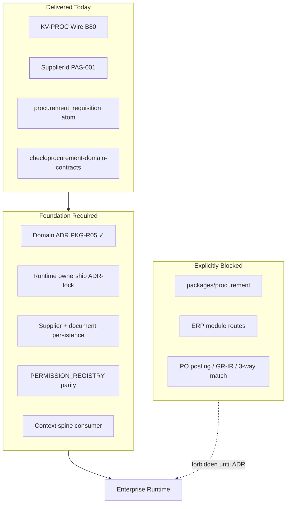

# ERP Procurement Runtime Foundation — Gap Report

> **Lane:** ERP-MODULES (features runtime) · consumes KV-PROC wire from kernel · **not** a kernel slice series  
> **Runtime path law:** `packages/features/erp-modules/src/procurement/` · wire: `@afenda/kernel/erp-domain/procurement`

| Field | Value |
| --- | --- |
| **Report ID** | PAS-PROC-FDN-AUDIT-001 |
| **Report type** | Foundation-gap report — **not** a runtime-build plan · **not** an authorized slice catalog |
| **Audit mode** | Evidence-first extraction — read-only; no runtime implementation |
| **Lane** | ERP-MODULES · [SLICE catalog](../SLICE/README.md) |
| **Parent authority** | PAS-001B §4.8 (KV-PROC wire) · PAS-001A (integration spine) · PAS-001 (identity) · PAS-004 (meaning) |
| **Wire slice** | [B80 — Procurement Domain Vocabulary](../../KERNEL/SLICE/b80-procurement-domain-vocabulary.md) (Delivered) |
| **Runtime owner (reserved)** | PKG-R05 · `@afenda/procurement` |
| **Audit date** | 2026-06-30 |
| **Review amended** | 2026-06-30 |
| **Verdict** | Wire-ready · runtime-blocked by design · **not enterprise-ready** for procurement business runtime |

### Confidence scores (clarified)

| Dimension | Score | Meaning |
| --- | --- | --- |
| **Extraction verdict** | **96%** | High confidence in what exists vs what is missing (file-path evidence) |
| **Enterprise runtime readiness** | **0–10%** | Procurement runtime is explicitly absent — not ready |
| **Foundation direction** | **90%** | Gap inventory and ownership model are directionally sound; **official slice IDs require handoff files** ([SLICE/README](../SLICE/README.md)) |

> **One sentence:** KV-PROC (B80) delivers contracts-only wire vocabulary; enterprise procurement **business runtime** remains blocked until authorized ERP-MODULES foundation work closes the gaps in sections A–F (ERP-PROC-FDN-001 Delivered 2026-06-30).

> **Main conclusion:** Procurement is not missing because of poor coding. Procurement is **intentionally runtime-blocked** because the enterprise foundation is not yet authorized.

---

## Review verdict (accepted amendments)

**Status:** Valid foundation-gap report — adopted as tracked PAS artifact after review amendments (2026-06-30).

| Review area | Score | Notes |
| --- | --- | --- |
| Evidence extraction | **9/10** | File/path inventory is useful |
| Boundary discipline | **9.5/10** | Correctly protects kernel from runtime leakage |
| Knowledge/meaning review | **7.5/10** → **8.5/10** after formal PAS-004 status model (section B) |
| Runtime-readiness diagnosis | **9/10** | Correctly states not enterprise-ready |
| Gate proposal | **8.5/10** → **9/10** after foundation vs runtime gate split (section G) |
| Execution sequence | **8/10** → **9/10** after ownership slice 002A before DB |
| **Overall** | **8.8/10** | Strong enough for tracked artifact after amendments below |

### What is strong (retained)

1. **Avoids the minimum-template mistake** — extracts wire vocabulary, business meaning, DB readiness, permissions, context spine, audit/outbox, metadata/UI, tests, gates, and missing runtime before any coding.
2. **Correctly separates wire from runtime** — KV-PROC is wire vocabulary only; aligned with PAS-001B doctrine (catalog authority ≠ domain runtime authority; delivered wire does not imply runtime package).
3. **Identifies real blockers** — no runtime ADR, no DB boundary, no permission registry wiring, no context consumer, no audit/outbox writers, incomplete knowledge corpus, readiness gates not implemented.

---

## 0. Audit Rule

This report **does not implement** procurement runtime.

It extracts what exists, classifies it, identifies gaps, and proposes foundation slices and gates. No item is marked complete without file-path evidence.

**Hard constraints verified:**

- PAS-001B KV-PROC is wire vocabulary only — not procurement runtime.
- No runtime logic belongs in `packages/kernel/src/erp-domain/procurement/`.
- `SupplierId` stays on PAS-001 business-reference authority (Rule 2) — not duplicated as domain branded ID.
- PAS-001A operating-context spine must not be bypassed by future procurement consumers.
- No local permission/context vocabulary in ERP.
- Business meaning belongs in PAS-004 / Enterprise Knowledge — not kernel contracts.

---

## 1. Executive Verdict

| Question | Answer |
| --- | --- |
| Is procurement only wire vocabulary today? | **Yes.** `PROCUREMENT_PACKAGE_LIFECYCLE = "contracts-only"`. |
| Is procurement runtime already present? | **No.** No `packages/procurement`, no transactional DB, no services, no ERP module routes. |
| Is procurement enterprise-ready? | **No.** Foundation gaps: domain ADR, ownership model, DB boundary, context consumer, permission parity, audit/outbox, knowledge corpus, readiness gates. |

### Real blockers (summary)

| Blocker | Why it matters |
| --- | --- |
| **No procurement runtime ADR** | ~~Cannot safely unblock `packages/procurement`~~ **Closed** — [ADR-0031](../../../adr/ADR-0031-procurement-runtime-authority-boundary.md) Accepted (ERP-PROC-FDN-001 Delivered 2026-06-30) |
| **No runtime ownership decision** | DB/schema work must not precede package responsibility |
| **No DB boundary** | No supplier/PR/PO/RFQ persistence |
| **No permission registry wiring** | Kernel has keys; runtime cannot enforce them |
| **No procurement context consumer** | PAS-001A spine exists; procurement does not consume it |
| **No audit/outbox writer** | Audit words exist; runtime evidence does not |
| **Knowledge corpus incomplete** | PO, RFQ, supplier, sourcing, blanket are mostly wire-only |
| **Readiness gates not implemented** | Future coding would depend on manual review |



---

## 2. Evidence Inventory

### 2.1 Files found (authoritative)

| Layer | Paths |
| --- | --- |
| Kernel wire module | `packages/kernel/src/erp-domain/procurement/` — 11 contracts + 1 test |
| Layout SSOT | `packages/kernel/src/erp-domain/erp-domain-layout.contract.ts` |
| Supplier identity | `packages/kernel/src/identity/families/business-reference-id.contract.ts`, wire reference, `SupplierNo` |
| BMD authority | `packages/architecture-authority/src/data/business-master-data-authority.registry.ts` |
| Enterprise knowledge | `packages/enterprise-knowledge/src/data/atoms.json`, bridge policy |
| Governance | `scripts/governance/check-procurement-domain-contracts.mts`, registry |
| ERP spine | `apps/erp/src/lib/context/**`, `apps/erp/src/lib/metadata/**` |
| Platform infra | `packages/database/src/schema/audit.schema.ts`, `outbox.schema.ts` |
| PAS slice | `docs/PAS/KERNEL/SLICE/b80-procurement-domain-vocabulary.md` |

### 2.2 Contracts, registries, gates, tests

| Category | Evidence |
| --- | --- |
| **Contracts** | Authority, branded IDs (3), status enums (2), document types, sourcing, wire context, 18 permission keys, 13 audit actions, vocabulary registry, lifecycle policy |
| **Registries** | `PROCUREMENT_DOMAIN_VOCABULARY_REGISTRY`, `ERP_DOMAIN_MODULE_KV_IDS.procurement` → `KV-PROC`, BMD `supplier` → `@afenda/procurement`, platform entity table `suppliers` deferred |
| **Gates (live)** | `pnpm check:procurement-domain-contracts` — wire/contracts-only |
| **Gates (proposed)** | 8 foundation readiness gates + runtime consumer gates (section G) — not implemented |
| **Tests** | `procurement-domain-vocabulary.contract.test.ts`, KV parity test, governance gate tests, supplier ID parse tests |

### 2.3 Missing expected files

| Expected | Status |
| --- | --- |
| `packages/procurement/**` | Blocked by scaffold policy |
| `packages/database/src/schema/suppliers.schema.ts` | Commented in `.gitkeep` only |
| `PERMISSION_REGISTRY` procurement block | Absent |
| `apps/erp/src/app/(protected)/modules/procurement/**` | Forbidden by gate |
| Procurement services/repositories | Absent |
| Procurement domain ADR | Absent (inventory has ADR-0019) |
| Procurement runtime PAS | Absent (only B80 wire slice) |
| `procurement-id.parser.ts` | Referenced in bridge test — correctly absent (contracts-only) |

---

## A. Procurement Wire Vocabulary Extraction

**Verdict:** KV-PROC is wire vocabulary only. No runtime, DB, UI, API, workflow, posting, or service logic in kernel procurement. **PASS** against B80 intent.

### A.1 Module authority

| Symbol | Value | Class |
| --- | --- | --- |
| `PROCUREMENT_MODULE_KV_ID` | `KV-PROC` | authority |
| `PROCUREMENT_REGISTRY_ID` | `PKGR01B_PROCUREMENT_VOCABULARY` | authority |
| `PROCUREMENT_PACKAGE_LIFECYCLE` | `contracts-only` | authority |
| `PROCUREMENT_AUTHORITY_PAS` | `PAS-001B` | authority |

**KV-PROC parity:** `ERP_DOMAIN_MODULE_KV_IDS.procurement === PROCUREMENT_MODULE_KV_ID === "KV-PROC"` — enforced by layout gate.

**Layout:** `runtimeOwnerPackage: null` (inventory has `PKGR02_INVENTORY`), SAP anchor `MM-PUR`, maturity `delivered` (vocabulary only).

### A.2 Complete export inventory

#### Branded IDs — identity (Rule 2: no SupplierId/ProductId duplication)

| Type | Helpers |
| --- | --- |
| `PurchaseRequisitionId` | brand/to |
| `PurchaseOrderId` | brand/to |
| `RfqId` | brand/to |

`SupplierId` stays on PAS-001 business-reference authority with `recordOwner: "procurement"`.

#### Closed vocabularies — classification

| Registry ID | Values |
| --- | --- |
| `purchase-requisition-status` | draft, submitted, approved, rejected, cancelled |
| `purchase-order-status` | draft, sent, acknowledged, partially_received, received, closed, cancelled |
| `procurement-document-type` | requisition, rfq, purchase_order, blanket_agreement |
| `sourcing-method` | catalog, rfq, auction, direct |

#### Wire context — context

`ProcurementDomainWireContext`: `tenantId`, `companyId`, `defaultSourcingMethod`, `defaultSupplierId` (opaque string), `requisitionApprovalRequired`.

#### Audit actions — event (13)

- Requisition: `requisition.drafted`, `.submitted`, `.approved`, `.rejected`, `.cancelled`
- RFQ: `rfq.published`, `rfq.closed`
- PO: `purchase_order.drafted`, `.sent`, `.acknowledged`, `.received`, `.closed`, `.cancelled`

#### Permission keys — authority (18)

Domains: `requisition`, `purchaseOrder`, `rfq`, `supplierQuote`  
Format: `procurement.{domain}_{action}` (e.g. `procurement.requisition_approve`, `procurement.purchaseOrder_receive`)

**Not wired:** zero `procurement` matches in `packages/permissions/**`.

#### Prohibited runtime surfaces — policy (8)

`purchase-order-posting-service`, `goods-receipt-matching-engine`, `procurement-database-runtime`, `procurement-package-scaffold`, `three-way-match-engine`, `supplier-onboarding-service`, `blanket-agreement-release-engine`, `rfq-award-automation`

#### Export surface

Single subpath: `@afenda/kernel/erp-domain/procurement` → ~50 re-exports from `index.ts`.

---

## B. Procurement Knowledge / Meaning Extraction

Procurement is not only tables and screens — it is an **enterprise meaning network**. PAS-004 status vocabulary is mandatory for foundation work.

### B.1 PAS-004 knowledge status model

| Status | Definition |
| --- | --- |
| **Accepted** | PAS-004 atom with `lifecycle: accepted` and ERP-domain bridge where required |
| **Proposed** | Atom or concept drafted but not accepted in acceptance chain |
| **Wire-only** | Kernel KV-PROC shape exists; no accepted enterprise meaning atom |
| **Missing** | No wire and no meaning (or cross-domain term not yet scoped) |
| **Ambiguous** | Overlapping or generic meaning (e.g. workflow vs procurement approval) |

### B.2 Procurement knowledge register

| Term | PAS-004 status | Wire (KV-PROC / PAS-001) | Required action |
| --- | --- | --- | --- |
| Procurement requisition | **Accepted** | Yes | Add synonyms (B52); lifecycle mapping to wire statuses |
| Supplier | **Missing** | PAS-001 identity only | Add PAS-004 / BMD atom; align vendor/supplier wording |
| Purchase order | **Wire-only** | Yes | Add enterprise meaning atom; define PO ↔ requisition relationship |
| RFQ | **Wire-only** | Yes | Add enterprise meaning atom |
| Sourcing | **Wire-only** | Yes (`SOURCING_METHODS`) | Add atom — process vs method enum |
| Blanket agreement | **Wire-only** | Yes (doc type) | Add enterprise meaning atom |
| Supplier quote | **Wire-only** | Yes (permission domain) | Add enterprise meaning atom |
| Approval (requisition) | **Ambiguous** | Partial wire + generic `workflow_context` | Decide generic workflow vs procurement-scoped approval atom |
| Purchasing group | **Ambiguous** | Team analog in PAS-001 archive | Perspective or atom linking Team ↔ procurement org |
| Goods receipt | **Missing** | Prohibited surface name only | Cross-domain with KV-INV + atom |
| Supplier invoice | **Missing** | — | Cross-domain with KV-ACCT + atom |
| Three-way match | **Missing** | Prohibited surface name only | Cross-domain ADR (PROC + INV + ACCT) |
| Incoterms / landed cost / RTV / analytics | **Missing** | — | Future PAS-004 + domain ADR as scoped |

### B.3 PAS-004 vs kernel embedding

**Doctrine compliance: PASS.** Kernel holds wire shapes; contested meaning must live in enterprise-knowledge. Only one procurement atom is accepted — correctly placed in PAS-004, not kernel contracts.

### B.4 Documentation contradictions (PAS fails)

| Issue | Evidence | Remediation |
| --- | --- | --- |
| **VendorId vs SupplierId** | B80 slice historically said "VendorId"; code uses `SupplierId`; registry field `vendorCode` | Fixed in B80 handoff; close in knowledge-alignment work |
| **B53 dual status** | `pas-status-index.md` lists B53 as both Delivered and Proposed while atom + bridge exist | Reconcile via documentation-drift |

---

## C. Procurement Runtime Surface Extraction

| # | Layer | Count | Runtime? | Key evidence |
| --- | --- | --- | --- | --- |
| 1 | Wire vocabulary | ~30 files | Contracts only | Kernel procurement module + BMD registry |
| 2 | Business meaning | 5 files | 1 accepted atom | enterprise-knowledge bridge |
| 3 | Database/persistence | 5 registry entries | Supplier **deferred** | No PO/PR/RFQ tables or migrations |
| 4 | Repository | 0 | — | — |
| 5 | Service/use case | 0 | — | — |
| 6 | API/server action | 2 files | Supplier ID ingress only | `parseRouteSupplierId` |
| 7 | Authorization | 3 kernel contracts | Vocab only | Not in `PERMISSION_REGISTRY` |
| 8 | Operating-context | Spine live + 1 wire context | No consumer | PAS-001A resolvers exist; procurement unused |
| 9 | Audit/outbox | 1 vocab + platform tables | No writers | Inventory pattern not replicated |
| 10 | Metadata binding | 3 files | Catalog slug only | No procurement operator surfaces |
| 11 | UI surface | ~60 demo files | **Not production** | appshell nav, Storybook PO demos |
| 13 | Test/fixture | ~16 | Contract/governance | No integration tests |
| 14 | Documentation | B80 + PAS-001B §4.8 | — | No runtime PAS |

**Inventory reference (what procurement should mirror):**

- Live DB schemas + RLS migrations
- Services with `insertAuditEvent({ module: "inventory" })`
- API routes under `apps/erp/src/app/api/internal/v1/inventory/**`
- `PERMISSION_REGISTRY.inventory` + parity test + platform seed

---

## D. Enterprise Procurement Capability Benchmark

| # | Capability | Status |
| --- | --- | --- |
| 1 | Supplier master reference | **Partially available** — identity + BMD registry; no table |
| 2 | Supplier onboarding | **Missing** — prohibited surface |
| 3 | Purchase requisition | **Wire-only** |
| 4 | Purchase approval | **Wire-only** |
| 5 | RFQ / quotation | **Wire-only** |
| 6 | Purchase order | **Wire-only** |
| 7 | Blanket PO / contract | **Wire-only** |
| 8 | Goods receipt | **Missing** |
| 9 | Inventory receiving bridge | **Missing** — requires KV-INV cross-domain ADR |
| 10 | Supplier invoice bridge | **Missing** |
| 11 | Three-way matching | **Missing** — prohibited surface name only |
| 12 | Tax / landed cost hooks | **Missing** |
| 13 | Payment request bridge | **Missing** — policy example key only |
| 14 | Return to vendor | **Missing** |
| 15 | Procurement audit trail | **Wire-only** — 13 action strings; no persistence |
| 16 | Procurement outbox events | **Missing** |
| 17 | Procurement workflow states | **Wire-only** — status enums |
| 18 | Procurement authorization | **Partially available** — 18 kernel keys; not registered |
| 19 | Procurement metadata/UI | **Partially available** — catalog slug; no surfaces |
| 20 | Procurement analytics | **Missing** — out of scope for foundation |

---

## E. Procurement Foundation Gap Matrix

| Capability | Current evidence | Current layer | Missing layer | Risk | Required next action |
| --- | --- | --- | --- | --- | --- |
| Domain authority boundary | B80 + contracts gate + ADR-0031 | Wire + governance + ADR | Runtime ownership ADR-lock | Low | Authorize ownership matrix (post FDN-001) |
| Runtime ownership model | Reserved PKG-R05; split undecided | Architecture policy | ADR-owned ownership matrix | **High** | ADR-lock before DB (section F.2) |
| Supplier master | SupplierId, BMD deferred | Identity + registry | DB schema, service, API | **High** | Database boundary slice (handoff TBD) |
| Purchase requisition | Wire + 1 accepted atom | Wire + partial meaning | DB, service, UI, audit | **High** | Persistence + consumer proof (handoffs TBD) |
| PO / RFQ / blanket | Wire vocab | Wire | Meaning atoms, runtime | Medium | Knowledge alignment + runtime (handoffs TBD) |
| Permission enforcement | 18 kernel keys | Wire vocabulary | PERMISSION_REGISTRY, seeds, test | **High** | Permission registry wiring (handoff TBD) |
| Operating context | PAS-001A spine live | Platform spine | Procurement consumer | **High** | Context spine consumer (handoff TBD) |
| Audit / outbox | Action vocab; platform tables | Wire + infra | Service writers, event catalog | Medium | Audit/outbox writers (handoff TBD) |
| Metadata / UI | KV-PROC in projection | Spine-ready | Operator surfaces, PAS-006 blocks | Medium | Metadata/UI binding (handoff TBD) |
| GR / receiving / 3-way | Prohibited surface names | Policy intent | Cross-domain ADR (INV, ACCT) | **Critical** | Requires PAS amendment — post-foundation |
| Runtime package | `@afenda/procurement` reserved | Architecture policy + ADR-0031 | ADR-lock ownership + folder structure | **Blocker until ownership ADR** | ERP-PROC-FDN-001 **Delivered**; scaffold blocked |
| Readiness gates | 1 contracts gate | Governance | Foundation + runtime gate families | Medium | Module readiness gates (handoff TBD) |
| End-to-end skeleton | None | — | Reference flow fixture | Low | Reference flow fixture (handoff TBD) |

---

## F. Procurement Enterprise Runtime Blueprint (Future — Do Not Implement Yet)

### F.1 Authority boundary

- **Wire:** `@afenda/kernel/erp-domain/procurement` (PAS-001B KV-PROC) — stays contracts-only
- **Runtime behavior:** `@afenda/procurement` (PKG-R05) — ADR-gated domain package
- **Persistence primitives:** `@afenda/database` — schema, migrations, RLS, data-access services
- **Kernel prohibition:** no schema/, services/, posting, GR-IR under kernel procurement

### F.2 Runtime ownership decision (required before database boundary)

**Hard decision gate:** Who owns procurement behavior? Options considered:

| Option | Verdict |
| --- | --- |
| A. `packages/procurement` only | Partial — domain behavior yes; persistence colocated with inventory pattern |
| B. `apps/erp` runtime only | **Rejected** — violates clean-core; behavior must not live only in app |
| C. `packages/database` service namespace only | Partial — persistence yes; domain use-cases need explicit owner |
| D. Split ownership | **Accepted** — see matrix below |

**Recommended ownership matrix (must be ADR-locked before DB work):**

| Concern | Owner |
| --- | --- |
| Wire enums / IDs / permission **words** | `@afenda/kernel` (KV-PROC only) |
| Business **meaning** | `@afenda/enterprise-knowledge` (PAS-004) |
| Supplier **identity** | PAS-001 business-reference (`SupplierId`, `supplier_no`) |
| Procurement domain **behavior** (use cases, domain rules) | `@afenda/procurement` (PKG-R05) |
| Schema, migrations, RLS, **persistence services** | `@afenda/database` |
| ERP **ingress** (routes, server actions, context assembly) | `apps/erp` |
| Permission **evaluation** registry | `@afenda/permissions` |
| Metadata **operator surfaces** | `apps/erp` + PAS-006 presentation |
| **Tests** | Mirror inventory: package tests + ERP integration tests |

Without an ADR-locked ownership matrix, DB schema must **not** be created — runtime responsibility would be ambiguous.

### F.3 Proposed package structure (post-ADR)

```text
packages/features/erp-modules/src/procurement/   # features runtime — path law (Blueprint §4.5)
packages/database/src/
  schema/supplier.schema.ts        # promote from deferred
  schema/purchase-*.schema.ts      # PR, PO, RFQ — ADR-defined
  supplier/supplier.service.ts     # persistence + audit writers
apps/erp/src/lib/procurement/      # context consumers, metadata loaders
apps/erp/src/app/(protected)/modules/procurement/  # currently forbidden
```

### F.4–F.12 Summary

| Section | Future requirement |
| --- | --- |
| Database boundary | Promote `suppliers` from deferred registry; document tables after RLS ADR — **after ownership ADR** |
| Operating-context | `loadProtectedRequestOperatingContext()` / `resolveApiRouteOperatingContext()`; project `ProcurementDomainWireContext` |
| Permission enforcement | Register 18 kernel keys; parity test mirroring inventory |
| Audit actions | `insertAuditEvent({ module: "procurement", ... })` using `PROCUREMENT_AUDIT_ACTIONS` |
| Outbox/events | Transactional enqueue pattern (workspace reference) |
| Metadata binding | Operator surfaces via metadata projection; PAS-006 UI |
| UI surface map | Requisitions, POs, RFQs, suppliers under `/modules/procurement/*` |
| Analytics | Deferred (KV-AN) |
| Tests | Permission parity, context consumer, audit writer, API integration |
| Non-goals | PO posting, GR-IR, 3-way, tax/landed cost, payment, onboarding, RFQ award, analytics |
| Escalation | GR → KV-INV; invoice/3-way → KV-ACCT; scaffold → foundation-registry-owner + ADR |

---

## G. Required Gate Proposal

> **2026-06-30 update:** Platform foundation gates are **live** under [PAS-001C](../../KERNEL/PAS-001C-ERP-MODULE-FOUNDATION-STANDARD.md) (`@afenda/erp-module-foundation`, ERP-MOD-FDN-003). Procurement-specific composite gates below remain **proposed** until module readiness gates are authorized via slice handoff.

Gates split into **foundation readiness** (authorize foundation work) and **runtime consumer** (prove live procurement surfaces). Do not conflate wire gate with runtime readiness.

### G.0 Platform foundation gates (live — PAS-001C)

| Gate | What it checks |
| --- | --- |
| `pnpm check:erp-module-foundation` | Composite — all sub-gates below |
| `pnpm check:erp-module-ownership` | Ownership surface parity |
| `pnpm check:erp-module-knowledge-alignment` | PAS-004 term rules |
| `pnpm check:erp-module-context-spine-consumer` | PAS-001A spine contract |
| `pnpm check:erp-module-permission-binding` | Permission parity mode |
| `pnpm check:erp-module-audit-outbox` | Audit/outbox catalog |
| `pnpm check:erp-module-metadata-binding` | Route-kind validation |
| `pnpm check:erp-module-database-boundary` | DB boundary (runtime status) |
| `pnpm check:erp-module-no-kernel-runtime-leak` | Zero-deps package |
| `pnpm check:erp-module-readiness` | Reference KV-PROC bundle + registry |

Reference bundle: `PROCUREMENT_FOUNDATION_BUNDLE` in `@afenda/erp-module-foundation`.

### G.1 Foundation readiness gates (pre-runtime — procurement-specific, proposed)

| Gate | What it checks | Enforces |
| --- | --- | --- |
| `check:procurement-no-kernel-runtime-leak` | Extends current contracts gate | PAS-001B B80 |
| `check:procurement-runtime-foundation` | ADR attested; PKG-R05 disposition; ownership doc | ADR-0020, ERP-PROC-FDN-001 |
| `check:procurement-knowledge-alignment` | Wire enums have atom or documented deferral | PAS-004D B53 |
| `check:procurement-module-readiness` | Composite foundation gates green | Foundation disposition |

**Existing wire gate (live):** `pnpm check:procurement-domain-contracts` — contracts-only; **not** runtime readiness.

### G.2 Runtime consumer gates (post-ingress — proposed)

| Gate | What it checks | Enforces |
| --- | --- | --- |
| `check:procurement-context-spine-consumer` | Protected procurement routes use operating-context spine | PAS-001A IS-002 |
| `check:procurement-permission-enforcement` | Kernel keys ⊆ PERMISSION_REGISTRY ⊆ seed | PAS-001B §4.8 |
| `check:procurement-audit-outbox` | Services use `PROCUREMENT_AUDIT_ACTIONS` | PAS-001A audit spine |
| `check:procurement-metadata-binding` | Surfaces in metadata projection with KV-PROC | PAS-001A, PAS-006 |

Implement procurement-specific foundation gates via authorized slice handoffs before enabling runtime routes.

---

## 3. Procurement Capability Matrix (Summary)

| Status | Items |
| --- | --- |
| **Available** | KV-PROC wire module, contracts gate, SupplierId identity, PAS-001A operating-context spine (platform), platform audit/outbox tables |
| **Partial** | Supplier master (identity only), permission vocab (18 keys unregistered), metadata catalog slug, demo UI fixtures |
| **Wire-only** | PR, PO, RFQ, blanket, sourcing, approval flags, audit action words |
| **Missing** | Runtime package, DB, services, API routes, GR, 3-way, invoice, payment, incoterms, landed cost, RTV, analytics, onboarding |

---

## 7. Recommended Next Slices (MUST DO sequence)

> **Superseded — not an authorized slice catalog.** Section retained as audit evidence only. The numbered ERP-PROC-FDN-001…009 sequence was an audit-agent proposal **not approved** for execution.  
> **Official slice IDs:** only slices with handoff files under [ERP-MODULES/SLICE/README.md](../SLICE/README.md). Today: **ERP-PROC-FDN-001 Delivered**. Next slice: **TBD — handoff must be authored before listing.**

<details>
<summary>Historical audit proposal (do not execute from this table)</summary>

### Corrected execution order (historical)

Do **not** start database or route work until **authority → meaning → ownership → boundary** are clear.

```text
Phase A — Authorize foundation
  ERP-PROC-FDN-001 — Procurement Runtime Authority Boundary  ✓ Delivered
  … remaining items were audit proposals only — superseded
```

</details>

---

## PAS Compliance Summary

| Check | Result |
| --- | --- |
| KV-PROC is wire-only (not runtime) | **PASS** |
| No runtime leak in kernel procurement | **PASS** |
| SupplierId not duplicated as domain branded ID | **PASS** |
| PAS-001A spine not bypassed | **Not Applicable / Not Yet Testable** — no procurement runtime consumer exists; absence of bypass is not positive proof future routes will use spine |
| No local ERP permission/context vocab | **PASS** |
| Business meaning in PAS-004 (not kernel) | **PASS** (under-populated, not misplaced) |
| B80 "VendorId" terminology | **FAIL** → remediated in B80 handoff; close via knowledge alignment |
| B53 status in pas-status-index | **FAIL** — doc drift; close via documentation-drift |
| Enterprise runtime readiness | **FAIL by design** — foundation gaps remain (sections A–F) |

---

## Related documents

| Document | Role |
| --- | --- |
| [`@afenda/erp-module-foundation`](../../../../packages/erp-module-foundation/README.md) | Reusable define*/assert* factories for module foundation bundles |
| [ERP runtime module foundation template](../erp-runtime-module-foundation.template.md) | Folder structure and required runtime files · [`template/`](../template/) |
| [PAS-001B §4.8](../../KERNEL/PAS-001B-ERP-WIRE-VOCABULARY-CATALOG-STANDARD.md) | KV-PROC wire catalog authority |
| [B80 slice handoff](../../KERNEL/SLICE/b80-procurement-domain-vocabulary.md) | Wire vocabulary delivery evidence |
| [PAS-001A](../../KERNEL/PAS-001A-ERP-INTEGRATION-SPINE-STANDARD.md) | Operating-context spine consumer rules |
| [PAS-001B-AUD-23](../../KERNEL/audit/PAS-001B.md#pas-001b-aud-23--procurement-domain-contract-audit) | Wire-only contract audit slice |
| [SLICE catalog](../SLICE/README.md) | Official slice IDs — handoff file required |
| [ADR-0019](../../../adr/ADR-0019-inventory-domain-master-data-activation.md) | Inventory activation pattern (reference) |
| [ADR-0020](../../../adr/ADR-0020-master-data-authority-consolidation.md) | BMD authority; procurement package blocked |

---

## Maintenance

| Event | Update |
| --- | --- |
| Foundation slice close | Re-run extraction sections A–E; update gap matrix and acceptance criteria |
| Domain ADR accepted | Update F.1–F.3; promote PKG-R05 in foundation-disposition |
| Gate implementation | Move gates from section G to pas-status-index gate bundle |
| Knowledge atoms added | Refresh section B knowledge register |
| Re-review | Update review verdict scores and confidence table |

**Last audited:** 2026-06-30 · **Review amended:** 2026-06-30 · **Relocated:** 2026-06-30 → ERP-MODULES lane · ERP-PROC-FDN-001 Delivered
