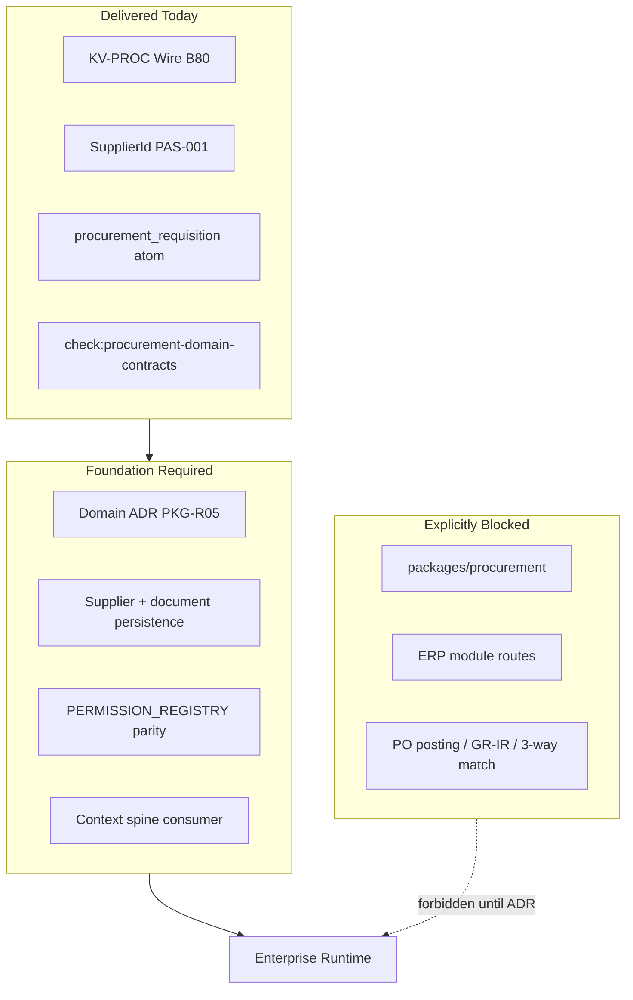

# ERP Procurement Runtime Foundation — Gap Report

| Field | Value |
| --- | --- |
| **Report ID** | PAS-PROC-FDN-AUDIT-001 |
| **Audit mode** | Evidence-first extraction — read-only; no runtime implementation |
| **Parent authority** | PAS-001B §4.8 (KV-PROC wire) · PAS-001A (integration spine) · PAS-001 (identity) · PAS-004 (meaning) |
| **Wire slice** | [B80 — Procurement Domain Vocabulary](../SLICE/b80-procurement-domain-vocabulary.md) (Delivered) |
| **Runtime owner (reserved)** | PKG-R05 · `@afenda/procurement` |
| **Audit date** | 2026-06-30 |
| **Confidence score** | 96% |
| **Verdict** | Wire-ready · runtime-blocked by design · **not enterprise-ready** for procurement business runtime |

> **One sentence:** KV-PROC (B80) delivers contracts-only wire vocabulary; enterprise procurement runtime requires nine foundation slices (ERP-PROC-FDN-001 through 009) before business logic.

---

## 0. Audit Rule

This report **does not implement** procurement runtime.

It extracts what exists, classifies it, identifies gaps, and proposes foundation slices and gates. No item is marked complete without file-path evidence.

**Hard constraints verified:**

- PAS-001B KV-PROC is wire vocabulary only — not procurement runtime.
- No runtime logic belongs in `packages/kernel/src/erp-domain/procurement/`.
- `SupplierId` stays on PAS-001 business-reference authority (Rule 2) — not duplicated as domain branded ID.
- PAS-001A operating-context spine must not be bypassed.
- No local permission/context vocabulary in ERP.
- Business meaning belongs in PAS-004 / Enterprise Knowledge — not kernel contracts.

---

## 1. Executive Verdict

| Question | Answer |
| --- | --- |
| Is procurement only wire vocabulary today? | **Yes.** `PROCUREMENT_PACKAGE_LIFECYCLE = "contracts-only"`. |
| Is procurement runtime already present? | **No.** No `packages/procurement`, no transactional DB, no services, no ERP module routes. |
| Is procurement enterprise-ready? | **No.** Foundation gaps: domain ADR, DB boundary, context consumer, permission parity, audit/outbox, knowledge corpus, readiness gates. |



---

## 2. Evidence Inventory

### 2.1 Files found (authoritative)

| Layer | Paths |
| --- | --- |
| Kernel wire module | `packages/kernel/src/erp-domain/procurement/` — 11 contracts + 1 test |
| Layout SSOT | `packages/kernel/src/erp-domain/erp-domain-layout.contract.ts` |
| Supplier identity | `packages/kernel/src/identity/families/business-reference-id.contract.ts`, wire reference, `SupplierNo` |
| BMD authority | `packages/architecture-authority/src/data/business-master-data-authority.registry.ts` |
| Enterprise knowledge | `packages/enterprise-knowledge/src/data/atoms.json`, bridge policy |
| Governance | `scripts/governance/check-procurement-domain-contracts.mts`, registry |
| ERP spine | `apps/erp/src/lib/context/**`, `apps/erp/src/lib/metadata/**` |
| Platform infra | `packages/database/src/schema/audit.schema.ts`, `outbox.schema.ts` |
| PAS slice | `docs/PAS/KERNEL/SLICE/b80-procurement-domain-vocabulary.md` |

### 2.2 Contracts, registries, gates, tests

| Category | Evidence |
| --- | --- |
| **Contracts** | Authority, branded IDs (3), status enums (2), document types, sourcing, wire context, 18 permission keys, 13 audit actions, vocabulary registry, lifecycle policy |
| **Registries** | `PROCUREMENT_DOMAIN_VOCABULARY_REGISTRY`, `ERP_DOMAIN_MODULE_KV_IDS.procurement` → `KV-PROC`, BMD `supplier` → `@afenda/procurement`, platform entity table `suppliers` deferred |
| **Gates** | `pnpm check:procurement-domain-contracts` (live); 8 foundation gates proposed (section G) — not implemented |
| **Tests** | `procurement-domain-vocabulary.contract.test.ts`, KV parity test, governance gate tests, supplier ID parse tests |

### 2.3 Missing expected files

| Expected | Status |
| --- | --- |
| `packages/procurement/**` | Blocked by scaffold policy |
| `packages/database/src/schema/suppliers.schema.ts` | Commented in `.gitkeep` only |
| `PERMISSION_REGISTRY` procurement block | Absent |
| `apps/erp/src/app/(protected)/modules/procurement/**` | Forbidden by gate |
| Procurement services/repositories | Absent |
| Procurement domain ADR | Absent (inventory has ADR-0019) |
| Procurement runtime PAS | Absent (only B80 wire slice) |
| `procurement-id.parser.ts` | Referenced in bridge test — correctly absent (contracts-only) |

---

## A. Procurement Wire Vocabulary Extraction

**Verdict:** KV-PROC is wire vocabulary only. No runtime, DB, UI, API, workflow, posting, or service logic in kernel procurement. **PASS** against B80 intent.

### A.1 Module authority

| Symbol | Value | Class |
| --- | --- | --- |
| `PROCUREMENT_MODULE_KV_ID` | `KV-PROC` | authority |
| `PROCUREMENT_REGISTRY_ID` | `PKGR01B_PROCUREMENT_VOCABULARY` | authority |
| `PROCUREMENT_PACKAGE_LIFECYCLE` | `contracts-only` | authority |
| `PROCUREMENT_AUTHORITY_PAS` | `PAS-001B` | authority |

**KV-PROC parity:** `ERP_DOMAIN_MODULE_KV_IDS.procurement === PROCUREMENT_MODULE_KV_ID === "KV-PROC"` — enforced by layout gate.

**Layout:** `runtimeOwnerPackage: null` (inventory has `PKGR02_INVENTORY`), SAP anchor `MM-PUR`, maturity `delivered` (vocabulary only).

### A.2 Complete export inventory

#### Branded IDs — identity (Rule 2: no SupplierId/ProductId duplication)

| Type | Helpers |
| --- | --- |
| `PurchaseRequisitionId` | brand/to |
| `PurchaseOrderId` | brand/to |
| `RfqId` | brand/to |

`SupplierId` stays on PAS-001 business-reference authority with `recordOwner: "procurement"`.

#### Closed vocabularies — classification

| Registry ID | Values |
| --- | --- |
| `purchase-requisition-status` | draft, submitted, approved, rejected, cancelled |
| `purchase-order-status` | draft, sent, acknowledged, partially_received, received, closed, cancelled |
| `procurement-document-type` | requisition, rfq, purchase_order, blanket_agreement |
| `sourcing-method` | catalog, rfq, auction, direct |

#### Wire context — context

`ProcurementDomainWireContext`: `tenantId`, `companyId`, `defaultSourcingMethod`, `defaultSupplierId` (opaque string), `requisitionApprovalRequired`.

#### Audit actions — event (13)

- Requisition: `requisition.drafted`, `.submitted`, `.approved`, `.rejected`, `.cancelled`
- RFQ: `rfq.published`, `rfq.closed`
- PO: `purchase_order.drafted`, `.sent`, `.acknowledged`, `.received`, `.closed`, `.cancelled`

#### Permission keys — authority (18)

Domains: `requisition`, `purchaseOrder`, `rfq`, `supplierQuote`  
Format: `procurement.{domain}_{action}` (e.g. `procurement.requisition_approve`, `procurement.purchaseOrder_receive`)

**Not wired:** zero `procurement` matches in `packages/permissions/**`.

#### Prohibited runtime surfaces — policy (8)

`purchase-order-posting-service`, `goods-receipt-matching-engine`, `procurement-database-runtime`, `procurement-package-scaffold`, `three-way-match-engine`, `supplier-onboarding-service`, `blanket-agreement-release-engine`, `rfq-award-automation`

#### Export surface

Single subpath: `@afenda/kernel/erp-domain/procurement` → ~50 re-exports from `index.ts`.

---

## B. Procurement Knowledge / Meaning Extraction

### B.1 What business meaning exists?

| Term | Where defined | Layer | Status |
| --- | --- | --- | --- |
| Procurement requisition | `procurement_requisition` atom | PAS-004 | **Accepted** — bridged to KV-PROC |
| Supplier | PAS-001 identity + BMD glossary | Wire + prose | **Meaning missing** — no atom |
| Purchase order | Kernel wire statuses/ID | PAS-001B | **Wire-only** |
| RFQ | Kernel wire ID, doc type, permissions | PAS-001B | **Wire-only** |
| Sourcing | `SOURCING_METHODS` enum | PAS-001B | **Wire-only** |
| Blanket agreement | Doc type enum | PAS-001B | **Wire-only** |
| Supplier quote | Permission domain | PAS-001B | **Wire-only** |
| Approval | Wire context + permissions; generic `workflow_context` atom | Mixed | **Ambiguous** |
| Purchasing group | PAS-001 archive maps Team → purchasing group | Prose | **Ambiguous** |
| GR, 3-way, invoice, incoterms, landed cost, RTV, analytics | — | — | **Missing** |

### B.2 PAS-004 vs kernel embedding

**Doctrine compliance: PASS.** Kernel holds wire shapes; contested meaning must live in enterprise-knowledge. Only one procurement atom exists — correctly placed in PAS-004.

### B.3 Procurement Knowledge Gap Matrix

| Term | Wire (KV-PROC) | PAS-004 atom | Gap class | Closure path |
| --- | --- | --- | --- | --- |
| Procurement requisition | Yes | Yes | **Accepted** | Close B53 doc; add synonyms (B52) |
| Purchase order | Yes | No | **Draft (wire)** | Atom defining PO ↔ requisition relationship |
| RFQ / sourcing / blanket / supplier quote | Yes | No | **Draft (wire)** | Atoms per concept |
| Supplier | PAS-001 identity | No | **Missing meaning** | BMD atom; align vendor/supplier wording |
| Goods receipt / 3-way / invoice | Prohibited names only | No | **Missing** | Cross-domain ADR (INV + ACCT) + atoms |
| Approval | Partial wire | Generic workflow | **Ambiguous** | Procurement-scoped approval atom |
| Incoterms / landed cost / RTV | No | No | **Missing** | Future PAS-004 + domain ADR |

### B.4 Documentation contradictions (PAS fails)

| Issue | Evidence |
| --- | --- |
| **VendorId vs SupplierId** | B80 slice Rule 2 says "VendorId"; code uses `SupplierId`; registry field is `vendorCode` |
| **B53 dual status** | `pas-status-index.md` lists B53 as both Delivered and Proposed while atom + bridge gate exist |

---

## C. Procurement Runtime Surface Extraction

| # | Layer | Count | Runtime? | Key evidence |
| --- | --- | --- | --- | --- |
| 1 | Wire vocabulary | ~30 files | Contracts only | Kernel procurement module + BMD registry |
| 2 | Business meaning | 5 files | 1 atom | enterprise-knowledge bridge |
| 3 | Database/persistence | 5 registry entries | Supplier **deferred** | No PO/PR/RFQ tables or migrations |
| 4 | Repository | 0 | — | — |
| 5 | Service/use case | 0 | — | — |
| 6 | API/server action | 2 files | Supplier ID ingress only | `parseRouteSupplierId` |
| 7 | Authorization | 3 kernel contracts | Vocab only | Not in `PERMISSION_REGISTRY` |
| 8 | Operating-context | Spine live + 1 wire context | No consumer | PAS-001A resolvers exist; procurement unused |
| 9 | Audit/outbox | 1 vocab + platform tables | No writers | Inventory pattern not replicated |
| 10 | Metadata binding | 3 files | Catalog slug only | No procurement operator surfaces |
| 11 | UI surface | ~60 demo files | **Not production** | appshell nav, Storybook PO demos |
| 13 | Test/fixture | ~16 | Contract/governance | No integration tests |
| 14 | Documentation | B80 + PAS-001B §4.8 | — | No runtime PAS |

**Inventory reference (what procurement should mirror):**

- Live DB schemas + RLS migrations
- Services with `insertAuditEvent({ module: "inventory" })`
- API routes under `apps/erp/src/app/api/internal/v1/inventory/**`
- `PERMISSION_REGISTRY.inventory` + parity test + platform seed

---

## D. Enterprise Procurement Capability Benchmark

| # | Capability | Status |
| --- | --- | --- |
| 1 | Supplier master reference | **Partially available** — identity + BMD registry; no table |
| 2 | Supplier onboarding | **Missing** — prohibited surface |
| 3 | Purchase requisition | **Wire-only** |
| 4 | Purchase approval | **Wire-only** |
| 5 | RFQ / quotation | **Wire-only** |
| 6 | Purchase order | **Wire-only** |
| 7 | Blanket PO / contract | **Wire-only** |
| 8 | Goods receipt | **Missing** |
| 9 | Inventory receiving bridge | **Missing** — requires KV-INV cross-domain ADR |
| 10 | Supplier invoice bridge | **Missing** |
| 11 | Three-way matching | **Missing** — prohibited surface name only |
| 12 | Tax / landed cost hooks | **Missing** |
| 13 | Payment request bridge | **Missing** — policy example key only |
| 14 | Return to vendor | **Missing** |
| 15 | Procurement audit trail | **Wire-only** — 13 action strings; no persistence |
| 16 | Procurement outbox events | **Missing** |
| 17 | Procurement workflow states | **Wire-only** — status enums |
| 18 | Procurement authorization | **Partially available** — 18 kernel keys; not registered |
| 19 | Procurement metadata/UI | **Partially available** — catalog slug; no surfaces |
| 20 | Procurement analytics | **Missing** — out of scope for foundation |

---

## E. Procurement Foundation Gap Matrix

| Capability | Current evidence | Current layer | Missing layer | Risk | Required next action |
| --- | --- | --- | --- | --- | --- |
| Domain authority boundary | B80 + contracts gate | Wire + governance | Runtime ADR, PKG-R05 disposition | Medium | ERP-PROC-FDN-001 |
| Supplier master | SupplierId, BMD deferred | Identity + registry | DB schema, service, API | **High** | ERP-PROC-FDN-003 |
| Purchase requisition | Wire + 1 atom | Wire + partial meaning | DB, service, UI, audit | **High** | FDN-003, 004, 006, 007 |
| PO / RFQ / blanket | Wire vocab | Wire | Meaning atoms, runtime | Medium | ERP-PROC-FDN-002 |
| Permission enforcement | 18 kernel keys | Wire vocabulary | PERMISSION_REGISTRY, seeds, test | **High** | ERP-PROC-FDN-005 |
| Operating context | PAS-001A spine live | Platform spine | Procurement consumer | **High** | ERP-PROC-FDN-004 |
| Audit / outbox | Action vocab; platform tables | Wire + infra | Service writers, event catalog | Medium | ERP-PROC-FDN-006 |
| Metadata / UI | KV-PROC in projection | Spine-ready | Operator surfaces, PAS-006 blocks | Medium | ERP-PROC-FDN-007 |
| GR / receiving / 3-way | Prohibited surface names | Policy intent | Cross-domain ADR (INV, ACCT) | **Critical** | Requires PAS amendment — post-FDN |
| Runtime package | `@afenda/procurement` reserved | Architecture policy | ADR + folder structure | **Blocker** | FDN-001 |
| Readiness gates | 1 contracts gate | Governance | 8 foundation gates | Medium | ERP-PROC-FDN-008 |
| End-to-end skeleton | None | — | Reference flow fixture | Low | ERP-PROC-FDN-009 |

---

## F. Procurement Enterprise Runtime Blueprint (Future — Do Not Implement Yet)

### F.1 Authority boundary

- **Wire:** `@afenda/kernel/erp-domain/procurement` (PAS-001B KV-PROC) — stays contracts-only
- **Runtime:** `@afenda/procurement` (PKG-R05) or `@afenda/database` procurement namespace — ADR-gated
- **Kernel prohibition:** no schema/, services/, posting, GR-IR under kernel procurement

### F.2 Ownership model

| Concern | Owner |
| --- | --- |
| Wire enums/IDs/permission words | `@afenda/kernel` |
| Business meaning | `@afenda/enterprise-knowledge` |
| Supplier identity | PAS-001 business-reference |
| Persistence + services | `@afenda/database` / `@afenda/procurement` (ADR) |
| ERP ingress | `apps/erp` |
| Permission registry | `@afenda/permissions` |

### F.3 Proposed package structure

```text
packages/procurement/              # ADR-gated domain services
packages/database/src/
  schema/supplier.schema.ts        # promote from deferred
  schema/purchase-*.schema.ts      # PR, PO, RFQ — ADR-defined
  supplier/supplier.service.ts
apps/erp/src/lib/procurement/      # context consumers
apps/erp/src/app/(protected)/modules/procurement/  # currently forbidden
```

### F.4–F.12 Summary

| Section | Future requirement |
| --- | --- |
| Database boundary | Promote `suppliers` from deferred registry; document tables after RLS ADR |
| Operating-context | `loadProtectedRequestOperatingContext()` / `resolveApiRouteOperatingContext()`; project `ProcurementDomainWireContext` |
| Permission enforcement | Register 18 kernel keys; parity test mirroring inventory |
| Audit actions | `insertAuditEvent({ module: "procurement", ... })` using `PROCUREMENT_AUDIT_ACTIONS` |
| Outbox/events | Transactional enqueue pattern (workspace reference) |
| Metadata binding | Operator surfaces via metadata projection; PAS-006 UI |
| UI surface map | Requisitions, POs, RFQs, suppliers under `/modules/procurement/*` |
| Analytics | Deferred (KV-AN) |
| Tests | Permission parity, context consumer, audit writer, API integration |
| Non-goals | PO posting, GR-IR, 3-way, tax/landed cost, payment, onboarding, RFQ award, analytics |
| Escalation | GR → KV-INV; invoice/3-way → KV-ACCT; scaffold → foundation-registry-owner + ADR |

---

## G. Required Gate Proposal (Not Implemented)

| Gate | What it checks | Inspects | Must fail when | Enforces |
| --- | --- | --- | --- | --- |
| `check:procurement-runtime-foundation` | ADR attested; registry row; scaffold policy | foundation-disposition, `packages/procurement/`, ADR index | Package without ADR | ADR-0020, PKG-R05 |
| `check:procurement-context-spine-consumer` | Protected routes use operating-context spine | `apps/erp/**/procurement/**` | Session/header bypass; local vocab | PAS-001A IS-002 |
| `check:procurement-permission-enforcement` | Kernel keys ⊆ PERMISSION_REGISTRY ⊆ seed | permission vocab, `permission.contract.ts`, seed catalog | Registry drift | PAS-001B §4.8 |
| `check:procurement-audit-outbox` | Services use `PROCUREMENT_AUDIT_ACTIONS` | database procurement services | Ad-hoc action strings | PAS-001A audit spine |
| `check:procurement-metadata-binding` | Surfaces in metadata projection with KV-PROC | `apps/erp/src/lib/metadata/**` | UI without metadata auth | PAS-001A, PAS-006 |
| `check:procurement-knowledge-alignment` | Wire enums have atom or documented deferral | enterprise-knowledge bridge | Wire without bridge/waiver | PAS-004D B53 |
| `check:procurement-no-kernel-runtime-leak` | Extends current contracts gate | kernel procurement/** | schema/, services/, DB imports | PAS-001B B80 |
| `check:procurement-module-readiness` | Composite of all above + typecheck | CI orchestrator | Any sub-gate fails | Foundation disposition |

**Existing gate retained:** `pnpm check:procurement-domain-contracts` (in PKGR01B gate bundle).

---

## 3. Procurement Capability Matrix (Summary)

| Status | Items |
| --- | --- |
| **Available** | KV-PROC wire module, contracts gate, SupplierId identity, PAS-001A operating-context spine, platform audit/outbox tables |
| **Partial** | Supplier master (identity only), permission vocab (18 keys unregistered), metadata catalog slug, demo UI fixtures |
| **Wire-only** | PR, PO, RFQ, blanket, sourcing, approval flags, audit action words |
| **Missing** | Runtime package, DB, services, API routes, GR, 3-way, invoice, payment, incoterms, landed cost, RTV, analytics, onboarding |

---

## 7. Recommended Next Slices

| Slice | Title | Delivers |
| --- | --- | --- |
| **ERP-PROC-FDN-001** | Procurement Runtime Authority Boundary | Domain ADR; PKG-R05 disposition; unblock scaffold; set `runtimeOwnerPackage` |
| **ERP-PROC-FDN-002** | Procurement Knowledge Alignment | PAS-004 atoms for PO, RFQ, supplier, sourcing, blanket; fix VendorId doc drift |
| **ERP-PROC-FDN-003** | Procurement Database Boundary | `suppliers.schema.ts`; entity registry promotion; PR/PO table ADR + RLS |
| **ERP-PROC-FDN-004** | Procurement Context Spine Consumer | Wire context projection; fail-closed protected surfaces |
| **ERP-PROC-FDN-005** | Procurement Permission Enforcement | PERMISSION_REGISTRY + seeds + parity test |
| **ERP-PROC-FDN-006** | Procurement Audit and Outbox Contract | Event catalog; service writers; integration tests |
| **ERP-PROC-FDN-007** | Procurement Metadata/UI Binding | Operator surfaces; PAS-006 blocks; demo nav disambiguation |
| **ERP-PROC-FDN-008** | Procurement Readiness Gates | Implement 8 gates; CI wiring |
| **ERP-PROC-FDN-009** | Procurement Reference Flow Skeleton | Read-only fixture: requisition → approval → PO (no posting) |

**Suggested execution order:** FDN-001 → FDN-002 → FDN-003 → FDN-004 + FDN-005 (parallel) → FDN-006 → FDN-007 → FDN-008 → FDN-009.

---

## PAS Compliance Summary

| Check | Result |
| --- | --- |
| KV-PROC is wire-only (not runtime) | **PASS** |
| No runtime leak in kernel procurement | **PASS** |
| SupplierId not duplicated as domain branded ID | **PASS** |
| PAS-001A spine not bypassed | **PASS** (no procurement consumer yet) |
| No local ERP permission/context vocab | **PASS** |
| Business meaning in PAS-004 (not kernel) | **PASS** (under-populated, not misplaced) |
| B80 "VendorId" terminology | **FAIL** — doc drift |
| B53 status in pas-status-index | **FAIL** — doc drift |
| Enterprise runtime readiness | **FAIL by design** — foundation slices required |

---

## Related documents

| Document | Role |
| --- | --- |
| [PAS-001B §4.8](../PAS-001B-ERP-WIRE-VOCABULARY-CATALOG-STANDARD.md) | KV-PROC wire catalog authority |
| [B80 slice handoff](../SLICE/b80-procurement-domain-vocabulary.md) | Wire vocabulary delivery evidence |
| [PAS-001A](../PAS-001A-ERP-INTEGRATION-SPINE-STANDARD.md) | Operating-context spine consumer rules |
| [PAS-001B-AUD-23](./PAS-001B.md#pas-001b-aud-23--procurement-domain-contract-audit) | Wire-only contract audit slice |
| [ADR-0019](../../adr/ADR-0019-inventory-domain-master-data-activation.md) | Inventory activation pattern (reference) |
| [ADR-0020](../../adr/ADR-0020-master-data-authority-consolidation.md) | BMD authority; procurement package blocked |

---

## Maintenance

| Event | Update |
| --- | --- |
| Foundation slice close | Re-run extraction sections A–E; update gap matrix and capability benchmark |
| Domain ADR accepted | Update F.1–F.3; promote PKG-R05 in foundation-disposition |
| Gate implementation | Move gates from section G to pas-status-index gate bundle |
| Knowledge atoms added | Refresh section B gap matrix |

**Last audited:** 2026-06-30 · Evidence from codebase at audit date; re-audit before runtime slice execution.
