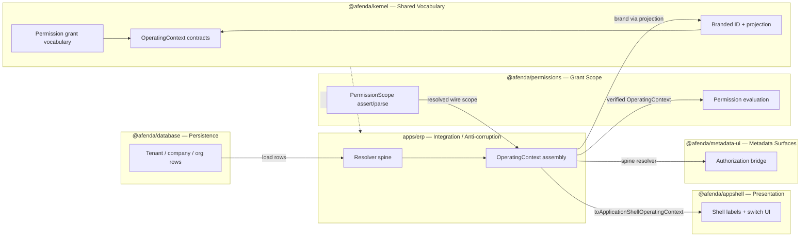

# PAS-001A — Kernel ERP Consumer Integration Standard (Production Candidate Rollout)

> **Derivation:** PAS-001 defines the **governed kernel language** ([PAS-001](PAS-001-KERNEL-AUTHORITY-STANDARD.md), B49–B70 closed). PAS-001A proves that **real ERP runtime speaks that language consistently** end-to-end through permissions, resolver spine, API/actions, AppShell, metadata surfaces, documentation, and gates. It does **not** amend PAS-001 §1–§16 kernel boundary doctrine or reopen kernel contract slices.
>
> **Scope lock (do not expand):** exactly six deliverables — (1) permission-scope ownership split proof, (2) ERP operating-context spine gate, (3) metadata/API/action integration proof, (4) documentation + runtime-matrix sync, (5) governance gates for consumer integration paths, (6) Production Candidate attestation. Not ledger runtime, not new kernel vocabulary, not UI/CSS migration.

| Field | Value |
| --- | --- |
| **PAS ID** | PAS-001A |
| **Document title** | Kernel ERP Consumer Integration Standard |
| **Parent PAS** | PAS-001 |
| **Document class** | `derived_consumer_integration_standard` |
| **Document role** | `kernel_erp_consumer_integration` · `production_candidate_rollout` |
| **Canonical filename** | `PAS-001A-KERNEL-ERP-PRODUCTION-INTEGRATION-STANDARD.md` |
| **Primary runtime owner** | `apps/erp/src/lib/context/` |
| **Layer** | Application integration (consumes Platform kernel) |
| **Package role** | Consumer integration proof — kernel operating-context vocabulary wired end-to-end through ERP resolver spine, permissions grant scope, database persistence, AppShell, metadata surfaces, and governance gates |
| **Runtime stance** | `integration-proven` (no new kernel contracts unless PAS-001 amendment slice) |
| **Registry lane** | `PKG010_KERNEL` (consumer) · `PKG-007 operating-context` |
| **Package owner** | Kernel Authority (vocabulary) · ERP Context (resolver spine) · Permissions (grant scope wire) |
| **Parent standards** | PAS-001 (kernel vocabulary — closed) · [multi-tenancy.md](../architecture/multi-tenancy.md) Step 8 |
| **Agent skills** | **`kernel-authority`** (mandatory) · `multi-tenancy-erp` · `/afenda-coding-session` · `/coding-consistency-bundle` |
| **Maturity** | Production Candidate (`production_candidate`) |
| **Authority status** | `approved_for_implementation` |
| **Implementation status** | `implemented` — B71–B75 Delivered; Production Candidate attested 2026-06-29 |
| **Evidence level** | `runtime` — all §6 scorecard gates green at B75 |
| **Runtime status** | Permission-scope wire triad in `@afenda/permissions`; kernel projection-only; ERP spine + metadata bridge gates operational |
| **Remaining slices** | none — B71–B75 Delivered |
| **Consumers** | `apps/erp`, `@afenda/permissions`, `@afenda/appshell`, `@afenda/metadata-ui`, `@afenda/ui-composition` |
| **Change model** | `serialized-slices` (B71+) |
| **Quality target** | Enterprise **9.5 / 10** |
| **Slice directory** | `docs/PAS/slice/` |
| **ADR prerequisites** | ADR-0011 (multi-level company) · ADR-0014 (foundation delivery) · ADR-0021–0023 (identity — read-only for branding paths) |

#### Required gates (baseline — must pass before any B71+ merge)

| # | Gate command |
| --- | --- |
| 1 | `pnpm --filter @afenda/kernel typecheck` |
| 2 | `pnpm --filter @afenda/kernel test:run` |
| 3 | `pnpm quality:kernel-context-surface` |
| 4 | `pnpm check:kernel-context-wire-triad` |
| 5 | `pnpm --filter @afenda/permissions typecheck` |
| 6 | `pnpm --filter @afenda/permissions test:run` |
| 7 | `pnpm --filter @afenda/erp typecheck` |
| 8 | `pnpm --filter @afenda/erp test:run` |
| 9 | `pnpm check:erp-context-surface` |
| 10 | `pnpm quality:boundaries` |
| 11 | `pnpm check:foundation-disposition` |

#### Required gates (PAS-001A — wired on slice close)

| # | Gate command | First slice |
| --- | --- | --- |
| 12 | `pnpm check:permission-scope-permissions-surface` | B71 (Delivered) |
| 13 | `pnpm check:erp-operating-context-spine` | B72 (Delivered) |
| 14 | `pnpm check:documentation-drift` | B73 (Delivered) |
| 15 | `pnpm check:metadata-context-authorization-bridge` | B74 (Delivered) |

> **Maturity is part of authority.**
> PAS-001 **Enterprise Accepted** is **closed** — do not reopen kernel vocabulary slices under PAS-001A without a PAS-001 amendment handoff.
> **Evidence promotion rule:** PAS-001A cannot become **Production Candidate** until B75 proves all §6 scorecard gates green **and** docs + runtime matrix are synced. Vocabulary closure (PAS-001) does not imply consumer integration closure (PAS-001A).

> **Kernel wire boundary (mandatory read):** [PAS-001](PAS-001-KERNEL-AUTHORITY-STANDARD.md) · [kernel-boundary-drift.registry.ts](../../packages/kernel/src/governance/kernel-boundary-drift.registry.ts) · `.cursor/skills/kernel-authority/SKILL.md`
> **ERP resolver authority:** [multi-tenancy.md](../architecture/multi-tenancy.md) · `apps/erp/src/lib/context/context-integration-registry.ts`
> **Canonical location:** `docs/PAS/PAS-001A-KERNEL-ERP-PRODUCTION-INTEGRATION-STANDARD.md`

---

# 0. Agent Quick Path

> Read **PAS-001 §0** (kernel boundary — closed), then this §0. Session: `/afenda-coding-session` · Bundle: `/coding-consistency-bundle` · Skills: **`kernel-authority` + `multi-tenancy-erp`** on every B71+ slice.

**Boundary (unchanged from PAS-001):** `@afenda/kernel` owns **cross-package facts and wire-safe shapes only**. PAS-001A proves **consumers** wire those shapes into production ERP without forking vocabulary or reintroducing resolver logic into kernel.

**Kernel is not the ERP runtime. Kernel is the accepted vocabulary consumed by ERP runtime.**

**PAS-001A adds (post–PAS-001 closure):**

| Topic | PAS-001 (closed) | PAS-001A target |
| --- | --- | --- |
| Permission scope | Dual slot documented (kernel branded + permissions resolved) | **Parser/assert owner = `@afenda/permissions`**; kernel **projection-only** branding for `OperatingContext` |
| Operating context | 10 required contracts + wire triads | **ERP spine proof** — every `CONTEXT_INTEGRATION_WIRING` delegate resolves via canonical resolvers |
| Metadata UI | Kernel shapes consumed by metadata packages | **Authorization bridge** — metadata actions receive verified `OperatingContext`, not local scope forks |
| Runtime matrix | Kernel row **implemented** | **Accounting readiness preview rows** upgraded only where B72+ gate evidence exists |
| Gates | `quality:kernel-context-surface` | **`check:erp-operating-context-spine`** (B72) + permission surface gate (B71) |
| Maturity | PAS-001 Enterprise Accepted | **PAS-001A Production Candidate** via B75 attestation only |

**Hard stops:**

- **Prohibited:** new resolver/database/auth logic in `packages/kernel/src/**`
- **Prohibited:** `@afenda/kernel` importing `@afenda/permissions` (kernel uses projection; ERP imports both)
- **Prohibited:** ERP defining parallel `PermissionScopeContext`, `TenantContext`, or grant vocabulary (**anti-corruption** — §4.1)
- **Prohibited:** kernel parsing untrusted wire input for permission scope (**runtime ingress** — §4.2)
- **Prohibited:** batching B72–B74 with B71 — permission ownership must land before spine gate assertions
- **Prohibited:** claim PAS-001A Production Candidate before B75 (**evidence promotion** — §4.3)
- **Required:** read `kernel-authority` + paste slice **9-field handoff** into Phase 0 before edits

**Execution rule:** one slice at a time, in order B71 → B75 unless `foundation-registry-owner` serializes registry-only work.

**Planner / registry:** `pas-slice-planner` · disposition changes → `foundation-registry-owner` only

---

# 1. Derivation and Scope

## 1.1 Why PAS-001A exists

PAS-001 closes when **kernel vocabulary is enterprise-gated**. Production ERP still requires proof that:

1. Resolved grant scope flows **permissions → ERP → kernel-branded `OperatingContext`**
2. Every protected surface (API, server action, RSC layout, AppShell, metadata workspace) uses the **same resolver spine**
3. Documentation and runtime matrix reflect **actual paths** (no stale kernel resolver files)
4. Governance gates enforce the spine **without manual review**

PAS-001A is the **kernel consumer integration PAS** — analogous to [PAS-004B](PAS-004B-ENTERPRISE-KNOWLEDGE-KERNEL-CONSUMER-STANDARD.md) (kernel consumer proof), but for **operating-context consumer wiring**.

## 1.2 Enterprise framing

| Enterprise principle | PAS-001A meaning |
| --- | --- |
| **TOGAF building-block discipline** | Kernel is the architecture building block; ERP resolver spine is the solution/integration proof |
| **DDD bounded context** | Kernel owns shared vocabulary; ERP, permissions, metadata, and AppShell remain separate consumers |
| **Context mapping** | §3 defines explicit relationships — no hidden coupling between bounded contexts |
| **ERP clean-core** | Kernel stays clean; extensions and integration belong outside the core |

## 1.3 In scope

| # | Deliverable | Owner path | Evidence |
| --- | --- | --- | --- |
| D1 | Permission-scope wire triad in `@afenda/permissions` | `packages/permissions/src/scope/permission-scope-context.{assert,parser,contract}.ts` | B71 gate + tests |
| D2 | Kernel branding projection only | `packages/kernel/src/context/permission-scope-context.projection.ts` | No parser in kernel; `wireIngress: false` in registry |
| D3 | ERP resolver spine | `apps/erp/src/lib/context/resolve-operating-context.server.ts` + registry | B72 gate scans `CONTEXT_INTEGRATION_WIRING` |
| D4 | Untrusted authority rejection | `reject-untrusted-authority-fields.ts` + API/action guards | `check:erp-context-surface` (existing) |
| D5 | Doc + matrix sync | `afenda-runtime-truth-matrix.md`, delivery doc §Context contracts | B73 `check:documentation-drift` |
| D6 | Metadata authorization bridge | metadata-ui + ui-composition consumers | B74 gate (proposed) |

## 1.4 Out of scope (explicit)

| Item | Owner | Notes |
| --- | --- | --- |
| Ledger / posting runtime | Future `@afenda/accounting` + ADR | PKGR01 contracts-only |
| `FiscalCalendarId` / `FiscalPeriodId` promotion | Finance ADR | Drift registry `pending` — waiver until ADR |
| New enterprise ID families (customer, supplier, …) | Domain PAS slices | PAS-001 §4.1.6 deferred table |
| CSS / presentation / shadcn strangler | PAS-005 / PAS-005A | Separate track |
| Knowledge atoms / semantic model | PAS-004 / PAS-004C | Kernel retains wire shapes only |
| PAS-001 kernel vocabulary amendment | PAS-001 amendment slice only | PAS-001A is integration proof, not hidden PAS-001 reopen |

---

# 2. Integration Architecture

## 2.1 Consumer spine (target state)

```text
HTTP / Server Action / RSC request
        │
        ▼
apps/erp  tenant-domain.server.ts          ← subdomain / session hints
        │
        ▼
apps/erp  resolve-grant-scope.server.ts   ← @afenda/permissions resolvePermissionScopeContext
        │
        ▼
@afenda/permissions  parse*/assert*       ← wire ingress (plain string ids)  [D1]
        │
        ▼
apps/erp  brandPermissionScopeContextFromUnknownWire  ← @afenda/kernel projection [D2]
        │
        ▼
apps/erp  resolve-consolidation-scope.server.ts
        │
        ▼
OperatingContext (branded kernel shape)     ← PAS-001 contracts
        │
        ├──► authorize-api-route / runProtectedMutation
        ├──► toApplicationShellOperatingContext → AppShell
        └──► metadata-workspace / module routes
```

## 2.2 Ownership split (canonical)

| Surface | Canonical owner | Kernel role |
| --- | --- | --- |
| `PermissionScopeWireContext` assert/parse | `@afenda/permissions` | — |
| `PermissionScopeContext` branded slot on `OperatingContext` | `@afenda/kernel` | `permission-scope-context.projection.ts` |
| Grant vocabulary (`PermissionGrantScopeType`, elevations) | `@afenda/kernel` | `permission-grant-vocabulary.contract.ts` |
| `resolvePermissionScopeContext` | `@afenda/permissions` | — |
| Full `OperatingContext` assembly | `apps/erp` | imports kernel + permissions |
| Persistence (tenant, company, org, membership) | `@afenda/database` | — |
| AppShell display labels / switch targets | `@afenda/appshell` | receives branded context from ERP |
| Metadata authorization evaluation | `@afenda/metadata-ui` + ERP bridge | consumes verified `OperatingContext` |

## 2.3 Integration registry (runtime authority)

Machine registry: [`apps/erp/src/lib/context/context-integration-registry.ts`](../../apps/erp/src/lib/context/context-integration-registry.ts)

B72 gate must verify every `CONTEXT_INTEGRATION_WIRING` entry:

- Module file exists
- Named `delegate` symbol is exported and referenced
- No forbidden deep imports (`@afenda/kernel/src`, `@afenda/database/dist`, …)

---

# 3. Context Map (Bounded Contexts)

Explicit relationships between consumer bounded contexts. **No hidden coupling** — every arrow must have a named owner module and gate evidence.



| Relationship | Pattern | Upstream | Downstream | Integration module |
| --- | --- | --- | --- | --- |
| Kernel → ERP | **Conformist** | Kernel contracts | ERP resolvers | `resolve-operating-context.server.ts` |
| Permissions → ERP | **Anti-corruption layer** | Wire grant scope | Branded `OperatingContext` slot | `resolve-grant-scope.server.ts` + kernel projection |
| Database → ERP | **Anti-corruption layer** | DB rows | Kernel-branded IDs | `tenant-domain.server.ts`, legal-entity resolvers |
| ERP → AppShell | **Published language** | `OperatingContext` | Display DTO only | `to-shell-operating-context.ts` |
| ERP → Metadata UI | **Shared kernel** | Verified context | Metadata authorization | B74 bridge modules |
| ERP → Permissions | **Customer/Supplier** | Context for checks | `checkPermission` | `authorize-api-route.ts` |

**Governance:** Any new cross-context link must add a row to this table **and** an entry in `CONTEXT_INTEGRATION_WIRING` before merge.

---

# 4. Integration Governance Rules

## 4.1 Anti-corruption rule

ERP (and other consumers) **may translate** permission, database, and session facts into kernel-branded `OperatingContext`. ERP **must not redefine** kernel vocabulary.

| Allowed | Prohibited |
| --- | --- |
| Map DB UUID strings → `parseTenantId` / branded IDs | Parallel `type TenantContext = { id: string }` in ERP |
| Assemble `OperatingContext` from resolver outputs | Fork `PermissionGrantScopeType` or grant elevation enums |
| Project accounting-readiness shapes in ERP layer | Add resolver logic to `packages/kernel/src/**` |
| Reject untrusted authority fields at API/action ingress | Accept client-supplied tenant/company/org IDs without server resolution |

**Enforcement:** `check:erp-context-surface` (authority guards) · B72 spine gate · `quality:boundaries`

## 4.2 Runtime ingress rule

Only **designated ingress boundaries** may parse untrusted wire input. Kernel receives **already-validated** wire shapes and applies **branding/projection only**.

| Ingress boundary | May parse untrusted wire | Kernel role |
| --- | --- | --- |
| `@afenda/permissions` assert/parser | Yes — permission scope wire | None |
| ERP API validation / server actions | Yes — reject untrusted authority fields | None |
| ERP operating-context resolvers | Yes — HTTP headers, session hints, DB rows | None |
| `@afenda/kernel` wire triads (tenant, company, …) | Yes — at kernel parser when wire enters kernel package | assert → parse → brand |
| `@afenda/kernel` permission-scope | **No wire ingress** | `brandPermissionScopeContextFromWire` projection only |
| AppShell / metadata-ui | **No** — receives verified branded context | None |

```text
untrusted input → permissions/API/resolver ingress → validated wire → kernel parse/brand → OperatingContext
```

**Violation examples (BLOCK):**

- `permission-scope-context.parser.ts` under kernel after B71
- Metadata workspace parsing raw tenant ID from client props
- Silent `as TenantId` without `parseTenantId`

## 4.3 Evidence promotion rule

PAS-001A maturity **cannot advance** without gate evidence. Manual doc claims do not promote status.

| From | To | Required evidence |
| --- | --- | --- |
| `partial` / `runtime_partial` | Slice delivered | Slice gate green + tests in slice handoff |
| All B71–B74 delivered | Production Candidate candidate | §6 scorecard 10/10 green |
| Production Candidate | **Closed in pas-status-index** | B75 attestation + `check:documentation-drift` + runtime matrix row updated |

**Prohibited promotions:**

- Mark runtime matrix `implemented` without corresponding gate output archived in slice doc
- Set PAS-001A `Remaining slices: none` before B75
- Treat PAS-001 Enterprise Accepted as PAS-001A closure

## 4.4 Hidden PAS-001 amendment guard

PAS-001A slices **must not**:

- Add new kernel contracts without a PAS-001 amendment handoff
- Expand kernel exports for ERP-only convenience types
- Move ERP/database resolvers into kernel "temporarily"

If kernel vocabulary change is required → **stop**, open PAS-001 amendment slice, do not implement under PAS-001A.

---

# 5. Slice Catalog (B71–B75)

| Slice | Doc | PAS section | Status | Closes |
| --- | --- | --- | --- | --- |
| B71 | [b71-permission-scope-permissions-parser.md](slice/b71-permission-scope-permissions-parser.md) | §2.2 D1–D2 · §4.2 | **Delivered** | Permission parser owner; kernel projection-only; gate `check:permission-scope-permissions-surface` |
| B72 | [b72-erp-operating-context-spine-gate.md](slice/b72-erp-operating-context-spine-gate.md) | §2.3 · §3 | **Delivered** | `check:erp-operating-context-spine`; integration registry + context map enforcement |
| B73 | [b73-kernel-erp-doc-drift-closure.md](slice/b73-kernel-erp-doc-drift-closure.md) | §1.3 D5 · §4.3 | **Delivered** | Runtime matrix + delivery doc + PAS-001 §9 rule-14 prose sync |
| B74 | [b74-metadata-context-authorization-bridge.md](slice/b74-metadata-context-authorization-bridge.md) | §1.3 D6 · §3 | **Delivered** | Metadata UI authorization uses verified operating context |
| B75 | [b75-pas001a-production-candidate-attestation.md](slice/b75-pas001a-production-candidate-attestation.md) | §6 · §4.3 | **Delivered** | Production Candidate scorecard + pas-status-index promotion |

**Dependency order:** B71 → B72 → B73 → B74 → B75 (B73 may parallel B72 only after B71 merges).

---

# 6. Production Candidate Scorecard (B75 target)

| # | Criterion | Evidence | Weight |
| --- | --- | --- | --- |
| 1 | Permission wire triad lives in `@afenda/permissions` | B71 gate green | Required |
| 2 | Kernel has no `permission-scope-context.parser.ts` | `check:kernel-package-structure` | Required |
| 3 | ERP uses kernel projection at assembly site | `resolve-operating-context.server.ts` + test | Required |
| 4 | Runtime ingress rule satisfied (§4.2) | B71 + B72 gates | Required |
| 5 | Anti-corruption rule satisfied (§4.1) | `check:erp-context-surface` green | Required |
| 6 | All `CONTEXT_INTEGRATION_WIRING` entries verified | B72 gate green | Required |
| 7 | Operating-context integration tests green | `apps/erp/src/lib/context/__tests__/` | Required |
| 8 | Context map rows have live integration modules | B72 + §3 table | Required |
| 9 | Metadata workspace uses spine resolver | B74 gate green | Required |
| 10 | `check:documentation-drift` green + matrix synced | B73 · §4.3 | Required |

**Pass threshold:** 10/10 required rows green. **Target score:** Enterprise 9.5+/10.

---

# 7. Closure Waivers (inherit from PAS-001 — not PAS-001A blockers)

These remain **documented partials** until domain ADRs land. Do not treat as PAS-001A failures:

| Waiver | Source | Owner |
| --- | --- | --- |
| `FiscalCalendarId` / `FiscalPeriodId` quarantine | PAS-001 B67 · drift registry | Finance ADR → `@afenda/accounting` |
| Additive `AppErrorCode` values | PAS-001 B67 | Kernel amendment slice (if ever) |
| Deferred ID families (customer, supplier, employee, document, asset) | PAS-001 §4.1.6 | Domain PAS |
| Ledger/posting runtime | PKGR01 prohibited | Foundation phase 15+ ADR |

---

# 8. Agent Skill Extension

**`.cursor/skills/kernel-authority/SKILL.md`** mirrors PAS-001A under `### PAS-001A — ERP consumer integration`.

When implementing B71+ slices, agents must load:

1. This document §0 + §3 Context Map + §4 Governance Rules
2. Target slice handoff (9 fields)
3. `kernel-authority` + `multi-tenancy-erp`

---

# 9. Doctrine

```text
PAS-001 defines the governed kernel language.
PAS-001A proves that real ERP runtime speaks that language consistently.

Kernel closure is vocabulary acceptance.
PAS-001A closure is production integration acceptance.
```

The kernel is not the ERP runtime. The kernel is the accepted vocabulary consumed by ERP runtime.

> If PAS-001A work requires new kernel words → stop and amend PAS-001 explicitly.
> If PAS-001A work wires existing kernel words through ERP → proceed under B71+ slices.

The kernel owns the words.
The owner package owns the decision.
The runtime layer owns the behavior.
PAS-001A proves the runtime layer speaks the words.

---

# 10. References

| Artifact | Path |
| --- | --- |
| Parent PAS | [PAS-001-KERNEL-AUTHORITY-STANDARD.md](PAS-001-KERNEL-AUTHORITY-STANDARD.md) |
| Consumer PAS analogue | [PAS-004B-ENTERPRISE-KNOWLEDGE-KERNEL-CONSUMER-STANDARD.md](PAS-004B-ENTERPRISE-KNOWLEDGE-KERNEL-CONSUMER-STANDARD.md) |
| Kernel tree | [packages/kernel/PAS-001-KERNEL-TREE.md](../../packages/kernel/PAS-001-KERNEL-TREE.md) |
| Context registry | [packages/kernel/src/context/context-registry.ts](../../packages/kernel/src/context/context-registry.ts) |
| Drift registry | [packages/kernel/src/governance/kernel-boundary-drift.registry.ts](../../packages/kernel/src/governance/kernel-boundary-drift.registry.ts) |
| ERP integration registry | [apps/erp/src/lib/context/context-integration-registry.ts](../../apps/erp/src/lib/context/context-integration-registry.ts) |
| Runtime matrix | [afenda-runtime-truth-matrix.md](../architecture/afenda-runtime-truth-matrix.md) |
| Slice index | [pas-status-index.md](pas-status-index.md) |
