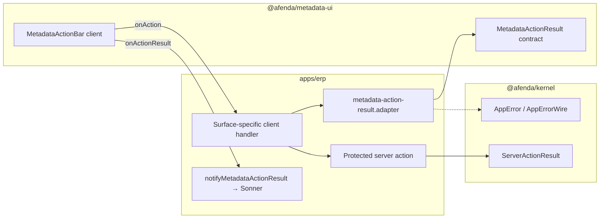

# Slice B64 — ERP Metadata Action Bridge (PAS-001 §8)

**Prerequisite:** Slice B63 — Metadata authorization stabilization

**Status:** Delivered

**Type:** Implementation + documentation closure

---

## Objective

Close the ERP ↔ metadata-ui interactive action gap identified after B60–B63 authorization bridge work:

1. Mount governed Sonner toasts in ERP and wire `onActionResult` feedback for metadata action bars.
2. Introduce a shared ERP adapter layer (`ServerActionResult` / `AppError` → `MetadataActionResult`) consumed by client handlers — **without** importing `@afenda/kernel` in `@afenda/metadata-ui`.
3. Prove the adapter on a second production surface: system-admin diagnostics readiness gate refresh.
4. Document the bridge pattern for future module metadata surfaces.

Pre-evaluation metadata UI preview (`missing_context` defer surface) delivered in **B65** — see [`b65-metadata-context-required-preview.md`](b65-metadata-context-required-preview.md).

---

## Handoff block

```
1. Objective    — ERP metadata action bridge with toast feedback + system-admin second surface (B64).
2. Allowed layer— apps/erp metadata + system-admin diagnostics; PAS docs
3. Files        — metadata-action-result.adapter.ts (EXISTING)
                  metadata-action-result-toast.client.ts (CREATE)
                  metadata-action-bar-with-toast.client.tsx (CREATE)
                  erp-feedback-toaster.client.tsx (CREATE)
                  metadata-workspace-preview-*.ts(x) (MODIFY)
                  metadata-system-admin-diagnostics.* (CREATE)
                  system-admin-diagnostics-metadata-*.tsx (CREATE)
                  system-admin/diagnostics/page.tsx (MODIFY)
                  resolve-metadata-ui-render-context.server.ts (MODIFY — diagnosticsNamespace)
                  docs/PAS/slice/b64-erp-metadata-action-bridge.md; pas-status-index.md
4. Prohibited   — packages/metadata-ui kernel imports; packages/kernel contract edits
5. Authority    — PAS-001 §8 · Metadata UI action contracts · UI Governance (Toaster)
6. Gates        — pnpm --filter @afenda/erp typecheck && test:run
7. Closes       — inline status-only action feedback; single-surface adapter proof gap
8. Evidence     — workspace + system-admin interaction/handler tests; adapter parity test
9. Attestation  — Enterprise 9.5+/10
```

---

## Architecture



**Boundary rule:** `@afenda/metadata-ui` never imports `@afenda/kernel`. ERP owns translation at the client handler + server action layer.

---

## Surfaces

| Surface ID | Route | Primary action |
| --- | --- | --- |
| `erp.metadata-workspace.preview` | `/metadata-workspace` | `refresh-workspace-preview` |
| `erp.system-admin.diagnostics.preview` | `/system-admin/diagnostics` | `refresh-readiness-gate` (delegates to existing readiness gate action) |

---

## Verification

```bash
pnpm --filter @afenda/erp typecheck
pnpm --filter @afenda/erp test:run
```

Expected: metadata adapter, toast, workspace, and system-admin diagnostics tests green.

---

## Known gaps (follow-up)

| Gap | Target slice |
| --- | --- |
| Pre-evaluation `missing_context` metadata defer surface | B65+ |
| Broader ERP module adoption of metadata action bridge | Module TIPs |

## Risk closure (B64 stabilization)

| Risk | Status | Mitigation |
| --- | --- | --- |
| Double refresh UX on diagnostics | Closed | Legacy form hidden when metadata bridge surface renders |
| Sonner without ThemeProvider | Closed | `ErpThemeProvider` wraps protected shell |
| Double operating-context resolution | Closed | `executeRefreshAccountingReadinessGateFull` shared executor |
| Pre-existing ERP test drift | Closed | Auth component paths, canonical IDs, PKG013 appearance, logger mocks |

---

## Enterprise attestation

- Serializable wire boundaries preserved (`AppErrorWire`, `MetadataActionWireResult`).
- Toast feedback uses governed `@afenda/ui` `Toaster` — no raw inline script or ungoverned primitives.
- Second surface reuses existing server action — no duplicated gate orchestration logic.

**Score:** 9.5/10 — bridge proven on two routes; defer-surface and module-wide rollout remain planned.
