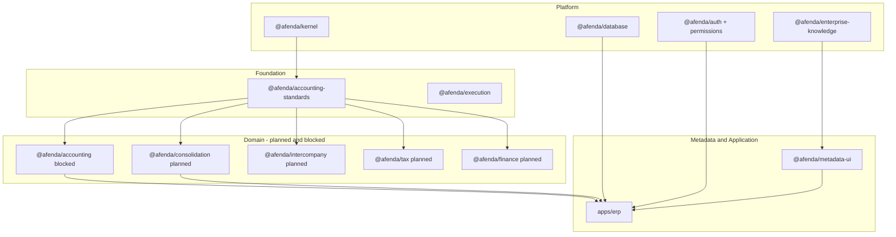

# Afenda Architecture Blueprint

| Field | Value |
| --- | --- |
| **Document class** | `architecture_blueprint` |
| **Authority** | [ADR-0026](../adr/ADR-0026-platform-north-star-and-architecture-blueprint.md) |
| **Canonical location** | `docs/architecture/afenda-architecture-blueprint.md` |
| **North Star** | [afenda-platform-north-star.md](afenda-platform-north-star.md) |
| **Machine truth** | [package-registry.md](package-registry.md) · [layer-registry.md](layer-registry.md) · [dependency-registry.md](dependency-registry.md) · [foundation-disposition.md](foundation-disposition.md) |
| **Does not confer** | Runtime APIs, contracts, slice handoffs, or registry rows |
| **Total PAS at maturity** | `~15 root PAS · ~25+ total documents (including derived extensions)` |
| **Live PAS today** | `15 documents` (PAS-001 family, PAS-002 family, PAS-003, PAS-004 family, **PAS-006 family**; PAS-005 family **retired for ERP**) |
| **Last reviewed** | 2026-06-29 (ADR-0027 frontend presentation reset · PAS-003 documentation-audit sync) |
| **Planned PAS** | `9+ root PAS` (accounting runtime, consolidation, intercompany, tax, finance, reporting, HRM, CRM, procurement) |

> **One sentence:** The Architecture Blueprint declares **what packages and domain authorities exist, why each exists, how they compose, and which PAS governs each box** — so PAS documents are discovered, not invented.

---

## Purpose

Before authoring or extending a PAS, answer from this document:

1. **What** package or domain authority is in scope?
2. **Why** does it exist as its own box (not merged into kernel, ERP app, or another domain)?
3. **Which layer** owns it?
4. **Who consumes** it and **what depends** on it?
5. **Which PAS** (existing or planned) standardizes it?

**Rule:** A PAS **Consumers** metadata field may list only packages declared here (status `live`, `planned`, or `blocked`). Undeclared phantom consumers are prohibited ([ADR-0026](../adr/ADR-0026-platform-north-star-and-architecture-blueprint.md)).

**Rule:** This document **references** registries for census data. Do not duplicate PKG-* tables here — edit registries via `foundation-registry-owner` when promoting `planned` → `active`.

---

## Agent execution rule

A coding agent must read documents in this order:

1. `afenda-platform-north-star.md`
2. `afenda-architecture-blueprint.md`
3. Relevant ADRs only when cited by the Blueprint or PAS
4. Target PAS
5. Target PAS slice

The agent must not create packages, consumers, PAS documents, or runtime code unless the package/domain authority is declared in the Blueprint and permitted by PAS maturity.

See also [Documentation doctrine](afenda-platform-north-star.md#documentation-doctrine) in the Platform North Star.

---

## PAS creation gate

A new PAS may be created only when **all** of the following are true:

1. The box exists in this Blueprint.
2. The box has a declared layer.
3. The box has a reason to exist separately (not merged into kernel, ERP app, or another domain).
4. The box has a status of `live`, `planned`, or `blocked`.
5. The PAS number is assigned from the [PAS index](../PAS/README.md) — numbers are never reused.
6. Any required ADR exists for irreversible or cross-cutting decisions (e.g. ADR-0010 before accounting runtime PAS).

If any condition fails, stop and update the Blueprint (and ADR/registry if needed) before authoring PAS content.

---

## Layer map

Afenda uses eight layers. **Machine assignments:** [`layer-registry.md`](layer-registry.md).

| Layer | Platform role | Blueprint intent |
| --- | --- | --- |
| **Platform** | Shared truth — identity, persistence, kernel, permissions, observability, governance, knowledge | Stable contracts consumed by all higher layers |
| **Design** | ERP frontend visual truth — `@afenda/shadcn-studio` only (ADR-0027) | No business rules; stock MCP surfaces during stabilization |
| **Foundation** | Shared infrastructure — execution, storage, standards authority | Cross-domain services that are not "business modules" |
| **Metadata** | Rendering truth — metadata contracts and metadata UI | Describes surfaces; does not own domain posting |
| **Integration** | Cross-cutting — entitlements, feature flags, test utilities | Wires platform to apps without domain logic |
| **ERPSpine** | Operating shell — navigation, layout, command center | ERP chrome; not domain runtime |
| **Domain** | Business truth — accounting, inventory, HRM, CRM, procurement, … | One package family per LoB authority |
| **Application** | Delivery — ERP, docs, Storybook, email preview | Composes platform + domain; never owns canonical rules |

---

## Platform families (live)

Narrative **why** only. Paths, PKG IDs, and lifecycle: [`package-registry.md`](package-registry.md).

| Family | Representative packages | Why it exists | Capability presented |
| --- | --- | --- | --- |
| **Governance** | `@afenda/architecture-authority`, `@afenda/ai-governance` | Prevent architectural entropy; enforce registry-first rules | "Is this package/layer/dependency allowed?" |

**Domain blueprint (Architecture authority):** [`docs/BLUEPRINT/architecture-authority-blueprint.md`](../BLUEPRINT/architecture-authority-blueprint.md) — registry surfaces, E2E integration chain, PAS-002/002A handoff. **Domain North Star:** [`docs/NORTHSTAR/architecture-authority-north-star.md`](../NORTHSTAR/architecture-authority-north-star.md).
| **Kernel & context** | `@afenda/kernel` | Single wire vocabulary for IDs, contexts, ERP domain catalog | Serializable platform contracts at boundaries |
| **Identity & access** | `@afenda/auth`, `@afenda/permissions`, `@afenda/entitlements` | Separate authentication, authorization, and capability gating | Secure, tenant-scoped operations |
| **Persistence** | `@afenda/database` | One schema and migration authority | Tenant-safe data access |
| **Knowledge** | `@afenda/enterprise-knowledge` | Accepted enterprise meaning is not duplicated in kernel or registries | Discoverable atoms with acceptance chains |

**Domain blueprint (Enterprise knowledge):** [`docs/BLUEPRINT/enterprise-knowledge-blueprint.md`](../BLUEPRINT/enterprise-knowledge-blueprint.md) — Concept → Atom → Representation, promotion pipeline, PAS-004 family E2E. **Domain North Star:** [`docs/NORTHSTAR/enterprise-knowledge-north-star.md`](../NORTHSTAR/enterprise-knowledge-north-star.md).
| **Standards** | `@afenda/accounting-standards` | Versioned IFRS/MFRS evidence is not embedded in posting code | Standards-backed validation before workflows |
| **Execution & storage** | `@afenda/execution`, `@afenda/storage` | Durable jobs and tenant object storage without domain coupling | Reliable async and file handling |
| **Observability** | `@afenda/observability` | Audit and diagnostics are platform-owned | Traceable, redacted operational evidence |
| **Design system (ERP frontend)** | `@afenda/shadcn-studio` only | Stock shadcn/studio via MCP; unprefixed CSS vars; legacy `@afenda/css-authority`, `@afenda/ui`, `@afenda/appshell` **retired for ERP** ([ADR-0027](../adr/ADR-0027-frontend-presentation-reset.md)) | Consistent shadcn/studio surfaces |

**Domain blueprint (Presentation):** [`docs/BLUEPRINT/shadcn-studio-presentation-blueprint.md`](../BLUEPRINT/shadcn-studio-presentation-blueprint.md) — PKG-026 single box. **Domain North Star:** [`docs/NORTHSTAR/shadcn-studio-presentation-north-star.md`](../NORTHSTAR/shadcn-studio-presentation-north-star.md).
| **Metadata UX (ERP)** | `apps/erp/src/lib/metadata/` *(interim — ADR-0027)* | Metadata render contracts live in ERP until PAS-006D; legacy `@afenda/metadata-ui` **retired** | Composable surfaces via ERP-local runtime + B111 extension boundary |
| **ERP shell (presentation)** | `apps/erp` · PAS-006A | Shell chrome on PAS-006 skeleton; legacy `@afenda/appshell` **retired** | Navigation and layout spine (P006-01 protected routes) |
| **Applications** | `apps/erp`, `apps/docs`, `apps/storybook` | Delivery surfaces compose authorities | Operator-facing product |

Each live family with a PAS is listed in [Blueprint → PAS traceability](#blueprint--pas-traceability) below.

---

## Domain decomposition

Forward-looking **business domain** map. Status values:

| Status | Meaning |
| --- | --- |
| **live** | Package or runtime surface exists; see registry + runtime matrix |
| **planned** | Declared in Blueprint; not yet PKG/PAS or not yet implemented |
| **blocked** | Declared but ADR-gated (no implementation until gate clears) |
| **retired** | Superseded; historical reference only |

### Accounting & finance domain

The accounting domain is **intentionally decomposed**. Standards authority, posting runtime, group reporting, intercompany, tax, and management finance are separate boxes — not one monolith.

**Domain blueprint (Accounting standards authority):** [`docs/BLUEPRINT/accounting-standards-blueprint.md`](../BLUEPRINT/accounting-standards-blueprint.md) — authority consumption layer, E2E integration chain, PAS-003 handoff. **Domain North Star:** [`docs/NORTHSTAR/accounting-standards-north-star.md`](../NORTHSTAR/accounting-standards-north-star.md).

```text
                    @afenda/accounting-standards (PAS-003)
                              │
         standards-backed validation & evidence
                              │
    ┌─────────────┬───────────┼───────────┬─────────────┐
    ▼             ▼           ▼           ▼             ▼
accounting   consolidation  intercompany   tax        finance
(runtime)    (runtime)      (runtime)   (runtime)  (runtime)
    │             │           │           │             │
    └─────────────┴───────────┴───────────┴─────────────┘
                              │
                    reporting (runtime, planned)
                              │
                         apps/erp (surfaces)
```

| Blueprint box | Package | Layer | Status | Why separate | PAS |
| --- | --- | --- | --- | --- | --- |
| Accounting standards authority | `@afenda/accounting-standards` | Foundation | **live** | Versioned IFRS/MFRS/SFRS evidence and deterministic validation — not posting | [PAS-003](../PAS/ACCOUNTING-STANDARDS/PAS-003-ACCOUNTING-STANDARDS-AUTHORITY-STANDARD.md) |
| Accounting vocabulary (contracts) | `@afenda/kernel` (`erp-domain/accounting`) | Platform | **live** | Wire vocabulary only; not ledger runtime ([ADR-0020](../adr/ADR-0020-master-data-authority-consolidation.md)) | [PAS-001](../PAS/KERNEL/PAS-001-KERNEL-VOCABULARY-AUTHORITY-STANDARD.md) · [PAS-001B](../PAS/KERNEL/PAS-001B-ERP-WIRE-VOCABULARY-CATALOG-STANDARD.md) |
| Accounting runtime | `@afenda/accounting` | Domain | **blocked** | Journal posting, ledger mutation, COA runtime — distinct from standards | Planned PAS-006+ (after ADR-0010 gate) |
| Consolidation runtime | `@afenda/consolidation` | Domain | **planned** | Group consolidation calculations — not standards metadata | Planned PAS (TBD) |
| Intercompany runtime | `@afenda/intercompany` | Domain | **planned** | IC pricing, eliminations, matching — not tax filing | Planned PAS (TBD) |
| Tax runtime | `@afenda/tax` | Domain | **planned** | Tax computation and filing workflows — not IFRS presentation | Planned PAS (TBD) |
| Finance / management reporting | `@afenda/finance` | Domain | **planned** | Management reporting and finance ops — not GL posting | Planned PAS (TBD) |
| Financial reporting (statements) | `@afenda/reporting` | Domain | **planned** | Statement generation and disclosure packs — consumes accounting + consolidation | Planned PAS (TBD) |

**Accounting runtime gate:** `@afenda/accounting` posting/ledger implementation remains **blocked** until [ADR-0010](../adr/ADR-0010-no-accounting-before-foundation-gate.md) **and** a new ADR amends `PKGR01_ACCOUNTING` prohibited rules in the disposition registry.

**Retired:** Standalone `@afenda/accounting` package (PKG-R01) — vocabulary consolidated into kernel per ADR-0020. Do not recreate without Blueprint + ADR update.

### ERP business domains (non-accounting)

| Blueprint box | Package | Layer | Status | Why separate | PAS |
| --- | --- | --- | --- | --- | --- |
| Inventory master data & stock | `@afenda/database` + `apps/erp` | Platform + Application | **live** | Physical master data in database layer per ADR-0020 | [ADR-0019](../adr/ADR-0019-inventory-domain-master-data-activation.md) · kernel inventory vocabulary PAS-001B |
| Inventory domain package | `@afenda/inventory` | Domain | **retired** | Runtime consolidated — do not recreate PKG-R02 path | — |
| Procurement | `@afenda/procurement` | Domain | **planned** | Source-to-pay LoB — distinct from inventory movement | Planned PAS (TBD) |
| HRM | `@afenda/hrm` | Domain | **planned** | People operations LoB | Planned PAS (TBD) |
| CRM | `@afenda/crm` | Domain | **planned** | Customer lifecycle LoB | Planned PAS (TBD) |

Kernel ERP domain catalog ([PAS-001B](../PAS/KERNEL/PAS-001B-ERP-WIRE-VOCABULARY-CATALOG-STANDARD.md)) lists vocabulary for domains above; it does **not** imply runtime delivery.

---

## Composition flow (domain level)



---

## PAS Inventory

**Total PAS planned at Blueprint maturity: ~15 root PAS · ~25+ total documents**

This table is the canonical count. Every PAS row must trace back to a Blueprint box above. When a new PAS is authored, add it here and update the metadata table counts at the top of this document.

| PAS | Title | Blueprint box | Live slices / Total slices | Status |
| --- | --- | --- | --- | --- |
| PAS-001 | Kernel Authority Standard | Kernel & context | Multiple / TBD | Enterprise Accepted |
| PAS-001A | ERP Integration Spine | Kernel & context | B71–B75 historical · B111 skeleton · PAS-001A-R1 pending | Production Candidate (doctrine) · runtime partial |
| PAS-001B | Kernel ERP Domain Vocabulary Catalog | Kernel & context | B76–B106 closed | Enterprise Accepted · catalog authority |
| PAS-001C | ERP Module Foundation Standard | ERP Module Runtime Foundation | ERP-MOD-FDN-003 Delivered | Production Candidate · foundation_authority |
| PAS-002 | Architecture Authority | Governance | Multiple / TBD | MVP Authority |
| PAS-002A | Architecture Authority extension | Governance | — / TBD | Enterprise Accepted |
| PAS-003 | Accounting Standards Authority | Accounting standards authority | B0–B11 + B13–B16 delivered / B12 pending | Production Candidate |
| PAS-004 | Enterprise Knowledge Standard | Knowledge | Multiple / TBD | MVP → Production Candidate |
| PAS-004A | Enterprise Knowledge extension A | Knowledge | — | Production Candidate |
| PAS-004B | Enterprise Knowledge Kernel Consumer | Knowledge | — | Production Candidate |
| PAS-004C | Enterprise Knowledge Semantic Model | Knowledge | — | Production Candidate |
| PAS-004D | Enterprise Knowledge Operational Closure | Knowledge | — | Production Candidate |
| PAS-006 | shadcn/studio Frontend Standard (charter) | Design (ERP) | — | MVP Authority |
| PAS-006A | shadcn/studio Product Standard | Design (ERP) | 1 / 1 | Production Candidate |
| PAS-006B | Inventory & Production Pipeline | Design (ERP) | 0 / 3 | Proposed |
| PAS-006C | Surface Acceptance (ACPA) | Design (ERP) | 0 / 3 | Proposed |
| PAS-006D | Metadata-Driven Surfaces | Design (ERP) | 0 / 2 | Proposed |
| PAS-005 | CSS Authority Standard | Design (archived) | Retired for ERP — B26–B37 historical | Retired |
| PAS-005A | shadcn/studio Presentation | Design (archived) | Merged into PAS-006 | Retired |
| PAS-005B | Design System Retirement | Design (archived) | Superseded by ADR-0027 cutover | Retired |
| PAS-006+ | Accounting Runtime | Accounting runtime | 0 / TBD | Blocked — ADR-0010 |
| Planned | Consolidation | Consolidation runtime | 0 / TBD | Planned |
| Planned | Intercompany | Intercompany runtime | 0 / TBD | Planned |
| Planned | Tax | Tax runtime | 0 / TBD | Planned |
| Planned | Finance / Management Reporting | Finance / management reporting | 0 / TBD | Planned |
| Planned | Financial Reporting | Financial reporting (statements) | 0 / TBD | Planned |
| Planned | HRM | HRM | 0 / TBD | Planned |
| Planned | CRM | CRM | 0 / TBD | Planned |
| Planned | Procurement | Procurement | 1 / TBD | Planned · [Procurement NS](../NORTHSTAR/procurement-north-star.md) · [readiness scaffold](../PAS/ERP-MODULES/PROCUREMENT/procurement-runtime-readiness-report.md) · ERP-PROC-FDN-001 Delivered |

> **Rule:** A PAS may be marked Live only when its Blueprint box is `live` and at least one slice is Delivered. Update `Live slices / Total slices` on every slice close.

---

## Blueprint → PAS traceability

**Every governed box → one PAS.** Derived extensions use `PAS-NNNA` without amending parent §1–§16 unless an explicit amendment slice says so.

| Blueprint box | Package / surface | PAS | Maturity (see PAS index) |
| --- | --- | --- | --- |
| Kernel | `@afenda/kernel` | PAS-001, PAS-001A, PAS-001B | Enterprise Accepted · PAS-001A doctrine PC · runtime partial (ADR-0027 skeleton) |
| ERP module runtime foundation | `@afenda/erp-module-foundation` | PAS-001C | Production Candidate · [Blueprint](../BLUEPRINT/erp-module-runtime-blueprint.md) |
| Architecture authority | `@afenda/architecture-authority` | PAS-002, PAS-002A | MVP / Enterprise Accepted |
| Accounting standards | `@afenda/accounting-standards` | PAS-003 | Production Candidate |
| Enterprise knowledge | `@afenda/enterprise-knowledge` | PAS-004 … PAS-004D | MVP → Production Candidate |
| shadcn/studio (ERP frontend) | `@afenda/shadcn-studio` | PAS-006, PAS-006A–006D | Production Candidate — not Enterprise Accepted until P06-010 |
| CSS authority (archived) | `@afenda/css-authority` | PAS-005 | Retired for ERP |
| Legacy UI/appshell (archived for ERP) | `@afenda/ui`, `@afenda/appshell` | — | Retired for ERP consumer paths |
| Accounting runtime | `@afenda/accounting` | *Planned PAS-006+* | Not started — blocked |
| Consolidation | `@afenda/consolidation` | *Planned* | Not started |
| Intercompany | `@afenda/intercompany` | *Planned* | Not started |
| Tax | `@afenda/tax` | *Planned* | Not started |
| Finance | `@afenda/finance` | *Planned* | Not started |
| Reporting | `@afenda/reporting` | *Planned* | Not started |
| HRM / CRM / Procurement | respective `@afenda/*` | *Planned* | Reserved in package registry |

Packages without a PAS today (auth, database, permissions, appshell, etc.) are governed by ADRs, registries, and domain guides until promoted to PAS when boundary complexity crosses the governance threshold ([`docs/PAS/README.md`](../PAS/README.md)).

---

## How to add a Blueprint box

1. Confirm the box is not already owned by an existing package (read [Platform North Star](afenda-platform-north-star.md) capability expectations).
2. Add a row to the appropriate **Domain decomposition** table with status `planned`, layer, and **why separate**.
3. If the box will become a workspace package, open an ADR and delegate registry promotion to `foundation-registry-owner`.
4. When ready to standardize boundaries, satisfy the [PAS creation gate](#pas-creation-gate) — then assign the next `PAS-NNN` from the index and copy templates from `.cursor/skills/kernel-authority/reference/pas-doc-template.md`.
5. Do **not** implement code until PAS maturity allows ([`docs/PAS/README.md`](../PAS/README.md) maturity labels).

---

## Explicit non-content

This Blueprint must **not** contain:

- PKG-* inventory tables (use [`package-registry.md`](package-registry.md))
- Layer assignment tables (use [`layer-registry.md`](layer-registry.md))
- Dependency edge lists (use [`dependency-registry.md`](dependency-registry.md))
- Lane / gate / evidence rows (use [`foundation-disposition.md`](foundation-disposition.md))
- Runtime API shapes, TypeScript contracts, or SQL schema
- Slice handoffs (`docs/PAS/CSS-AUTHORITY/SLICE/`)
- Implementation sequences (live inside each PAS §10–§12)
- Feature implementation roadmaps outside PAS §10–§12

---

## Related documents

| Document | Role |
| --- | --- |
| [afenda-platform-north-star.md](afenda-platform-north-star.md) | Platform why + capability expectations |
| [foundation-delivery-authority.md](foundation-delivery-authority.md) | PAS implementation workflow |
| [docs/PAS/README.md](../PAS/README.md) | PAS index and maturity |
| [afenda-runtime-truth-matrix.md](afenda-runtime-truth-matrix.md) | What is live today (evidence matrix) |
| [shadcn-studio-presentation-north-star.md](../NORTHSTAR/shadcn-studio-presentation-north-star.md) | shadcn/studio Presentation domain NS |
| [shadcn-studio-presentation-blueprint.md](../BLUEPRINT/shadcn-studio-presentation-blueprint.md) | shadcn/studio Presentation blueprint |
