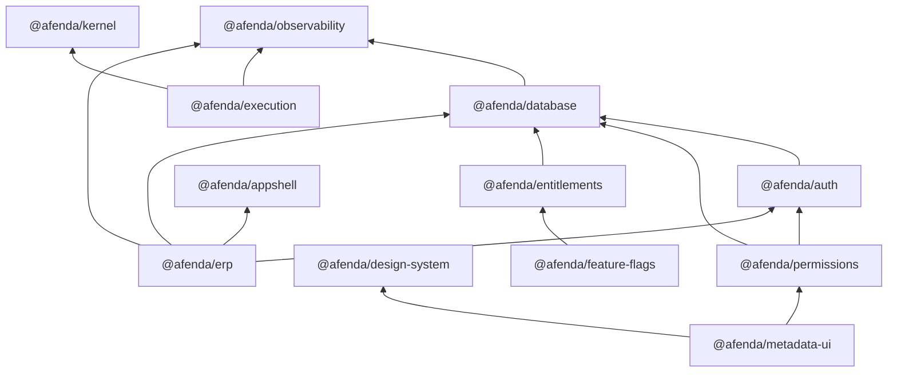

# Architecture Authority Baseline Report

| Field | Value |
|-------|-------|
| **Report** | ARCHITECTURE BASELINE REPORT |
| **Status** | TIP-001A COMPLETE — TIP-000D documentation authority closeout |
| **Date** | 2026-06-28 (fingerprint bump) |
| **Owner** | Architecture Authority |
| **TIP** | TIP-001A — Architecture Baseline Discovery |
| **Authority version** | `1.0.0` (`@afenda/architecture-authority`) |

---

## Baseline Fingerprint

Immutable identifier for this audit artifact. Any material edit to active workspaces, dependencies, layers, or owners requires a new fingerprint version and explicit sign-off.

| Component | Count |
|-----------|-------|
| Active workspaces | 18 |
| Planned workspaces | 0 |
| Runtime dependency edges | 14 |
| Architectural layers | 8 |
| Active package owners | 18 |

```text
Fingerprint: ARCH-BASELINE-2026-06-28-v5
```

**v2 change (2026-06-23):** Documentation authority closeout (TIP-000D). ADR-0009–0013 Accepted; runtime truth matrix, pre-accounting roadmap, tip-status-index, and `pnpm quality:documentation-drift` enforced. No workspace topology change from v1.

---

## Executive Summary

This report freezes the Afenda monorepo architecture as of 2026-06-20. It is the human-readable source of truth aligned with the `@afenda/architecture-authority` package (TIP-001C) and ADR constitution (TIP-001B).

**Discovery result:** 18 active workspaces discovered in the filesystem. Zero planned filesystem workspaces. Zero unknown packages. Zero circular dependencies against the proposed model.

**Validation scope:** Baseline registries and machine contracts validate against the **Accepted** layering and dependency model in [`layer-registry.md`](layer-registry.md) and [`dependency-registry.md`](dependency-registry.md). CI gates enforce via `pnpm quality:architecture` and `pnpm quality:architecture-drift`.

---

## Discovery Method

1. Enumerated workspaces via [`pnpm-workspace.yaml`](../../pnpm-workspace.yaml) globs (`apps/*`, `packages/*`).
2. Read live `package.json` for each workspace — name, `dependencies`, `devDependencies`.
3. Cross-referenced with [`scripts/quality/check-package-boundaries.mjs`](scripts/quality/check-package-boundaries.mjs) discovery rules.
4. Proposed layer and ownership assignments per ADR-0001 Phase 1 intent (draft — pending ADR-0002–0004).
5. Validated dependency graph for cycles and draft layer-rule violations.

---

## Metrics

| Metric | Target | Actual | Result |
|--------|--------|--------|--------|
| Active workspace packages discovered | 100% | 18/18 | PASS |
| Planned workspaces documented | — | 0 | PASS |
| Package ownership assigned (active) | 100% | 18/18 | PASS |
| Single owner per active package | 100% | 18/18 | PASS |
| Runtime deps mapped | 100% | 14/14 edges | PASS |
| Unknown packages | 0 | 0 | PASS |
| Circular dependencies (proposed model) | 0 | 0 | PASS |
| Layer rule violations (proposed model) | 0 | 0 | PASS |
| Exception / deprecated runtime dependencies | 0 | 0 | PASS |

---

## Active Workspaces (18)

Inventory represents **filesystem reality** only. Packages with a `package.json` under `apps/*` or `packages/*`.

| # | Package | Path | Layer | Owner | Runtime deps |
|---|---------|------|-------|-------|--------------|
| 1 | `@afenda/appshell` | `packages/appshell` | ERPSpine | ERP Spine Authority | — |
| 2 | `@afenda/architecture-authority` | `packages/architecture-authority` | Platform | Architecture Authority | — |
| 3 | `@afenda/auth` | `packages/auth` | Platform | Platform Authority | database |
| 4 | `@afenda/database` | `packages/database` | Platform | Platform Authority | observability |
| 5 | `@afenda/design-system` | `packages/design-system` | Design | Design Authority | — |
| 6 | `@afenda/docs` | `apps/docs` | Application | Application Authority | — |
| 7 | `@afenda/entitlements` | `packages/entitlements` | Integration | Platform Authority | database |
| 8 | `@afenda/erp` | `apps/erp` | Application | Application Authority | appshell, auth, database, observability |
| 9 | `@afenda/execution` | `packages/execution` | Foundation | Platform Authority | kernel, observability |
| 10 | `@afenda/feature-flags` | `packages/feature-flags` | Integration | Platform Authority | entitlements |
| 11 | `@afenda/kernel` | `packages/kernel` | Foundation | Platform Authority | — |
| 12 | `@afenda/metadata-ui` | `packages/metadata-ui` | Metadata | Metadata Authority | design-system, permissions |
| 13 | `@afenda/observability` | `packages/observability` | Platform | Platform Authority | — |
| 14 | `@afenda/permissions` | `packages/permissions` | Platform | Platform Authority | auth, database |
| 15 | `@afenda/storage` | `packages/storage` | Foundation | Platform Authority | — |
| 16 | `@afenda/testing` | `packages/testing` | Integration | Platform Authority | — |
| 17 | `@afenda/typescript-config` | `packages/typescript-config` | Platform (tooling) | Platform Authority | — |
| 18 | `@afenda/ui` | `packages/ui` | Design | Design Authority | — |

---

## Planned Workspaces (0)

No filesystem-planned workspaces. Reserved domain slots are documented in [`package-registry.md`](package-registry.md).

---

## Dependency Authority Classification

Every runtime `@afenda/*` edge is classified. Future edges may use `Exception` or `Deprecated` (requires ADR-0005).

| Consumer | Dependency | Classification | ADR | Expires |
|----------|------------|------|-----|---------|
| `@afenda/auth` | `@afenda/database` | Approved | — | — |
| `@afenda/database` | `@afenda/observability` | Approved | — | — |
| `@afenda/entitlements` | `@afenda/database` | Approved | — | — |
| `@afenda/erp` | `@afenda/appshell` | Approved | — | — |
| `@afenda/erp` | `@afenda/auth` | Approved | — | — |
| `@afenda/erp` | `@afenda/database` | Approved | — | — |
| `@afenda/erp` | `@afenda/observability` | Approved | — | — |
| `@afenda/execution` | `@afenda/kernel` | Approved | — | — |
| `@afenda/execution` | `@afenda/observability` | Approved | — | — |
| `@afenda/feature-flags` | `@afenda/entitlements` | Approved | — | — |
| `@afenda/metadata-ui` | `@afenda/design-system` | Approved | — | — |
| `@afenda/metadata-ui` | `@afenda/permissions` | Approved | — | — |
| `@afenda/permissions` | `@afenda/auth` | Approved | — | — |
| `@afenda/permissions` | `@afenda/database` | Approved | — | — |

**Classification legend**

| Classification | Meaning |
|----------------|---------|
| `Approved` | Declared runtime edge; permitted under proposed layer model |
| `Dev-only exempt` | `devDependencies` only; see [`dependency-registry.md`](dependency-registry.md) |
| `Exception` | Permitted by ADR-0005 exception registry |
| `Deprecated` | Still present; consumers must migrate |
| `Blocked` | Explicitly forbidden; see blocked patterns in dependency registry |

---

## Dependency Graph (runtime `@afenda/*` only)



---

## Violations

| ID | Severity | Package | Rule | Detail |
|----|----------|---------|------|--------|
| — | — | — | — | No violations detected against the proposed layering and dependency model pending ADR approval |

---

## Architecture Risks

Risks identified at baseline. Not violations — tracked for governance closeout.

| Risk | Impact | Likelihood | Owner | Mitigation |
|------|--------|------------|-------|------------|
| Architecture Authority package not implemented | High | Medium | Architecture Authority | **Resolved** — TIP-001C complete |
| Dependency drift before TIP-001E CI gate | Medium | High | Platform Authority | **Mitigated** — drift gate active |
| Missing exception governance (ADR-0005) | Medium | Medium | Architecture Authority | TIP-001B |
| Missing lifecycle governance (ADR-0006) | Medium | Medium | Architecture Authority | TIP-001B + [`package-lifecycle.md`](package-lifecycle.md) |
| Proposed layer model not ADR-backed | Medium | High | Architecture Authority | TIP-001B ADR-0002–0004 |
| AI creates unregistered packages | High | Medium | Architecture Authority | TIP-001E enforcement + TIP-001G lifecycle |
| Silent baseline edits without fingerprint bump | Low | Medium | Architecture Authority | Fingerprint + sign-off on change |

---

## Gaps (expected — not violations)

| Gap | Resolution |
|-----|------------|
| Human sign-off on baseline | Pending Architecture Authority |

---

## Related Artifacts

| Document | Path |
|----------|------|
| Package registry | [`package-registry.md`](package-registry.md) |
| Ownership registry | [`ownership-registry.md`](ownership-registry.md) |
| Dependency registry | [`dependency-registry.md`](dependency-registry.md) |
| Layer registry | [`layer-registry.md`](layer-registry.md) |
| Package lifecycle | [`package-lifecycle.md`](package-lifecycle.md) |
| Phase 1 ADR | [`../adr/ADR-0001-phase-1-foundation-redefinition.md`](../adr/ADR-0001-phase-1-foundation-redefinition.md) |

---

## Sign-off

| Role | Name | Date | Status |
|------|------|------|--------|
| Architecture Authority | — | — | Pending |
| Platform Authority | — | — | Pending |

| Dimension | Result |
|-----------|--------|
| Technical quality | PASS |
| Architecture quality | PASS |
| Governance quality | PASS |
| Audit quality | PASS (post audit-hardening) |
| **Overall** | **Ready for sign-off** |

**Gate:** TIP-001B (ADR Constitution: ADR-0000–0006) unlocks after baseline sign-off.

---

## Acceptance Gate (TIP-001A)

```text
GIVEN  the Afenda monorepo as of 2026-06-20
WHEN   Architecture Baseline Discovery completes
THEN   100% active workspace packages are discovered (18/18)
AND    100% active package ownership is assigned (18/18)
AND    100% runtime dependencies are mapped (14/14)
AND    0 unknown packages exist
AND    planned workspaces are documented separately from inventory
```

**Result: PASS (pending human sign-off)**
