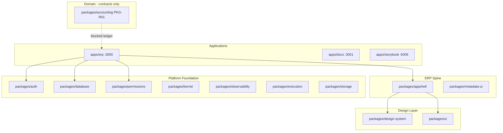

# Afenda Monorepo — Feature Inventory & Gap Analysis

| Field | Value |
| --- | --- |
| **As-of** | 2026-06-25 |
| **Validated** | 2026-06-25 (filesystem + test gates — see [Appendix A](#appendix-a-validation-evidence)) |
| **Owner** | Architecture Authority |
| **Authority hierarchy** | ADR > ARCH > FDR > [runtime matrix](afenda-runtime-truth-matrix.md) > code |

Phase 1 foundation (TIP-001–012 infrastructure) is **largely built in code**; most backlog is **delivery attestation** (FDR peer review, ARCH slices), not greenfield work. Business ERP domains (Accounting ledger, Inventory, HRM, etc.) are **intentionally deferred**.



---

## 1. Runnable applications

| App | Path | Port | Primary functions |
| --- | --- | ---: | --- |
| **@afenda/erp** | [`apps/erp/`](../apps/erp/) | 3000 | Primary ERP — auth, multi-tenant context, workspace, system admin, user settings, module placeholders, internal APIs, CSP |
| **@afenda/docs** | [`apps/docs/`](../apps/docs/) | 3001 | Fumadocs site — getting started, monorepo map, [Applications](/docs/apps) (`content/docs/apps/`), contributing ([`content/docs/`](../apps/docs/content/docs/)) |
| **@afenda/storybook** | [`apps/storybook/`](../apps/storybook/) | 6006 | Composed stories from `@afenda/ui`, `@afenda/appshell`, `@afenda/metadata-ui` |

**Dev commands:** `pnpm dev` (all) · `pnpm --filter @afenda/erp dev` · `pnpm storybook`

---

## 2. Foundation packages (by layer)

Source of truth: [`package-registry.md`](package-registry.md) (22 active workspaces). **Filesystem check:** 22/22 paths verified (Appendix A.2).

### Platform / persistence

| Package | Path | Key capabilities |
| --- | --- | --- |
| `@afenda/kernel` | [`packages/kernel/`](../packages/kernel/) | Branded IDs, Result type, operating context ([`src/context/`](../packages/kernel/src/context/)), platform authority ([`src/contracts/platform/`](../packages/kernel/src/contracts/platform/)), business master-data contracts ([`src/contracts/business-master-data/`](../packages/kernel/src/contracts/business-master-data/)) |
| `@afenda/database` | [`packages/database/`](../packages/database/) | Drizzle schema ([`src/schema/`](../packages/database/src/schema/)), migrations, RLS, domain services (tenant, company, membership, auth, entitlement, tenant-settings) |
| `@afenda/auth` | [`packages/auth/`](../packages/auth/) | Better Auth provider, session bridge, MFA policy, invitations, mirror-sync, dev bootstrap |
| `@afenda/permissions` | [`packages/permissions/`](../packages/permissions/) | `PERMISSION_REGISTRY`, policy engine, scope/grants ([`src/grants/`](../packages/permissions/src/grants/), [`src/scope/`](../packages/permissions/src/scope/)) |
| `@afenda/observability` | [`packages/observability/`](../packages/observability/) | Pino logger, audit writer, governed mutation audit registry |
| `@afenda/execution` | [`packages/execution/`](../packages/execution/) | Trigger.dev jobs ([`src/jobs/`](../packages/execution/src/jobs/)), outbox publish, execution registry |
| `@afenda/storage` | [`packages/storage/`](../packages/storage/) | Tenant-scoped R2/Blob providers, signed upload/download contracts |

### Integration / evaluation

| Package | Path | Key capabilities |
| --- | --- | --- |
| `@afenda/entitlements` | [`packages/entitlements/`](../packages/entitlements/) | Feature manifest, entitlement engine, limits, beta access ([`src/evaluation/`](../packages/entitlements/src/evaluation/)) |
| `@afenda/feature-flags` | [`packages/feature-flags/`](../packages/feature-flags/) | Deployment-flag / rollout / kill-switch evaluation facade |

### Design / UI

| Package | Path | Key capabilities |
| --- | --- | --- |
| `@afenda/design-system` | [`packages/design-system/`](../packages/design-system/) | Token registry, recipes, CSS generation — **no runtime UI** (by design) |
| `@afenda/ui` | [`packages/ui/`](../packages/ui/) | Governed primitives ([`src/components/`](../packages/ui/src/components/)), `resolvePrimitiveGovernance()` |
| `@afenda/appshell` | [`packages/appshell/`](../packages/appshell/) | App shell, dashboard, navigation, shadcn-studio blocks ([`src/shadcn-studio/blocks/`](../packages/appshell/src/shadcn-studio/blocks/)) |
| `@afenda/metadata` | [`packages/metadata/`](../packages/metadata/) | Layout/surface/renderer/action contracts |
| `@afenda/metadata-ui` | [`packages/metadata-ui/`](../packages/metadata-ui/) | Metadata renderers, layouts, surfaces ([`src/renderers/`](../packages/metadata-ui/src/renderers/)) |

### Governance / tooling

| Package | Path | Key capabilities |
| --- | --- | --- |
| `@afenda/architecture-authority` | [`packages/architecture-authority/`](../packages/architecture-authority/) | FDR registry, dependency/layer validators ([`src/data/foundation-disposition.registry.ts`](../packages/architecture-authority/src/data/foundation-disposition.registry.ts)) |
| `@afenda/ai-governance` | [`packages/ai-governance/`](../packages/ai-governance/) | AI boundary/drift/change validators (ADR-0007) |
| `@afenda/testing` | [`packages/testing/`](../packages/testing/) | jsdom setup, React interaction helpers ([`src/setup/react.ts`](../packages/testing/src/setup/react.ts)) |
| `@afenda/typescript-config` | [`packages/typescript-config/`](../packages/typescript-config/) | Shared strict TS presets |

### Domain (contracts only)

| Package | Path | Status |
| --- | --- | --- |
| `@afenda/accounting` (PKG-R01) | [`packages/accounting/`](../packages/accounting/) | **Contracts only** — journal, posting status, fiscal period vocabulary. **No ledger/posting runtime** (ADR-0010) |
| PKG-R02–R05 | *not in filesystem* | `@afenda/inventory`, `@afenda/hrm`, `@afenda/crm`, `@afenda/procurement` — **planned, no package** |

---

## 3. ERP application — routes & features

Base path: [`apps/erp/src/app/`](../apps/erp/src/app/)

**Route count:** **28** unique `page.tsx` files (Appendix A.1). Nine API `route.ts` handlers (Appendix A.3).

### Authentication

| Feature | Route / path |
| --- | --- |
| Sign-in | [`(auth)/sign-in/page.tsx`](../apps/erp/src/app/(auth)/sign-in/page.tsx) |
| Better Auth API | [`api/auth/[...all]/route.ts`](../apps/erp/src/app/api/auth/) |

### Protected workspace

| Feature | Route | Supporting code |
| --- | --- | --- |
| Workspace home / dashboard | [`(protected)/page.tsx`](../apps/erp/src/app/(protected)/page.tsx) | [`src/lib/workspace/`](../apps/erp/src/lib/workspace/), [`src/components/workspace/`](../apps/erp/src/components/workspace/) |
| Context switcher | (shell) | [`context-switch.action.ts`](../apps/erp/src/lib/context/context-switch.action.ts), [`resolve-operating-context-from-headers.server.ts`](../apps/erp/src/lib/context/resolve-operating-context-from-headers.server.ts) |
| Module placeholders (RBAC-gated) | [`(protected)/modules/[moduleId]/page.tsx`](../apps/erp/src/app/(protected)/modules/[moduleId]/page.tsx) | [`src/lib/modules/`](../apps/erp/src/lib/modules/) — manifest from `@afenda/entitlements` |
| Metadata preview | [`(protected)/metadata-workspace/page.tsx`](../apps/erp/src/app/(protected)/metadata-workspace/page.tsx) | [`src/lib/metadata/`](../apps/erp/src/lib/metadata/) |

**Registered modules** (placeholder empty states): `workspace`, `accounting`, `hrm`, `inventory`, `manufacturing`, `mrp`, `sales`, `ai_copilot` — source: [`feature-manifest.registry.ts`](../packages/entitlements/src/evaluation/feature-manifest.registry.ts)

### User settings (`/settings/**`)

| Tab | Route | Code |
| --- | --- | --- |
| Profile | [`settings/profile/page.tsx`](../apps/erp/src/app/(protected)/settings/profile/page.tsx) | [`user-profile-settings-panel.tsx`](../apps/erp/src/components/user-settings/user-profile-settings-panel.tsx) |
| Security | [`settings/security/page.tsx`](../apps/erp/src/app/(protected)/settings/security/page.tsx) | [`user-security-settings-panel.tsx`](../apps/erp/src/components/user-settings/user-security-settings-panel.tsx) |
| Notifications | [`settings/notifications/page.tsx`](../apps/erp/src/app/(protected)/settings/notifications/page.tsx) | [`user-notifications-settings-panel.tsx`](../apps/erp/src/components/user-settings/user-notifications-settings-panel.tsx) |
| Preferences | [`settings/preferences/page.tsx`](../apps/erp/src/app/(protected)/settings/preferences/page.tsx) | [`user-preferences-settings-panel.tsx`](../apps/erp/src/components/user-settings/user-preferences-settings-panel.tsx) |
| Tab nav + layout | [`settings/layout.tsx`](../apps/erp/src/app/(protected)/settings/layout.tsx) | [`src/lib/user-settings/`](../apps/erp/src/lib/user-settings/) |

### System admin control plane (`/system-admin/**`)

| Section | Route | Code |
| --- | --- | --- |
| Users | [`system-admin/users/page.tsx`](../apps/erp/src/app/(protected)/system-admin/users/page.tsx) | [`invite-company-user.server.ts`](../apps/erp/src/server/system-admin/invite-company-user.server.ts) |
| Memberships | [`system-admin/memberships/page.tsx`](../apps/erp/src/app/(protected)/system-admin/memberships/page.tsx) | [`list-company-members.server.ts`](../apps/erp/src/server/system-admin/list-company-members.server.ts) |
| Roles | [`system-admin/roles/page.tsx`](../apps/erp/src/app/(protected)/system-admin/roles/page.tsx) | — |
| Permissions | [`system-admin/permissions/page.tsx`](../apps/erp/src/app/(protected)/system-admin/permissions/page.tsx) | — |
| Audit | [`system-admin/audit/page.tsx`](../apps/erp/src/app/(protected)/system-admin/audit/page.tsx) | [`src/components/system-admin/`](../apps/erp/src/components/system-admin/) |
| Diagnostics | [`system-admin/diagnostics/page.tsx`](../apps/erp/src/app/(protected)/system-admin/diagnostics/page.tsx) | Accounting readiness gate UI |
| **Settings tabs** | [`system-admin/settings/*/page.tsx`](../apps/erp/src/app/(protected)/system-admin/settings/) | [`src/lib/system-admin/`](../apps/erp/src/lib/system-admin/), [`*-settings-panel.tsx`](../apps/erp/src/components/system-admin/) |

**Settings tabs:** General · Notifications · Workspace · Integrations · Members · Security · Billing & Usage · Appearance

### Internal API routes

| Endpoint | Path | Purpose |
| --- | --- | --- |
| Health | [`api/health/`](../apps/erp/src/app/api/health/) | Public health |
| Internal v1 health | [`api/internal/v1/health/`](../apps/erp/src/app/api/internal/v1/health/) | Execution spine diagnostics |
| Client errors | [`api/internal/v1/client-error/`](../apps/erp/src/app/api/internal/v1/client-error/) | Client error reporting |
| Dashboard layout | [`api/internal/v1/workspace/dashboard-layout/`](../apps/erp/src/app/api/internal/v1/workspace/dashboard-layout/) | GET/PUT/DELETE layout |
| Audit events | [`api/internal/v1/system-admin/audit-events/`](../apps/erp/src/app/api/internal/v1/system-admin/audit-events/) | Audit listing |
| User invite | [`api/internal/v1/system-admin/users/invite/`](../apps/erp/src/app/api/internal/v1/system-admin/users/invite/) | Invite flow |
| Role assignment | [`api/internal/v1/system-admin/memberships/role/`](../apps/erp/src/app/api/internal/v1/system-admin/memberships/role/) | Role changes |
| Supabase claims (debug) | [`api/integrations/supabase/claims/`](../apps/erp/src/app/api/integrations/supabase/claims/) | JWT claims debug |

**API governance:** [`apps/erp/src/server/api/`](../apps/erp/src/server/api/) — contracts, handler factory, validation, audit, idempotency

### Cross-cutting ERP lib modules

| Concern | Path |
| --- | --- |
| Operating context / multi-tenancy | [`apps/erp/src/lib/context/`](../apps/erp/src/lib/context/) |
| CSP / security | [`apps/erp/src/lib/security/`](../apps/erp/src/lib/security/) — [`csp-allowlist.ts`](../apps/erp/src/lib/security/csp-allowlist.ts), [`proxy.ts`](../apps/erp/src/proxy.ts) |
| Outbox / execution spine | [`apps/erp/src/lib/outbox/`](../apps/erp/src/lib/outbox/), [`src/lib/spine/`](../apps/erp/src/lib/spine/) |
| Server actions | [`apps/erp/src/lib/server-actions/`](../apps/erp/src/lib/server-actions/) |
| Rollout flags | [`apps/erp/src/lib/rollout/`](../apps/erp/src/lib/rollout/) |

### Dev harnesses (non-production)

[`apps/erp/src/app/(dev)/`](../apps/erp/src/app/(dev)/) — appshell demo, canvas, governance integration, policy gate (4 routes)

---

## 4. Database schema domains

Path: [`packages/database/src/schema/`](../packages/database/src/schema/)

| Schema file | Domain |
| --- | --- |
| `tenant.schema.ts`, `tenant-settings.schema.ts` | Tenant + settings (JSONB integrations) |
| `auth.schema.ts`, `auth-identity-link.schema.ts` | Auth sessions (`active_workspace_id`), identity links |
| `user.schema.ts`, `membership.schema.ts`, `team.schema.ts` | Users, memberships, teams |
| `organization.schema.ts`, `company.schema.ts`, `entity-group.schema.ts`, `legal-entity-ownership.schema.ts` | Enterprise hierarchy |
| `role.schema.ts`, `permission.schema.ts`, `role-permission.schema.ts`, `policy.schema.ts` | RBAC |
| `entitlement.schema.ts`, `rollout.schema.ts` | Entitlements + rollout flags |
| `audit.schema.ts` | Audit events |
| `outbox.schema.ts`, `execution.schema.ts` | Outbox + durable execution |
| `storage.schema.ts` | Storage metadata |
| `project.schema.ts` | Projects scaffold |

**Not present (validated):** `user_preferences`, durable `member_invitations`, accounting ledger tables, domain PKG-R02–R05 schemas

---

## 5. Governance & quality infrastructure

| Layer | Path | Commands |
| --- | --- | --- |
| Biome / Ultracite | [`biome.jsonc`](../biome.jsonc) | `pnpm lint`, `pnpm ci:biome`, `pnpm format` |
| Architecture validators | [`scripts/quality/`](../scripts/quality/), [`scripts/governance/`](../scripts/governance/) | `pnpm quality:architecture`, `pnpm quality:boundaries` |
| UI governance (TIP-004) | [`scripts/governance/ui-guard.mjs`](../scripts/governance/ui-guard.mjs) | `pnpm ui:guard`, `pnpm ui:guard:scan` |
| Multi-tenancy gates | 16 `check:multi-tenancy-*` scripts | `pnpm quality:multi-tenancy-enterprise-acceptance` |
| Accounting readiness | [`check-accounting-readiness-gate.mts`](../scripts/governance/check-accounting-readiness-gate.mts) | `pnpm check:accounting-readiness-gate` — **Phase 9 PASSED 2026-06-24** |
| Documentation drift | [`check-documentation-drift.mts`](../scripts/governance/check-documentation-drift.mts) | `pnpm check:documentation-drift` |
| E2E (Playwright) | [`apps/erp/e2e/`](../apps/erp/e2e/) | `pnpm --filter @afenda/erp test:e2e` |

---

## 6. FDR / ARCH delivery status (summary)

Full register: [`fdr-status-index.md`](../delivery/fdr-status-index.md) (33 FDRs)

| Status | Count | Examples |
| --- | ---: | --- |
| **Complete** | 7 | auth, tenant-RLS, outbox-jobs, audit-coverage, RBAC, manifest-nav, accounting-contracts (authority only) |
| **Partially Implemented** | 23 | system-admin, operating-context, entitlements, kernel×3, most foundation |
| **Not started** | 3 | ui-consumption FDR, ai-governance FDR, storybook FDR (runtime exists; docs not reconciled) |

Active ARCH docs: [`arch-status-index.md`](../ARCH/arch-status-index.md)

| ARCH | Delivered | Next |
| --- | --- | --- |
| ARCH-AUTH-001 | Slices 1–9, workspace session | Waiver review only |
| ARCH-ADMIN-001 | Slices 1–11 **Complete** | — |
| ARCH-USER-001 | Slices 1–12 **Complete** | — (profile email change UI → ARCH-AUTH-001 v2) |

---

## 7. Gap analysis

### Critical — hard blocks or production risk

| Gap | Why critical | Authority / next step | Validation |
| --- | --- | --- | --- |
| **Accounting ledger runtime** | First business domain; prohibited until ADR | ADR-0010 + new ADR for TIP-015+; [`packages/accounting/`](../packages/accounting/) contracts-only | `PKGR01_ACCOUNTING` prohibited rules in disposition registry |
| **Domain packages PKG-R02–R05** | No Inventory, HRM, CRM, Procurement runtime | ADR + registry promotion before filesystem | No `packages/inventory` etc. on disk |
| **In-memory invitations (`AUTH-INV-001`)** | Invites not durable across restarts | Durable `member_invitations` table + ARCH-AUTH waiver closeout | [`ARCH-AUTH-001`](../ARCH/[Partially%20Implemented]%20ARCH-AUTH-001-enterprise-authentication.md) §Remaining gaps |
| **MFA enroll UI (`AUTH-MFA-UI-001`)** | Policy exists; user enrollment surface missing | ARCH-AUTH-001 waiver track | Same ARCH doc |
| **Profile email change UI** | Email change deferred to auth v2 | ARCH-AUTH-001 `changeEmail.enabled` — ARCH-USER-001 §15 v2 gap (not Complete blocker) | [`ARCH-USER-001`](../ARCH/[Complete]%20ARCH-USER-001-user-settings-self-service.md) §15 |
| **System admin settings audit waiver** | ~~Mutation audit incomplete for some settings blocks~~ | ARCH-ADMIN-001 Slice 5 **closed** · **Complete** 2026-06-25 | `check:system-admin-mutation-audit` exit 0 |
| **Storybook runner (400/1860 failures)** | Visual regression gate broken | `fdr-021-storybook` Slice 3 | Runtime matrix row — not re-run this pass |
| **AI governance test failure** | `quality:ai-governance` not fully green | [`packages/ai-governance/`](../packages/ai-governance/) | **38/39 pass** — 1 failing boundary test (Appendix A.4) |

> **Note:** Runtime matrix cites 2 failing ERP tests (`context-switch`, `list-visible-system-admin-sections`). **Validation run:** `@afenda/erp` **658/658 pass** (124 files). Treat matrix row as stale until Evidence-sync.

### Essential — needed for Phase 1 closeout (not hard-blocked)

| Gap | Impact | Path / track |
| --- | --- | --- |
| **FDR DoD #14 peer review backlog** | ~23 FDRs at 29/30 cannot promote to Complete | Upgrade sequence in [`fdr-status-index.md`](../delivery/fdr-status-index.md) steps 3–8: `fdr-013-logging-tracing`, `fdr-009-rollout-flags`, `fdr-015-tenant-storage`, `fdr-001-shell-composition`, `fdr-018-governed-primitives`, `fdr-006-feature-manifest`, `fdr-007-*` siblings |
| **Registry sync debt** | Four PKG workspaces lack disposition rows | `foundation-registry-owner` Slice 2 — **missing:** `PKG004_DESIGN`, `PKG019_ARCHITECTURE`, `PKG020_AI_GOV`, `PKG021_STORYBOOK`. **Onboarded:** PKG005, PKG011, PKG012, PKG016, PKG017 (Appendix A.5) |
| **Storage ERP consumer wiring** | Abstraction built; limited app integration | [`packages/storage/`](../packages/storage/) — waiver `storage-erp-e2e` |
| **Feature flags route-level gating** | Evaluation exists; routes not fully gated | [`apps/erp/src/lib/rollout/`](../apps/erp/src/lib/rollout/) |
| **ADR-0008 ref-as-prop migration** | Blocks React 19 primitive modernization | [`packages/ui/`](../packages/ui/) — `fdr-018-governed-primitives` Slice 2 |
| **ADR-0017 shadcn/studio acceptance** | MCP cwd + constitutional authority pending | [ADR-0017](../adr/ADR-0017-shadcn-studio-ui-delivery-acceleration.md) (Proposed) |
| **Enterprise SSO / passkey (`AUTH-PHASE3-001`)** | Deferred Phase 3 auth | ARCH-AUTH-001 |
| **Master data runtime (TIP-008)** | Authority contracts frozen; no domain schemas | [`packages/kernel/src/contracts/business-master-data/`](../packages/kernel/src/contracts/business-master-data/) |
| **Durable idempotency store** | API idempotency in-memory/deferred | [`apps/erp/src/server/api/`](../apps/erp/src/server/api/) |

### Intentionally deferred (not gaps for Phase 1)

- ERP business modules at [`/modules/*`](../apps/erp/src/app/(protected)/modules/) — placeholder only
- Accounting posting, COA, journal entries
- Manufacturing / MRP / Sales operational workflows
- Full metadata-driven ERP screens beyond preview route
- Live DNS / production deploy for docs app

---

## 8. Maturity snapshot

```text
IMPLEMENTED (runtime exists)     PARTIAL                         NOT STARTED / BLOCKED
─────────────────────────────     ───────────────────────────     ─────────────────────────
Multi-tenant operating context    Feature flags (route gating)    Accounting ledger
Better Auth + session bridge      FDR delivery attestation        PKG-R02–R05 domains
RBAC + API governance             Storybook test runner           SSO / passkey
App shell + module nav            AI governance test (1 fail)     Master data schemas
System admin control plane (Complete)                             Business module UIs
User settings (Complete)
Tenant settings persistence
Outbox / Trigger.dev jobs         AI governance test (1 fail)
Audit + observability spine
Metadata preview
Accounting readiness gate (Phase 9 ✓)
Governed UI + CSP pipeline
ERP unit tests (658/658 ✓)
```

---

## 9. Recommended reading order for agents

1. [`afenda-runtime-truth-matrix.md`](afenda-runtime-truth-matrix.md) — what code actually does
2. [`fdr-status-index.md`](../delivery/fdr-status-index.md) — implementation gates
3. [`arch-status-index.md`](../ARCH/arch-status-index.md) — next UX/auth/admin slices
4. [`foundation-disposition.registry.ts`](../packages/architecture-authority/src/data/foundation-disposition.registry.ts) — lane + prohibited rules

**Next coding sessions (per ARCH index):** ARCH-AUTH-001 `changeEmail` maintenance

---

## Appendix A — Validation evidence

Generated during inventory implementation (2026-06-25). Commands run from repo root.

### A.1 ERP `page.tsx` inventory (28 routes)

| # | Path |
| ---: | --- |
| 1 | `apps/erp/src/app/(auth)/sign-in/page.tsx` |
| 2 | `apps/erp/src/app/(dev)/appshell-canvas/page.tsx` |
| 3 | `apps/erp/src/app/(dev)/appshell-demo/page.tsx` |
| 4 | `apps/erp/src/app/(dev)/governance-integration/page.tsx` |
| 5 | `apps/erp/src/app/(dev)/policy-gate/page.tsx` |
| 6 | `apps/erp/src/app/(protected)/metadata-workspace/page.tsx` |
| 7 | `apps/erp/src/app/(protected)/modules/[moduleId]/page.tsx` |
| 8 | `apps/erp/src/app/(protected)/page.tsx` |
| 9 | `apps/erp/src/app/(protected)/settings/notifications/page.tsx` |
| 10 | `apps/erp/src/app/(protected)/settings/page.tsx` |
| 11 | `apps/erp/src/app/(protected)/settings/preferences/page.tsx` |
| 12 | `apps/erp/src/app/(protected)/settings/profile/page.tsx` |
| 13 | `apps/erp/src/app/(protected)/settings/security/page.tsx` |
| 14 | `apps/erp/src/app/(protected)/system-admin/audit/page.tsx` |
| 15 | `apps/erp/src/app/(protected)/system-admin/diagnostics/page.tsx` |
| 16 | `apps/erp/src/app/(protected)/system-admin/memberships/page.tsx` |
| 17 | `apps/erp/src/app/(protected)/system-admin/permissions/page.tsx` |
| 18 | `apps/erp/src/app/(protected)/system-admin/roles/page.tsx` |
| 19 | `apps/erp/src/app/(protected)/system-admin/settings/appearance/page.tsx` |
| 20 | `apps/erp/src/app/(protected)/system-admin/settings/billing/page.tsx` |
| 21 | `apps/erp/src/app/(protected)/system-admin/settings/general/page.tsx` |
| 22 | `apps/erp/src/app/(protected)/system-admin/settings/integrations/page.tsx` |
| 23 | `apps/erp/src/app/(protected)/system-admin/settings/members/page.tsx` |
| 24 | `apps/erp/src/app/(protected)/system-admin/settings/notifications/page.tsx` |
| 25 | `apps/erp/src/app/(protected)/system-admin/settings/page.tsx` |
| 26 | `apps/erp/src/app/(protected)/system-admin/settings/security/page.tsx` |
| 27 | `apps/erp/src/app/(protected)/system-admin/settings/workspace/page.tsx` |
| 28 | `apps/erp/src/app/(protected)/system-admin/users/page.tsx` |

### A.2 Package registry filesystem cross-check (22/22)

| PKG | Path | Exists |
| --- | --- | --- |
| PKG-001 | `packages/appshell` | ✓ |
| PKG-002 | `packages/auth` | ✓ |
| PKG-003 | `packages/database` | ✓ |
| PKG-004 | `packages/design-system` | ✓ |
| PKG-005 | `apps/docs` | ✓ |
| PKG-006 | `packages/entitlements` | ✓ |
| PKG-007 | `apps/erp` | ✓ |
| PKG-008 | `packages/execution` | ✓ |
| PKG-009 | `packages/feature-flags` | ✓ |
| PKG-010 | `packages/kernel` | ✓ |
| PKG-011 | `packages/metadata` | ✓ |
| PKG-012 | `packages/metadata-ui` | ✓ |
| PKG-013 | `packages/observability` | ✓ |
| PKG-014 | `packages/permissions` | ✓ |
| PKG-015 | `packages/storage` | ✓ |
| PKG-016 | `packages/testing` | ✓ |
| PKG-017 | `packages/typescript-config` | ✓ |
| PKG-018 | `packages/ui` | ✓ |
| PKG-019 | `packages/architecture-authority` | ✓ |
| PKG-020 | `packages/ai-governance` | ✓ |
| PKG-021 | `apps/storybook` | ✓ |
| PKG-R01 | `packages/accounting` | ✓ |

PKG-R02–R05: **not in filesystem** (planned only) — matches [`package-registry.md`](package-registry.md).

### A.3 ERP API routes (9 handlers)

| Path |
| --- |
| `apps/erp/src/app/api/auth/[...all]/route.ts` |
| `apps/erp/src/app/api/health/route.ts` |
| `apps/erp/src/app/api/integrations/supabase/claims/route.ts` |
| `apps/erp/src/app/api/internal/v1/client-error/route.ts` |
| `apps/erp/src/app/api/internal/v1/health/route.ts` |
| `apps/erp/src/app/api/internal/v1/system-admin/audit-events/route.ts` |
| `apps/erp/src/app/api/internal/v1/system-admin/memberships/role/route.ts` |
| `apps/erp/src/app/api/internal/v1/system-admin/users/invite/route.ts` |
| `apps/erp/src/app/api/internal/v1/workspace/dashboard-layout/route.ts` |

### A.4 Critical gap test evidence

| Check | Command | Result |
| --- | --- | --- |
| ERP unit tests | `pnpm --filter @afenda/erp test:run` | **658/658 pass** (124 files) |
| AI governance | `pnpm --filter @afenda/ai-governance test:run` | **38/39 pass** — 1 boundary violation test fail |
| `user_preferences` schema | grep `packages/database/src/schema/` | **Not found** |
| Auth waivers | `docs/ARCH/ARCH-AUTH-001` | **AUTH-INV-001**, **AUTH-MFA-UI-001**, **AUTH-PHASE3-001** documented |

### A.5 Disposition registry sync status

Fingerprint: `FOUNDATION-DISPOSITION-2026-06-25-v9` (21 entries including `TIP_ARCHIVE`).

| PKG workspace | Disposition entry ID | Status |
| --- | --- | --- |
| PKG-001 | `PKG001_APPSHELL` | Onboarded |
| PKG-002 | `PKG002_AUTH` | Onboarded |
| PKG-003 | `PKG003_DATABASE` | Onboarded |
| PKG-004 | — | **Missing** |
| PKG-005 | `PKG005_DOCS` | Onboarded |
| PKG-006 | `PKG006_ENTITLEMENTS`, `PKG006_FEATURE_MANIFEST` | Onboarded |
| PKG-007 | `PKG007_ADMIN`, `PKG007_CONTEXT` | Onboarded |
| PKG-008 | `PKG008_EXECUTION` | Onboarded |
| PKG-009 | `PKG009_FEATURE_FLAGS` | Onboarded |
| PKG-010 | `PKG010_KERNEL` | Onboarded |
| PKG-011 | `PKG011_METADATA` | Onboarded |
| PKG-012 | `PKG012_METADATA_UI` | Onboarded |
| PKG-013 | `PKG013_AUDIT`, `PKG013_LOGGING` | Onboarded |
| PKG-014 | `PKG014_PERMISSIONS` | Onboarded |
| PKG-015 | `PKG015_STORAGE` | Onboarded |
| PKG-016 | `PKG016_TESTING` | Onboarded |
| PKG-017 | `PKG017_TS_CONFIG` | Onboarded |
| PKG-018 | `PKG018_UI` | Onboarded |
| PKG-019 | — | **Missing** |
| PKG-020 | — | **Missing** |
| PKG-021 | — | **Missing** |
| PKG-R01 | `PKGR01_ACCOUNTING` | Onboarded |

---

*Maintained alongside [`afenda-runtime-truth-matrix.md`](afenda-runtime-truth-matrix.md). Update this doc when major surfaces or gap status changes.*
