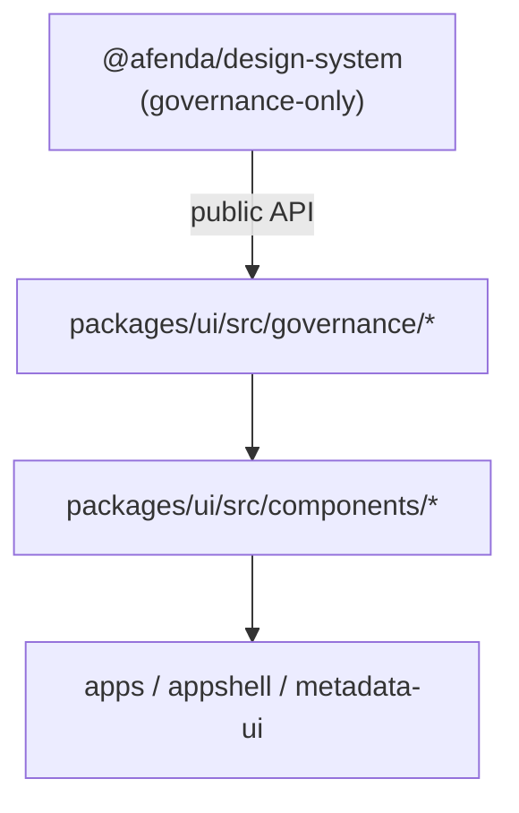

# TIP-004 — UI Consumption

Status: **Complete**

## Purpose

Adopt `@afenda/design-system` as the single design authority inside `@afenda/ui`. Governed React components consume contracts, recipes, variants, tokens, state policy, motion policy, accessibility policy, and className policy through a centralized adapter — they do not invent parallel design vocabulary.

## Dependency direction



| Package | Owns |
| --- | --- |
| `@afenda/design-system` | Tokens, variants, recipes (metadata), states, motion, accessibility, className policy, export surface |
| `@afenda/ui` | React/Base UI implementation, recipe projection to className, component behavior |
| Apps | Page wiring only (out of scope for this TIP) |

**Prohibited:** `@afenda/design-system` must never depend on or import `@afenda/ui`.

## Governance adapter

All design-system imports flow through [`packages/ui/src/governance/`](../../packages/ui/src/governance/):

| Module | Responsibility |
| --- | --- |
| `design-system.ts` | Sole re-export surface from `@afenda/design-system` |
| `variant.ts` | `resolveGovernedVariant(selection)` |
| `recipe.ts` | `resolveGovernedRecipe(name, selection)`, CVA projections for button/badge/card |
| `class-name.ts` | `assertAllowedLayoutClassName(className)` |
| `state.ts` | `assertGovernedState(state)` |
| `accessibility.ts` | `getComponentAccessibilityRequirement(componentName)` |
| `motion.ts` | `getMotionIntent(intent)` |

Components import `@afenda/ui/governance` — never deep-import design-system internals.

## Reference implementations

| Component | Governed props | Recipe |
| --- | --- | --- |
| `Button` | `intent`, `emphasis`, `size`, `density?`, `presentation?` | `button` |
| `Badge` | `tone`, `emphasis?`, `density?`, `size?` | `badge` |
| `Card` | `density`, `radius`, `shadow` | `card` |

Recipe metadata lives in design-system; className projection lives in `governance/recipe.ts` using semantic token classes (`bg-primary`, `bg-card`, `statusTone.*` surfaces) — never raw palette utilities (`bg-blue-600`).

## className policy

- **Allowed:** layout utilities (`flex`, `grid`, `w-*`, `h-*`, `overflow-*`, etc.)
- **Prohibited:** semantic color, radius, shadow, motion, typography overrides on governed components
- Enforced at runtime in development via `assertAllowedLayoutClassName`

## Prohibited drift examples

```tsx
// ❌ Local authority
const STATUS_TONES = ["info", "warn"];

// ❌ Deep import
import { tokenRegistry } from "@afenda/design-system/src/tokens/registry";

// ❌ Raw palette on governed components
<Button className="bg-blue-600" />

// ❌ shadcn variant strings on governed Button
<Button variant="ghost" />
```

```tsx
// ✅ Governed consumption
<Button intent="primary" emphasis="solid" size="md" className="w-full" />
<Badge tone="success" emphasis="soft" />
<Card density="comfortable" radius="md" shadow="raised" className="max-w-lg" />
```

## shadcn overwrite recovery

Running `pnpm dlx shadcn@latest add --all -c packages/ui -y --overwrite` reverts Button/Badge/Card to shadcn inline CVA. Re-apply governed implementations or exclude those files from bulk overwrite.

## Files created

- `packages/ui/src/governance/design-system.ts`
- `packages/ui/src/governance/variant.ts`
- `packages/ui/src/governance/recipe.ts`
- `packages/ui/src/governance/class-name.ts`
- `packages/ui/src/governance/state.ts`
- `packages/ui/src/governance/accessibility.ts`
- `packages/ui/src/governance/motion.ts`
- `packages/ui/src/governance/index.ts`
- `packages/ui/scripts/check-design-system-consumption.ts`
- `packages/ui/src/__tests__/governance/design-system-consumption.test.ts`
- `docs/delivery/tip-004-ui-consumption.md`

## Files modified

- `packages/ui/package.json` — `check:governance`, `check:design-system`, `tsx`, `./governance` export
- `packages/ui/src/components/button.tsx`
- `packages/ui/src/components/badge.tsx`
- `packages/ui/src/components/card.tsx`
- `packages/ui/src/lib/afenda-contracts.ts`
- `packages/ui/src/index.ts`
- Intra-package Button consumers: `dialog`, `alert-dialog`, `sheet`, `combobox`, `calendar`, `carousel`, `pagination`, `input-group`, `sidebar`
- `packages/ui/src/__tests__/components.render.test.tsx`

## Files removed

- `packages/ui/src/lib/afenda-variants.ts` (logic moved to `governance/recipe.ts`)

## Acceptance criteria

- [x] `@afenda/ui` depends on `@afenda/design-system`
- [x] `@afenda/design-system` has no runtime dependency on `@afenda/ui`
- [x] Button, Badge, Card are governed reference implementations
- [x] Governance adapter centralizes design-system imports
- [x] Anti-drift tests and static checker pass
- [x] className overrides validated as layout-only in development
- [x] Public exports remain stable (types re-exported via governance)

## Test evidence

```bash
pnpm --filter @afenda/ui typecheck          # pass
pnpm --filter @afenda/ui test:run           # 23 tests pass
pnpm --filter @afenda/ui build              # pass
pnpm --filter @afenda/ui check:governance   # pass

pnpm --filter @afenda/design-system typecheck
pnpm --filter @afenda/design-system test:run
pnpm --filter @afenda/design-system build
pnpm --filter @afenda/design-system check:governance
```

## Known gaps

- Only **Button**, **Badge**, and **Card** are governed; ~50 other shadcn components remain un migrated
- Recipe projection is UI-owned until design-system ships CSS recipe output
- `Alert` still uses shadcn `variant` (not in this TIP scope)
- Bulk shadcn `--overwrite` will revert governed components unless re-applied

## Related

- [TIP-004 Design System Contracts](./tip-004-design-system-contracts.md)
- [TIP-UI-02 Component Library](./tip-ui-02-component-library.md)
