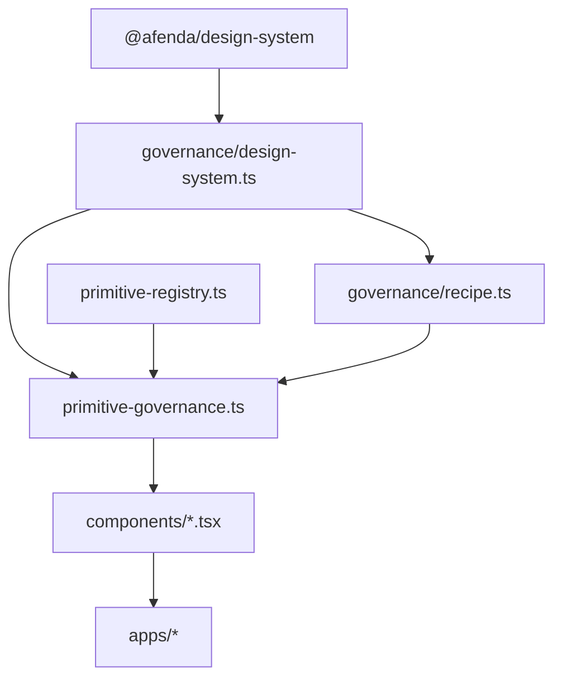

# TIP-004B — Governed UI Primitive Adapter Layer

Status: **Complete (Phase 1)** · **In progress (Phase 2 — form controls)**

## Purpose

Introduce a single governed primitive adapter in `@afenda/ui` so Radix/shadcn behavior stays implementation-only while all presentation resolves through one pipeline:

```txt
recipe → variant → state → slot → accessibility → motion → className policy
```

Phase 1 wires **Button**, **Badge**, **Card**, **Alert**, **Field**, and **Table**. Phase 2 (started) adds the **form-control leaf family**: **Input**, **Label**, **Textarea**, **Checkbox**, and **Switch**. Remaining shadcn components stay in `STOCK_SHADCN_PENDING` until later phases.

## Architecture



| Layer | Owns |
| --- | --- |
| `@afenda/design-system` | Tokens, variants, recipes (metadata), states, motion, accessibility, className policy |
| `@afenda/ui/governance` | Bridge, registry, recipe runtime, `resolvePrimitiveGovernance()` |
| `@afenda/ui/components` | Radix behavior + governed presentation |
| Apps | Page wiring only |

## New modules

| Module | Responsibility |
| --- | --- |
| [`primitive-contract.ts`](../packages/ui/src/governance/primitive-contract.ts) | `PrimitiveGovernanceInput`, `PrimitiveGovernanceResult`, `GovernedPrimitiveDefinition` |
| [`primitive-registry.ts`](../packages/ui/src/governance/primitive-registry.ts) | `GOVERNED_PRIMITIVE_REGISTRY`, `STOCK_SHADCN_PENDING`, `PRIMARY_UI_EXPORTS` |
| [`primitive-governance.ts`](../packages/ui/src/governance/primitive-governance.ts) | `resolvePrimitiveGovernance()` |
| [`stock-shadcn-compat.ts`](../packages/ui/src/governance/stock-shadcn-compat.ts) | Temporary shadcn→governed Button mapping for stock pending components |

## Governed component API (Phase 1)

| Component | Governed props | Recipe |
| --- | --- | --- |
| `Button` | `intent`, `emphasis`, `size`, `density?`, `presentation?` | `button` |
| `Badge` | `tone`, `emphasis?`, `density?`, `size?` | `badge` |
| `Card` | `density`, `radius`, `shadow` | `card` |
| `Alert` | `tone`, `density?`, `radius?` | `status` |
| `Field` | `density?`, `size?`, `orientation?` | `form-control` |
| `Table` | `density?`, `size?` | `table` |
| `Input` | `density?`, `size?` | `form-control` (leaf) |
| `Label` | — | `form-control` (leaf) |
| `Textarea` | `density?`, `size?` | `form-control` (leaf) |
| `Checkbox` | — | `form-control` (leaf) |
| `Switch` | `size?` (`sm` \| `md`) | `form-control` (leaf) |

## Usage pattern

```tsx
import { resolvePrimitiveGovernance } from "@afenda/ui/governance/primitive-governance";

const governed = resolvePrimitiveGovernance({
  componentName: "Button",
  recipeName: "button",
  variant: { intent: "primary", emphasis: "solid", size: "md" },
  slot: "root",
  className: "w-full",
});

return (
  <button {...governed.dataAttributes} className={governed.className}>
    Save
  </button>
);
```

## CI enforcement

[`scripts/check-design-system-consumption.ts`](../packages/ui/scripts/check-design-system-consumption.ts) blocks:

1. Direct `@afenda/design-system` imports in `src/components/**`
2. Local `cva()` in governed component files
3. Governed files missing `resolvePrimitiveGovernance()`
4. Raw semantic Tailwind classes in governed component source
5. Missing `PRIMARY_UI_EXPORTS` registry coverage

Run locally:

```bash
pnpm --filter @afenda/ui check:governance
pnpm --filter @afenda/ui test:run
pnpm --filter @afenda/ui typecheck
```

## Stock pending components

Components listed in `STOCK_SHADCN_PENDING` may still use stock shadcn patterns temporarily. They must use `mapStockButtonProps()` when rendering governed `Button` instances.

Do **not** run `shadcn add --all -o` on governed files without re-applying the adapter layer afterward.

## Depends on

- [TIP-004 — UI Consumption](./tip-004-ui-consumption.md)
- [TIP-004 — Design System Contracts](./tip-004-design-system-contracts.md)

## Next phases

- Phase 2 (in progress): form-control leaf family — Input, Label, Textarea, Checkbox, Switch ✓; Dialog, Popover, Select, Tabs, Tooltip, DropdownMenu next
- Phase 3: Remaining stock shadcn components until `STOCK_SHADCN_PENDING` is empty

## Verdict

Phase 1 complete — governed adapter layer, six migrated primitives, CI guards, and tests are in place. Phase 2 form-control leaf family migration is underway (five components governed).
