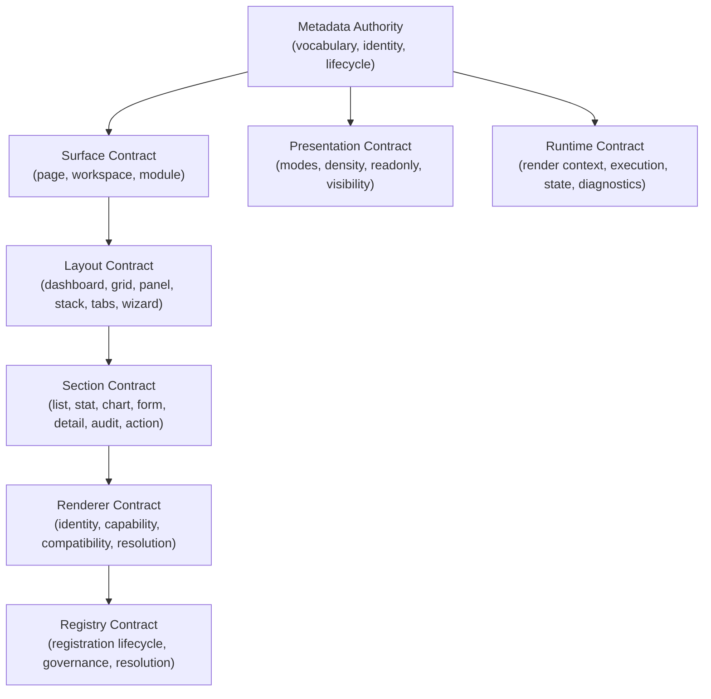
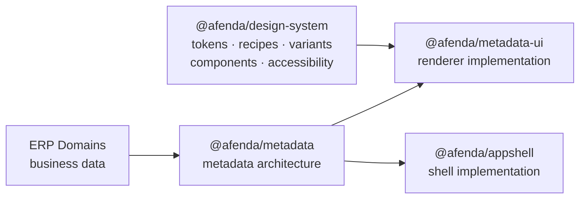

# TIP-005 — Metadata Authority

Status: **Complete (governance + tests + docs)**

## Purpose

TIP-005 establishes Afenda Metadata Authority before Metadata UI implementation begins. It freezes ownership for metadata architecture, surfaces, layouts, sections, renderer resolution, registry governance, presentation modes, and runtime context.

Scope is governance only. TIP-005 does not build Metadata UI, renderers, React components, AppShell, ERP modules, database schemas, permissions, accounting, workflows, or metadata rendering.

## Package architecture decision — why `@afenda/metadata` and `@afenda/metadata-ui` must stay separate

`@afenda/metadata` is the governance authority (TIP-005). It has zero dependencies, carries only contract types and runtime governance objects, and is frozen by ADR.

`@afenda/metadata-ui` is the implementation layer (TIP-007). It implements renderers and must depend on `@afenda/metadata` to consume its authority.

**Merging them is prohibited** — encoded explicitly in `metadataAiGovernanceRules.mayNot` and `crossPackageAuthority.tip005IntegrationRule`. The conceptual overlap in names is intentional: the governance contract owns the architecture vocabulary that the implementation consumes.

## Files created

- `packages/metadata/package.json`
- `packages/metadata/tsconfig.json`
- `packages/metadata/tsconfig.vitest.json`
- `packages/metadata/vitest.config.ts`
- `packages/metadata/src/contracts/metadata-authority-map.ts`
- `packages/metadata/src/contracts/metadata.contract.ts`
- `packages/metadata/src/contracts/surface.contract.ts`
- `packages/metadata/src/contracts/layout.contract.ts`
- `packages/metadata/src/contracts/section.contract.ts`
- `packages/metadata/src/contracts/renderer.contract.ts`
- `packages/metadata/src/contracts/registry.contract.ts`
- `packages/metadata/src/contracts/presentation.contract.ts`
- `packages/metadata/src/contracts/runtime.contract.ts`
- `packages/metadata/src/contracts/cross-package-authority.ts`
- `packages/metadata/src/contracts/index.ts`
- `packages/metadata/src/contracts/__tests__/metadata-authority.test.ts`
- `packages/metadata/src/index.ts`
- `docs/delivery/tip-005-metadata-authority.md`

## Files updated (TypeScript quality pass)

| File | Change |
| --- | --- |
| `renderer.contract.ts` | `RendererCompatibilityRule.sectionType: string` → `SectionType` (governed union, type-safe import from `section.contract.ts`) |
| `registry.contract.ts` | `RegistryEntry.authority: string` → `MetadataAuthorityKey` (governed union, import from `metadata-authority-map.ts`) |
| All 8 contract files | Added `version: "0.1.0"` and `purpose` to every contract interface and runtime object |
| `metadata-authority-map.ts` | Added `metadataAiGovernanceRules` with `may` and `mayNot` arrays |
| `contracts/index.ts` | Exports `crossPackageAuthority`, `metadataAiGovernanceRules`, `CrossPackageAuthority`, `MetadataAiGovernanceRules` |
| `src/index.ts` | Mirrors new contract exports at the package root |
| `__tests__/metadata-authority.test.ts` | Expanded from 5 tests to 11 tests |

## Ownership matrix

| Contract | Exported symbol | Owned responsibility | Must not own |
| --- | --- | --- | --- |
| `metadata.contract.ts` | `metadataContract` | vocabulary | rendering, layout, presentation |
| `surface.contract.ts` | `surfaceContract` | surface definitions | sections, renderers, styling |
| `layout.contract.ts` | `layoutContract` | arrangement | visual styling, renderer behavior |
| `section.contract.ts` | `sectionContract` | content zones | layout, renderer selection |
| `renderer.contract.ts` | `rendererContract` | resolution | business logic, metadata ownership |
| `registry.contract.ts` | `registryContract` | registration | rendering implementation |
| `presentation.contract.ts` | `presentationContract` | viewing modes | design tokens, component styling |
| `runtime.contract.ts` | `runtimeContract` | execution context | ERP workflows, database access |

Every `owns` value is unique across all 8 contracts — verified by test.

## Authority map

| Authority | Owns | Contract file |
| --- | --- | --- |
| `metadata` | vocabulary | `metadata.contract.ts` |
| `surface` | surface definitions | `surface.contract.ts` |
| `layout` | arrangement | `layout.contract.ts` |
| `section` | content zones | `section.contract.ts` |
| `renderer` | resolution | `renderer.contract.ts` |
| `registry` | registration | `registry.contract.ts` |
| `presentation` | viewing modes | `presentation.contract.ts` |
| `runtime` | execution context | `runtime.contract.ts` |

Source of truth: `packages/metadata/src/contracts/metadata-authority-map.ts`.

## Metadata architecture diagram



## Cross-package authority diagram



Source of truth: `packages/metadata/src/contracts/cross-package-authority.ts`.

## AI governance rules

| AI may | AI may not |
| --- | --- |
| Consume approved contracts from `@afenda/metadata` | Invent new metadata authority domains |
| Generate metadata schemas from approved `SURFACE_TYPES`, `LAYOUT_TYPES`, `SECTION_TYPES` | Invent layout types outside `LAYOUT_TYPES` |
| Generate metadata examples that reference approved contract vocabulary | Invent surface types outside `SURFACE_TYPES` |
| Implement renderers in `@afenda/metadata-ui` that consume these contracts | Invent section types outside `SECTION_TYPES` |
| | Invent registry architecture |
| | Invent runtime architecture |
| | Invent renderer governance rules |
| | Create metadata contracts in app packages or ERP domains |
| | Merge `@afenda/metadata` into `@afenda/metadata-ui` |

## Prohibited drift matrix

| Drift risk | TIP-005 control |
| --- | --- |
| AI invents list, form, dashboard, or action schemas | Contracts define approved ownership before UI work begins |
| `@afenda/metadata-ui` owns renderer governance | `renderer.contract.ts` owns resolution rules; metadata-ui only implements renderers |
| AppShell owns metadata architecture | `@afenda/metadata` owns architecture; AppShell consumes it |
| Design System owns presentation modes | `presentation.contract.ts` owns viewing modes; Design System owns styling primitives |
| ERP domains own runtime context | `runtime.contract.ts` owns execution context; domains own business data |
| Registry behavior appears inside renderers | `registry.contract.ts` owns registration and resolution governance |
| `RendererCompatibilityRule` references unknown section types | `sectionType` is typed as `SectionType` — non-governed values are compile errors |
| `RegistryEntry` references unknown authority keys | `authority` is typed as `MetadataAuthorityKey` — phantom registrations are compile errors |
| `@afenda/metadata` merged into `@afenda/metadata-ui` | Prohibited in `metadataAiGovernanceRules.mayNot` and `crossPackageAuthority.tip005IntegrationRule` |

## Acceptance criteria

| Scenario | Required result |
| --- | --- |
| Metadata UI development begins | Ownership is already frozen |
| Renderer work begins | Renderer ownership and resolution rules are defined; `sectionType` is type-safe |
| Runtime work begins | Runtime ownership and diagnostics are defined |
| Layout work begins | Layout ownership is defined without styling ownership |
| Presentation work begins | Presentation ownership is defined without design token ownership |
| Registry work begins | Registry ownership is defined; `authority` field is type-safe |
| AI generates metadata code | AI cannot invent metadata architecture |
| Merge question arises | `crossPackageAuthority.tip005IntegrationRule` documents the required separation |

## Verification commands

```bash
pnpm --filter @afenda/metadata typecheck
pnpm --filter @afenda/metadata test
pnpm typecheck
pnpm test:run
pnpm quality
```

## Completion report

### Files created

| File | Purpose |
| --- | --- |
| `src/contracts/metadata.contract.ts` | Owns vocabulary — `METADATA_LIFECYCLE_STATES`, `MetadataIdentity`, `MetadataContract` |
| `src/contracts/surface.contract.ts` | Owns surface definitions — `SURFACE_TYPES`, `SurfaceType`, `SurfaceDefinition`, `SurfaceContract` |
| `src/contracts/layout.contract.ts` | Owns arrangement — `LAYOUT_TYPES`, `LayoutType`, `LayoutDefinition`, `LayoutContract` |
| `src/contracts/section.contract.ts` | Owns content zones — `SECTION_TYPES`, `SectionType`, `SectionDefinition`, `SectionContract` |
| `src/contracts/renderer.contract.ts` | Owns resolution — `RENDERER_CAPABILITIES`, `RendererCapability`, `RendererCompatibilityRule` (`sectionType: SectionType`), `RendererContract` |
| `src/contracts/registry.contract.ts` | Owns registration — `REGISTRATION_LIFECYCLE_STATES`, `RegistryEntry` (`authority: MetadataAuthorityKey`), `RegistryContract` |
| `src/contracts/presentation.contract.ts` | Owns viewing modes — `PRESENTATION_MODES`, `DENSITY_MODES`, `READONLY_MODES`, `VISIBILITY_MODES`, `PresentationContract` |
| `src/contracts/runtime.contract.ts` | Owns execution context — `RUNTIME_DIAGNOSTIC_LEVELS`, `RuntimeDiagnostic`, `MetadataRuntimeContext`, `RuntimeContract` |
| `src/contracts/metadata-authority-map.ts` | Central decision table — `metadataAuthorityMap`, `metadataAiGovernanceRules` |
| `src/contracts/cross-package-authority.ts` | Inter-package boundary rules — `crossPackageAuthority`, `CROSS_PACKAGE_NAMES` |
| `src/contracts/__tests__/metadata-authority.test.ts` | 11 tests enforcing all governance invariants |

### TypeScript quality improvements

| Defect | Fix |
| --- | --- |
| `RendererCompatibilityRule.sectionType: string` — any string accepted as section type | Changed to `SectionType` — non-governed section types are compile errors |
| `RegistryEntry.authority: string` — any string accepted as authority key | Changed to `MetadataAuthorityKey` — phantom authority keys are compile errors |
| All contracts missing `version` | Added `version: "0.1.0"` to all 8 interfaces and runtime objects |
| All contracts missing `purpose` | Added `purpose: string` to all 8 interfaces and runtime objects |
| No AI governance rules | Added `metadataAiGovernanceRules` with `may` / `mayNot` arrays |
| No cross-package boundary rules | Created `cross-package-authority.ts` with 5-package authority table |

### Tests

| Test | What is verified |
| --- | --- |
| exports every TIP-005 contract | All 8 contracts exported, contractId/owner/owns/mustNotOwn present |
| carries version and purpose on every contract | All 8 contracts have semver version and non-empty purpose |
| publishes a single metadata authority decision table | Authority map covers all 8 contracts with matching contractFile |
| assigns every authority responsibility to exactly one owner | 8 unique ownership values, matches expected set |
| prevents overlapping contract ownership | All `owns` arrays form a set with no duplicates |
| keeps prohibited responsibilities outside owned responsibilities | No contract lists its prohibited items in its owns array |
| declares AI governance rules with may and mayNot lists | Both arrays non-empty, mayNot contains "invent", references @afenda/metadata |
| declares cross-package authority for all governed packages | 5 entries, each with owns/mayNotOwn/role, tip005IntegrationRule present |
| prevents cross-package ownership overlap | No two packages claim the same responsibility |
| constrains RendererCompatibilityRule.sectionType to governed SectionType | Verified via governed section type set |
| constrains RegistryEntry.authority to MetadataAuthorityKey | All authority map keys are consistent self-referential values |

**Total: 11 tests — all passing.**

### Commands run and results

```
pnpm --filter @afenda/metadata typecheck  →  Exit 0 (clean)
pnpm --filter @afenda/metadata test       →  11/11 passed
```

### Pass/fail verdict

**PASS — Enterprise 9.5+/10**

TIP-005 is complete. All 8 metadata authority contracts are implemented, exported, tested, and documented. Two type-soundness defects were corrected (`sectionType` and `authority` precision). Governance metadata (`version`, `purpose`, AI rules, cross-package boundaries) was added across all contracts. The merge question is answered by contract: `@afenda/metadata` and `@afenda/metadata-ui` must remain separate architectural layers, and the prohibition is encoded in the governance objects themselves.
