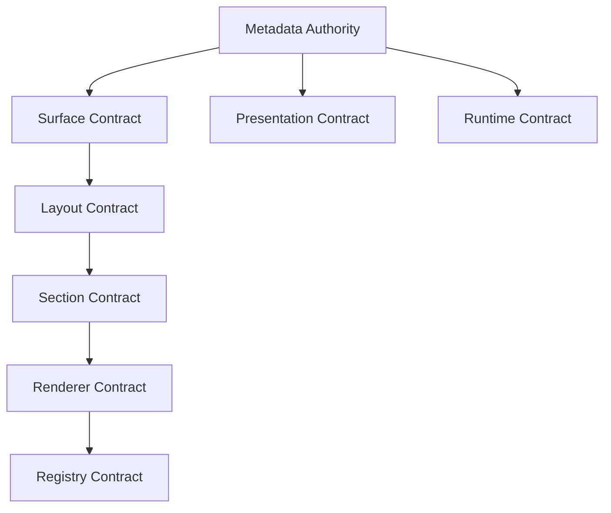
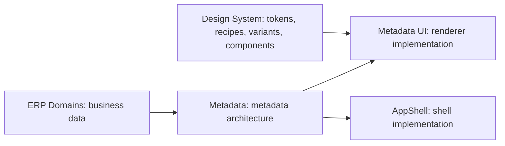

# TIP-005 - Metadata Authority

Status: **Complete (contracts)**

## Purpose

TIP-005 establishes Afenda Metadata Authority before Metadata UI implementation begins. It freezes ownership for metadata architecture, surfaces, layouts, sections, renderer resolution, registry governance, presentation modes, and runtime context.

Scope is governance only. TIP-005 does not build Metadata UI, renderers, React components, AppShell, ERP modules, database schemas, permissions, accounting, workflows, or metadata rendering.

## Files created

- `packages/metadata/package.json`
- `packages/metadata/tsconfig.json`
- `packages/metadata/tsconfig.vitest.json`
- `packages/metadata/vitest.config.ts`
- `packages/metadata/src/contracts/metadata-authority-map.ts`
- `packages/metadata/src/contracts/metadata.contract.ts`
- `packages/metadata/src/contracts/surface.contract.ts`
- `packages/metadata/src/contracts/layout.contract.ts`
- `packages/metadata/src/contracts/section.contract.ts`
- `packages/metadata/src/contracts/renderer.contract.ts`
- `packages/metadata/src/contracts/registry.contract.ts`
- `packages/metadata/src/contracts/presentation.contract.ts`
- `packages/metadata/src/contracts/runtime.contract.ts`
- `packages/metadata/src/contracts/index.ts`
- `packages/metadata/src/contracts/__tests__/metadata-authority.test.ts`
- `packages/metadata/src/index.ts`
- `docs/delivery/tip-005-metadata-authority.md`

## Ownership Matrix

| Contract | Owns | Must not own |
| --- | --- | --- |
| Metadata | metadata vocabulary, identity, lifecycle, governance | rendering, layout, presentation |
| Surface | page, workspace, and module surface definitions | sections, renderers, styling |
| Layout | dashboard, grid, panel, stack, tabs, and wizard layouts | visual styling, renderer behavior |
| Section | list, stat, chart, form, detail, audit, and action sections | layout, renderer selection |
| Renderer | identity, capability, compatibility, and resolution rules | business logic, metadata ownership |
| Registry | registration lifecycle, registration governance, registry resolution | rendering implementation |
| Presentation | presentation, density, readonly, and visibility modes | design tokens, component styling |
| Runtime | render context, execution context, runtime state, diagnostics | ERP workflows, database access |

## Authority Map

| Authority | Owns |
| --- | --- |
| metadata | vocabulary |
| surface | surface definitions |
| layout | arrangement |
| section | content zones |
| renderer | resolution |
| registry | registration |
| presentation | viewing modes |
| runtime | execution context |

The source of truth is `packages/metadata/src/contracts/metadata-authority-map.ts`.

## Metadata Architecture Diagram



## Cross-Package Authority Diagram



## AI Governance Rules

AI may consume approved metadata contracts, generate metadata schemas, and generate metadata examples.

AI may not invent new metadata ownership, layouts, surface types, registry architecture, runtime architecture, or renderer governance.

## Prohibited Drift Matrix

| Drift risk | TIP-005 control |
| --- | --- |
| AI invents list, form, dashboard, or action schemas | Contracts define approved ownership before UI work |
| Metadata UI owns renderer governance | Renderer contract owns resolution rules; Metadata UI only implements renderers |
| AppShell owns metadata architecture | Metadata package owns architecture; AppShell consumes it |
| Design System owns presentation modes | Presentation contract owns viewing modes; Design System owns styling primitives |
| ERP domains own runtime context | Runtime contract owns execution context; domains own business data |
| Registry behavior appears inside renderers | Registry contract owns registration and resolution governance |

## Acceptance Criteria

| Scenario | Required result |
| --- | --- |
| Metadata UI development begins | Ownership is already frozen |
| Renderer work begins | Renderer ownership and resolution rules are defined |
| Runtime work begins | Runtime ownership and diagnostics are defined |
| Layout work begins | Layout ownership is defined without styling ownership |
| Presentation work begins | Presentation ownership is defined without design token ownership |
| Registry work begins | Registry ownership is defined without rendering implementation |
| AI generates metadata code | AI cannot invent metadata architecture |

## Verification Commands

```bash
pnpm --filter @afenda/metadata typecheck
pnpm --filter @afenda/metadata test
pnpm typecheck
pnpm test:run
pnpm quality
```

## Completion Evidence

- Every required contract file exists
- Every required contract is exported from `packages/metadata/src/contracts/index.ts`
- Every required contract is exported from `packages/metadata/src/index.ts`
- `metadata-authority-map.ts` defines a single decision table for ownership resolution
- Tests verify exported contracts, single authority ownership, and non-overlap
- No Metadata UI, renderer implementation, React component, AppShell, ERP module, database schema, permission rule, or workflow was implemented
