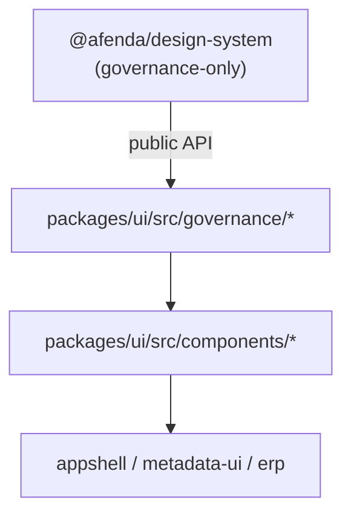

# TIP-004 — UI Consumption

Status: **Complete** (superseded for operational policy by [`docs/governance/tip-004-policy.md`](../../governance/tip-004-policy.md))

## Purpose

Adopt `@afenda/design-system` as the single design authority inside `@afenda/ui`. Governed React components consume contracts, recipes, variants, tokens, state policy, motion policy, accessibility policy, and className policy through a centralized adapter — they do not invent parallel design vocabulary.

> **Operational policy:** author vs consumer `className` rules, import discipline, anti-slop, and verification gates are maintained in [`docs/governance/tip-004-policy.md`](../../governance/tip-004-policy.md). This delivery doc records the original TIP scope and acceptance evidence.

## Dependency direction



| Package | Owns |
| --- | --- |
| `@afenda/design-system` | Tokens, variants, recipes (metadata), states, motion, accessibility, className policy, export surface |
| `@afenda/ui` | React/Base UI implementation, recipe projection to className, component behavior |
| Consumer packages | Page/shell wiring only — see [TIP-004 policy](../../governance/tip-004-policy.md) |

**Prohibited:** `@afenda/design-system` must never depend on or import `@afenda/ui`.

## Governance adapter

All design-system imports flow through [`packages/ui/src/governance/`](../../packages/ui/src/governance/):

| Module | Responsibility |
| --- | --- |
| `design-system.ts` | Sole re-export surface from `@afenda/design-system` |
| `primitive-governance.ts` | `resolvePrimitiveGovernance()` — see [TIP-004B](%5BComplete%5D%20tip-004b-primitive-adapter.md) |
| `variant.ts` | `resolveGovernedVariant(selection)` |
| `recipe.ts` | `resolveGovernedRecipe(name, selection)`, CVA projections |
| `class-name.ts` | `assertAllowedLayoutClassName(className)` (author layer) |
| `class-name-guard.ts` | `guardClassName()` — layout + anti-slop |
| `state.ts` | `assertGovernedState(state)` |
| `accessibility.ts` | `getComponentAccessibilityRequirement(componentName)` |
| `motion.ts` | `getMotionIntent(intent)` |

Components import `@afenda/ui/governance` — never deep-import design-system internals.

## className policy (summary)

| Layer | Rule |
| --- | --- |
| **Author** (`packages/ui/src/components/`) | Layout-only `className` through `resolvePrimitiveGovernance()` |
| **Consumer** (`appshell`, `metadata-ui`, `erp`) | **Zero** `className` on governed primitives — props only |

Full rules: [`docs/governance/tip-004-policy.md`](../../governance/tip-004-policy.md)

## Prohibited drift examples

```tsx
// ❌ Local authority
const STATUS_TONES = ["info", "warn"];

// ❌ Deep import
import { tokenRegistry } from "@afenda/design-system/src/tokens/registry";

// ❌ Raw palette on governed components (author)
<Button className="bg-blue-600" />

// ❌ Any className on governed components (consumer)
<Button className="w-full" />

// ❌ shadcn variant strings on governed Button (consumer)
<Button variant="ghost" />
```

```tsx
// ✅ Author — layout-only className
<Button intent="primary" emphasis="solid" size="md" className="w-full" />

// ✅ Consumer — governed props, wrap for layout
<div className="w-full">
  <Button intent="primary" emphasis="solid" size="md" />
</div>
```

## shadcn overwrite recovery

Running `pnpm dlx shadcn@latest add --all -c packages/ui -y --overwrite` reverts governed components to shadcn inline CVA. Re-apply governed implementations or exclude those files from bulk overwrite.

## Acceptance criteria

- [x] `@afenda/ui` depends on `@afenda/design-system`
- [x] `@afenda/design-system` has no runtime dependency on `@afenda/ui`
- [x] Governance adapter centralizes design-system imports
- [x] Anti-drift tests and static checker pass
- [x] Public exports remain stable (types re-exported via governance)
- [x] TIP-004B complete — all primary exports governed ([`tip-004b-primitive-adapter.md`](./tip-004b-primitive-adapter.md))

## Test evidence

```bash
pnpm --filter @afenda/ui typecheck
pnpm --filter @afenda/ui test:run
pnpm --filter @afenda/ui build
pnpm --filter @afenda/ui check:governance
pnpm ui:guard
```

## Related

- [TIP-004 Policy (canonical)](../../governance/tip-004-policy.md)
- [TIP-004 Design System Contracts](./tip-004-design-system-contracts.md)
- [TIP-004B — Primitive Adapter](./tip-004b-primitive-adapter.md)
- [UI Guard](../../governance/ui-guard.md)
- [TIP-UI-02 Component Library](./tip-ui-02-component-library.md)
