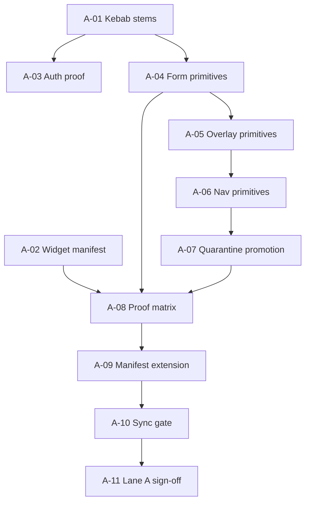

# Lane A — V2 Internal Stabilization Program

## Document status

| Field | Value |
| --- | --- |
| Mode | Internal implementation program index |
| Audience | Engineers executing `@afenda/shadcn-studio-v2` work after Phase 9 |
| Authority | `../MIGRATION-MAP.md` (Lane A / Lane B), `../DEVELOPMENT-ROADMAP.md` |
| Action enabled | Pick the next bounded Lane A slice without starting v1 cutover or ERP migration |

## Problem

Phase 9 proves the greenfield package is consumable. Without an ordered post-acceptance
program, work drifts into Lane B (ERP surfaces, v1 retirement) before internal contracts,
proof coverage, and gates are stable.

## Goals

- Execute **Lane A only** until internal sign-off (Lane A-11).
- Keep every slice bounded to package + developer proof route.
- Preserve executable proof: tests, drift guards, and `verify:v2-proof`.

## Non-goals

- ERP broad migration, `WorkspaceBoardWidgetFrame`, or drag/resize runtime (Lane B).
- v1 lab shell replacement or `@afenda/shadcn-studio` retirement (Lane B).
- New architecture decisions without an ADR when the slice explicitly requires one.

## Execution order

Run slices **in numeric order**. Do not skip a slice because a later slice looks more
interesting. If a slice is already complete, record evidence and proceed.

```txt
A-01 → A-02 → A-03 → A-04 → A-05 → A-06 → A-07 → A-08 → A-09 → A-10 → A-11
```

### Dependency graph



### Slice register

| # | Slice | Status | Primary proof |
| --- | --- | --- | --- |
| A-01 | [Kebab stem normalization](LANE-A-01-KEBAB-STEM-NORMALIZATION.md) | **Complete** | `normalize:kebab-stems --check`, taxonomy snapshot |
| A-02 | [Widget manifest and evidence adapter](LANE-A-02-WIDGET-MANIFEST-AND-EVIDENCE-ADAPTER.md) | **Complete** | manifest registry test, `EvidenceWidget` on proof route |
| A-03 | [Auth shell proof integration](LANE-A-03-AUTH-SHELL-PROOF-INTEGRATION.md) | **Complete** | `AuthShell` opt-in on `/design-system/v2-proof` |
| A-04 | [Primitive contract — form controls](LANE-A-04-PRIMITIVE-CONTRACT-FORM-CONTROLS.md) | **Complete** | `test:primitives` + consistency doc |
| A-05 | [Primitive contract — overlays](LANE-A-05-PRIMITIVE-CONTRACT-OVERLAYS.md) | **Complete** | `primitive-overlays.test.ts` |
| A-06 | [Primitive contract — navigation and data chrome](LANE-A-06-PRIMITIVE-CONTRACT-NAV-DATA.md) | **Complete** | `primitive-nav-data.test.ts` |
| A-07 | [Quarantine promotion governance](LANE-A-07-QUARANTINE-PROMOTION-GOVERNANCE.md) | **Complete** | `quarantine-governance.test.ts`, `check:drift` quarantine rules |
| A-08 | [Proof route state matrix](LANE-A-08-PROOF-ROUTE-STATE-MATRIX.md) | **Complete** | `v2-proof-route.state-matrix.test.tsx`, `verify:v2-proof` |
| A-09 | [Manifest workflow kinds](LANE-A-09-MANIFEST-WORKFLOW-KINDS.md) | **Complete** | Option A HOLD + `workflow-board-host-mapping.ts` |
| A-10 | [Lane A synchronization gate](LANE-A-10-SYNCHRONIZATION-GATE.md) | **Complete** | `lane-a-synchronization.test.ts`, full gate matrix |
| A-11 | [Lane A internal sign-off](LANE-A-11-INTERNAL-SIGN-OFF-GATE.md) | **Complete** | `lane-a-sign-off.test.ts`, full gate matrix |

## Universal hard stops (Lane A)

Stop and report if the slice would:

- import from `@afenda/shadcn-studio` (v1) into V2 source
- add ERP business logic inside `packages/shadcn-studio-v2`
- embed drag/resize or layout persistence in widget adapters
- add PascalCase file stems under `src/**` (run `normalize:kebab-stems --check`)
- widen `MIGRATION-MAP.md` Lane B rows without A-11 sign-off

## Universal package gates

```bash
pnpm --filter @afenda/shadcn-studio-v2 test
pnpm --filter @afenda/shadcn-studio-v2 typecheck
pnpm --filter @afenda/shadcn-studio-v2 build
pnpm --filter @afenda/shadcn-studio-v2 check:drift
pnpm exec biome ci packages/shadcn-studio-v2
```

Developer proof (when slice touches consumer proof):

```bash
pnpm --filter @afenda/developer verify:v2-proof
```

## Lane B (planning — execution per slice)

Program index: [Lane B v1 migration and retirement](LANE-B-V1-MIGRATION-AND-RETIREMENT-INDEX.md).
Formal v1 deprecation at **B-15 PROCEED** only.
