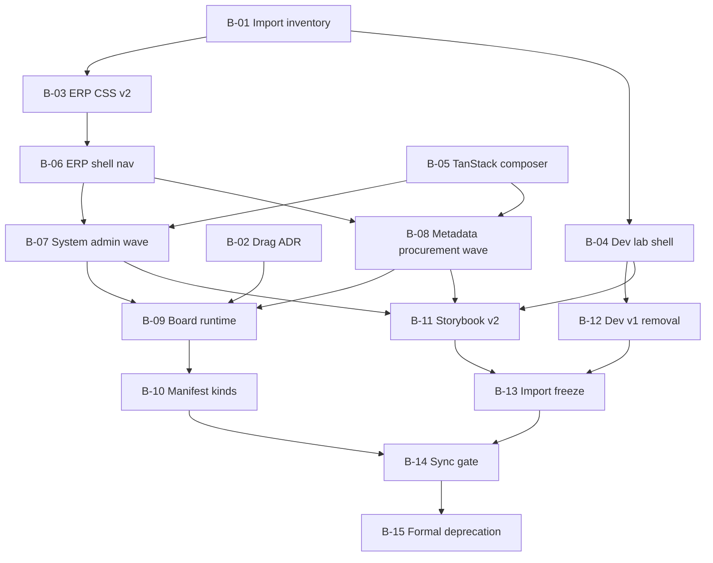

# Lane B — V1 Migration And Formal Deprecation Program

## Document status

| Field | Value |
| --- | --- |
| Mode | Internal migration program index |
| Audience | Engineers cutting over consumers from `@afenda/shadcn-studio` (v1) to `@afenda/shadcn-studio-v2` |
| Authority | `../MIGRATION-MAP.md`, `../DEVELOPMENT-ROADMAP.md`, ADR-0027, PAS-006 family |
| Lifecycle | **Complete** — B-01–B-15 **Complete** (2026-07-06); formal v1 deprecation **PROCEED** |
| Action enabled | Pick the next bounded Lane B slice without skipping inventory, ADR, or gate prerequisites |

## Problem

Lane A proved the greenfield V2 package is enterprise-accepted internally. Production
consumers still depend on v1:

```txt
apps/developer  → dual stack (v2 proof route + v1 lab shell and blocks)
apps/erp        → v2 providers only; surfaces, shell, tables, metadata blocks still v1
apps/storybook  → v1 block lab parameters and imports
```

ADR-0027 still names `@afenda/shadcn-studio` as the sole ERP presentation chain. Formal
v1 deprecation requires a sequenced cutover with consumer proof, registry updates, and
an ADR amendment — not a big-bang delete.

## Goals

- Migrate every v1 consumer import to v2 public entrypoints with executable proof.
- Promote `MIGRATION-MAP.md` rows from `deferred` → `migrated` → `pilot-proven` only with consumer tests.
- Close Lane A-09 HOLD items (manifest workflow kinds, board runtime) under ERP proof.
- End at **v1 formal deprecation**: `@afenda/shadcn-studio` marked `retired` in foundation disposition and removed from active workspace consumption.

## Non-goals

- Reopening Lane A taxonomy, primitive, or drift work except regression fixes.
- Kernel vocabulary, PAS-001A context spine, or accounting runtime (orthogonal lanes).
- PAS-005 / css-authority revival (retired per ADR-0027).
- Bulk MCP reinstall into v1 quarantine paths.
- Deleting v1 filesystem before B-15 sign-off and ADR amendment.

## Entry criteria (Lane B unlock)

All must be true before **B-01 execution**:

| Criterion | Evidence |
| --- | --- |
| Lane A complete | A-11 decision **`PROCEED`** (2026-07-06) |
| V2 package baseline | 196 tests, typecheck, build, drift, biome |
| Consumer proof route | `/design-system/v2-proof` pilot-proven |
| Migration ledger | `MIGRATION-MAP.md` Lane B `approved-for-planning` |

## Exit criteria (v1 formal deprecation)

All must be true before **B-15 sign-off**:

| Criterion | Evidence |
| --- | --- |
| Zero v1 imports in `apps/erp`, `apps/developer`, `apps/storybook` | B-01 inventory → 0; CI gate |
| ERP build + smoke on v2-only stack | `@afenda/erp build`, route smoke |
| Developer lab on v2 shell + gates | `verify:v2-proof`, lab e2e smoke |
| Storybook on v2 blocks or documented waiver | B-11 DoD |
| ADR-0027 chain amended to v2 | New ADR or ADR-0027 amendment |
| Foundation disposition | `@afenda/shadcn-studio` → `retired` via registry owner |
| Lane B sync gate | B-14 executable doc/runtime tests |

## Status vocabulary (consumers and v1 package)

Reuse ledger vocabulary from `MIGRATION-MAP.md`:

```txt
deferred → approved-for-migration → migrated → pilot-proven → retirement-candidate → retired
```

**Formal deprecation** means the v1 package row reaches **`retired`** — not merely
`migrated` on one app.

## Execution order

Run slices **in numeric order** unless this index documents an explicit parallel
exception. Planning may draft later slices early; **execution** must respect dependencies.

```txt
B-01 → B-02 → B-03 → B-04 → B-05 → B-06 → B-07 → B-08 → B-09 → B-10 → B-11 → B-12 → B-13 → B-14 → B-15
```

### Dependency graph



### Slice register

| # | Slice | Status | Primary proof |
| --- | --- | --- | --- |
| B-01 | [Consumer import inventory](LANE-B-01-CONSUMER-IMPORT-INVENTORY.md) | **Complete** | 69-import baseline, `check:v1-consumer-imports` |
| B-02 | [ADR — drag library and board frame](LANE-B-02-ADR-DRAG-LIBRARY-AND-BOARD-FRAME.md) | **Complete** | ADR-0042 Accepted, boundary test |
| B-03 | [ERP theme and CSS v2 chain](LANE-B-03-ERP-THEME-CSS-V2-CHAIN.md) | **Complete** | ERP `globals.css` v2-only; `lane-b-erp-css-v2-chain.test.ts` |
| B-04 | [Developer lab shell cutover](LANE-B-04-DEVELOPER-LAB-SHELL-CUTOVER.md) | **Complete** | `(lab)` on `AppShell01`; baseline 66 |
| B-05 | [TanStack datatable headless composer](LANE-B-05-TANSTACK-DATATABLE-COMPOSER.md) | **Complete** | ADR-0043 Accepted, `ErpDataTableComposer`, boundary test |
| B-06 | [ERP app shell and navigation cutover](LANE-B-06-ERP-APP-SHELL-NAV-CUTOVER.md) | **Complete** | Protected layout on v2 `AppShell01`; baseline 62 |
| B-07 | [ERP surface wave — system admin](LANE-B-07-ERP-SURFACE-WAVE-SYSTEM-ADMIN.md) | **Complete** | Memberships/users on v2 composer + toolbar; baseline 56 |
| B-07-ext | [ERP surface wave 2](LANE-B-07-EXT-ERP-SURFACE-WAVE-2.md) | **Complete** | Remaining ERP v1 imports → 0; roles/permissions/workspace/auth/error |
| B-08 | [ERP surface wave — metadata and procurement](LANE-B-08-ERP-SURFACE-WAVE-METADATA-PROCUREMENT.md) | **Complete** | Metadata bridge + procurement on v2 composer |
| B-09 | [Workflow board runtime](LANE-B-09-WORKFLOW-BOARD-RUNTIME.md) | **Complete** | ERP RGL frame per ADR-0042; `lane-b-09-workflow-board-runtime.test.ts` |
| B-10 | [Manifest workflow kind promotion](LANE-B-10-MANIFEST-WORKFLOW-KIND-PROMOTION.md) | **Complete** | `workflow-table` / `workflow-approval` kinds; A-09 HOLD lifted |
| B-11 | [Storybook v2 alignment](LANE-B-11-STORYBOOK-V2-ALIGNMENT.md) | **Complete** | Storybook on v2 `/lab`; zero v1 imports |
| B-12 | [Developer lab v1 dependency removal](LANE-B-12-DEVELOPER-LAB-V1-REMOVAL.md) | **Complete** | Developer v1 imports = 0; v1 dep removed |
| B-13 | [v1 import freeze and retirement candidate](LANE-B-13-V1-IMPORT-FREEZE-AND-RETIREMENT-CANDIDATE.md) | **Complete** | `check:v1-consumer-imports` in CI; registry retirement-candidate |
| B-14 | [Lane B synchronization gate](LANE-B-14-LANE-B-SYNCHRONIZATION-GATE.md) | **Complete** | `lane-b-synchronization.test.ts`; doc/runtime parity |
| B-15 | [v1 formal deprecation sign-off](LANE-B-15-V1-FORMAL-DEPRECATION-SIGN-OFF.md) | **Complete** | Registry `retired`; ADR-0040 Accepted; `lane-b-sign-off.test.ts`; **PROCEED** |

## Known v1 consumer surface (baseline 2026-07-06, Wave 2 sync)

All three consumer roots at **zero** v1 import statements. B-01–B-15 **Complete**.
Lane B program **Complete** — v1 formally deprecated (B-15 **PROCEED**).

| Consumer | Status | Proof slice |
| --- | --- | --- |
| `apps/developer` | **migrated** | B-12 |
| `apps/erp` | **migrated** (imports) | B-07-ext |
| `apps/storybook` | **migrated** | B-11 |

## Universal hard stops (Lane B)

Stop and report if the slice would:

- import `@afenda/shadcn-studio` **into** `packages/shadcn-studio-v2/src/**`
- import `@afenda/kernel` into `@afenda/shadcn-studio-v2`
- delete `packages/shadcn-studio` before B-15 **`PROCEED`**
- widen `MIGRATION-MAP.md` to `enterprise-accepted` for ERP without consumer proof
- embed drag/resize inside V2 widget adapters (frame stays ERP/consumer per B-02 ADR)
- run PAS-005 or css-authority gates for ERP frontend work

## Universal gates

### V2 package (regression — every slice touching v2)

```bash
pnpm --filter @afenda/shadcn-studio-v2 test
pnpm --filter @afenda/shadcn-studio-v2 typecheck
pnpm --filter @afenda/shadcn-studio-v2 build
pnpm --filter @afenda/shadcn-studio-v2 check:drift
pnpm exec biome ci packages/shadcn-studio-v2
```

### Developer proof (when touching developer consumer)

```bash
pnpm --filter @afenda/developer verify:v2-proof
pnpm --filter @afenda/developer build
```

### ERP (when touching ERP consumer)

```bash
pnpm sync:package-css-dist -- --package @afenda/shadcn-studio-v2
pnpm check:package-css-dist-sync
pnpm --filter @afenda/erp typecheck
pnpm --filter @afenda/erp build
```

### v1 retirement trajectory (B-13 onward)

```bash
pnpm check:foundation-disposition
```

## Rollback policy

Lane B slices are **consumer migrations**. Rollback is per slice:

1. Revert the consumer PR (app-level imports and CSS).
2. Reset the affected `MIGRATION-MAP.md` row to prior status.
3. Do not revert V2 package improvements unless they break public exports.

Greenfield V2 proof route (`/design-system/v2-proof`) must stay green after every slice.

## PAS and ADR routing

| Topic | Lane | Document |
| --- | --- | --- |
| Presentation product ownership | PAS-006A | Amended when v2 replaces v1 in ADR-0027 |
| Metadata binding / templates | PAS-006D | ERP bridge stays in `apps/erp`; types from v2/metadata |
| Drag library / board frame | ADR (B-02) | ERP consumer; not V2 adapter markup |
| Foundation disposition | Registry owner | B-15 only — `@foundation-registry-owner` |
| Lane boundaries | PAS | `docs/PAS/DEVELOPMENT-LANE-BOUNDARIES.md` |

## Assumptions and open items

| Item | Disposition |
| --- | --- |
| ADR-0027 still names v1 as sole chain | **Resolved** — ADR-0040 Accepted; ADR-0027 amended at B-15 |
| ERP already uses v2 providers | B-03 completes CSS; B-06 completes shell |
| A-09 manifest kinds on HOLD | B-10 after B-09 ERP board proof |
| TanStack lives in consumer layer | B-05 — not inside V2 `data-table-surface` primitive |
| v1 registries (metadata-binding, block-slot) | Port or re-export via v2/metadata before ERP cutover |

## Related documents

- `../MIGRATION-MAP.md` — row-level status ledger
- `LANE-A-INTERNAL-STABILIZATION-INDEX.md` — predecessor program (complete)
- `PHASE-7B-WORKFLOW-VIEWS.md` — board frame follow-on scope
- `../TAXONOMY.md` — v1 → v2 structural mapping
- `docs/adr/ADR-0027-frontend-presentation-reset.md` — amended at deprecation
